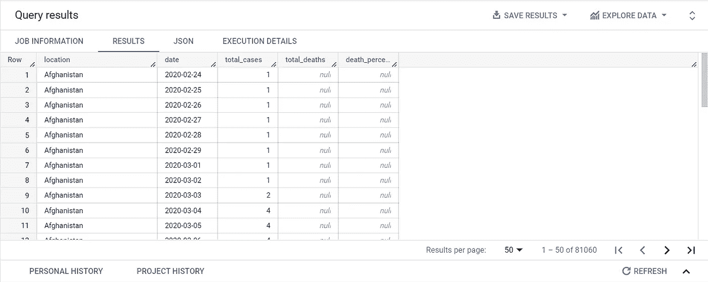
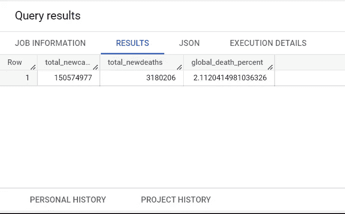
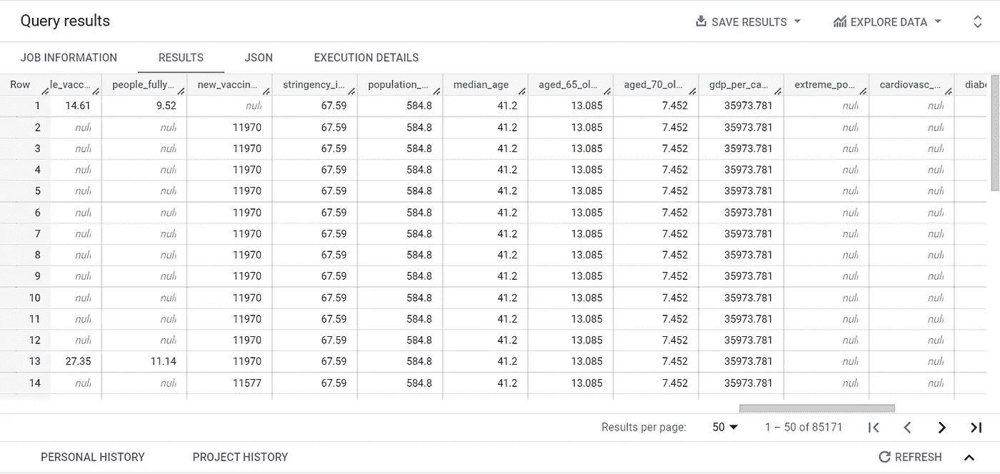

# 使用 SQL 浏览(新冠肺炎)数据

> 原文：<https://blog.devgenius.io/exploring-covid-19-data-using-sql-90e1c83d66d1?source=collection_archive---------3----------------------->

在这个项目中，我使用 SQL 查询来深入了解数据集，在这里我将详细解释我采用的方法和整个过程。

# 介绍

在这个个人项目中，我使用了来自*ourworldindata.org*的**新冠肺炎**数据集，并尝试使用 **SQL** 来分析和洞察数据，并为可视化做准备。

在这个项目中，我使用了 **BigQuery** ，因为我在将数据加载到 **MySQL** 时遇到了麻烦，还因为我开始在 BigQuery 上学习 SQL，我发现将数据加载到 BigQuery 数据库非常简单和容易。

**关于数据**:我在这个项目中使用的数据在**新冠肺炎**上。当我不久前做这个项目时，数据可能不是最新的。要获取更新的数据，请访问**[**www.ourworldindata.org**](http://www.ourworldindata.org)，这是一个获取公共数据集的免费资源。下载完数据后，我**用 **MS Excel** 和**将**数据集分成**两个**部分，即 **CovidDeaths** 和**covidnevacciness**。我这样做是因为这将有助于简化 SQL 查询，并有助于以后使用**连接**。在将数据集保存到两个不同的文件中之后，现在就可以上传到 BigQuery 了。****

**如果你想按顺序查看我在这篇博客中讨论过的所有 SQL 查询，请点击这个 [**链接**](https://github.com/bishaldutta98/SQL_code_for_data_exploration/blob/main/SQL_code_1) 。**

# **目标**

*   **花时间处理数据并熟悉它。**
*   **找出当地和全球的死亡率。**
*   **找出本地和全球感染人口的百分比。**
*   **找出感染率最高的国家。**
*   **找出死亡人数最多的国家和大陆。**
*   **使用联接来组合 covid_deaths 和 covid_vaccine 表。**
*   **找出人口和接种疫苗的人数。**
*   **了解接种人群和新增接种人群。**

# **程序**

**在对数据做了一些小的调整并将其分成两个不同的表之后，现在是时候将数据上传到 BigQuery 了。为此，打开 **BigQuery** 上的 **SQL 工作区**，它是 **Google Cloud** 平台的一部分。在这里，如果您还没有创建项目，那么创建一个新项目。然后，在界面左侧的**资源管理器**窗格下，单击与您已创建的项目相邻的**三个点**，并单击**创建数据集**选项。这将打开**创建数据集**窗口。**

****

**这里，在**数据集 ID** 部分，给数据集起一个合适的名字，然后**点击创建数据集**。我将数据集命名为 **Covid19** 。更新选项卡后，可以在项目下拉列表中找到这个新数据集。**

****

**既然已经创建了数据集，就必须将表插入到数据集中，该数据集中将包含以后要查询的数据。为此，**点击与 **Covid19** 数据集相邻的**三个点**上的**，并**点击**上的**创建表格**。**

****

**这将打开**创建表**窗口。**

****

**在这里，从下拉列表中的**创建表格，选择**上传**选项。****

****

**现在，从**选择文件**选项，点击**浏览**，然后选择您想要的文件。然后给表格起一个合适的名字，然后在**模式**选项下，检查**自动检测**选项。现在，点击**创建表格**，表格将被添加。在我的例子中，我将表命名为 **covid_deaths** 和 **covid_vaccine** 。选项卡更新后，表格将在 Covid19 数据集下可见。**

****

**现在已经插入了表，您可以继续进行数据探索过程。**

## **花时间处理数据并熟悉它**

**为了查看数据，我编写了以下查询:**

****

**查询 1**

**在上面的查询中，我只是编写了 **SELECT** 、 **FROM** 和 **WHERE** 语句，后来又添加了 **ORDER BY** 语句来组织数据。我使用了 **WHERE** 语句从数据中过滤掉 **NULL** 值。这是拉出 **covid_deaths** 表的查询。上述查询的结果如下:**

****

**我熟悉了表格的内容和表格中的所有列。**

**然后，我编写了相同的查询，但是针对的是 **covid_vaccine** 表。**

****

**查询 2**

**上述查询的结果如下:**

****

**从这两个表中，您可以看到像**位置**和**日期**这样的列在 **covid_deaths** 和 **covid_vaccine** 表中都很常见。这是非常有价值的信息，因为它将有助于以后连接两个表。**

**您还会注意到，有许多不必要的列此时并不需要，它们只是占用了表中的空间。为此，我将有选择地只选择每个查询需要的那些列。例如:**

****

**查询 3**

**该查询的结果如下:**

****

**如您所见，现在的表格更加精确，易于阅读。**

## **找出当地和全球的死亡率**

****为了找到本地的死亡率**(在我的例子中，对于**印度**)，我编写了以下查询:**

****

**查询 4**

**在上面的查询中，我通过**将**的**总死亡数**除以**总病例数**，然后**将**乘以 **100** 将其转换成一个**百分比**，找到了死亡率。我还给它起了一个别名**作为 **death_percent** ，这样列名就在结果表中指定了。我使用了 **WHERE** 语句来提取那些位置**位置**为**印度**并且**大陆**不为 **NULL 的数据。**上述查询的结果如下:****

****

**印度的死亡率**

**最初，当病例非常少时，没有死亡，死亡在一段时间后开始，因此**死亡百分比**的值在开始时为 **NULL** 。它开始于 2020 年 3 月 10 日**之后**在印度，当你向下滚动表格时可以看到。**

****

****为了找到全球的死亡率，**我编写了以下查询:**

****

**查询 5**

**在这个查询中，我只是在 **WHERE** 子句中**没有** **设置****位置**。查询的其余部分是相同的。上述查询的结果如下:**

****

**全球死亡率**

**在这张表中，与印度的情况相似，死亡并没有立即开始，如表中所示。它在一段时间后开始。**

****根据新增病例和新增死亡病例统计的全球死亡率****

**为了找到这一点，我编写了以下查询:**

****

**查询 6**

**在上面的查询中，我选择了**日期**、**新增 _ 病例**的**总和**、**别名**为**合计 _ 新增 _ 病例**、**新增 _ 死亡**的**总和**和**别名**为**合计 _ 新增 _ 死亡**，然后将**新增 _ 死亡的**总和**除以我使用了 **CAST** 函数将 **new_deaths** 的**数据类型**更改为 **integer** ，在我使用该列的任何地方。I **按**日期**对**进行分组，**按**日期**和**对**进行排序。上述查询的结果如下:******

根据新病例和新死亡病例计算的全球死亡率

**全球总死亡率**

为了找到这一点，我只是从**查询 6** 中删除了**日期**，它显示了全球的总体死亡率。

查询 7

结果如下:

全球总死亡率

## 找出本地和全球受感染人口的百分比

**为了找到当地(印度)感染人口的百分比**，我编写了以下查询:

查询 8

在上面的查询中，我保持其他内容不变，只是用**人口**替换了**总死亡数**(在之前的查询中)，并且为了找出**感染人口比率**，我用**人口**除以总病例数**，并通过**将其转换为**百分比**我还给它起了一个别名**作为**infected _ population _ percent**，这样就创建了列标题以使表格易于理解。我还在 **WHERE** 语句中将**位置**设置为 **India** ，以便**只过滤掉位置为 India 的那些数据。我是按地点和日期订的。上述查询的结果如下:****

印度受感染人口百分比

**找出全球感染人口的百分比**

提取全球感染人口百分比的查询几乎类似于**查询 6** ，只是**位置**没有设置在 **WHERE** 语句下。内容如下:

查询 9

上述查询的结果如下:

全球感染人口百分比

## 找出感染率最高的国家

为了找出感染率最高的国家，我编写了以下查询:

查询 10

在上面的查询中，我使用 **MAX** 函数选择了**位置**、**人口**、**总病例数**中的**最大值**，并为其赋予了一个**别名**作为**最大感染数**，以及与上一个查询中相同的**感染人口百分比**的最大值，并为其赋予了一个**别名**我**注释掉**过滤器将位置设置为印度，然后**将**按**位置**和**人口**分组**并按**max _ infected _ population _ percent**按**降序**排序**以便感染率最高的国家停留在表格的**顶端**。

上述查询的结果如下:

人均感染率最高的国家

## 找出死亡人数最多的国家和大陆

**死亡人数最多的国家:**

为了找出死亡人数最多的国家，我编写了以下查询:

查询 11

在上面的查询中，我选择了**位置**列和**总死亡数**的**最大值**和**别名**为**最大死亡数**。我使用了 **CAST** 函数，以便将 **total_deaths** 的**数据类型**更改为一个**整数**，因为它会导致其他问题(可能数据类型之前是一个字符串，所以查询无法读取 MAX 函数)。然后我用 **WHERE** 函数过滤掉 **NULL** 值，并用**按**位置**对**进行分组，用 **max_death_count** 按**降序**的顺序对**进行排序**，这样死亡人数最多的国家就位于表格的顶部。上述查询的结果如下:

死亡人数最多的国家

从上表可以清楚地看出，美国的死亡人数最高，印度也是死亡人数最高的五个国家之一。

**死亡人数最多的大洲:**

为了找出死亡人数最多的大陆，我编写了以下查询:

查询 12

在上面的查询中，所有其他部分与**查询 9** 相同，我只是通过语句将**选择**和**组上的**位置**改为**大陆**。结果如下:**

死亡人数最多的大陆

**注意:**我忽略了所有出现在**大陆**列中的**空值**。

## 使用联接来组合 covid_deaths 和 covid_vaccine 表

两个表，即 **covid_deaths** 和 **covid_vaccine** 可以结合起来，通过组合两个表中的数据来发现细节。为此，我使用**连接**或**内部连接**编写了以下查询。

**注意**:内部连接(join 或 Inner join)返回两个表中有匹配值的记录。

查询 13

在上面的查询中，我使用两个表共有的**位置**和**日期**列连接了两个表。在 **JOIN** 语句中，我将 **covid_deaths** 表命名为 **dea** ，将**covid _ vac**表命名为 **vac** 。运行查询后的结果如下:

在上面的图片中，您可以看到两个表中的数据都存在，所以连接工作得很好。

## 找出人口与接种疫苗的人数

为了找到一个地方的人口和已经接种疫苗的人数，我编写了以下查询:

查询 14

在上面的查询中，我使用了 **JOIN** 或 **INNER JOIN** 语句来连接两个表，连接方式与我在上一部分中解释的方式相同。如果您正在使用 **JOIN** 语句，您必须通过您在 **JOIN** 语句中为它们各自的表指定的名称来寻址列。在我的例子中，我将 **covid_deaths** 表命名为 dea，将 **covid_vaccine** 表命名为 vac，因此当我想从 **covid_death** 表中选择列 continent 时，我编写了**DEA . continental**，以此类推。

我选择了**DEA . continental**， **dea.location** ， **dea.date** ， **dea.population** ，以及**vac . new _ nevaccines**。现在已经很熟悉了，我只从 **covid_vaccine** 表中选择了一列，其余的从 **covid_deaths** 表中选择。然后我使用 **WHERE** 语句应用了一个过滤器，以便从 **covid_death** 表的**大陆**列中选择 **no NULL** 值。最后，我按**地点**和**日期**订购。

注意:在**订单日期**语句中，我没有写 **dea** 或 **vac** ，因为它们是两个表中的公共字段，我使用这些字段来连接这两个表。

结果如下:

人口与接种疫苗的人数

在上表中，您可以看到新的疫苗接种开始于**2021 年 3 月**，一些国家很晚接种，一些国家更早接种。

但是这个表格有一个缺点，那就是**没有计算**一个地方的人口接受的全部疫苗接种**。为了解决这个问题，您可以使用 **new_vaccinations** 列上的**滚动计数**。**

**使用滚动计数查找新接种的疫苗:**

**滚动计数**不断将新值加到第一个值上，直到位置保持不变，当位置改变时重新开始。为此，我编写了以下查询:

查询 15

在上面的查询中，我使用了 **JOIN** 来组合这两个表，就像我前面解释的那样，但是这里我使用了 **PARTITION BY** 来将数据划分为数据子集，并分别对这些子集执行计算。

因此，我首先编写了一个查询，使用 **PARTITION BY** 子句对 **dea.location** 进行分区，并通过 **dea.location** 和 **dea.date** 对进行排序，然后我通过语句将**vac . new _ nevaccinations**的 **SUM** 置于和**分区之上，并赋予它一个**这个查询所做的是:它首先**分隔**所有的**位置**，当**求和**函数开始时，它继续**将**加到**的第一个**值上，直到**位置**保持与**相同，**，然后它再次开始。****

同样，我将 **WHERE** 子句中的**筛选出**洲**列中有 **NULL** 值的行，并按照**位置**和**日期**对**表进行排序。最终结果如下:****

新疫苗的滚动计数

从上表可以清楚地看出，预期的**滚动计数**工作正常。

**查找接受新疫苗接种的人口百分比:**

这将类似于滚动计数，只是随着新疫苗接种的滚动计数，接受新疫苗接种的人口百分比也将被添加到一列中。

为此，我编写了以下查询:

查询 16

在上面的查询中，一切都与**查询 15** 相同，只是我在 **rolling_count_vac** 之后的 **SELECT** 语句中添加了另一部分，其中我取了 **rolling count** 段的**整体**部分，并且**将**除以**人口**并将**乘以**100**它的作用是:取滚动计数的值(如前一节所述)除以总人数，然后将比率乘以 100，得到新接种疫苗的总人数百分比。结果如下:**

接受新疫苗接种的人口百分比

从上表中可以看出，随着接种疫苗人数的增加，接种疫苗的总比例也在增加。

**注:**

*   如果您在 **Microsoft SQL Server** 上做这个项目，那么您可以创建一个 **CTE** (公共表表达式)，然后用 **CTE** 除**人口**，以获得相同的结果，使查询看起来更令人愉快，同时也简化了工作。可以按如下方式完成:

查询 17

*   如果您正在使用其他 SQL 工作空间，如 MySQL 或 SQL Lite 等。然后，您可以创建一个**临时表**或**临时表**，然后使用它来代替查询的**滚动计数**部分，并将其除以总体。这也会产生同样的结果。

查询 18

*   **我起初无法创建临时表**，因为我使用的是免费版的 BigQuery，它不允许我对表进行更改。因此，我单独编写了 temp 表中的查询，将该表保存在我的桌面上并重新加载文件，然后再次对其进行查询。虽然这是一个漫长的过程，但我想尝试新的方法来解决这个问题。

我首先编写并运行了以下查询:

查询 19

运行查询后，结果如下:

工作单元表

现在，我将该表保存到我的桌面，并将其作为**percent _ population _ vaccined**重新加载到 **Covid19** 数据集中。

然后，我运行以下查询，并再次运行它:

查询 20

运行上述查询后，我得到了下面的表，该表与之前的表相同:

这里，我总结了我在这个数据集上进行的所有数据探索。

## 未来范围

使用这个数据集可以做更多的事情，因为还有许多列我没有使用，例如患有**糖尿病**和**心脏病**的患者，以及它如何影响当地和全球的**感染**和**死亡率**，以及许多这样的见解。

**可视化**可以使用我在这个项目中提取的数据，这些数据可以进一步用于创建**仪表板**。这是我下一步打算做的项目。

## 感谢您的阅读！