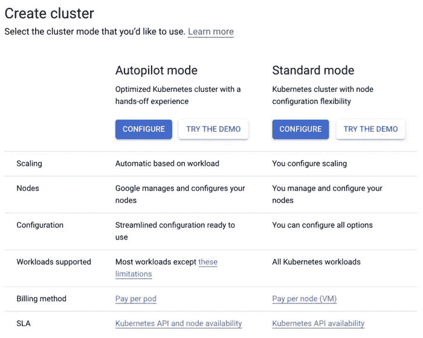
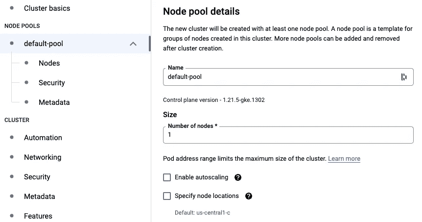
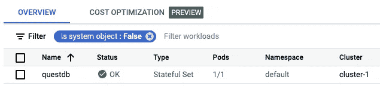
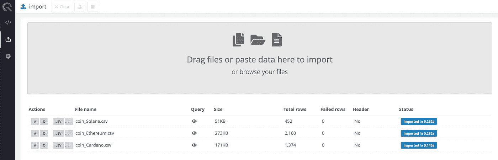
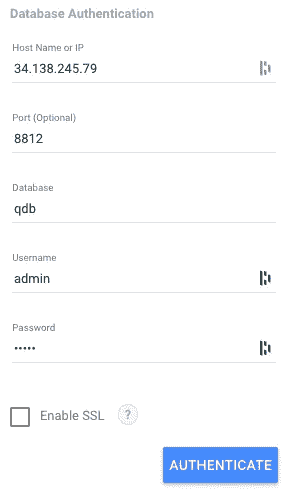
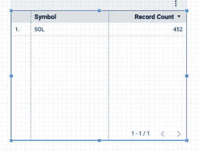
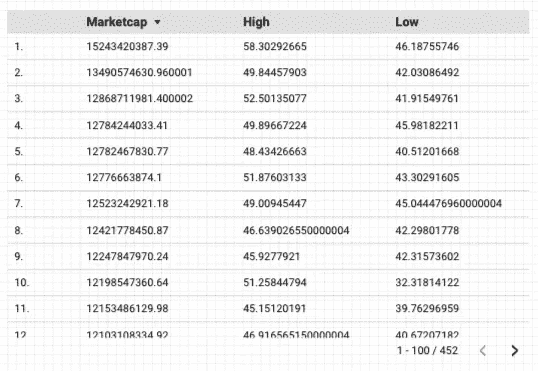
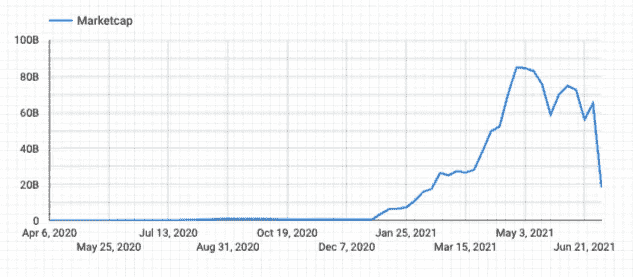
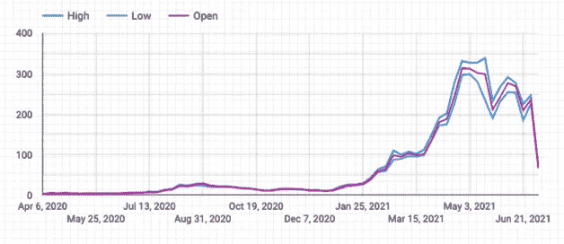
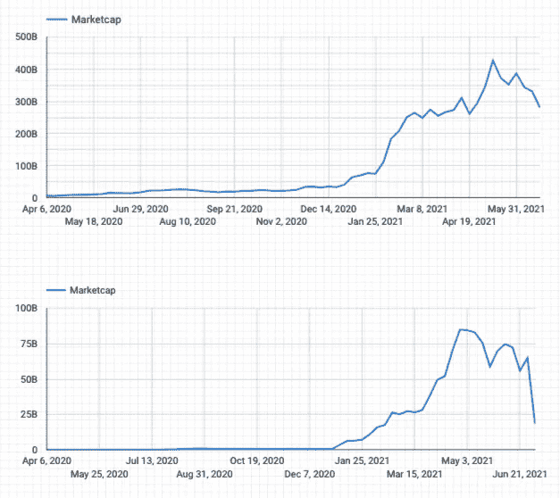

# 使用 QuestDB 和 Google Data Studio 探索加密价格

> 原文：<https://blog.devgenius.io/exploring-crypto-prices-with-questdb-and-google-data-studio-cb3ddced0308?source=collection_archive---------9----------------------->

通过将数据导入 QuestDB 并在 Google Data Studio 上绘制价格趋势，可视化以太坊、卡尔达诺和索拉纳的历史价格。


图片来源: [Pixabay](https://pixabay.com/vectors/image-set-interface-pictogram-3375234/)

各种秘密的市场研究网站，如 [Glassnode](https://glassnode.com/) 、 [Messari](https://messari.io/) 和 [TradingView](https://www.tradingview.com/) 提供了分析市场趋势的免费和简单的方法。然而，并不是所有的高级图表功能都是免费的，一些最好的功能被锁在付费墙后面。如果您想使用开源和免费的替代品来探索这些数据集，您可以在不到 5 分钟的设置时间内快速开始。

# 先决条件

*   [谷歌云账户](https://console.developers.google.com/billing/freetrial?hl=en&pli=1)
*   [gcloud sdk](https://cloud.google.com/sdk/docs/install)
*   [舵 3](https://v3.helm.sh/docs/intro/install/)
*   [卡格尔账户](https://www.kaggle.com/)
*   *可选:比特币基地 API*

在本教程中，我们将使用 Kaggle 预编译的加密货币价格数据集，但如果您想构建自己的数据集，请参考“[带有 Kafka 和 QuestDB 的实时加密跟踪器](https://medium.com/swlh/realtime-crypto-tracker-with-kafka-and-questdb-b33b19048fc2)”。

# 下载数据集

Kaggle 上的“[加密货币历史价格](https://www.kaggle.com/sudalairajkumar/cryptocurrencypricehistory)”提供了一份来自 [CoinMarketCap](https://coinmarketcap.com/) 的加密货币价格汇编列表。创建一个免费的 Kaggle 帐户，下载不同时间的硬币价格的各种 csv 文件。由于 2021 年最重要的叙述是第 1 层协议的出现，我将研究以太坊、Cardano 和 Solana 数据集。

# Google 云设置

虽然谷歌数据工作室可以连接到任何公共可访问的 PostgreSQL 端点，但我将使用谷歌云，因为我在之前已经写了关于在 GKE 自动驾驶仪上运行 [QuestDB 的文章。](/running-questdb-on-gke-autopilot-dab25fd76e66)

创建一个新的 Google Cloud 帐户，导航到 [Google Kubernetes 引擎](https://cloud.google.com/)，启用 Kubernetes 引擎 API，然后点击“创建集群”(您需要添加一个计费帐户):



对于这个演示，我决定使用“标准模式”,在`us-east1-c`区域中有一个节点，接受其他默认设置。



创建集群后，获取集群凭据进行身份验证:

```
$ gcloud container clusters get-credentials cluster-1 --zone us-east1-c --project <project-id> 
```

# QuestDB 设置

QuestDB 提供了一个官方的舵图，默认情况下，它使用 50Gi PVC 来部署单个 StatefulSet pod。为了让 Google Data Studio 可以访问 PostgreSQL wire 端点，我们需要修改服务类型并将 expose 字段设置为 true。用以下内容创建一个新的`values.yaml`文件:

```
service:
  type: LoadBalancer
  expose:
    postgresql:
    enabled: true
```

然后部署到我们的 GKE 集群:

```
$ helm repo add questdb [https://helm.questdb.io/](https://helm.questdb.io/)
$ helm upgrade -i questdb questdb/questdb -f values.yaml
```

等待 pod 变得正常并配置负载平衡器:



在 Kubernetes Engine > Services & Ingress 下，检查`questdb`服务的 IP 地址。点击端口`9000`链接进入用户界面。

单击左侧面板上的上传图标，导入 csv 文件。



# Google Data Studio 设置

导航至[https://datastudio.google.com](https://datastudio.google.com/u/0/)并点击创建>报告。这将自动打开“Add data to report”选项卡，我们可以在其中选择 PostgreSQL。填写 GKE 提供的外部负载平衡器的 ip 以及[默认端口和凭证](https://questdb.io/docs/develop/connect):



不幸的是，Google 将每个表都视为一个数据源，所以您必须单独导入每个表。默认情况下，Data Studio 将创建一个包含符号和记录计数的默认表:



您可以修改`Dimension`以添加其他字段，如市值、最高价、最低价等:



不幸的是，Google Data Studio 使用的默认日期格式与 QuestDB 不兼容，因为它使用了尚不支持的`DATE_TRUNC`函数。点击资源>管理添加的数据源，并将日期格式更改为`ISO Year Week`。然后，您可以创建一个粗略的 Marketcap 时间序列图表:



您还可以添加多个维度来检查市场是如何开盘的，当天的最高价和最低价是什么。



Data Studio 的图形功能有限，但是您可以导入多个数据源来比较 Cardano 与 Solana 在相似时间段内的价格:



# 后续步骤

目前，QuestDB 本身不支持 SSL 连接。为了启用 SSL，我们可以使用 [PgBouncer](https://www.pgbouncer.org/) 来保护 Google Data Studio 到 PgBouncer，并利用 Kubernetes 内部的服务网格来保护 PgBouncer 到 QuestDB。您还可以将 QuestDB 置于防火墙之后，只将 Dat Studio 用来访问数据库的[IP 列入白名单。](https://support.google.com/datastudio/answer/7288010?hl=en#zippy=%2Cin-this-article)

诚然，除了简单的可视化和自动聚合，Google Data Studio 并不适合严肃的数据分析需求。在下一篇文章中，我们将把 QuestDB 直接连接到 Jupyter 笔记本上，以探索我们关于熊猫的数据。