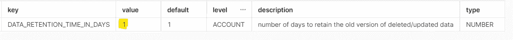

# 探索 DDL/DML/CLONE 操作对雪花存储的影响

> 原文：<https://blog.devgenius.io/exploring-ddl-dml-clone-operation-impact-on-snowflake-storage-8f4804ae5c43?source=collection_archive---------7----------------------->


[戴红帽的女孩](https://unsplash.com/@girlwithredhat?utm_source=medium&utm_medium=referral)在 [Unsplash](https://unsplash.com?utm_source=medium&utm_medium=referral) 上的照片

在这篇博客中，我们将对普通表和克隆表进行各种 DDL 和 DML 操作，观察其对存储的影响，并尝试探索哪些操作会影响存储开销，以及在实际项目实施过程中需要注意哪些操作。这个博客更像是一个亲身实践的博客，而不是任何理论。希望这篇博客能帮助你理解我们的行动对雪花存储的影响。

# 额外补贴

```
ALTER ACCOUNT SET DATA_RETENTION_TIME_IN_DAYS=1;
```



# 测试用例#1:创建测试设置

```
--Step 1 Create base table

CREATE  OR REPLACE TABLE EMPLOYEE (MEMBER_ID NUMBER, LASTNAME VARCHAR(50));
INSERT INTO EMPLOYEE VALUES 
(1,'Choules' ),
(2,'Aaronsohn'),
(3,'Cotherill'),
(4,'Grewer' ),
(5,'Mammatt');

--Step 2 : Create employee clone

Create table EMPLOYEE_CLONE1 clone EMPLOYEE;

--Step 3 : Create employee2 clone from clone EMPLOYEE_CLONE1

Create table EMPLOYEE_CLONE2 clone EMPLOYEE_CLONE1;

--Step 4: Create duplicate employee table without clone for insert test

CREATE  OR REPLACE TABLE EMPLOYEE_INSERT (MEMBER_ID NUMBER, LASTNAME VARCHAR(50));
INSERT INTO EMPLOYEE_INSERT VALUES 
(1,'Choules' ),
(2,'Aaronsohn'),
(3,'Cotherill'),
(4,'Grewer' ),
(5,'Mammatt');

--Step 5: Create duplicate employee table without clone for update test

CREATE  OR REPLACE TABLE EMPLOYEE_UPD (MEMBER_ID NUMBER, LASTNAME VARCHAR(50));
INSERT INTO EMPLOYEE_UPD VALUES 
(1,'Choules' ),
(2,'Aaronsohn'),
(3,'Cotherill'),
(4,'Grewer' ),
(5,'Mammatt'); 
```

```
USE SCHEMA STORAGE_DEMO.DATA;

--This table take 30-45 min to start showing storage bytes

SELECT * FROM INFORMATION_SCHEMA.TABLE_STORAGE_METRICS 
WHERE TABLE_CATALOG='STORAGE_DEMO' 
AND CATALOG_DROPPED IS NULL  
ORDER BY CLONE_GROUP_ID;
```


图像 0

## 观察:

1.  所有的表都有相同的 5 行，其中 2 个表是从 Employee 表克隆的，没有活动字节，因为它引用了 Employee 表分区。
2.  CLONE_GROUP_ID 列引用了两个克隆表 EMPLOYEE_CLONE1 和 EMPLOYEE_CLONE2 的员工表 ID，而不管它是从克隆表中克隆的。
3.  目前，没有一个表在时间旅行或故障安全列中有任何存储字节。
4.  员工的存储呈现将需要一些时间，因为填充此视图会有一些延迟。

# 测试用例 2:表上的 DML/Drop 操作并测试输出

```
--Create new clone3 from clone 2 table
Create table EMPLOYEE_CLONE3 clone EMPLOYEE_CLONE2;

--Insert data into clone2 table
INSERT INTO EMPLOYEE_CLONE2 VALUES 
(6,'New data' );

--Update 1 rows only first
update EMPLOYEE_UPD
set LASTNAME='x' where MEMBER_ID=5;

--Update all rows from EMPLOYEE_UPD
update EMPLOYEE_UPD
set LASTNAME='a';

--Delete all rows from EMPLOYEE_INSERT
Delete from EMPLOYEE_INSERT where MEMBER_ID=5;

--Delete all rows from EMPLOYEE_INSERT
Delete from EMPLOYEE_INSERT;

--DROP CLONE3
DROP TABLE EMPLOYEE_CLONE3;
```

```
USE SCHEMA STORAGE_DEMO.DATA;

--This table take some time render storage bytes, its not immediate

SELECT * FROM INFORMATION_SCHEMA.TABLE_STORAGE_METRICS 
WHERE TABLE_CATALOG='STORAGE_DEMO' 
AND CATALOG_DROPPED IS NULL  
ORDER BY CLONE_GROUP_ID;
```

## 观察:


图片 1

1.  如上图 1 所示，员工& EMPLOYEE_CLONE1 没有变化。EMPLOYEE_CLONE3 已删除。EMPLOYEE_CLONE2 又插入了 1 条记录。EMPLOYEE_INSERT 所有记录已被删除，EMPLOYEE_UPD 已用常数值更新了所有记录。

2.下图 2 显示了上述 dml/drop 操作对存储的影响。未更改员工& EMPLOYEE_CLONE1，其中 EMPLOYEE_CLONE1 仍然没有任何有效字节，因为它仍在参考基表。


图片 2

3.EMPLOYEE_CLONE2 克隆表现在有了新的分区，并在插入新记录后拥有了新的生命周期。因为它被插入了，所以你在时间旅行或自动防故障中还看不到任何字节。

4.EMPLOYEE_CLONE3 表在经过 1 天的时间旅行后进入故障安全期。因为它没有任何自己的分区，所以您不会在任何列中看到任何字节。

5.因为我们已经从 EMPLOYEE_INSERT 表中删除了所有数据，所以所有分区字节现在都已经从时间旅行转移到故障安全区。你可能会想，为什么在失效保护中看到的是双字节，而不是上面的活动字节。这是因为我首先删除了 1 行，然后删除了所有剩余的行。

6.自从我们更新了 EMPLOYEE_UPD 表，现在我们可以看到新分区的活动字节数，我们还可以看到旧分区现在已经从时间旅行转移到故障保护。你可能会想，为什么在失效保护中看到的是双字节，而不是上面的活动字节。这是因为我首先更新了 1 行，然后更新了所有剩余的行。

# 测试用例 3:删除 EMPLOYEE & EMPLOYEE_CLONE2 表并测试输出。

```
--Update the data retention for account to 0 days

ALTER ACCOUNT SET DATA_RETENTION_TIME_IN_DAYS=0;

SHOW PARAMETERS LIKE 'DATA_RETENTION_TIME_IN_DAYS' IN ACCOUNT;
```


图 3

```
--Drop table.

DROP TABLE EMPLOYEE;

DROP TABLE EMPLOYEE_CLONE2; 
```

```
SELECT 
TABLE_NAME,
ACTIVE_BYTES,
TIME_TRAVEL_BYTES,
FAILSAFE_BYTES,
RETAINED_FOR_CLONE_BYTES,
TABLE_DROPPED,
TABLE_ENTERED_FAILSAFE,
ID,
CLONE_GROUP_ID
FROM INFORMATION_SCHEMA.TABLE_STORAGE_METRICS 
WHERE TABLE_CATALOG='STORAGE_DEMO'
AND CATALOG_DROPPED IS NULL  
ORDER BY TABLE_NAME;
```


图 4-渲染前分区移动。

**V/S**


图 5 —渲染后分区移动。

## 观察:

1.  图 4 是元数据表查询的输出，它显示员工& EMPLOYEE_CLONE2 都已被删除，但将存储字节呈现为故障安全需要时间。
2.  图 5 是元数据表查询的输出，显示员工& EMPLOYEE_CLONE2 都已被删除。
3.  EMPLOYEE_CLONE2 拥有的分区字节目前处于故障安全状态，不久(7 天)它将在雪花中不可恢复。
4.  EMPLOYEE 表拥有的分区字节当前被保留用于克隆字节。employee 表拥有的(并向其开单的)字节，这些字节在删除后保留，因为它们被该表的一个或多个副本引用。

# 测试案例#4:高流失率对存储的影响。


```
--Insert data into EMPLOYEE_INSERT table
INSERT INTO EMPLOYEE_INSERT VALUES 
(1,'Choules' ),
(2,'Aaronsohn'),
(3,'Cotherill'),
(4,'Grewer' ),
(5,'Mammatt'),
(6,'New data' );

--Delete 1 row at a time from EMPLOYEE_INSERT
Delete from EMPLOYEE_INSERT where MEMBER_ID=1 ;
Delete from EMPLOYEE_INSERT where MEMBER_ID=2 ;
Delete from EMPLOYEE_INSERT where MEMBER_ID=3 ;
Delete from EMPLOYEE_INSERT where MEMBER_ID=4 ;
Delete from EMPLOYEE_INSERT where MEMBER_ID=5 ;
Delete from EMPLOYEE_INSERT where MEMBER_ID=6 ;

--Update 1 row at a time from EMPLOYEE_UPD
update EMPLOYEE_UPD set LASTNAME='adad' where MEMBER_ID=1 ;
update EMPLOYEE_UPD set LASTNAME='nhnh' where MEMBER_ID=2 ;
update EMPLOYEE_UPD set LASTNAME='zczc' where MEMBER_ID=3 ;
update EMPLOYEE_UPD set LASTNAME='xxcc' where MEMBER_ID=4 ;
update EMPLOYEE_UPD set LASTNAME='zxzs' where MEMBER_ID=5 ;
update EMPLOYEE_UPD set LASTNAME='saas' where MEMBER_ID=6 ;

--Delete 1 row at a time from EMPLOYEE_UPD
Delete from EMPLOYEE_UPD where MEMBER_ID=1 ;
Delete from EMPLOYEE_UPD where MEMBER_ID=2 ;
Delete from EMPLOYEE_UPD where MEMBER_ID=3 ;
Delete from EMPLOYEE_UPD where MEMBER_ID=4 ;
Delete from EMPLOYEE_UPD where MEMBER_ID=5 ;
Delete from EMPLOYEE_UPD where MEMBER_ID=6 ;

--Drop all table now
DROP TABLE EMPLOYEE_INSERT;

DROP TABLE EMPLOYEE_UPD;

DROP TABLE EMPLOYEE_CLONE1;
```

```
SELECT 
TABLE_NAME,
ACTIVE_BYTES,
TIME_TRAVEL_BYTES,
FAILSAFE_BYTES,
RETAINED_FOR_CLONE_BYTES,
TABLE_DROPPED,
TABLE_ENTERED_FAILSAFE,
ID,
CLONE_GROUP_ID
FROM INFORMATION_SCHEMA.TABLE_STORAGE_METRICS 
WHERE TABLE_CATALOG='STORAGE_DEMO'
AND CATALOG_DROPPED IS NULL  
ORDER BY TABLE_NAME;
```


图 6—渲染前分区移动。

**V/S**


图 7-渲染中的分区移动。

**V/S**


图 8 —最终

## 观察:

1.  在**图 6 —渲染前分区移动中，**您将看到所有表都标记为删除，但字节的移动尚未开始。
2.  在**图 7 —渲染中的分区移动中，**您将会看到现在字节移动已经开始，并且正在进行中。虽然我们已经为我们的帐户设置了 0 天的数据保留期，但是您会看到，对于 EMPLOYEE _ INSERT&EMPLOYEE _ UPD 表，我们可以看到来自时间旅行的 in-rendering 字节，很快它将被更新为故障保护字节，因为我们可以看到 TABLE _ ENTERED _ FAILSAFE 列的时间戳已经更新。
3.  **在图 7** 中，您将看到，由于 EMPLOYEE _ INSERT&EMPLOYEE _ UPD 表上的高流失率(即多个 DML & DDL 操作),实际的 1024 字节数据已被转换为其实际存储字节的 4 到 5 倍。
4.  **在图 7 中，**您还会看到，1024 字节的 EMPLOYEE 表已从 RETAINED_FOR_CLONE_BYTES 列移到 FAILSAFE_BYTES 列。这是因为现在已经没有需要保留基表备份的克隆了，因为所有克隆都已删除。之前，它被保留用于 EMPLOYEE_CLONE1 表，我们在测试用例#4 中删除了该表。
5.  **在图 8 中，**您还会看到，最终所有的表分区都被转移到了防故障分区，并且很快(7 天后)它将移出雪花。没有 DML 操作的所有克隆表在任何桶中都没有字节，因此不会产生存储成本。

# 总结:

1.  创建克隆不会影响存储成本，但会产生计算成本，这与从中克隆克隆的表的大小直接相关。
2.  当您对表执行 DML 操作时，克隆表就开始产生存储成本，并且它开始维护自己的分区生命周期。
3.  如果从任何表中创建克隆，即使删除了基表，它的分区也会作为备份保留，以便在删除基表之前没有删除克隆表的情况下恢复克隆表。
4.  TABLE_STORAGE_METRICS 元数据表需要时间来呈现实际的存储字节移动，因此如果您没有看到字节立即从一个存储桶移动到另一个存储桶，请耐心等待，不要惊慌。这只是一个时间问题，这一点没有错。
5.  对表进行的 DML 操作越多，就有越多的分区版本将经历生命周期的不同状态，最终会花费更多的存储成本。相应地规划你的桌子类型。

希望这篇演示博客能帮助您深入了解**雪花克隆和其他 DML/DDL 操作及其对存储的影响**。如果你对此有任何疑问，欢迎在评论区提问。如果你喜欢这个博客，请鼓掌。保持联系，看到更多这样的酷东西。谢谢你的支持。

**你可以找到我:**

【https://www.youtube.com/c/RajivGuptaEverydayLearning】订阅我的 YouTube 频道:

**跟我上媒:**[https://rajivgupta780184.medium.com/](https://rajivgupta780184.medium.com/)

**在推特上关注我:**[https://twitter.com/RAJIVGUPTA780](https://twitter.com/RAJIVGUPTA780)

**在 LinkedIn 上联系我:**[https://www.linkedin.com/in/rajiv-gupta-618b0228/](https://www.linkedin.com/in/rajiv-gupta-618b0228/)


**#继续学习#继续分享# RajivGupta everyday learning # SnowflakeDataSuperhero # RajivGupta**