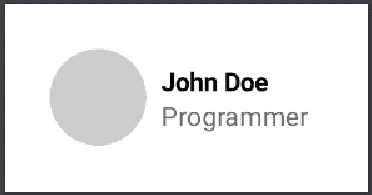

# 探索 Jetpack 撰写:基础

> 原文：<https://blog.devgenius.io/exploring-jetpack-compose-the-basics-cfb27264e6c6?source=collection_archive---------3----------------------->

## 了解 Jetpack Compose 的基础知识。

照片由 [Rohit Tandon](https://unsplash.com/@rohittandon?utm_source=medium&utm_medium=referral) 在 [Unsplash](https://unsplash.com?utm_source=medium&utm_medium=referral) 上拍摄

Android 的下一个重大变化现在处于 alpha 阶段，所以这可能是开始探索这个库并了解它如何帮助我们轻松编写更好的用户界面的最佳时间。

> Jetpack Compose 是 Android 用于构建原生 UI 的现代工具包。它简化并加速了 Android 上的 UI 开发。— [正式文件](https://developer.android.com/jetpack/compose)。

# 使用 Compose 的好处

*   Jetpack compose 使我们不必编写冗长 XML 文件。可以用更少的声明性代码创建相同的 UI。
*   当应用程序中的数据发生变化时，Jetpack compose 会自动处理 UI 状态的变化。
*   它与我们应用程序中的现有代码兼容。您可以轻松地迁移到 compose。
*   它内置了对材质设计、动画、黑暗主题等的支持。
*   它可以直接访问 Android 平台的 API。

# 项目设置

由于 Jetpack Compose 处于 alpha 阶段，你需要使用 android 的最新版本。在 android studio 的 canary 版本中，您可以通过选择一个**空合成活动来启动一个合成项目。**

*   你的`minSdkVersion`应该不低于 21。
*   确保使用 kotlin 版本`1.4.0`或更高版本。

Android studio 将自动配置您的项目，通过添加所需的依赖关系到您的应用程序级别`build.gradle`来使用 compose。

build.gradle

# 一些基本的东西

Jetpack Compose 完全改变了我们在 android 中创建用户界面的方式，这意味着我们将不是通过编写`XML`而是通过在应用程序代码中描述我们的 UI 来创建 UI。

## 可组合函数

可组合函数是 Jetpack Compose 的核心。在 Jetpack Compose 中，您将声明您的应用程序 UI 组件，如`Button`、`TextView`、`EditText`等。通过创建可组合的函数，而不是在 XML 文件中编写视图。您可以通过用`@Composable`注释标记来创建一个可组合的函数。

主活动. kt

*   `SayHello()`函数是一个标有`@Composable`注释的可组合函数。
*   `Text()`函数是 jetpack compose api 中提供的另一个可组合函数。它在活动中创建一个文本元素。
*   `setContent{ }`是 jetpack compose 提供的一个函数，它将给定的可组合组件组合成给定的活动。传入的 composable 成为活动的根视图。
*   可组合函数只能从其他可组合函数中调用。

上面的代码将在活动的左上角创建一个文本元素。

同样，您可以使用`Button()` composable 函数创建一个`Button`元素。

*   `Buttton()`可组合函数为按钮点击事件获取一个`onClick`λ。
*   `Button()`函数为`Button`上显示的内容获取另一个 lambda，例如文本“Show Toast ”,我们通过用`Text()`函数创建一个文本元素来创建它。

上面的代码在活动的左上角创建了一个按钮。单击该按钮会显示一条提示消息。

## 布局

如果使用上述`Text()`功能创建多个文本元素，它们将出现在彼此之上，因为它们没有与文本元素相关联的布局。jetpack compose api 提供了创建布局的函数，以便在活动中垂直或水平堆叠 UI 元素。

要垂直堆叠元素，需要使用`Column`函数，要水平堆叠元素，需要使用`Row`函数。

主活动. kt

*   `Column`函数垂直堆叠元素
*   `Row`函数水平堆叠元素。

文本“星期二”和“下午 3:09”水平堆叠

## 修饰语

您可以使用修饰符来修饰可组合的。通过使用修改器，你可以改变一个组件的外观，比如添加填充，改变大小，应用重力等等。或者你可以使一个元素可点击、可滚动或可缩放。

将修饰符应用于文本元素

您可以使用`Modifier.padding(start = 8.dp)`将填充应用到文本元素的开头。

# 创建 UI 组件

现在我们将使用上述概念创建一个用户卡 UI 组件，如[官方代码实验室](https://developer.android.com/codelabs/jetpack-compose-layouts)中所述。

用户卡 UI 组件

主活动. kt

*   `Row`函数水平堆叠用户个人资料图像和姓名。
*   `Column`函数垂直堆叠用户名和作业。
*   `Surface`功能充当个人资料图像的占位符。我们可以用`shape`和`color`属性应用表面的形状和颜色，我们可以用`.preferredSize()`修改器设置尺寸。
*   您可以通过使用`.padding()`修改器添加填充来在个人资料图像和用户细节之间应用间距。
*   `ProvideEmphasis()`为文本元素创建一个强调。
*   您可以使用`.clickable()`修改器设置整个组件可点击，并使用`.clip()`修改器设置波纹的形状。

结束了。您学习并使用 Jetpack compose 创建了一个基本的 UI 组件。在下一篇文章中，我们将学习更多的概念，如应用材质主题和通过在 jetpack compose 中创建一些屏幕来创建复杂的布局。

# 参考

*   [构成路径](https://developer.android.com/courses/pathways/compose)
*   [撰写基础代码实验室](https://developer.android.com/codelabs/jetpack-compose-basics)
*   [合成布局 codelab](https://developer.android.com/codelabs/jetpack-compose-layouts)

如果你还在，谢谢你的阅读。