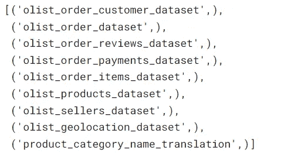

# 探索 Olist 电子商务数据集

> 原文：<https://blog.devgenius.io/exploring-olist-ecommerce-dataset-59652562496d?source=collection_archive---------8----------------------->

由 [Unsplash](https://unsplash.com?utm_source=medium&utm_medium=referral) 上的 [CardMapr.nl](https://unsplash.com/@cardmapr?utm_source=medium&utm_medium=referral) 拍摄的照片

> 业务决策通常需要深入分析数据。

本文旨在使用可视化从 olist 电子商务数据中发现一些洞察力。

**指数:**

1.  **目标**
2.  **概述**
3.  **准备**
4.  **目标 1**
5.  **目标 2**
6.  **目标 3**

**目标**:

在这次数据探索中，我的主要目标是:

1.哪些支付选项在加班中所占份额最大？

2.周末的订单是否大于工作日？

3.出售价值高于购买价值的州。

**概述**

在这个项目中，我们将使用 2016 年至 2018 年巴西的 olist 电子商务数据，这些数据存储在 sqlite 文件数据库中，由几个表组成:

来源:作者

但是根据我的目标，我使用:

1.  奥利斯特 _ 订单 _ 项目 _ 数据集
2.  奥利斯特 _ 卖家 _ 数据集
3.  奥利斯特 _ 订单 _ 数据集
4.  奥利斯特 _ 订单 _ 客户 _ 数据集

**准备**

**目标 1:哪种支付方式在加班中所占份额最大？**

为了实现这些目标，我们将使用以下 SQL 查询数据

在处理步骤中，我使用空值检查并检查重复值。结果是数据没有空数据和重复数据。

下一步，我将**order _ purchase _ timestamp**列转换为 datetime 数据类型，并提取年份，以便以后进行聚合。

在按年份对 payment_type 计数进行分组后，我计算相对于其年份的百分比。然后用 matplotlib 绘图。结果是:

**关键要点**

从 2016 年到 2018 年的支付类型份额来看:

1.借记卡作为支付工具略有增加，

2.信用卡占据了最大的份额，而且这一趋势还在增长

3.凭单付款类型正在减少

**目标 2:周末的订单是否大于工作日？**

为了获取相关数据，我创建了 SQL 查询:

预处理步骤与第一个目标基本相同。结果是没有丢失和重复的值。

之后，我将**order _ purchase _ timestamp**转换成 pandas.datetime 数据类型，并提取日期名称和时间。

为了回答这个问题，我们需要知道 24 小时内每天的订单密度。为此，我只按日名和小时分组。在热图绘图之后

**关键要点**

按日计算，**周末(周六和周日)订单少于工作日。从周一到周日，我们可以看到密度逐渐降低。在工作日高峰时段订单在 7 点到 13 点之间。对于周六，我们在 3 点至 13 点钟看到稳定的模式，而对于周日，在 1 点至 13 点钟出现最高顺序。**

**目标 3:哪些州的卖出价值高于买入价值？**

为了获得相关数据，我使用以下查询获取数据:

预处理步骤:检查空值和重复值:

获取数据后，我创建了两个数据帧，即包含每个订单的聚合价格的卖方和客户数据帧。下一步，我根据状态连接两个数据帧。卖方状态中缺少值，只有 23 个状态，而客户状态有 27 个状态。没有被覆盖的状态是因为状态没有卖方。我假设没有出售价值，因此用 0 来计算是合理的。

识别一个州是否在消费/销售的下一步是从它的边际开始。为了计算它，我减去卖出值——买入值。对于小熊猫功能，我将它们分为以下标签:

结果是:

**关键要点**

根据上述分析，大多数州的消费高于销售，在 27 个州中，只有 3 个州的销售价值高于购买价值，包括:

**1。SP 状态(最高保证金)**

**2。SC 状态**

**3。服务请求状态**

从消费活动来看，消费最高的是 **RJ 州。**

所有的目标都包括在内。下一篇更新的文章将涵盖更多的目标。代码可在我的 [github](https://github.com/fakhrirobi/olist_data_report) 或 [deepnote](https://deepnote.com/workspace/fakhrirobi-dd7ad1e4-0582-43be-86e2-12ce5f9bacb3/project/Olist-eb1ca835-0abf-4be1-b9fa-478f699ea927/%2Folist_wrangling_notebook.ipynb) 中找到。

或者，如果你想了解更多关于我以前的媒体文章:

**我的 Fullstack Timeseries 项目:**

**第一部分:** [**时间序列预测:航空客运(时间序列端到端项目第一部分)**](/time-series-forecasting-passenger-air-traffic-time-series-project-part-1-da51d4e8520a)

**第 2 部分:** [**使用 Dash 创建时间序列仪表板(时间序列端到端项目第 2 部分)**](https://medium.com/@fakhrirobi.fra/create-timeseries-dashboard-using-dash-timeseries-end-to-end-project-part-2-38f0319e952?source=your_stories_page----------------------------------------)

**第三部分:** [**使用 Fast API 和 Heroku 将预测模型部署为 API(时间序列端到端项目第三部分)**](/deploy-forecasting-model-as-api-with-fast-api-and-heroku-timeseries-end-to-end-project-part-3-34692d980c3?source=your_stories_page----------------------------------------)