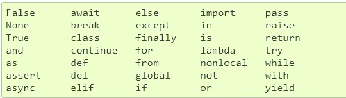
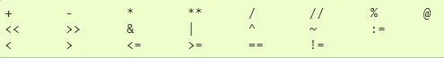
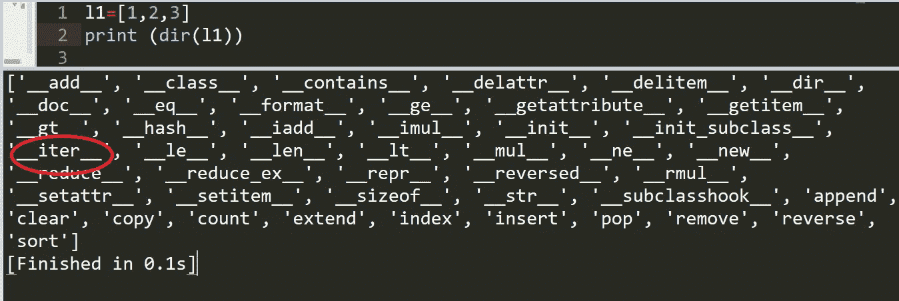
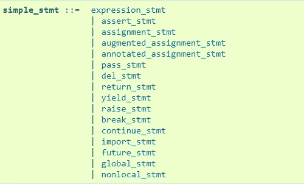
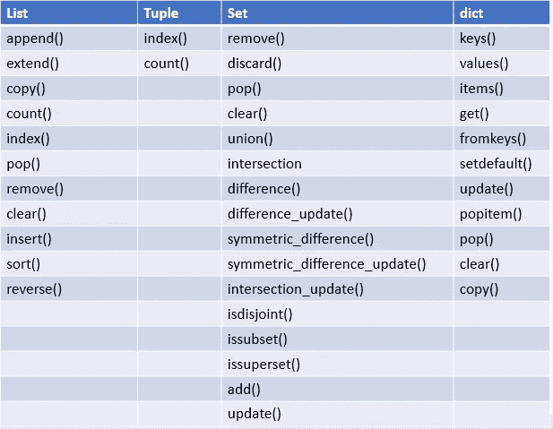
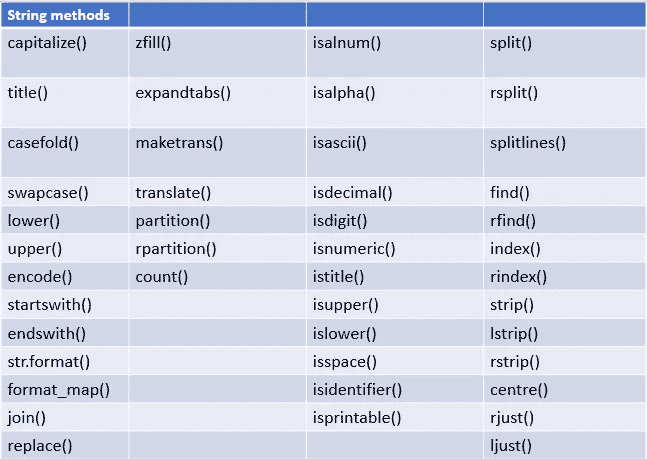

# 探索 Python 基本术语

> 原文：<https://blog.devgenius.io/exploring-python-basic-terms-15ba62286c53?source=collection_archive---------2----------------------->

## 了解 python 基本术语


来自 [Pexels](https://www.pexels.com/photo/kids-sitting-on-green-grass-field-1094072/?utm_content=attributionCopyText&utm_medium=referral&utm_source=pexels) 的[维多利亚·博罗迪诺娃](https://www.pexels.com/@victoria-borodinova-392079?utm_content=attributionCopyText&utm_medium=referral&utm_source=pexels)的照片

## Python 基本术语

1.  标识符
2.  关键词
3.  经营者
4.  对象 Id，对象类型
5.  顺序
6.  设置类型
7.  映射
8.  可迭代的
9.  迭代程序
10.  简单的陈述
11.  内置类型
12.  内置函数
13.  内置方法
14.  可变的，不可变的
15.  文档字符串

## 标识符

Python 标识符是用来标识变量、类、函数、模块、包、方法、实例变量或任何其他对象的名称。
标识符以小写或大写字母`A-Z a-z`或`underscore`开头。
其后可以跟零个或多个字母、数字和下划线。
标识符中不允许使用特殊字符和空格。

**命名约定:**

1.  如果一个标识符以下划线开头，那么它就是一个私有标识符
    参考我关于 python 中[下划线的故事](https://medium.com/analytics-vidhya/underscores-in-python-266e8b3eedf2)。
2.  类名通常应该使用 CapWords 约定。
    `class BankAccount:`
3.  模块应该有简短的，全小写的名字。如果可以提高可读性，可以在模块名中使用下划线。
4.  Python 包也应该有简短的、全小写的名字，尽管不鼓励使用下划线。
5.  函数名应该是小写的，单词之间用下划线分隔，以提高可读性。
    T3
    
6.  变量名遵循与函数名相同的约定。
    `a=[1,2,3]`
    `d={‘a’:1}`
    
7.  方法名和实例变量应该小写，单词之间用下划线分隔，以提高可读性。
8.  仅对非公共方法和实例变量使用一个前导下划线。

**要避免的名字:**

切勿使用字符“l”(小写字母 el)、“O”(大写字母 oh)或“I”(大写字母 eye)作为单字符变量名称。在某些字体中，这些字符与数字 1 和 0 难以区分。

示例 1:函数名中给定了空格

```
**def** bank withdrawal():
    **pass** *#Output:SyntaxError: invalid syntax*
```

示例 2:函数名中的特殊字符

```
**def** withdrawal%():
    **pass***#Output:SyntaxError: invalid syntax*
```

## 关键词:

关键字是保留字，不能用作普通标识符。



来源 [: Python 文档](https://docs.python.org/3/reference/lexical_analysis.html#keywords)

## 经营者

python 支持以下运算符。



来源: [Python 文档](https://docs.python.org/3/reference/lexical_analysis.html#operators)

## 对象 Id，对象类型

每个对象都有标识、类型和值。
**对象 Id** 是内存中的对象地址。`id()`函数返回对象的标识
**对象类型**确定对象的类型，如列表、字典、元组、字符串等。
`type()`函数返回对象类型

```
list1=[1,2,3]
print (id(list1))*#Output:39270408* print (type(list1))*#Output:<class 'list'>* tuple1=(1,2,3)
print (id(tuple1))*#Output:39405192* print (type(tuple1))*#Output:<class 'tuple'>* dict1={1:**'a'**,2:**'b'**}
print (id(dict1))*#Output:22432336* print (type(dict1))*#Output:<class 'dict'>*
```

## 序列:

序列表示由非负数索引的有限有序集。

1.  **不可变序列**
    字符串
    元组
    字节

```
str1=**"python"** print (str1[1])*#Output: y* tup1=(1,2,3)
print (tup1[1])*#Output:2*
```

**2。可变序列**列表
字节数组

```
lis1=[1,2,3]
print (lis1[2]) *#Output:3*
```

## 设置类型

集合类型表示唯一的、不可变的对象的无序的、有限的集合。集合的常见用途是从序列中删除重复项，并执行[数学集合运算](https://medium.com/better-programming/mathematical-set-operations-in-python-e065aac07413)，如并、交、差、对称差。— [python 文档](https://docs.python.org/3/library/stdtypes.html#set-types-set-frozenset)

1.  **集**集
    集是不可变的。使用内置的 set()构造函数创建。空集被给定为 `set()`
2.  **冻结集**
    冻结集是不可变的。因为它是不可变的，也是可散列的，所以可以用作字典键

```
set1=set((1,2,3))
print (set1)*#Output:{1,2,3}* set2={1,2,3}
print (set2)*#Output:{1,2,3}* fro1=frozenset({1,2,3})
print (fro1)*#Output:frozenset({1, 2, 3})*
```

## 映射

> 一个*映射*对象将一种类型(键类型)的值映射到任意对象。映射是可变的对象。目前只有一种标准的映射类型，即*字典*。字典的键几乎是任意值。唯一不能作为键接受的值类型是包含列表、字典或其他可变类型的值，这些值是通过值而不是通过对象标识进行比较的。- [python 文档](https://docs.python.org/3/library/stdtypes.html#mapping-types-dict)

```
d={**'a'**:1,**'b'**:2}
```

## 可重复的

能够一次返回一个成员的对象。可以使用 for 循环对 Iterables 进行迭代。

**例**。列表、集合、元组、字典、范围对象、文件对象

```
list1=[1,2,3]
**for** i **in** list1:
    print(i , end=**" "**) *#Output:1 2 3* set1={1,2,3}
**for** i **in** set1:
    print(i , end=**" "**)*#Output:1 2 3* tuple1=(1,2,3)
**for** i **in** tuple1:
    print(i , end=**" "**)*#Output:1 2 3* dict1={1:**'a'**,2:**'b'**}
**for** i **in** dict1:
    print (i,end=**" "**)*#Output:1 2 3* r=range(1,4)
**for** i **in** r:
    print (i,end=**" "**)*#Outpur:1 2 3*
```

## 迭代器

表示数据流的对象。如果 iterable 包含`iter()` 函数，我们可以转换成迭代器。



我们可以迭代迭代器
1。使用 for 循环

我们可以在迭代器上迭代。但是它只会迭代一次。尝试第二次迭代只会返回与前一次迭代中使用的相同的耗尽迭代器对象，使它看起来像一个空容器。

```
n1=[1,2,3]
n2=iter(n1)
**for** i **in** n2:
    print (i, end=**" "**) *#Output: 1 2 3* print (**""**)#exhausted iterator returns an empty container
n3=list(n2)
print (n3)*#Output: []*
```

**2。使用 next()函数**
当迭代器用尽(没有更多的数据可用)时，会引发一个`StopIteration`异常。

```
n1=[1,2,3]
n2=iter(n1)
print (next(n2))*#Output: 1* print (next(n2))*#Output: 2* print (next(n2))*#Output: 3* print (next(n2))*#Output:StopIteration*
```

参考我的故事 [Iterable vs 迭代器](https://medium.com/analytics-vidhya/iterable-vs-iterator-in-python-eda1295a815e)

## 简单的陈述

一个简单的语句由一行逻辑行组成



来源: [Python 文档](https://docs.python.org/3/reference/simple_stmts.html#simple-statements)

## **内置方法**

可变对象的内置方法。

在对象上调用方法。其返回类型为**无**。它将修改原始对象本身。但是 python 函数不修改对象，它会返回一个新的对象。

《出埃及记》列表对象有一个内置方法`sort`和内置函数`sorted()`

排序→这必须在一个对象(列表)上调用，如`list.sort()`
它将修改原始列表。它不会返回任何东西。

sorted()-这是内置函数。`sorted(list)`
它将返回一个新的排序列表。它不会修改原始列表。

```
*#built-in methods* list1=[2,1,5,3,7,6,4]
print (list1.sort())*#Output:None* print (list1)*#Output:[1,2,3,4,5,6,7]

#built-in functions* list2=[2,1,5,3,7,6,4]
print (sorted(list2)) *#Output:[1,2,3,4,5,6,7]
# It won't modify the original list.* print (list2)*#Output:[2, 1, 5, 3, 7, 6, 4]*
```

**列表、元组、字典和集合支持的内置方法。**



图片来源:作者

**字符串支持的内置方法**

不可变对象(如 string)的内置方法将返回字符串的新副本。它不会修改原始字符串。



图片来源:作者

## **可变对象**

值可以改变的对象称为*可变*；一旦被创建，其值就不可改变的对象被称为*不可变*。

**可变对象**-列表、字典、集合

**不可变对象**-字符串、元组

## 文档字符串

docstring 是作为模块、函数、类或方法定义中的第一条语句出现的字符串文字。它允许程序员添加关于函数/类的快速注释。它也可以跨越多行。我们可以使用 __doc__ 方法来访问 docstring。
为了保持一致，请始终在文档字符串两边使用“三重双引号”。- [python 文档](https://www.python.org/dev/peps/pep-0257/)

```
**def** add1(a,b):
    *"""This function used to calculate subtraction of 2 numbers"""* **return** a-b

print(add1.__doc__)
*#Output: This function used to calculate subtraction of 2 numbers*
```

## 资源(Python 文档):

[数据模型](https://docs.python.org/3/reference/datamodel.html)

[内置类型](https://docs.python.org/3/library/stdtypes.html)

[简单的语句](https://docs.python.org/3/reference/simple_stmts.html)

[可迭代定义](https://docs.python.org/3/glossary.html#term-iterable)

[命名约定](https://www.python.org/dev/peps/pep-0008/#prescriptive-naming-conventions)

[文档字符串约定](https://www.python.org/dev/peps/pep-0257/)

*关注此空间，获取更多关于 Python 和数据科学的文章。如果你喜欢看更多我的教程，就关注我的* [***中***](https://medium.com/@IndhumathyChelliah) ，[***LinkedIn***](https://www.linkedin.com/in/indhumathy-chelliah/)***，*** [***推特***](https://twitter.com/IndhuChelliah) ***。***

感谢阅读！