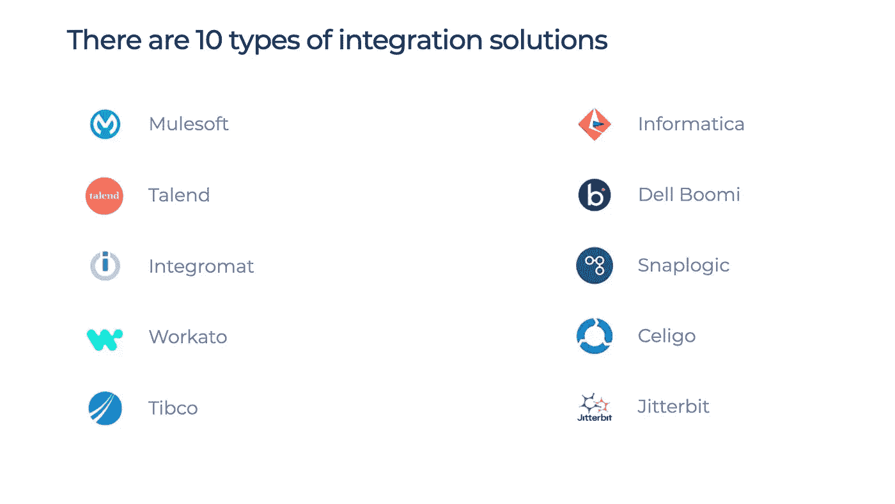

# 探索对来自第三方 REST APIs 的数据使用无服务器接收的好处和挑战

> 原文：<https://blog.devgenius.io/exploring-the-benefits-and-challenges-of-using-serverless-ingestion-for-data-from-third-party-rest-ec3db33f7ac5?source=collection_archive---------22----------------------->

照片由 [JJ 英](https://unsplash.com/@jjying?utm_source=medium&utm_medium=referral)在 [Unsplash](https://unsplash.com?utm_source=medium&utm_medium=referral)

在今天的会议中，我们将探讨从第三方 REST APIs 获取数据以创建市场的情境化视图所面临的挑战。我们将探讨数据摄取和 ETL 系统的角色，以及维护当前编排系统所需的复杂管道管理逻辑。我建议过渡到一个无服务器的摄取后端，利用其服务之间的本机系统集成来简化将 REST APIs 摄取到易于理解和维护的声明性 YAML 文件中的逻辑。这将节省资金并降低服务复杂性。

使用无服务器后端的优势包括仅在实际运行时间内进行自定义运行时计费、无缝横向扩展和纵向扩展以降低成本，以及通过智能指定每个端点调用的计算和内存要求来优化成本的能力。无服务器产品还提供了它们之间的本机集成，消除了协调复杂服务的粘合代码的需要，并将编排转移到按需计费模型。

首先，让我们检查一下数据摄取和 ETL 服务的当前状况，以确定我们正在应对的挑战。

## 使用无服务器后端的好处

*   无服务器功能提供自定义运行时间，仅在实际运行时间内收费，同时提供无缝的横向扩展和纵向扩展功能，以降低成本。
*   我们可以通过针对每个端点调用的计算和内存需求的智能需求规范来进一步优化成本计算，而不是针对整个摄取集群。
*   无服务器产品提供了彼此之间的本机集成，减少了创建复杂服务协调的粘合代码的需要。这消除了运行昂贵的编排服务的需要，并将编排从永不停机模式转移到按需计费模式。

首先，让我们了解当前数据摄取和 ETL 服务的服务前景，以明确我们具体要应对的挑战。

## 数据摄取和 ETL 的角色

数据接收和 ETL(提取、转换和加载)是数据管理领域中经常使用的两个不同的过程。这些过程虽然有关联，但不是一回事。

**数据摄取**是指将数据导入系统或数据库的过程。该过程通常涉及将数据从一个系统传输到另一个系统，并且可能涉及对数据进行一些初始清理和处理，以使其适合在目标系统中使用。数据摄取服务通常设计用于处理大量数据，并从各种不同的来源导入数据。

另一方面， **ETL** 指的是转换和清理数据的过程，以便可以在下游过程或分析中使用。这个过程通常包括从一个或多个源提取数据，将其转换为适合目标系统的格式，然后将其加载到目标系统中。ETL 服务通常被设计为处理复杂的数据转换，并确保结果数据是准确和一致的。

## 数据摄取责任

数据摄取和 ETL 之间的主要区别在于，数据摄取侧重于将数据导入系统，而 ETL 侧重于转换和清理数据，以使其适用于下游流程。

数据摄取框架可能执行的一些常见任务包括:

*   **从各种来源提取数据**，包括文件、数据库和数据流
*   **转换和清理**数据，使其适合目标系统
*   **以高效且可扩展的方式将数据**加载到目标系统中
*   为**监控和管理数据摄取过程**提供工具和接口

## 流行的数据摄取框架

有几种不同的数据接收框架常用于数据管理领域。一些最常见的数据接收框架包括:

1.  **Apache Flume**:Apache Flume 是一个开源的数据摄取框架，通常用于从各种来源收集、聚合和移动大量数据到一个集中的数据存储。Flume 具有高度的可伸缩性和容错性，可用于从各种来源获取数据，包括日志文件、社交媒体提要和传感器数据。
2.  **Apache NiFi** : Apache NiFi 是另一个开源数据摄取框架，它被设计成高度可配置和可伸缩的。NiFi 提供了一个基于 web 的用户界面，允许用户创建数据流并自动在不同系统之间移动数据。它还包括对多种数据格式和协议的内置支持，使其易于与各种不同的系统集成。
3.  Apache Storm : Apache Storm 是一个分布式实时数据接收和处理框架，旨在处理大量数据。Storm 提供了一个简单的编程模型，允许开发人员快速轻松地构建能够实时处理数据流的应用程序。它通常用于需要低延迟数据处理的应用，如实时分析和事件处理。
4.  **Apache Kafka** : Apache Kafka 是一个分布式、可伸缩、容错的数据接收和流平台。Kafka 通常用于构建实时数据管道和流应用程序，并为存储、处理和分析数据流提供了一套强大的工具。

## 基于云的集成和流程编排服务

基于云的集成和编排服务是使开发人员能够创建数据驱动的管道的平台，这些管道可以移动、转换和处理来自各种来源的数据，通常使用基于云的基础设施。基于云的集成和流程编排服务的一些示例包括:

*   **Azure Data Factory**:Azure Data Factory 是微软 Azure 提供的基于云的数据集成和编排服务。它允许开发人员创建数据管道，可以移动、转换和处理来自各种来源的数据，包括内部系统和云服务。
*   **AWS Glue** : AWS Glue 是亚马逊网络服务(AWS)提供的基于云的数据集成和编排服务。它允许开发人员创建可以从各种来源(包括数据库、文件和流)提取、转换和加载数据的数据管道。
*   **Google Cloud Composer:**Google Cloud Composer 是 Google 云平台提供的基于云的数据集成和编排服务。它允许开发人员创建数据管道，可以移动、转换和处理来自各种来源的数据，包括内部系统和云服务。
*   **IBM Cloud Integration**:IBM Cloud Integration 是 IBM Cloud 提供的基于云的数据集成和编排服务。它允许开发人员创建数据管道，可以移动、转换和处理来自各种来源的数据，包括内部系统和云服务。

## 那么，IPaas(集成平台即服务)产品怎么样呢

IPA as(Integration Platform as a Service)是一个基于云的平台，它提供了一套工具和服务，用于构建、部署和管理数据集成和编排解决方案。IPaaS 服务的一些示例包括:

*   **Azure Logic Apps**:Azure Logic Apps 是微软 Azure 提供的基于云的集成平台。它允许开发人员使用可视化的拖放界面构建数据管道，并为各种数据源和服务提供内置连接器。
*   **AWS Step Functions**:AWS Step Functions 是亚马逊 Web Services (AWS)提供的基于云的集成平台。它允许开发人员使用状态机模型定义和执行数据管道，并与其他 AWS 服务集成，以实现端到端的数据解决方案。
*   **谷歌云数据融合**:谷歌云数据融合是谷歌云平台提供的基于云的集成平台。它允许开发人员使用可视化的拖放界面构建和管理数据管道，并为各种数据源和服务提供内置连接器。
*   **MuleSoft 任意点平台** : MuleSoft 任意点平台是 MuleSoft 提供的基于云的集成平台。它允许开发人员使用各种不同的集成模式构建数据管道，并提供管理和部署集成解决方案的工具。

所有 IPaaS 系统都旨在通过本机连接器、混合或完全可视化的设计体验以及所需服务器基础架构的无服务器(或基于云)部署来简化工作流程。然而，将这些系统用于 REST API 逻辑的挑战是缺乏对跨端点管理依赖关系和跨函数解析依赖参数的支持。这可能导致一个复杂的、硬编码的依赖关系解析和临时存储架构，只是为了检索最终的集成数据模式。

所有系统都试图通过本机连接、混合或完全可视化的设计体验以及所需服务器基础架构的无服务器(或基于云)部署来简化您的工作流程。

这里的挑战是，特别是对于 REST API 逻辑，不支持管理跨端点的依赖性或跨函数的依赖参数的解析。因此，我们最终将得到一个更加复杂、硬编码的依赖关系解析和临时存储架构，只是为了检索我们最初来这里接收的最终集成数据模式。

## 为了集成 REST APIs，您现在可能会做什么

从复杂的、相互依赖的 REST API 端点获取数据以收集自定义数据模式的过程包括定义模式、构建获取管道、测试管道、部署管道以及监控和维护管道。

支持这一过程的系统设计将受到您试图集成的 REST API 数据接口的设计所产生的需求的影响，包括:

*   提供实体详细信息的端点依赖于通过其他端点解析的实体标识符
*   复杂数据集通常具有多层嵌套，需要解析端点调用中的多个参数
*   您可能正在使用一个编排框架来执行 REST 摄取，解析结果，并将它们加载到一个接收器中
*   您可能已经开始开发包含复杂代码逻辑的 lambda-lith，这些复杂代码逻辑可以被参数化，以概括 API 端点的摄取并使用元数据表中的参数。在所有情况下，您最终都会得到一组依赖的(硬编码逻辑)管道，这些管道检索其他端点的参数，以解析所需的数据并将其集成。

获取一组复杂的相互依赖的 REST API 端点以从第三方数据提供者收集自定义数据模式的过程可以分为以下几个步骤:

1.  **定义数据模式**:数据摄取过程的第一步是定义数据模式，该模式将用于存储从 REST API 端点收集的数据。这个模式应该被设计为从 API 中捕获所有需要的数据，并且应该以一种允许数据被容易地访问和查询的方式来组织。
2.  **构建数据接收管道**:一旦定义了数据模式，下一步就是构建将用于从 API 端点收集数据的数据接收管道。这个管道应该被设计成处理 API 端点的相互依赖的性质，并且应该能够从每个端点提取数据并将其转换成定义的数据模式。
3.  **测试数据接收管道**:在部署数据接收管道之前，对其进行测试以确保其正常工作是非常重要的。这可能涉及使用样本数据运行管道，并验证数据是否被正确收集和存储在目标系统中。
4.  **部署数据接收管道**:一旦数据接收管道经过测试并正常工作，就可以将其部署到生产环境中。这通常包括将管道部署到基于云的平台，如 Azure Data Factory 或 AWS Glue，并将其配置为定期运行，以从 API 端点收集数据。
5.  **监控和维护数据接收管道**:部署数据接收管道后，监控它以确保其平稳运行并正确收集数据是非常重要的。这可能涉及监视管道的错误和性能问题，并对管道进行任何必要的更改或更新，以确保它继续正确工作。

## 无服务器摄取系统

由于为您的模型生成训练数据需要更多的数据，数据摄取逻辑管理的影响也随之增加。

无服务器摄取是指使用无服务器计算技术来实现数据摄取过程。无服务器计算允许开发人员构建和运行应用和服务，而不必担心管理基础设施，如服务器或虚拟机。这使得构建和部署可扩展且经济高效的数据接收系统变得更加容易。

*   **AWS Lambda** : AWS Lambda 是亚马逊网络服务(AWS)提供的无服务器计算服务。它允许开发人员运行代码来响应事件，如亚马逊 S3 桶中的数据变化或亚马逊 Kinesis 流中的消息。Lambda 可用于构建由特定事件触发的数据接收管道，并可自动伸缩以处理不同的工作负载。
*   **Azure Functions**:Azure Functions 是微软 Azure 提供的无服务器计算服务。它允许开发人员运行代码来响应事件，如 Azure 存储帐户中的数据变化或 Azure 服务总线队列中的消息。Azure 函数可用于构建由特定事件触发的数据摄取管道，并且可以自动扩展或缩减以处理不同的工作负载。
*   **谷歌云功能**:谷歌云功能是谷歌云平台提供的无服务器计算服务。它允许开发人员运行代码来响应事件，如 Google 云存储桶中的数据变化或 Google Cloud 发布/订阅主题中的消息。Google Cloud 函数可用于构建由特定事件触发的数据接收管道，并且可以自动扩展或缩减以处理不同的工作负载。

## 为什么我们应该转向无服务器？

分布式系统是由多个组件组成的系统，这些组件一起工作以实现一个共同的目标。这些系统可以使用各种不同的技术和架构来构建，包括无服务器服务。

使用无服务器服务构建分布式系统的一个原因是它们具有高度的可伸缩性。无服务器服务旨在根据工作负载自动伸缩，这意味着它们可以轻松处理大量请求，而无需任何手动干预。这对于处理高流量的分布式系统尤其有用。

为分布式系统使用无服务器服务的另一个原因是它们可以节省成本。由于无服务器服务只对代码的实际执行时间收费，因此它比使用传统服务器更具成本效益，传统服务器通常按小时收费。这对于工作负载不可预测或需要高可用性的分布式系统尤其有用。

此外，为分布式系统使用无服务器服务可以使构建和部署应用程序变得更加容易。无服务器服务提供了高度的抽象，这意味着开发人员可以专注于编写代码，而不必担心底层基础设施。这使得快速有效地构建和部署分布式系统变得更加容易。

## 无服务器接收框架需要什么

当摆脱复杂、昂贵的第三方摄取管理系统时，我们需要一个无服务器后端，它可以为我们提供:

*   **人类可读的配置文件中 REST API 业务逻辑的声明性配置**，这些配置文件被编译成可执行的无服务器系统。想想 Kubernetes 模板文件。
*   **本地编排**构建于反应式架构之上，如消息传递、队列、主题和事件触发器。
*   **将为 REST API 调用提供参数的数据解析器**功能从执行请求的函数中分离出来。
*   **语义抽象**可以帮助我们重用相同的系统架构，而不管实际部署目标(AWS、Azure、GCP、Kubernetes 等)的实现逻辑。)
*   **代码编译逻辑**为给定的端点请求/认证/响应-处理程序/输出组合生成特定的功能代码
*   **一个干净的，易于推理的接口**来实现跨不同后端提供者的系统

这将帮助我们克服:

*   需要连续运行复杂的主/从集群架构，这需要高可用性设置，维护成本很高。
*   面向依赖端点解析器调用的多个中间参数解析管道之间的流中的硬编码业务逻辑
*   不兼容的第三方工具，具有自己的部署、监控、管理和日志记录流程。
*   在托管服务不可用的情况下，需要维护复杂的分布式开源系统部署。
*   难以维护的抽象接口中依赖于工具的、通常非代码的摄取管道逻辑配置。

接下来会发生什么

在下面的文章中，我将描述第一个`IngestLess`框架的 PoC 实现，它使用 YAML 格式的 Kubernetes 风格的配置文件来描述一组要摄取的依赖 REST API 端点。

该架构建立在语义抽象层之上，该层定义了跨越`functions`、`tables`、`queues`和`topics`的交互，将所需的编排逻辑放到本机后端。

一个基于 ServiceBus 功能构建的示例 Orchestrator 将展示如何使用事件触发器、消息传递、用于数据传递的中间存储队列以及扇出数据解析主题(针对多个函数需要解析来自上游解析器的相同数据的情况)对跨函数的交互进行本机建模。

该项目是我正在构建的即将到来的人工智能交易平台系统所需的数据摄取层的概念验证，欢迎所有反馈和功能请求。

在[https://github.com/data-native/ingestless](https://github.com/data-native/ingestless)检查系统