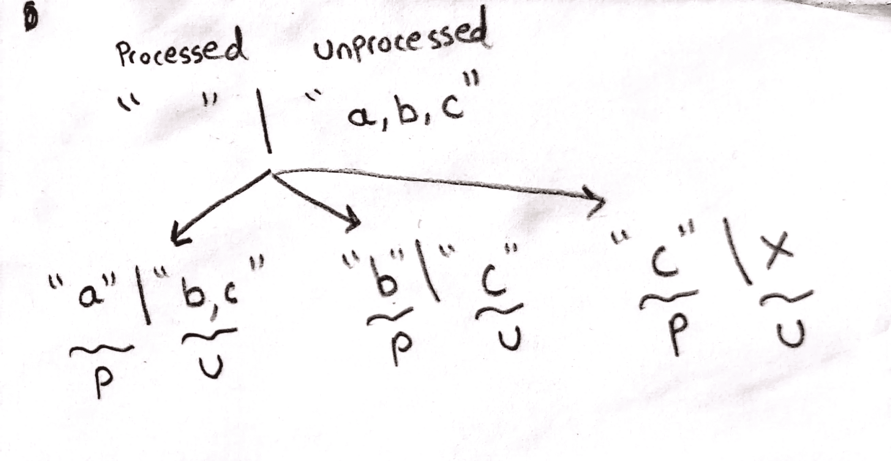
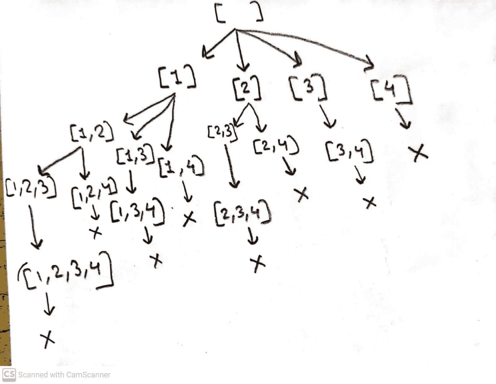
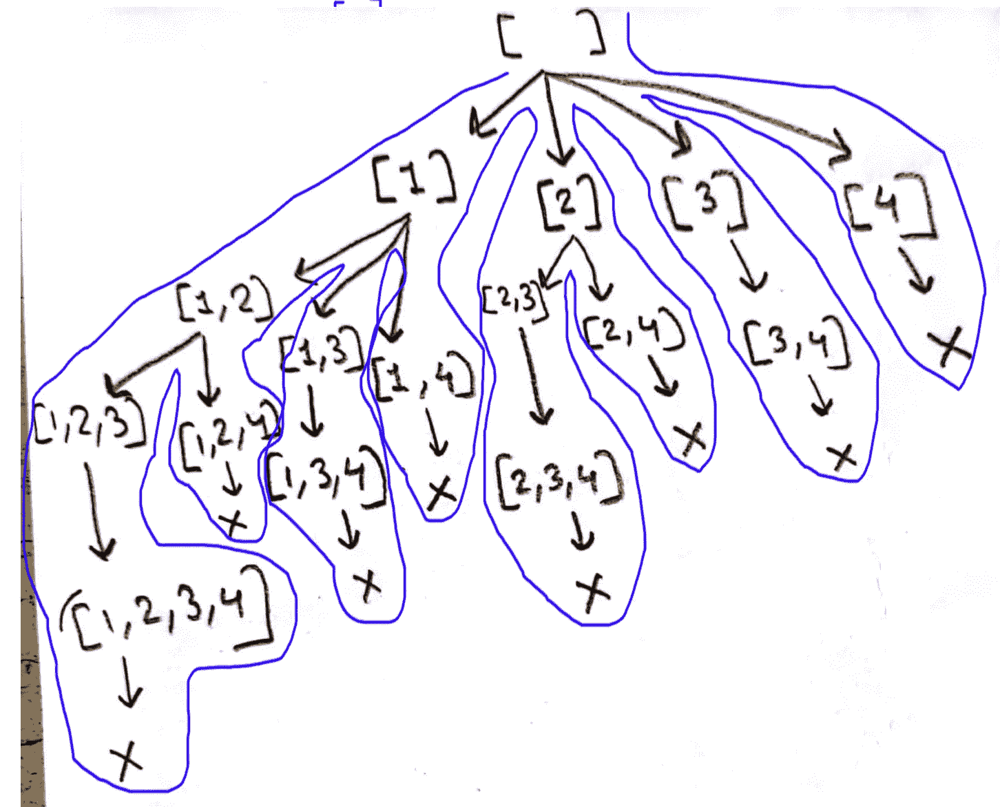
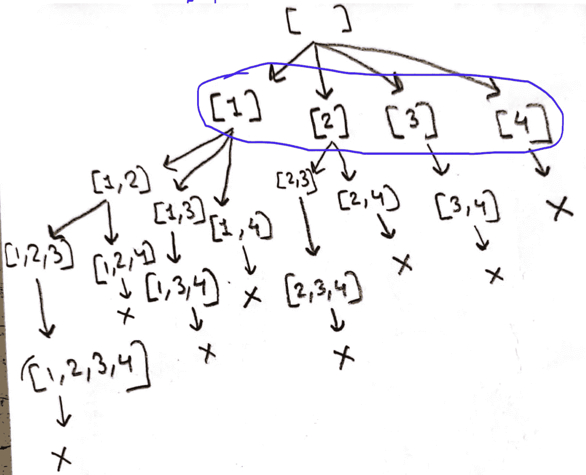
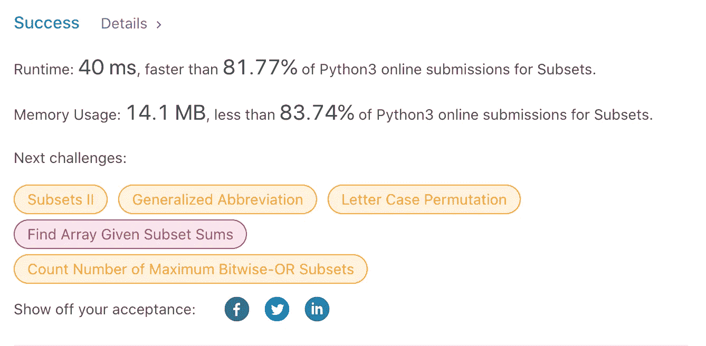
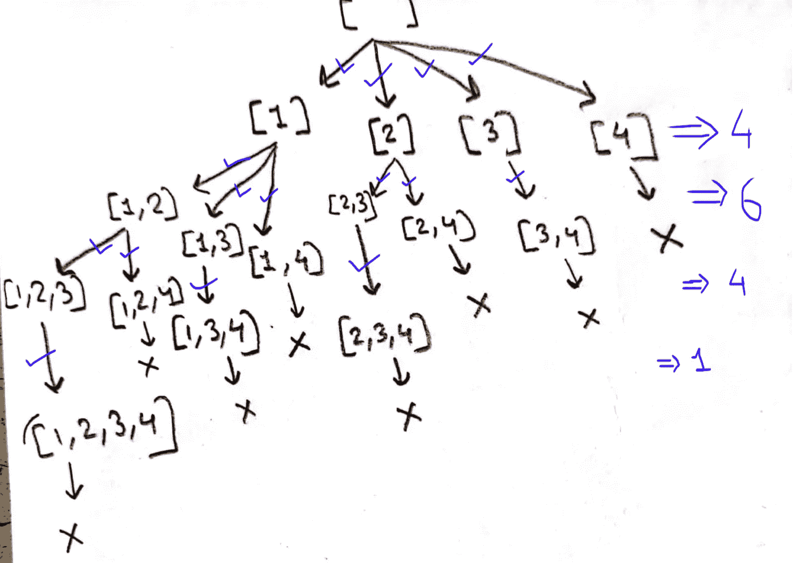
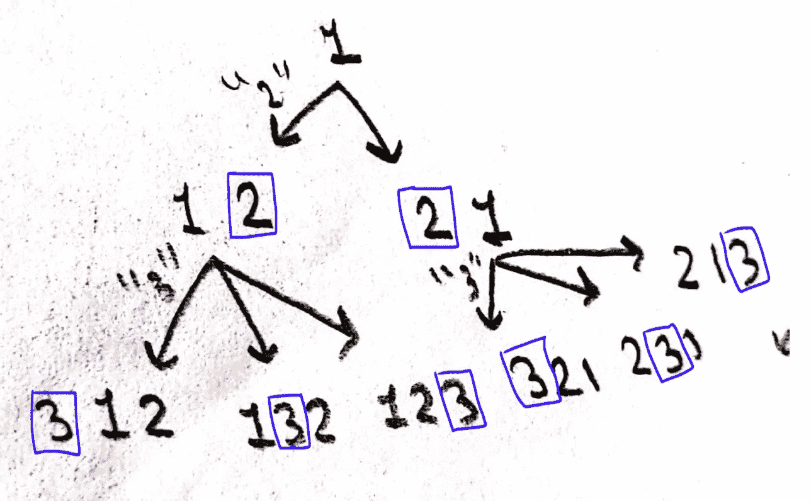
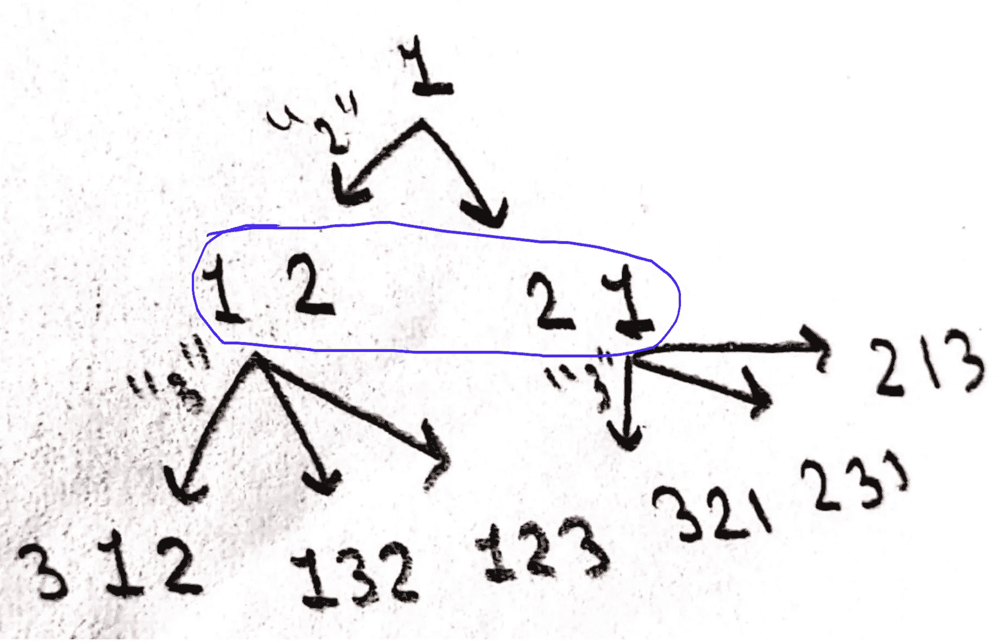
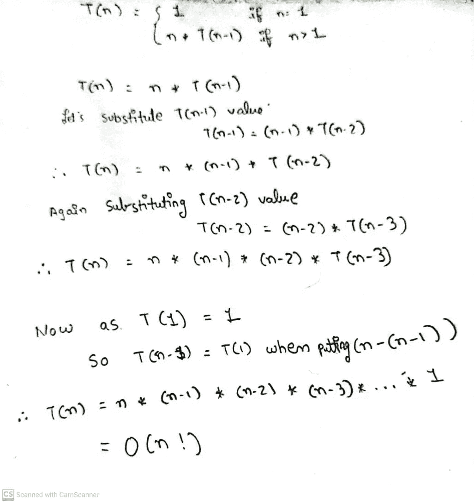
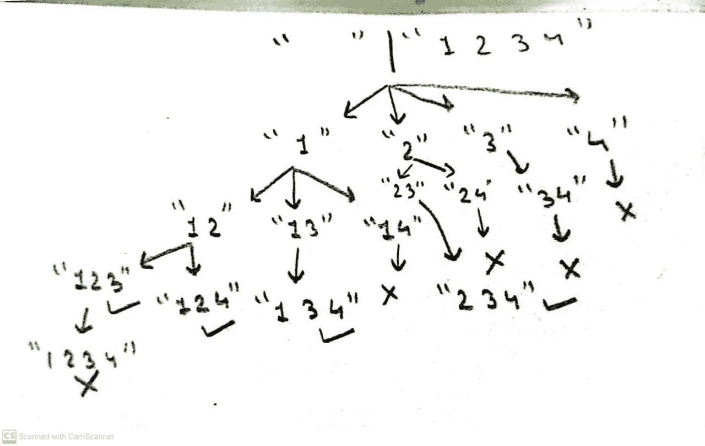

# 探索递归的基础:子集、置换和组合

> 原文：<https://blog.devgenius.io/exploring-the-fundamentals-of-recursion-subsets-permutations-and-combinations-189001dc000e?source=collection_archive---------8----------------------->


在本帖中，我们将深入迷人的递归世界，探索构成这一强大编程技术基础的三个基本概念:子集、置换和组合。

## 递归

递归是一种编程技术，它涉及根据函数本身定义函数，允许函数一遍又一遍地重复特定的任务，直到满足某个条件。这个概念一开始看起来可能很混乱，但是通过一点实践和对底层逻辑的理解，你会发现递归可以成为解决复杂问题的强大工具。

所以，事不宜迟，让我们从探索递归的三个基本概念中的第一个开始我们的旅程:

## 1.子集

子集是组成更大集合的一组元素，在递归的上下文中，我们可以使用这个概念来生成集合中所有可能的元素组合。

**例 1:**

输入:nums = [1，2，3，4]
输出:
[]
【1】
【2】
【1，2】
【3】
【1，3】
【2，3】
【1，2，3】
【4】
【1，4】
【2，4】
【1，2，4】
【3，4】

最重要的是，从输入和输出，我们需要可视化的树。一旦可视化完成，实现递归就非常容易了。
例:【1，3】这里我们取了 1 和 3，而忽略了 2 和 4。

我们遵循的过程是加工和未加工的方法。

## 加工和未加工方法

*   让我们来理解什么是加工过的方法和未加工的方法。这里，我们将有两个选择，要么接受一个元素，要么忽略该元素。
*   下面的树显示了流程和取消流程方法是如何工作的



*   如果我们对[1，2，3，4]的给定输入应用这个过程和 unprocess 方法，那么递归树将看起来像这样



现在，如果对生成的树进行中缀遍历，我们将得到所需的输出。



因此，我们由此推断出如下结论

1.  我们在每次函数调用时都需要打印语句。
2.  我们将遵循自顶向下的方法，基本条件在顶部，递归调用在底部。
3.  基本条件是当我们到达数组的末尾时，在我们的例子中是 4。

```
def subset(output, index):
    #Print statement#
    print(output)

    #Base condition#
    if index == len(arr):
        return

    #Recusive logic#

#Function calling#
subset(output=[], index=0)
```

所以，我们的第一个模板已经准备好了。

现在，让我们演练并探索如何编写递归逻辑。
为，此见树的横向形式。在第一次递归调用中，我们有[1，2，3，4]。



我们怎么才能得到这个[1，2，3，4]？通过一个循环很简单。此外，您可以看到在空数组中有[1]、[2]、[3]、[4]。所以，这意味着我们在输出[]中添加了迭代器。之后，追加它，我们正在做一个递归调用。

记住，已处理和未处理规则说，如果我们添加了一些东西，那么在调用之后我们也需要删除它。所以在递归调用之后，我们将调用 list.pop()方法。代码将如下所示。

```
arr = [1,2,3,4]

def subset(output, index):
    #Print statement#
    print(output)

    #Base condition#
    if index == len(arr):
        return

    #Recusive logic#
    for i in range(index, len(arr)):
        output.append(arr[i])
        subset(output, i+1)
        output.pop()

#Function calling#
subset(output=[], index=0)[]
[1]
[1, 2]
[1, 2, 3]
[1, 2, 3, 4]
[1, 2, 4]
[1, 3]
[1, 3, 4]
[1, 4]
[2]
[2, 3]
[2, 3, 4]
[2, 4]
[3]
[3, 4]
[4]
```

现在，假设我们想返回输出而不是打印。不要忘记重要的一点，在 python 中，一切都是通过引用传递的。所以我们需要使用 copy.copy()。如下图所示:

```
class Solution:
    def subsets(self, nums: List[int]) -> List[List[int]]:
        final_output = []
        def sub(output, index):
            #Print statement#
            final_output.append(copy.copy(output))

            #Base condition#
            if index == len(nums):
                return

            #Recusive logic#
            for i in range(index, len(nums)):
                output.append(nums[i])
                sub(output, i+1)
                output.pop()

        #Function calling#
        sub(output=[], index=0)
        return final_output
```

当通过 leetcode 提交时，我们的方法在时间和空间复杂度上快了 80%:



## 时间复杂度分析:

*   在这里，这个函数是一个递减函数，即对于每个调用，我们在 for 循环中缩小搜索范围。
*   所以递归关系不会只看代码就直接形成。我们需要看到形成的树的深度。
*   下面显示了每一步执行的递归调用的数量。



*   递归调用的总数= 15 = 2^n-1。因此，时间复杂度是 O(2^n).

给定代码的递归关系可以表示如下:

```
T(n) = 2 * T(n-1) + O(1)
```

其中，`T(n)`是输入列表大小为`n`的函数的运行时间，`O(1)`表示执行循环中的基本情况和代码所需的恒定时间。

这种递归关系可以通过分析递归函数调用的次数来导出。每个递归调用处理一个更小版本的输入列表，由于输入列表的长度是固定的`n`，递归调用的次数将受到 2 的幂的限制。具体来说，该函数将进行`2^n`递归调用，因为每个调用处理输入列表的一个子集，并且有`2^n`个大小为`n`的列表的可能子集。

使用替换法可以进一步简化递归关系:

```
T(n) = 2 * T(n-1) + O(1)
  = 2 * (2 * T(n-2) + O(1)) + O(1)
  = 2^2 * T(n-2) + 2 * O(1) + O(1)
  = 2^2 * (2 * T(n-3) + O(1)) + 2 * O(1) + O(1)
  = 2^3 * T(n-3) + 3 * O(1)
  ...
  = 2^n * T(0) + n * O(1)
  = 2^n * O(1) + n * O(1)
  = O(2^n)
```

## 2.排列

排列，是一组元素按特定顺序的排列。使用递归，我们可以生成给定集合的所有可能的排列，允许我们以特定的顺序检查元素的每个可能的组合。

例如，给定一组元素{1，2，3}，一些可能的排列是:

输入:[1，2，3]
输出:[[1，2，3]，[1，3，2]，[2，1，3]，[2，3，1]，[3，1，2]，[3，2，1]

输入:[1，2]
输出:[[1，2]，[2，1]]

从上面的例子中，如果你考虑[1，2，3]，[2，1，3]，[2，3，1]，那么在这个例子中，1 是逐步移动的。因此，我们将使用这种逻辑，并建立递归树。



因此由此我们得出以下结论:

1.  输出是在基本条件下获得的。
2.  基本条件是当索引到达末尾时

```
def permute(output, index):

    #Base Condition#
    if index == len(arr):
        print(output)
        return
    #Recursive function#

permute(arr[0],0)
```

现在，让我们演练并探索如何编写递归逻辑。因为，这看到了树的横向形式。在第一次递归调用中，我们有[1，2]和[2，1]。因此，我们迭代 n+1 项并插入元素。



如前所述，我们遵循已处理和未处理的方法，我们将删除插入的元素。

```
arr = [1,2,3]
def permute(output, index):

    #Base Condition#
    if index == len(arr):
        print(output)
        return

    #Recursive function#
    for iter_ in range(len(output)+1):
        output.insert(iter_,arr[index])
        permute(output,index+1)
        output.pop(iter_)

permute([arr[0]],1) #Start from 1 and not from empty@[3, 2, 1]
[2, 3, 1]
[2, 1, 3]
[3, 1, 2]
[1, 3, 2]
[1, 2, 3]
```

## 分析代码的时间复杂度

*   这个码的递归关系是 T(n) = n*T(n-1)。因为我们在做 n 次迭代，调用 n-1 个函数。求解该递推关系的方法如下:



因此总的时间复杂度是 O(n！)

## 组合

组合，是从一个较大的集合中选择的元素组，不考虑顺序。通过使用递归，我们可以在一个集合中生成所有可能的元素组合，让我们全面了解元素组合的各种方式。

示例:
输入:n=4，k=3

输出:
(1，2，3) (1，2，4) (1，3，4) (2，3，4)

通过使用已处理和未处理的方法，递归树将形成如下:



从递归树中获得的结论:

1.  当我们到达最后一个索引时，应用基本条件
2.  当到达递归树的第 k 个深度时，我们打印输出

```
def combination(output, index, depth):

    #Base Condition#
    if index == len(arr):
        return
    if depth == k:
        print(output)
        return

    #Recursive Call#
```

现在，应用递归的逻辑，看看树呼吸的形式。
所以，如你所见，我们对每个数组元素进行迭代，然后执行递归调用。

```
n = 4
k = 3
arr = [i for i in range(1,n+1)]
def combination(output, index, depth):

    #Base Condition#
    if index == len(arr)+1:
        return
    if depth == k:
        print(output)
        return

    #Recursive Call#
    for i in range(index,len(arr)):
        output.append(arr[i])
        combination(output,i+1,depth+1)
        output.pop()

combination([],0,0)[1, 2, 3]
[1, 2, 4]
[1, 3, 4]
[2, 3, 4]
```

这个码的递归关系是 T(n) = n*T(n-1，k-1)。因为我们在减少深度的同时也在减少迭代的次数。它将按如下方式解决:

T(n，k) = n * T(n-1，k-1)
= n * (n-1) * T(n-2，k-2)
= n * (n-1) * (n-2) * T(n-3，k-3)
=…
= n *(n-1)*(n-2)*…*(n-k+1)

现在，解决这个序列有点棘手！！！让我们一步一步来看

一个简单的 n！=(n)*(n-1)*(n-2)*…*(n-k+1)*(n-k)*(n-k-1)*…32*1
反之，(n-k)！=(𝑛−𝑘)*(𝑛−𝑘−1)*(𝑛−𝑘−2)*…32*1

如果你仔细看，然后
𝑛！=𝑛(𝑛−1)(𝑛−2)⋯(𝑛−𝑘+1)⋅(𝑛−𝑘)!

因此，𝑛！/(𝑛−𝑘)!=𝑛(𝑛−1)(𝑛−2)⋯(𝑛−𝑘+1).

表达式 n！/(n-k)！等于 O(n^k)，因为随着 n 的增加，它的增长率与 n^k 的增长率相同。

要了解这种情况的原因，请考虑以下因素:

*   当 n = k 时，表达式 n！/(n-k)！= k！/(k-k)！= k！/0!= k^k
*   当 n = k+1 时，表达式 n！/(n-k)！= (k+1)！/(k+1-k)！= (k+1)！/1!= (k+1)^k
*   当 n = k+2 时，表达式 n！/(n-k)！= (k+2)！/(k+2-k)！= (k+2)！/2!= (k+2)^k
*   …

可以看到，表达式 n！/(n-k)！随着 n 的增加，以与 n^k 相同的速度增长。这意味着这段代码的时间复杂度是 O(n^k).

需要注意的是，表达式 n！/(n-k)！是时间复杂度的上限，这意味着实际的时间复杂度可以更低。然而，它对代码的时间复杂度提供了一个很好的估计。

*感谢你阅读我的文章*

普里图尔·戴夫([http://linktr.ee/prituldave](http://linktr.ee/prituldave))