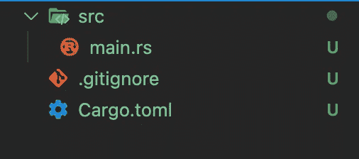
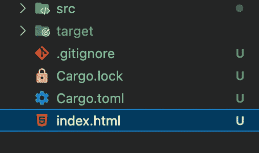
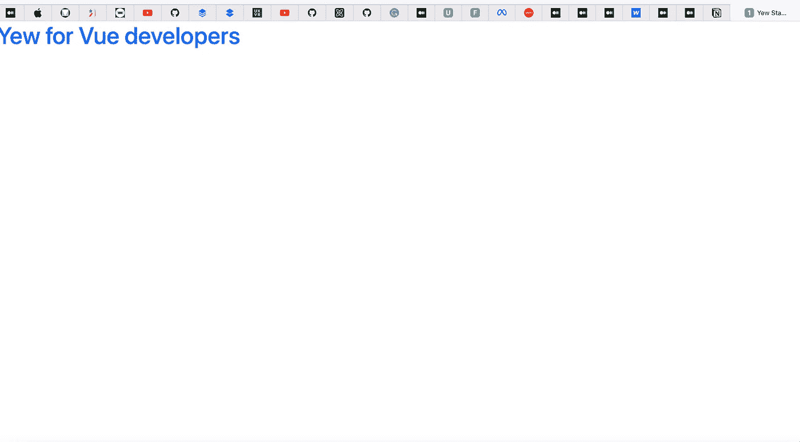
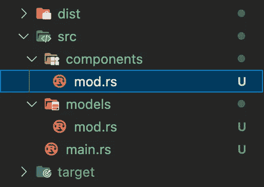
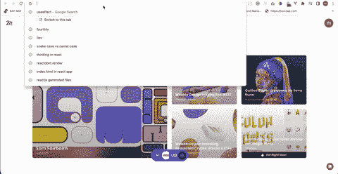

# 作为 Vue 开发者探索基于 rust 的前端框架 Yew

> 原文：<https://blog.devgenius.io/exploring-yew-the-rust-based-frontend-framework-as-a-vue-developer-36051a4f8bbb?source=collection_archive---------1----------------------->


WebAssembly，俗称 WASM，彻底改变了 web 应用程序的构建方式。它允许开发者使用他们最喜欢的编程语言来构建网络应用。

有了这些可能性，开发人员在构建前端应用程序时就不用承担学习基于 JavaScript 的框架的负担了。他们可以利用自己喜欢的编程语言特性，如静态类型、模式匹配、内存安全等，来构建前端应用程序。

Yew 是一个基于 Rust 的现代框架，用于使用 WebAssembly 构建前端应用程序。

在本帖中，作为一名 Vue 开发者，我们将学习如何使用来自 [DummyJSON](https://dummyjson.com/) 和 Yew 的开放 API 数据构建一个 web 应用程序。
GitHub 资源库可以在[这里找到](https://github.com/Mr-Malomz/yew-starter)。

# Vue 和紫杉的相似之处

以下是这两种技术之间的相似之处:

类似

# 先决条件

要完全掌握本教程中介绍的概念，需要满足以下要求:

*   对 Vue 的基本了解
*   对铁锈的基本认识
*   生锈[安装](https://www.rust-lang.org/tools/install)

# 开发环境设置

首先，我们需要确保我们的机器上安装了最新版本的 Rust。我们可以通过运行以下命令升级到稳定版本:

```
rustup update
```

接下来，我们需要安装一个 WASM 目标，这是一个帮助我们将 Rust 源代码编译成基于浏览器的 WebAssembly 并使其在 web 浏览器上运行的工具。我们可以通过运行以下命令来安装它:

```
rustup target add wasm32-unknown-unknown
```

最后，我们需要安装 Trunk，这是一个用于管理和打包 WebAssembly 应用程序的工具。我们可以通过运行下面的命令来做到这一点:

```
cargo install trunk
```

# 入门指南

首先，我们需要导航到所需的目录，并在我们的终端中运行以下命令:

```
cargo new yew-starter && cd yew-starter
```

该命令创建一个名为`yew-starter`的 Rust 项目，并导航到项目目录。

`cargo`是 Rust 的包经理。它的工作方式类似于 Vue 生态系统中的`npm`。

运行该命令时，`cargo`将生成一个包含基本文件的项目目录，如下所示:



项目结构

`main.rs`是我们应用程序的入口点。

`Cargo.toml`是清单文件，用于指定项目元数据，如包、版本等。它的工作方式类似于 Vue 应用程序中的`package.json`。

接下来，我们通过修改`Cargo.toml`文件的`[dependencies]`部分来安装所需的依赖项，如下所示:

`yew = “0.19”`是一个基于 Rust 的前端框架

`serde = “1.0.136”`是一个序列化和反序列化 Rust 数据结构的框架。例如，将 Rust 结构转换为 JSON。

`gloo-net= “0.2”`是一个 HTTP 请求库。它的工作原理类似于 Vue 生态系统中的 axios。

`wasm-bindgen-futures = “0.4”`是一个基于 Rust 的库，通过在 Rust 异步编程(futures)和 JavaScript `Promises`之间架起桥梁，在 Yew 中执行异步编程。基本上，它有助于利用 Rust 中基于`Promise`的 web APIs。

我们需要运行下面的命令来安装依赖项:

```
cargo build
```

# 应用程序入口点

安装了项目依赖项后，我们需要修改 src 文件夹中的`main.rs`文件，如下所示:

哎呀！在上面的代码片段中，看起来发生了很多事情。让我们把它分解一下。

`use yew::prelude::*`:通过指定`*`导入所需的`yew`依赖项及其关联项

`#[function_component(App)]`:将`app`功能声明为功能组件，名称为`App`。这里使用的语法称为 Rust 宏；宏是编写其他代码的代码。

`fn app() -> Html {…..}`:使用`html!`宏创建`Yew for Vue developers`标记。宏的工作方式类似于 Vue 中的`template`语法。

`yew::start_app::<App>()`:通过将 App 组件挂载到文档主体来启动 Yew 应用程序。其工作原理类似于 Vue 中的`createApp(App).mount()`功能。

**HTML 渲染**

与 Vue 渲染到 DOM 的方式类似，同样的原理也适用于紫杉。接下来，我们需要在项目的根目录下创建一个支持引导 CDN 的`index.html`文件，并添加下面的代码片段:



更新的项目结构

接下来，我们可以通过在终端中运行以下命令来启动开发服务器，从而测试我们的应用程序:

```
trunk serve --open
```



工作应用

# 用紫杉构建一个真正的应用程序

现在我们已经很好地掌握了 Yew 是如何工作的，我们可以继续构建一个集成了 [DummyJSON](https://dummyjson.com/) 的用户 API 的应用程序。

**模块系统在 Rust
Vue**中，组件构成了一个应用程序的构建模块。在我们的应用中，我们将使用 Rust 模块系统来构建我们的应用。

为此，我们需要导航到`src`文件夹，并创建`component`和`model`文件夹及其对应的`mod.rs`文件来管理可见性。



更新的文件夹结构

要使用模块中的代码，我们需要将它们声明为一个模块，并导入到`main.rs`文件中，如下所示:

完成后，我们需要创建模型来表示从 API 返回的响应。为此，我们需要导航到`models`文件夹，在这里，创建一个`user.rs`文件并添加下面的代码片段:

上面的代码片段执行了以下操作:

*   导入所需的依赖项
*   使用`derive`宏生成对格式化输出和反序列化数据结构的实现支持。`#[serde(rename_all = “camelCase”)]`宏将 snake case 属性转换为 camel case(API 返回 camel case 中的数据)
*   用 API 嵌套响应所需的必需属性创建一个`User`结构
*   创建具有`users`属性的`Users`结构；`User`结构的数组类型。Rust 中的动态数组表示为一个向量

DummyJSON 的 API 响应示例如下:

**PS**:*`*pub*`*修饰符使结构及其属性成为公共的，可以从其他文件/模块中访问。**

*接下来，我们必须将`user.rs`文件注册为`models`模块的一部分。为此，打开`models`文件夹中的`mod.rs`并添加以下代码片段:*

***创建组件***

*模型完全建立后，我们就可以开始创建我们的应用程序构建块了。*

*首先，我们需要导航到 components 文件夹，创建一个`header.rs`文件，并添加下面的代码片段:*

*上面的代码片段创建了一个 Header 组件来表示我们的应用程序头。*

*其次，我们需要在同一个`components`文件夹中创建一个`loader.rs`文件，并添加下面的代码片段:*

*当我们的应用程序加载时，上面的代码片段创建了一个表示 UI 的 Loader 组件。*

*第三，我们需要在同一个`components`文件夹中创建一个`message.rs`文件，并添加下面的代码片段:*

*上面的代码片段执行了以下操作:*

*   *导入所需的依赖项*
*   *创建一个具有`text`和`css_class`属性的`MessageProp`结构来表示组件属性。`#[derive(Properties, PartialEq)]`宏将结构标记为类似于 Vue 应用程序的组件属性*
*   *析构这些属性，将它们用作 CSS 类，并在标记中显示文本*

*第四，我们需要在同一个`components`文件夹中创建一个`card.rs`文件，并添加下面的代码片段:*

*上面的代码片段执行了以下操作:*

*   *导入我们之前创建的`yew`依赖项和`User`模型*
*   *创建一个具有`user`属性的`CardProps`组件属性*
*   *析构属性以在用户界面中显示用户信息*

*最后，我们必须将新创建的组件注册为`components`模块的一部分。为此，打开 components 文件夹中的`mod.rs`并添加下面的代码片段:*

***将所有这些放在一起** 创建好应用程序组件后，我们可以通过修改如下所示的`main.rs`文件，开始使用它们来构建我们的应用程序:*

*上面的代码片段执行了以下操作:*

*   *导入所需的依赖项*
*   ***第 13–14 行**:使用`use_state`钩子(类似于 Vue 中的`data`函数)并指定`None`为初始值，创建一个`users`和`error`应用状态。`UseStateHandle`结构用于指定状态类型，而`Option`枚举表示可选值*
*   ***第 18–19 行**:创建当前范围内安全使用的状态副本*
*   ***第 21–42 行**:使用类似于 Vue 中`created`钩子的`use_effect_with_deps`钩子来执行一个副作用，与`wasm_bindgen_futures`和`gloo_net`的`Request::get`函数异步地从 [DummyJSON](https://dummyjson.com/) API 获取数据。我们还使用`match`控制流来匹配通过相应地更新状态而返回的 JSON 响应*
*   ***第 44–66 行**:创建一个`user_list_logic`变量，通过使用`match`控制流来抽象我们的应用程序逻辑，通过执行以下操作来匹配模式:
    ——映射`users`列表，并在 API 返回适当的数据
    时将单个的`user`传递给`Card`组件——使用`Message`和`Loader`组件分别匹配错误和加载状态*
*   ***第 68–73 行**:用`Header`组件和`user_list_logic`抽象更新标记*

*完成后，我们可以使用下面的命令重新启动开发服务器:*

```
*trunk serve --open*
```

**

*工作演示*

# *结论*

*这篇文章讨论了如何使用来自 DummyJSON 和 Yew 的开放 API 数据创建一个 web 应用程序。*

*这些资源可能会有所帮助:*

*   *[红豆杉文献](https://yew.rs/docs/getting-started/introduction)*
*   *[官方锈书](https://doc.rust-lang.org/book/)*
*   *[网络组装技术](https://webassembly.org/)*