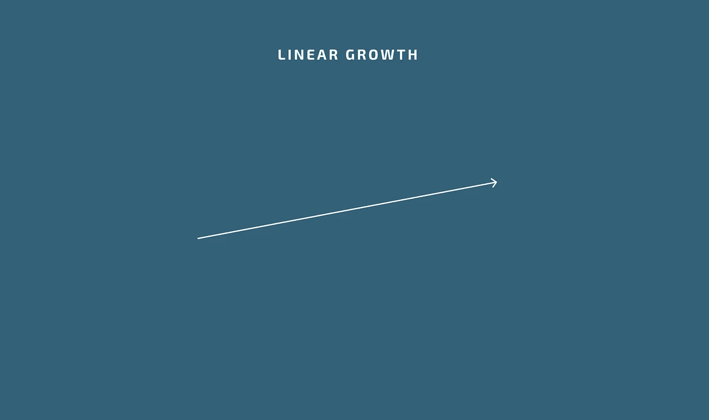
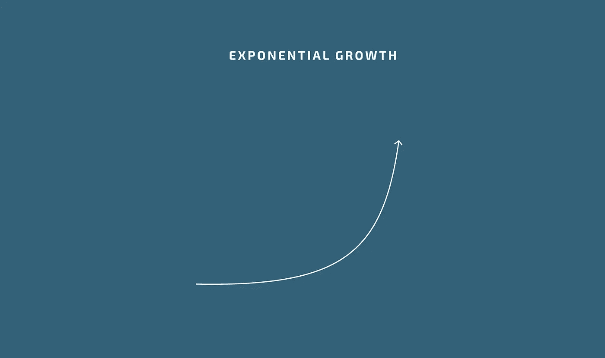

# 指数功

> 原文：<https://blog.devgenius.io/exponential-work-85a3b3cff157?source=collection_archive---------31----------------------->

## 非指数业务是什么样的？

一家非指数型企业雇佣的员工没有什么影响力。为他们提供长期的线性增长。使用时间作为衡量标准来跟踪他们的生产。建立阵地结构，而不是游戏。用地位而不是财富来奖励。

## 指数型商业模式是什么样的？

在一个指数级的行业中，游戏是被创造出来的，而不是标题。游戏很简单，员工可以轻松得分。这些积分直接奖励了员工和企业。结果是，角色直接反映了在公司工作的每个人的附加值。最后，目标必须是指数级的。虽然不要求玩家玩这个游戏，但是动机是如此巨大，以至于产量也跟着增加。企业和员工的报酬应该同步增长。

## 为指数级企业工作是什么感觉？

任何从事指数业务的人都有可能获得指数回报。一个设计合理的指数型企业应该对在企业中工作的人所赚的财富没有上限。

作为一家指数型公司的员工，你的灵感类似于创始人的灵感。你的收入上限是无限的。当你的同事发挥他们未知的潜力时，他们会受到鼓舞和充满活力。

## F*&k 亿万富翁？

这个世界的问题是有太多的人在发挥他们的潜力。在没有发展空间的岗位上工作，浪费他们的生命去梦想新的职位，如果没有庞氏骗局一样的招聘策略，这些职位甚至无法存在。

许多人认为，世界的问题在于亿万富翁。这不是真的。这个世界的问题是百万富翁应该是亿万富翁，成千上万的人应该是百万富翁。所有人类的活力都是建立在生产能帮助人们的东西的经济基础上的。帮助人们吃饭的东西。帮助人们微笑的东西。帮助人们实现梦想的东西。少感受痛苦。这个清单还在继续。社会问题的答案不是阻止那些生产最多东西的人。这是为了创造系统，让更多的人生产更多的东西。我们需要更多的埃隆·马斯克。我们需要数百万只埃隆·马斯克。更准确地说，我们需要数百万人成倍地创新和生产。

## 我们怎样才能鼓励更多的生产？

实施指数级商业模式。一种商业模式，在这种模式下，某人的工资不是由官僚设定的目标或任意限制决定的。更确切地说，一个人的薪水是他们对创始人设计的系统投入的结果。一个被有意设计成允许指数增长的系统。该系统将激励和鼓励创造性的人类潜力。人们最终会完成/做更多的工作，而“筋疲力尽”的情况会少得多。

有三条规则可以确保你建立一个指数系统。

1.  产量不是用时间来衡量的。
2.  生产没有限制。
3.  随着产量的增加，企业及其员工的价值也随之增加。