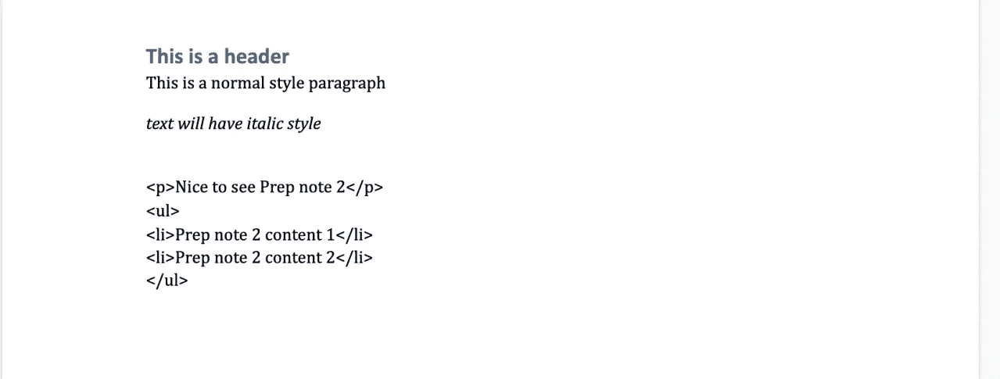

# 在 Django 应用程序中使用 python-docx 导出 docx 文件

> 原文：<https://blog.devgenius.io/export-docx-file-with-python-docx-in-django-app-527ff5eb7280?source=collection_archive---------1----------------------->


导出文件是一个常用的功能，允许用户检索他们的数据。

在整个系列中，我将概述在 Django 应用程序中导出文件的各种方法。导出的文件格式可能包括 docx、csv、zip 或 pdf。

在这个系列的第一篇文章中，我将介绍导出一个 **docx** 文件的过程。我们将利用一个名为 python-docx 的库来实现这一点。

# python-docx

## 介绍

python-dox 是一个 python 库，用于创建和更新 Microsoft Word(。docx)文件。(请在此查看[官方文件](https://python-docx.readthedocs.io/en/latest/))

python-docx 背后的基本概念是创建一个文档对象，您可以向其中添加内容，如段落、标题、分页符、表格、图片以及粗体或斜体等样式选项。

示例:

```
from docx import Document
document = Document()
document.add_paragraph('Lorem ipsum dolor sit amet.')
```

## 安装

要安装 [python-docx](https://pypi.org/project/python-docx/) ，运行命令:

```
pip install python-docx
```

如果你正在使用 docker，并且有一个 **requirement.txt** 文件，你可以在上面添加你所有的库，不要忘记添加“python-docx”版本。

# 导出视图

为了能够通过 API 下载 docx 文件，我们通常创建一个只允许 GET 方法的视图。

```
**class** ExportDocx(APIView):
    **def** get(self, request, *args, **kwargs):
        # create an empty document object
        document = Document()

        # save document info
        buffer = io.BytesIO()
        document.save(buffer)  # save your memory stream
        buffer.seek(0)  # rewind the stream

        # put them to streaming content response 
        # within docx content_type
        response = StreamingHttpResponse(
            streaming_content=buffer,  # use the stream's content
            content_type='application/vnd.openxmlformats-officedocument.wordprocessingml.document'
        )

        response['Content-Disposition'] = 'attachment;filename=Test.docx'
        response["Content-Encoding"] = 'UTF-8'

        **return** response
```

一旦我们创建了一个空文档，下一步就是保存它并将其发送给响应。

**python-docx** 提供了一个 **document.save()** 方法，接受流而不是文件名。

我们可以初始化一个 **io。BytesIO()** 对象来存储文档信息，然后将其发送给用户。

为了处理大量数据并返回响应，我们使用了 **StreamingHttpResponse** 函数，并将 docx 文件的内容类型设置为**application/vnd . openxml formats-office document . wordprocessingm**。

# 构建文档内容

在启用下载空 docx 文件后，下一步是开始为 docx 构建内容。详细说明建议参考 python-docx 文档。

要添加标题文本，您可以使用**。add_heading()** 方法，而要添加段落，可以使用**。**add _ paragraph()方法。

如果您想要样式化文本，您可以在段落中添加一个段落。

作为一个例子，我创建了一个 **build_document()** 方法来构建文档中的所有内容。

```
def build_document(self):
    document = Document() 

    # add a header
    document.add_heading("This is a header")

    # add a paragraph
    document.add_paragraph("This is a normal style paragraph")

    # add a paragraph within an italic text then go on with a break.
    paragraph = document.add_paragraph()
    run = paragraph.add_run()
    run.italic = True
    run.add_text("text will have italic style")
    run.add_break()

    return document
```

然后，我将用下面的代码替换在视图中创建空文档的代码:

```
document = self.build_document()
```

当前导出结果如下所示:


。从 Django 使用 python-docx 导出 docx 文件

# 高级—构建 html 内容

本质上，我可以导出一个包含内容的 docx 文件。首先，我简单地在一个段落中添加内容:

```
# add paragraph for html content
document.add_paragraph("<p>Nice to see Prep note 2</p><ul><li>Prep note 2 content 1</li><li>Prep note 2 content 2</li></ul>")
```

然而，有一个奇怪的显示如下:



我需要找到一种方法，将 HTML 内容转换成纯文本，同时保留基本格式，如斜体、粗体和项目符号。下面是一个示例:

*很高兴看到准备注释 2
●准备注释 2 内容 1
●准备注释 2 内容 2*

经过研究，我发现了一个 Python 内置库，叫做[html . parser](https://docs.python.org/3/library/html.parser.html)——简单的 HTML 和 XHTML 解析器。

遵循[示例](https://github.com/python-openxml/python-docx/issues/352)创建一个名为 **DocumentHTMLParser** 的类来处理它，如下所示:

```
class DocumentHTMLParser(HTMLParser):
    """
    Document Within HTML Parser
    """
    def __init__(self, document):
        """
        Override __init__ method
        """
        HTMLParser.__init__(self)
        self.document = document
        self.paragraph = None
        self.run = None

    def add_paragraph_and_feed(self, html):
        """
        Custom method where add paragraph and feed
        """
        self.paragraph = self.document.add_paragraph()
        self.feed(html)

    def handle_starttag(self, tag, attrs):
        """
        Override handle_starttag method
        """
        self.run = self.paragraph.add_run()

        if tag in ["ul"]:
            self.run.add_break()
        if tag in ["li"]:
            self.run.add_text(u'        \u2022    ')

    def handle_endtag(self, tag):
        """
        Override handle_endtag method
        """
        if tag in ["li"]:
            self.run.add_break()

    def handle_data(self, data):
        """Override handle_data method"""
        self.run.add_text(data)
```

上面的代码涉及重写 HTMLParser 类中的一个函数，并使用段落的运行来基于开始标记定制其样式。如果某个标签需要在末尾处中断，我们会为其添加一个中断。然后，我在视图中使用这个自定义类来处理 HTML 内容:

```
def build_document(self):
    """Build content document"""
    document = Document()
    doc_html_parser = DocumentHTMLParser(document)

    # add a header
    document.add_heading("This is a header")

    # add a paragraph
    document.add_paragraph("This is a normal style paragraph")

    # add a paragraph within an italic text then go on with a break.
    paragraph = document.add_paragraph()
    run = paragraph.add_run()
    run.italic = True
    run.add_text("text will have italic style")
    run.add_break()

    # with html content, call method add_paragraph_and_feed tui build content
    html_content = "<p>Nice to see Prep note 2</p><ul><li>Prep note 2 content 1</li><li>Prep note 2 content 2</li></ul>"
    doc_html_parser.add_paragraph_and_feed(html_content)
```

以下是 HTML 内容生成的 docx 文件:


# 单元测试

在后端，单元测试是保护应用程序的关键组件。在我的项目中，通过测试，每个拉请求至少需要 80%的代码覆盖率，这使得单元测试成为开发过程中的一个强制性部分。为了帮助编写单元测试，我们使用了诸如 [factory_boy](https://factoryboy.readthedocs.io/en/stable/) 和 [pytest](https://docs.pytest.org/en/stable/) 之类的库。如果您不熟悉这些库，您可以在继续之前查看提供的链接。

在这一节中，我将不涉及如何使用或编写 Django 应用程序的单元测试。相反，我将确保导出的 docx 文件具有正确的名称和类型，并且该文件包含预期的内容和样式。

## 测试内容响应

我对导出的文件进行了一些基本检查，例如验证响应状态、内容类型和文件名。

```
def test_export_docx_general(self):
    """
    Ensure general content like
    status response, content type, file name exported correctly
    """
    response = self.client.get(reverse("export_docx"))
    import pdb;pdb.set_trace()
```

通过使用**导入 pdbpdb.set_trace()** 在单元测试中提出 **GET** 请求后，我可以检查当前数据了。

以下是它的一个示例:

```
<django.http.response.StreamingHttpResponse object at 0x7fc392a61990>
(Pdb) response.status_code
200
(Pdb) response.streaming_content
<map object at 0x7fc3927aadd0>
(Pdb) response.streaming_content.__dir__()
['__getattribute__', '__iter__', '__next__', '__new__', '__reduce__', '__doc__', '__repr__', '__hash__', '__str__', '__setattr__', '__delattr__', '__lt__', '__le__', '__eq__', '__ne__', '__gt__', '__ge__', '__init__', '__reduce_ex__', '__subclasshook__', '__init_subclass__', '__format__', '__sizeof__', '__dir__', '__class__']
(Pdb) response.get("Content-Type")
'application/vnd.openxmlformats-officedocument.wordprocessingml.document'
(Pdb) response.get("Content-Disposition")
'attachment;filename=Recipe_Pho_2021-04-15-14-34-09.docx'
```

如前面的代码块所示，我可以继续编写单元测试来检查导出文件的一般内容，例如文件的内容类型、状态代码和名称。

```
def test_export_docx_general(self):
    """
    Ensure general content like
    status response, content type, file name exported correctly
    """
    response = self.client.get(reverse("export_docx"))
    assert response.status_code == status.HTTP_200_OK
    assert response.get("Content-Type") == \
        "application/vnd.openxmlformats-officedocument.wordprocessingml.document"
    filename = response.get("Content-Disposition").split("=")
    assert filename == "Test.docx"
```

请注意上面的**response . streaming _ content**对象，该对象显示为地图对象，没有任何测试数据。最初，我不确定如何准确测试文档的内容和风格。尽管研究了各种方案，我还是找不到合适的解决方案。

最后，我自己想出了一个测试构建文档的解决方案，如下所示:

## 测试文档内容

我在代码中创建了一个名为 **build_document** 的函数来构建文档，现在可以进行测试了:

```
def build_document(self):
    """Build content document"""
    document = Document()
    doc_html_parser = DocumentHTMLParser(document)

    # with html content, call method add_paragraph_and_feed tui build content
    html_content = "<p>Nice to see Prep note 2</p><ul><li>Prep note 2 content 1</li><li>Prep note 2 content 2</li></ul>"
    doc_html_parser.add_paragraph_and_feed(html_content)
```

我的解决方案是直接调用这个函数在模拟视图上进行测试。下面是它在测试函数中的表现:

```
def test_build_document_for_docx(self):
    """Ensure document built content and style correctly"""
    # inline import just for you know where they are
    from django.http import HttpRequest
    from rest_framework.request import Request as DRFRequest

    # mock drf request
    request = HttpRequest()
    request.method = 'GET'
    drf_request = DRFRequest(request)
    drf_request.user = self.user

    # mock view with request
    view = ExportRecipesDocx()
    view.request = request

    # call function in view directly
    document = view.build_document()
    import pdb;pdb.set_trace()
```

我再次检查了文档配置文件。作为一个例子，我只是有一个个人的好奇心和爱探索他们 are^^

```
(Pdb) document
<docx.document.Document object at 0x7fd5e65140a0>
(Pdb) document._body.paragraphs
[<docx.text.paragraph.Paragraph object at 0x7fd5e5d5fb50>]
(Pdb) document._body.paragraphs[0].runs
[<docx.text.run.Run object at 0x7fd5e5e419d0>, <docx.text.run.Run object at 0x7fd5e5eba6d0>, <docx.text.run.Run object at 0x7fd5e5eba410>, <docx.text.run.Run object at 0x7fd5e5eba3d0>]
(Pdb) document._body.paragraphs[0].runs[0].text
'Nice to see Prep note 2\n'
(Pdb) document._body.paragraphs[0].runs[0].style.name
'Default Paragraph Font'
(Pdb) document._body.paragraphs[0].runs[0].style.priority
1
(Pdb) document._body.paragraphs[0].runsp[1].text
```

在我当前的 **build_document** 方法中，我创建了一个段落并向其中添加了一些段落，同时还根据 HTML 的开始和结束标签在必要的地方插入了分隔符。

下面是我的单元测试的最终版本，用于检查文档的内容和样式:

```
def test_build_document_for_docx(self):
    """Ensure document built content and style correctly"""
    # mock request and view initialize like above code
    # ...
    # call function in view directly
    document = view.build_document()

    paragraphs = document._body.paragraphs
    assert len(paragraphs) == 1
    assert paragraphs[0].style.name == "Normal"
    assert paragraphs[0].style.priority is None
    assert [
        'Nice to see Prep note 2',
        '\n',
        '        •    Prep note 2 content 1\n',
        '        •    Prep note 2 content 2\n'
    ] == [item.text for item in paragraphs[0].runs]
    assert {None} == {item.italic for item in paragraphs[0].runs}
    assert {None} == {item.bold for item in paragraphs[0].runs}
```

在 Django 应用程序中导出文件是一个迷人的过程，Python 有几个库对处理内容格式很有用。

在本文中，我们讨论了一个在 Django 应用程序中导出 docx 文件的简单例子。

如果你觉得这很有帮助，请考虑在下面的[链接](https://ko-fi.com/beautyoncode)给我买杯咖啡。

我的个人博客上的[原帖欢迎您的访问。](https://beautyoncode.com/export-docx-file-with-python-docx-in-django-app/)