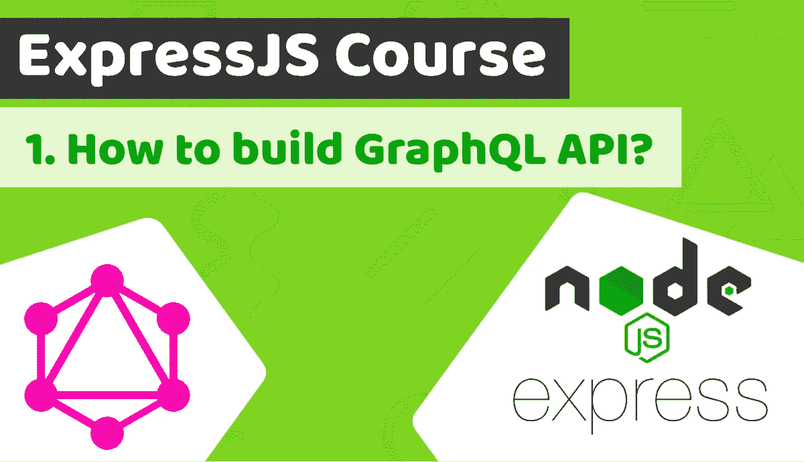

# 包含 TypeScript 的 Express.js 课程第 1 课—如何构建 GraphQL API

> 原文：<https://blog.devgenius.io/express-js-course-with-typescript-lesson-1-how-to-build-graphql-api-2ed47dafb9e9?source=collection_archive---------41----------------------->



[Duomly —编程在线课程](https://www.blog.duomly.com)

本文原载于[https://www . blog . duomly . com/how-to-build-graph QL-API-tutorial-express-js-course-lesson-1/](https://www.blog.duomly.com/how-to-build-graphql-api-tutorial-express-js-course-lesson-1/)

# 介绍如何构建 GraphQL API 教程

在快车的第一课。JS 课程，我们将重点介绍用 typescript 构建 GraphQL API 教程。

Express.js 是 Node 之一。JS 最流行的框架，它帮助我们使用 Javascript 或 Typescript 为应用程序创建后端。

这很方便，因为我们只需要了解 Javascript 就可以进行全栈开发。

如果你还不知道 Javascript，不要担心，我们创建了一门课程，可以帮助你学习这种优秀的编程语言。

您可以在此找到面向初学者的 Javascript 课程的 Url:

【https://www.duomly.com/course/javascript-course/ 

我们将创建一个个人财务应用程序，从 JSON 文件转换财务数据，并通过 GraphQL API 提供服务。

所有这些都与 React.js 前端完美配合，我的队友安娜将在 Duomly 的 youtube 频道上上传这些内容。

如果您还不知道 React，您可以在此找到完整的互动课程:

[https://www.duomly.com/course/react-js-course/](https://www.duomly.com/course/react-js-course/)

你准备好迎接这次激动人心的旅行了吗？

开始吧！

如果你喜欢视频，这是 youtube 的版本:

# 如何创建项目目录

作为 Express.js 课程的第一步，我们需要为项目创建一个目录。

打开您的终端并键入:

```
mkdir express-js-duomly
```

接下来，通过以下方式进入文件夹:

```
cd express-js-duomly
```

# Npm 初始化

在我们的项目目录中，我们应该初始化 npm 包，这将让我们处理 NPM 包。

为此，您需要在项目目录中打开一个终端，并键入:

```
npm init
```

接下来，您需要填写一些输入，或者您可以将它们留空。

由您来确认所有信息和问题的结尾，即使它们是空白的。

# 如何安装 typescript

现在，我们需要安装一些将在项目中使用的依赖项。

第一个是“typescript”，要安装 dep，您需要打开终端并键入:

```
npm i -S typescript
```

# 如何安装终端服务节点

我们需要的第二个 npm 包是“ts-node”。

打开终端，并键入:

```
npm i -S ts-node
```

# 如何安装 express

现在，我们应该安装“express”。

打开终端，并键入:

```
npm i -S express
```

# 如何安装 GraphQL

在这一步中，我们将安装 GraphQL，我们将使用它作为 API 的基础。

打开终端，并键入:

```
npm i -S graphql
```

# 如何安装 graphql-express

我们应该安装的最后一个依赖项是“graphql-express”。

打开终端，并键入:

```
npm i -S graphql-express
```

# 创建服务器文件

太好了！所有的依赖项都已安装，所以我们可以开始编码了。

首先，我们应该专注于创建 server.ts 文件，我们将使用它来处理 express.js 应用程序的主要逻辑。
在项目的根目录下，你要创建一个名为“server.ts”的文件。

在“server.ts”文件中，我们应该导入一些依赖项。

第一个是“express”，第二个是“graphqlHTTP”。

```
import * as express from 'express';
import {graphqlHTTP} from 'express-graphql';
```

# 如何创建 GraphQL 模式

我们应该进入的下一步是模式。

Schema 是一种模式，它告诉我们可以进行什么类型的查询或变化。

我们将为查询费用创建一个模式，该模式将返回一个“费用”类型的数组。

我们应该做的第二件事是在我们的模式中创建“Expense”类型。

这将声明“Expense”项应该包含什么类型的数据。

```
var { buildSchema } = require('graphql');const schema = buildSchema(`
  type Query {
    expenses: [Expense]
  },
  type Expense {
    id: Int,
    date: String,
    amount: Int,
    type: String,
    category: String
  }
`);export default schema;
```

# 添加数据

现在我们可以进入数据。

作为第一步，我们应该创建一个名为“data”的目录，并在该目录中创建一个文件“expenses.json”。

为了生成数据，我使用了 mockaroo，并有 1000 个项目，但你可以创建自己的，或只是克隆我们的回购，并复制文件。

包含数据的文件应包含一个包含 1000 个对象的数组，其结构如下例所示:

```
{"id":2,"date":"1/12/2020","amount"1567,"type":"incoming","category":"passive"}
```

# 如何创建 GraphQL 解析器

我认为解析器有点类似于 REST API 中的端点。

它们定义了应该对类型化查询触发什么逻辑。

要创建解析器，作为第一步，我们需要在“graphql”目录中创建名为“resolvers.ts”的文件。

第二步，我们应该导入数据，在函数“getExpenses”中返回数据，并在名为“resolvers”的对象中将“getExpenses”设置为“Expenses”方法的返回。

接下来，我们需要默认导出对象“解析器”。

你可以看看下面的例子:

```
const expenses = require('../data/expenses');const getExpenses = () => {
  return expenses;
}const resolvers = {
  expenses: () => {
    return getExpenses();
  },
};export default resolvers;
```

# 如何安装类型

为了处理 typescript 中的所有 node.js 逻辑，我们需要安装类型。
为此，我们需要打开终端并键入:

```
npm i @types/node
```

# 创建应用程序

很好，现在，我们可以进入 server.ts，进入与“app”相关的逻辑。

作为第一步，我们应该调用 express，并将它赋给名为“app”的变量。

接下来，我们应该创建端点“/graphql”，并调用“graphqlHTTP”函数。

在端点下面，我们应该设置端口 4000 的监听，并返回任何 console.log 来通知我们服务器何时准备好。

```
var app = express();
app.use('/graphql', graphqlHTTP({}));
app.listen(4000);
console.log('Running a GraphQL API server at [http://localhost:4000/graphql');](http://localhost:4000/graphql');)
```

# 导入模式和解析器

好了，我们差不多完成了，离测试只有三小步了。

现在，我们应该将模式和解析器导入 server.ts。

```
import schema from './graphql/schema';
import resolvers from './graphql/resolvers';
```

# 应用模式和解析器

如果我们的模式被导入，我们可以应用它，作为“graphqlHTPP”函数的参数。

为此，我们应该将“schema”、as“schema”和“resolvers”分配给“rootValue”参数。

我们应该添加到“graphqlHTTP”函数中的另一个参数是“graphiql ”,值应该是“true”。

```
var app = express();
app.use('/graphql', graphqlHTTP({
  schema: schema,
  rootValue: resolvers,
  graphiql: true,
}));
app.listen(4000);
console.log('Running a GraphQL API server at [http://localhost:4000/graphql');](http://localhost:4000/graphql');)
```

# 修改 package.json

呜哇！我们的应用已经准备好了。

我们可以用两种方式启动 API，第一种是打开终端并键入:

```
ts-node server.js
```

或者，我们可以设置 package.json 脚本。

为此，您需要在“脚本”对象中添加“ts-node server.js”作为“启动”脚本。

```
"scripts": {
  "test": "echo \"Error: no test specified\" && exit 1",
  "start": "ts-node server.ts"
},
```

# 启动应用程序

我们完成了，app 准备好了，可以开始测试了，恭喜！

打开终端并键入:

```
npm start
```

接下来，进入 URL: localhost:4000 并键入 GraphQL 查询:

```
{
  expenses {
    id,
    date,
    amount,
    type,
    category
  }
}
```

# 关于如何构建 GraphQL API 教程的总结

恭喜你，你学会了如何在 Express.js 中创建 GraphQL API！

这是第一课，但不是最后一课。

在下一集，我们将关注 Web Sockets 与 GraphQL 的结合，这将让我们创建实时更新的应用程序。

在这里你可以找到包含当前课程代码的 GitHub 存储库:
[https://GitHub . com/Duomly/Express-js-with-graph QL-and-web sockets/tree/Express-js-course-Lesson-1](https://github.com/Duomly/express-js-with-graphql-and-websockets/tree/Express-js-course-Lesson-1)

别忘了访问我们的 youtube 频道，观看 Anna 创建的 React.js 课程，并构建前端以拥有一个完整的应用程序。

以下是我们 youtube 频道的网址:
【https://www.youtube.com/c/duomly 


[Duomly 促销代码](https://www.duomly.com?code=lifetime-80)

感谢您和我们一起学习，Duomly 的 Radek