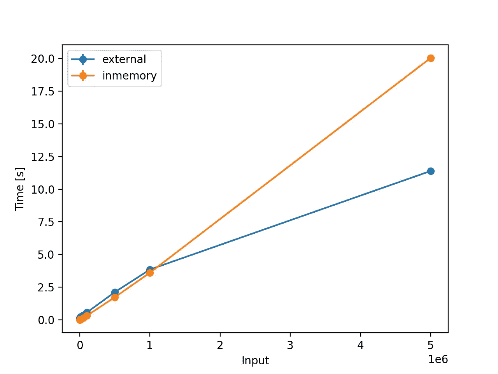

# 使用优先级队列的外部合并排序

> 原文：<https://blog.devgenius.io/external-merge-sorting-dcf5dc6f93cb?source=collection_archive---------11----------------------->


外部分拣—龙猫

**外部排序**是一类可以处理海量数据的排序算法。当被排序的数据不适合计算设备的主存储器(RAM)时，需要外部排序。相反，它们必须驻留在较慢的外部存储器(磁盘)中。

为了解释使用优先级队列的外部合并排序的工作原理，考虑输入数组:`[5, 8, 6, 3, 7, 1, 4, 9, 10, 2]`

# 概述:

1.  在分割阶段，大的输入文件被分割成可以放入内存的较小的块。
2.  在合并阶段，逐个对每个较小的块文件执行 K 向合并，并将输出写入文件。

# 分相:

*   将输入分成几块(5 块)。
*   然后，对每个单独的块进行排序。
*   最后，将排序后的块存储在文件中(5 个临时文件)。

为此，我们有 5 个文件:

*   组块 1: `[5, 8]`
*   第二块:`[3, 6]`
*   组块 3: `[1, 7]`
*   第四块:`[4, 9]`
*   组块 5: `[2, 10]`

# 合并阶段:

*   创建数量为`HeapNode`的`m`，其中`HeapNode`的值是块的最低元素，并存储对临时块文件的引用。示例:

```
{
	"element": 5,
	"file": <chunk-file>
} 
```

*   现在，将所有的`m` `HeapNode` (s)存储在一个 Min 堆中，其中顶部节点总是堆中的最小元素:


*   执行`heapify`操作→将元素存储在输出文件中→用拥有 min 元素的卡盘文件中的下一个元素替换 min 元素
*   在最小堆`1`中选择最小元素，并将其写入输出文件`1`
*   在块文件中找到下一个元素，它拥有 min 元素`1`
*   从`Chunk 3`开始编号`7`；将其移动到堆中并执行`heapify`


*   选择最小元素`2`并将其附加到输出文件`1, 2`
*   找到块文件中的下一个元素，它拥有 min 元素`2`
*   编号`10`来自`Chunk 5`；将其移动到堆中并执行`heapify`


*   选择最小元素`3`并将其附加到输出文件`1, 2, 3`
*   找到块文件中的下一个元素，它拥有 min 元素`3`
*   从`Chunk 2`开始编号`6`；将它移到堆中并执行`heapify`


*   选择最小元素`4`并将其添加到输出文件`1, 2, 3, 4`
*   找到块文件中的下一个元素，它拥有 min 元素`4`
*   从`Chunk 4`开始编号`9`；将其移动到堆中并执行`heapify`


*   选择最小元素`5`并将其附加到输出文件`1, 2, 3, 4, 5`
*   找到块文件中的下一个元素，它拥有 min 元素`5`
*   从`Chunk 1`开始编号`8`；将其移动到堆中并执行`heapify`


*   如果块文件中的下一个元素小于当前的 min 元素，则替换`MAX_INTEGER`中的 min 元素，并重复该过程，直到堆中的所有元素都是`MAX_INTEGER`
*   选择最小元素`6`并将其附加到输出文件`1, 2, 3, 4, 5, 6`
*   找到块文件中的下一个元素，它拥有 min 元素`6`
*   看到`EOF (End of Line)`就换成`MAX_INTEGER`


*   继续操作，直到堆看起来像这样:


最终输出:`1, 2, 3, 4, 5, 6, 7, 8, 9, 10`😎

既然你已经来了，结帐吧🚀:[https://github.com/addu390/sorting-algorithms](https://github.com/addu390/sorting-algorithms)比较排序算法；下面是外部排序和内存合并排序的比较。


对于 2 的幂



对于 10 的幂