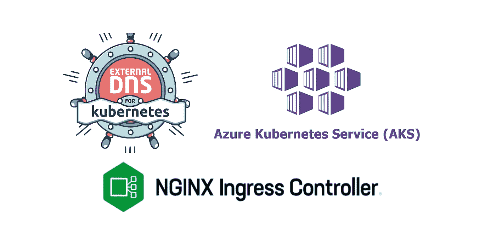

# AKS 集群中的外部 DNS 和基于主机的 TLS 入口

> 原文：<https://blog.devgenius.io/externaldns-and-host-based-tls-ingress-in-aks-cluster-edf75fae36f3?source=collection_archive---------1----------------------->



本文涵盖了用 Azure Kubernetes 服务(AKS)和 Azure DNS 配置 [E](https://github.com/kubernetes-sigs/external-dns) xternalDNS 的过程。通过正确部署和配置外部 DNS 和必要的 Azure 服务，您可以确保从您的自定义域到 Kubernetes 的正确路由。入口对象将使用正确的记录更新 DNS 区域。

# 要执行的步骤:

*   为自定义域创建 DNS 区域。
*   为入口控制器创建名称空间 ingress-basic，其中将创建所有与入口控制器相关的资源。
*   将群集节点池的托管身份分配给 DNS 区域。
*   使用 Helm 在 ingress-basic 命名空间中部署 ExternalDNS。
*   使用 Helm 在 ingress-basic 命名空间中安装 SSL 证书的 cert-manager。
*   创建用于颁发证书的 CA 群集颁发者。
*   创建第一个应用和服务。
*   创建第二个应用和服务。
*   创建入口路由，以配置基于主机的规则以及将流量路由到两个应用程序之一的 DNS 记录和 TLS 证书。
*   验证自动创建的证书。
*   使用自定义域测试应用程序。

# 创建一个 DNS 区域

```
# Create a DNS Zone for custom Domain
az network dns zone create -g aksdemocluster-rg -n mydevsecops.org
```

# 创建入口控制器

```
# Create a namespace for ingress resources
kubectl create namespace ingress-basic# Add the Helm repository
helm repo add ingress-nginx [https://kubernetes.github.io/ingress-nginx](https://kubernetes.github.io/ingress-nginx)
helm repo update# Use Helm to deploy an NGINX ingress controller
helm install ingress-nginx ingress-nginx/ingress-nginx \
    --namespace ingress-basic \
    --set controller.replicaCount=2
```

# 设置权限

```
# Assign Variables
tenantid=$(az account show --subscription "Visual Studio Enterprise Subscription" --query tenantId --output tsv)subscriptionid=$(az account show --query id -o tsv)UserClientId=$(az aks show --name [aksdemocluster](https://portal.azure.com/#@shailenderchoudharygmail.onmicrosoft.com/resource/subscriptions/461db24f-c0a7-4a65-aa6b-764717134583/resourceGroups/aksdemocluster-rg/providers/Microsoft.ContainerService/managedClusters/aksdemocluster) --resource-group [aksdemocluster-rg](https://portal.azure.com/#@shailenderchoudharygmail.onmicrosoft.com/resource/subscriptions/461db24f-c0a7-4a65-aa6b-764717134583/resourceGroups/aksdemocluster-rg) --query identityProfile.kubeletidentity.clientId -o tsv)DNSID=$(az network dns zone show --name mydevsecops.org --resource-group aksdemocluster-rg --query id -o tsv)# Assign managed identity of cluster’s node pools DNS Zone Contributor rights on to Custom Domain DNS zone.
az role assignment create --assignee $UserClientId --role 'DNS Zone Contributor' --scope $DNSID
```

# 部署外部 DNS

```
# Add the Helm repository
helm repo add bitnami [https://charts.bitnami.com/bitnami](https://charts.bitnami.com/bitnami)
helm repo update

# Use Helm to deploy an External DNS
helm install external-dns bitnami/external-dns --namespace ingress-basic --set provider=azure --set txtOwnerId=aksdemocluster --set policy=sync --set azure.resourceGroup=aksdemocluster-rg --set azure.tenantId=$tenantid --set azure.subscriptionId=$subscriptionid --set azure.useManagedIdentityExtension=true --set azure.userAssignedIdentityID=$UserClientId
```

# 安装证书管理器

```
# Label the cert-manager namespace to disable resource validation
kubectl label namespace ingress-basic cert-manager.io/disable-validation=true# Add the Jetstack Helm repository
helm repo add jetstack [https://charts.jetstack.io](https://charts.jetstack.io#)[#](https://charts.jetstack.io#) Update your local Helm chart repository cache
helm repo update# Install CRDs with kubectl
kubectl apply -f [https://github.com/cert-manager/cert-manager/releases/download/v1.7.1/cert-manager.crds.yaml](https://github.com/cert-manager/cert-manager/releases/download/v1.7.1/cert-manager.crds.yaml#)[#](https://github.com/cert-manager/cert-manager/releases/download/v1.7.1/cert-manager.crds.yaml#) Install the cert-manager Helm chart
helm install cert-manager jetstack/cert-manager \
  --namespace ingress-basic \
  --version v1.7.1
```

# 创建 CA 群集颁发者

```
apiVersion: cert-manager.io/v1
kind: ClusterIssuer
metadata:
  name: letsencrypt
spec:
  acme:
    server: [https://acme-v02.api.letsencrypt.org/directory](https://acme-v02.api.letsencrypt.org/directory)
    email: shailender.choudhary@gmail.com
    privateKeySecretRef:
      name: letsencrypt
    solvers:
    - http01:
        ingress:
          class: nginx
          podTemplate:
            spec:
              nodeSelector:
                "kubernetes.io/os": linux
```

要创建发行者，请使用 kubectl 命令。

```
kubectl apply -f cluster-issuer.yaml --namespace ingress-basic
```

# 运行演示应用程序

创建一个 *aks-helloworld-one.yaml* 文件，并在以下示例中复制 yaml:

```
apiVersion: apps/v1
kind: Deployment
metadata:
  name: aks-helloworld-one
spec:
  replicas: 1
  selector:
    matchLabels:
      app: aks-helloworld-one
  template:
    metadata:
      labels:
        app: aks-helloworld-one
    spec:
      containers:
      - name: aks-helloworld-one
        image: mcr.microsoft.com/azuredocs/aks-helloworld:v1
        ports:
        - containerPort: 80
        env:
        - name: TITLE
          value: "Welcome to Azure Kubernetes Service (AKS)"
---
apiVersion: v1
kind: Service
metadata:
  name: aks-helloworld-one
spec:
  type: ClusterIP
  ports:
  - port: 80
  selector:
    app: aks-helloworld-one
```

创建一个 *aks-helloworld-two.yaml* 文件，并在以下示例中复制 yaml:

```
apiVersion: apps/v1
kind: Deployment
metadata:
  name: aks-helloworld-two
spec:
  replicas: 1
  selector:
    matchLabels:
      app: aks-helloworld-two
  template:
    metadata:
      labels:
        app: aks-helloworld-two
    spec:
      containers:
      - name: aks-helloworld-two
        image: mcr.microsoft.com/azuredocs/aks-helloworld:v1
        ports:
        - containerPort: 80
        env:
        - name: TITLE
          value: "AKS Ingress Demo"
---
apiVersion: v1
kind: Service
metadata:
  name: aks-helloworld-two
spec:
  type: ClusterIP
  ports:
  - port: 80
  selector:
    app: aks-helloworld-two
```

使用 kubectl 运行两个演示应用程序:

```
kubectl apply -f aks-helloworld-one.yaml --namespace ingress-basic
kubectl apply -f aks-helloworld-two.yaml --namespace ingress-basic
```

# 创建入口路由

入口资源配置将流量路由到两个应用之一的规则。

```
apiVersion: networking.k8s.io/v1
kind: Ingress
metadata:
  name: hello-world-ingress
  annotations:
    kubernetes.io/ingress.class: nginx
    cert-manager.io/cluster-issuer: letsencrypt
spec:
  tls:
  - hosts:
    - web1.mydevsecops.org
    - web2.mydevsecops.org
    secretName: tls-secret
  rules:
  - host: web1.mydevsecops.org
    http:
      paths:
      - path: /
        pathType: Prefix
        backend:
          service:
            name: aks-helloworld-one
            port:
              number: 80- host: web2.mydevsecops.org
    http:
      paths:
      - path: /
        pathType: Prefix
        backend:
          service:
            name: aks-helloworld-two
            port:
              number: 80
```

使用 kubectl 创建入口资源:

```
kubectl apply -f hello-world-ingress.yaml --namespace ingress-basic
```

# 验证证书

要验证证书是否创建成功，请使用`kubectl describe certificate tls-secret --namespace ingress-basic`命令。

**注意**:等待几分钟，让 Txt 和 A 记录在 DNS 区域中更新。

在浏览器中打开 web1.mydevsecops.org 和 web2.mydevsecops.org，检查从 App1 和 App2 路由的 2 个不同的网页。

有关 Azure Kubernetes 服务(AKS)的更多详细视频，请查看我的 YouTube 频道:

[https://www.youtube.com/channel/UCkJRkUw2hYSlleTUuHY43lQ](https://www.youtube.com/channel/UCkJRkUw2hYSlleTUuHY43lQ)