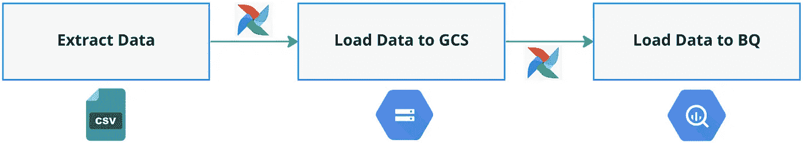
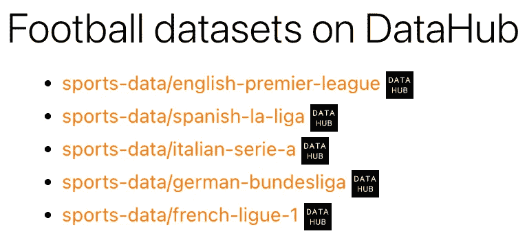
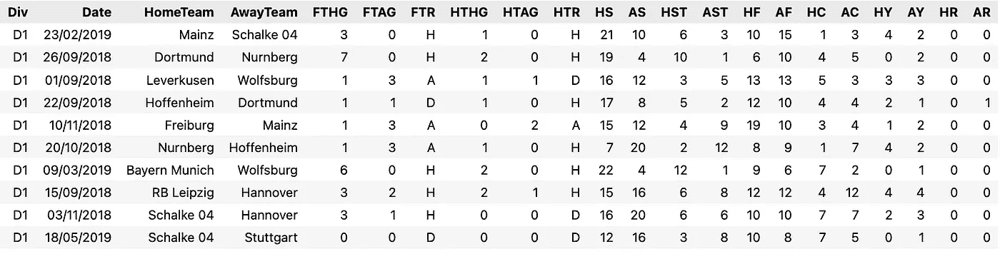
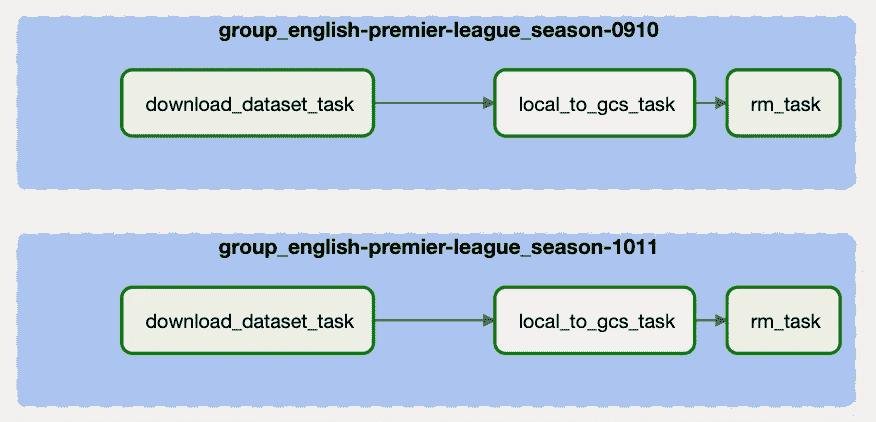
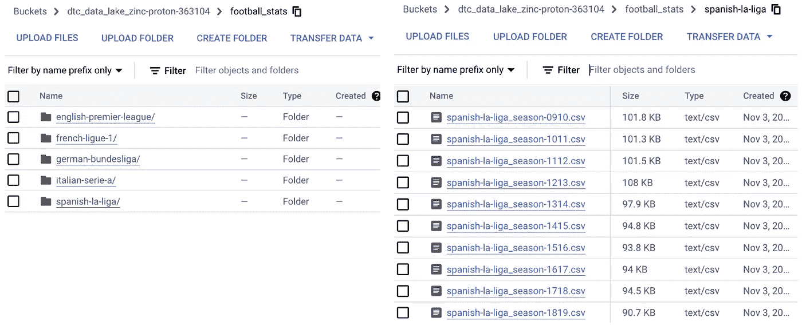
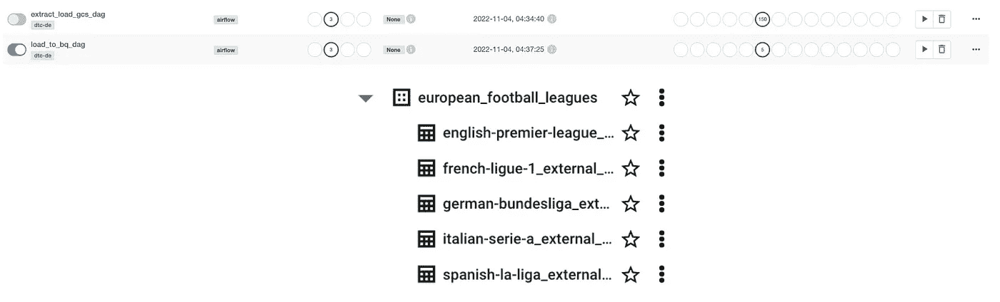

# 提取足球统计数据并加载到 Google 云存储& BigQuery with Airflow

> 原文：<https://blog.devgenius.io/extract-and-load-football-statistics-to-google-cloud-storage-bigquery-with-airflow-1a217227dbd1?source=collection_archive---------6----------------------->

## *利用气流自动提取和装载管道的演示*


图片来自马修·施瓦特的 Unsplash

如果你碰巧看到这篇文章，那么我想你目前正在学习或从事一个涉及 Apache Airflow 的项目。 **Apache Airflow** 是最流行的开源工作流编排工具。它将您的代码转换成一个您可以计划、运行和观察的工作流。在数据领域，许多数据团队使用这个工具来**自动化他们的 ETL 管道**(提取、传输和加载)，例如在数据库、数据湖和数据仓库之间复制或传输数据。

## 目标

在这篇文章中，我将展示如何从外部数据源提取数据并加载到 Google 云存储(GCS)和 BigQuery (BQ)中。为此，我将使用 Astro CLI。Astro CLI 是一个开源的 CLI 工具，用于 Apache Airflow 的数据编排。它为构建、测试和部署气流 Dag 和任务提供了一个自包含的本地开发环境。关于 Astro CLI 的更多信息，您可以访问这篇[博客文章](https://www.astronomer.io/blog/astro-cli-the-easiest-way-to-install-apache-airflow/)。

这篇文章不是关于气流的介绍性阅读。因此，我将不涉及诸如*“什么是气流”*或*“什么是 DAG”*之类的内容。为了了解气流、概念和功能，我强烈推荐你访问这个由天文学家撰写的关于气流的伟大的[指南和教程](https://docs.astronomer.io/learn)。

**以下是工作流程概要:**



按作者分类的图像:工作流摘要

## **先决条件:**

1.  Astro CLI & Docker。按照本指南安装 Astro CLI 。
2.  一个谷歌云帐户和项目来访问 GCS & BigQuery。你可以在这里免费试用。
3.  访问 GCS 和 BigQuery 的服务帐户权限(JSON)。
    选择你的项目，进入 IAM &管理，点击 IAM 。点击您的服务帐户上的编辑主体图标，添加这些角色(除了*查看者的角色*)；*存储管理员、存储对象管理员和大查询管理员。*按照这些说明[创建服务账户密钥](https://cloud.google.com/iam/docs/creating-managing-service-account-keys)。

## **数据的简要描述**📝

我要提取的数据是 [datahub](https://datahub.io/) 上欧洲五大足球联赛的足球队统计数据。有 5 个联赛(英超、西甲、德甲、意甲、法甲)和 10 个赛季(2009/2010–2018/2019)的数据以 csv 格式存储。我将从数据源中提取 50 个 csv 文件[。](https://datahub.io/collections/football#football-datasets-on-datahub)



图片作者:数据集位置-->[https://data hub . io/collections/football # football-datasets-on-data hub](https://datahub.io/collections/football#football-datasets-on-datahub)

以下是数据集的简要介绍:



作者图片

如上所示，从每个数据集中，我将只提取如上所示的 22 列，并添加 1 列作为季节号的标志(将在数据提取过程中生成)。以下是每列的简短描述和数据类型。

## 开始吧…🚀

首先，我们需要在一个空的本地目录中初始化一个新的 Astro 项目。在 Astro CLI 中，我们用`astro dev init`命令创建一个新项目。

```
$ mkdir airflow_astrocli_demo && cd airflow_astrocli_demo
$ astro dev init
```

它将生成一个基本的项目目录，如下所示。`dags`文件夹将包含您将要编写的工作流(Dag)。

```
 ├── dags
│   ├── example_dag_advanced.py
│   ├── example_dag_basic.py
├── tests
│   ├── dags
│       ├── test_dag_integrity.py
├── Dockerfile
├── include
├── packages.txt
├── plugins
└── requirements.txt
```

要在您的机器上启动本地版本的气流，请使用`astro dev start`。这将启动一个气流调度器、webserver 和 postgres(都运行在 docker 容器中)。你可以用`astro dev ps`进一步验证这一点。

接下来，在您的`Dockerfile`中，您需要指定一些环境变量，Airflow 将使用这些变量来访问您的 GCS 和 BigQuery。

```
FROM quay.io/astronomer/astro-runtime:6.0.3

# Insert your gcp project id and gcs bucket name
ENV GCP_PROJECT_ID='your_gcp_project_id'
ENV GCP_GCS_BUCKET='your_gcs_bucket_name'

# Create a dataset on your BQ, in my case I name it as european_football_leagues
ENV BIGQUERY_DATASET='your_dataset_name'

# Path to the location where you store your JSON service account key
ENV GOOGLE_APPLICATION_CREDENTIALS=/usr/local/airflow/google_credentials.json
ENV AIRFLOW_CONN_GOOGLE_CLOUD_DEFAULT='google-cloud-platform://?extra__google_cloud_platform__key_path=/usr/local/airflow/google_credentials.json'
```

最后，由于我们将使用 BigQuery，我们需要为`google` provider 安装一个 provider 包，这样 Airflow 就可以与 BigQuery 交互并为我们创建外部表。在`requirements.txt`中，添加以下内容来安装提供程序:`apache-airflow-providers-google==8.4.0`。

在我们进入下一部分之前，这些是我在这个项目中发现有用的其他 Astro CLI 命令:

*   `astro dev restart`:停止你的 Airflow 环境，把你的 Astro 项目重建成 Docker 镜像，用新的 Docker 镜像重启你的 Airflow 环境。
*   `astro dev stop`:暂停所有运行本地气流环境的 Docker 容器。
*   `astro dev kill`:针对您当地的气流环境，强制停止并移除所有正在运行的容器。
*   `astro dev logs`:显示本地 Airflow 环境中的 Airflow web 服务器、调度程序和触发器日志。

这个项目我创建了 2 个 Dag，一个用于提取数据并加载到 GCS，另一个用于将数据从 GCS 加载到 BigQuery。

## DAG 1:提取并加载数据到 GCS…⏳

为了开始提取数据，我们首先需要导入我们之前在`Dockerfile`中定义的环境变量，并创建两个 [python 函数，用于下载和上传数据到 GCS](https://github.com/Balurc/airflow_astrocli_demo/blob/main/dags/data_ingestion_gcs_dag.py) ( `download_upload_data` & `upload_to_gcs`)。

```
PROJECT_ID = os.environ.get("GCP_PROJECT_ID")
BUCKET = os.environ.get("GCP_GCS_BUCKET")
AIRFLOW_HOME = os.environ.get("AIRFLOW_HOME", "/opt/airflow/")
BIGQUERY_DATASET = os.environ.get("BIGQUERY_DATASET", "european_football_leagues")
```

`download_upload_data`函数包含**三个气流任务**，同时使用 bash 操作符和 python 操作符。任务(在气流中)是一个工作单元，它被安排到一个 DAG 中。任务之间设置了上游和下游依赖关系，以表示它们应该运行的顺序。在这种情况下，任务依赖关系和执行顺序如下。


作者图片:执行顺序

## 任务 1:下载数据→下载数据集任务📥

该任务将使用`BashOperator`从数据源中提取数据。`BashOperator`是一个 Airflow 操作符，它从 Airflow DAG 中执行 bash 命令或 bash 脚本。该命令有 4 个部分，第一部分是用`curl -sSLF`提取 csv 格式的数据，然后用`cut -f 1-22 -d,`选择相关字段，用`sed`添加季节年份，最后将新下载和编辑的文件保存(`>`)到气流数据库。

```
download_dataset_task = BashOperator(
         task_id="download_dataset_task",
         bash_command=f"curl -sSLf https://datahub.io/sports-data/english-premier-league/r/season-0910.csv \
                        | cut -f 1-22 -d, \
                        | sed '1s/$/,\season/; 2,$s/$/,\season-0910/' \
                        > usr/local/airflow/english-premier-league_season-0910.csv"
    )
```

## 任务 2:将数据摄取到 GCS → local_to_gcs_task💉

一旦提取了数据，下一个任务就是用 python 代码将它们接收到 GCS 中。在 Airflow 中，我们可以使用`PythonOperator`来执行 python 代码。在本例中，我创建了一个 python 函数，`upload_to_gcs`，它是一个将数据连接并传输到 GCS 的函数。该功能将通过使用`PythonOperator`中的`python_callable`参数传递给气流 DAG。确保在您的`ops_kwargs`参数中定义您的 GCS 存储桶名称、保存 GCS 存储桶中文件的路径以及文件所在的本地路径。

```
local_to_gcs_task = PythonOperator(
            task_id="local_to_gcs_task",
            python_callable=upload_to_gcs,
            op_kwargs={
                "bucket": BUCKET,
                "object_name": gcs_path_template,
                "local_file": local_csv_path_template,
            },
    )
```

## 任务 3:从本地清除数据→ rm_task 🧹

该任务将使用`BashOperator`和 bash 命令(`rm`)从 Airflow 数据库中删除所有文件。

```
rm_task = BashOperator(
            task_id="rm_task",
            bash_command=f"rm usr/local/airflow/english-premier-league_season-0910.csv"
    )
```

定义完任务后，让我们开始创建一个 DAG 来自动化整个过程。有 50 个 csv 文件(来自 5 个足球联赛，每个有 10 个 csv 文件)，我们正在处理。为此，我将循环每个联盟和每个赛季的每个数据，并使用`TaskGroup`在气流中组织这些任务。`TaskGroup`帮助您更好地组织您的任务和维护您的 Dag，而没有苛刻的子 Dag。我们总共将有 150 个任务在`extract_load_gcs_dag`运行。



作者图片

```
leagues = ["english-premier-league", "spanish-la-liga", "german-bundesliga", "italian-serie-a", "french-ligue-1"]
seasons = ["season-0910", "season-1011", "season-1112", "season-1213", "season-1314", "season-1415", "season-1516", "season-1617", "season-1718", "season-1819"]

   for league in leagues:
       for season in seasons:
           with TaskGroup(group_id=f'group_{league}_{season}') as tg1:
               URL_TEMPLATE = f"{URL_PREFIX}/{league}/r/{season}.csv"
               CSV_FILE_TEMPLATE = f"{AIRFLOW_HOME}/{league}_{season}.csv"
               GCS_PATH_TEMPLATE = f"football_stats/{league}/{league}_{season}.csv"

               if league == "english-premier-league":
                   download_upload_data(url_template=URL_TEMPLATE,
                                       filter="cut -f 1-10,12-23 -d,",
                                       local_csv_path_template=CSV_FILE_TEMPLATE,
                                       season=season,
                                       gcs_path_template=GCS_PATH_TEMPLATE
                                   )
               else:
                   download_upload_data(url_template=URL_TEMPLATE,
                                       filter="cut -f 1-22 -d,",
                                       local_csv_path_template=CSV_FILE_TEMPLATE,
                                       season=season,
                                       gcs_path_template=GCS_PATH_TEMPLATE
                                   )
```



作者提供的图片:DAG 运行结束后，所有数据都已被纳入 GCS

一旦数据已经在 GCS 内部，下一个任务就是将它们加载到 BigQuery 外部表中。外部表非常类似于标准的 BigQuery 表。它在 BigQuery 存储中存储元数据和模式。然而，主要的区别是，它的数据驻留在外部源中。外部表包含在数据集中，您可以像管理标准的 BigQuery 表一样管理它们。

## DAG 2:将数据加载到 Biguery…⏳

为了执行这个任务，我创建了一个单独的 DAG ( `load_to_bq_dag`)，它将数据从 GCS bucket 加载到 BigQuery 外部表，在这个过程中，我使用了`BigQueryCreateExternalTableOperator`，一个气流操作符。在这个操作符中，您需要在参数中定义源路径(GCS)、目标路径(BigQuery)和模式。总共，我们将有 5 个任务在这个 DAG 中运行，每个足球联赛一个任务。一旦 DAG 运行完成，您应该在 BigQuery 中看到您的数据，并为您的查询做好准备。



作者图片:DAGs 运行成功

```
for league in leagues:
     with TaskGroup(group_id=f'group_{league}') as tg2:
         bigquery_external_table_task = BigQueryCreateExternalTableOperator(
                    task_id="bigquery_external_table_task",
                    destination_project_dataset_table=f"{BIGQUERY_DATASET}.{league}_external_table",
                    bucket=BUCKET,
                    source_objects=[f"football_stats/{league}/*"],
                    skip_leading_rows=1,
                    schema_fields=[
                        {"name": "Div", "type": "STRING"},
                        {"name": "Date", "type": "STRING"},
                        {"name": "HomeTeam", "type": "STRING"},
                        {"name": "AwayTeam", "type": "STRING"},
                        {"name": "FTHG", "type": "INTEGER"},
                        {"name": "FTAG", "type": "INTEGER"},
                        .......
                      ]
```

我们已经达到了帖子的结尾，请[检查我的回购](https://github.com/Balurc/airflow_astrocli_demo)项目的全面实施。我希望这篇文章值得你花每一秒钟的时间，如果你有任何反馈，请随时写在评论区。谢谢你。

## 附加资源📚

*   [跟天文学家](https://docs.astronomer.io/learn)学习气流。
*   [带阿帕奇气流的数据管道](https://www.amazon.com/Data-Pipelines-Apache-Airflow-Harenslak/dp/1617296902)。
*   [关于 DataTalksClub 数据摄取的第 2 周课程](https://github.com/Balurc/data_eng_zoomcamp/tree/main/week2_data_ingestion)。