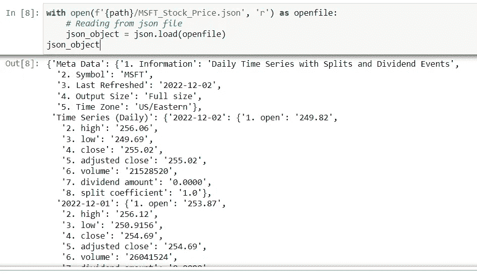

# 用 Python 提取股票价格数据

> 原文：<https://blog.devgenius.io/extract-stock-price-data-with-python-fa53300120e0?source=collection_archive---------4----------------------->

Python 股价分析 01:在线获取股价数据


坎瓦公司 [Unsplash](https://unsplash.com/s/photos/stock-price?utm_source=unsplash&utm_medium=referral&utm_content=creditCopyText) 模板上[贝南·诺鲁齐](https://unsplash.com/@behy_studio?utm_source=unsplash&utm_medium=referral&utm_content=creditCopyText)的照片

# 目录

> [简介](#206a)
> [股价 API](#395a)
> [运行 Jupyter 笔记本中的代码](#9a6f)
> [导出为 JSON 文件](#6fef)
> [数据理解](#0904)
> [转换成数据帧](#cbc0)
> [导出数据到文件](#a0b8)
> [结论](#1a99)
> [视频教程](#42c2)

# 介绍

世界各地的股市每天都会产生大量的数据。股票市场的波动性以及复杂的交易和投资规则使其成为数据分析的好去处。但是在我们能够分析股市中的任何数据之前，我们需要一种简单高效的方法来提取每天产生的海量数据。

在今天的教程中，我将教你如何提取你想要的股票的每日股价。

# 股票价格 API

我们需要首先连接到 API。


作者图片

我们知道我们需要从网上的某个地方获取数据，但必须有人在那里提供这种服务。 [RapidAPI](https://rapidapi.com/) 就是其中之一。我不知道它是否足以告诉你它是做什么的，但我用它来提取股票价格数据。请随意在它的网站上探索更多，因为它提供的不仅仅是股票价格 API。

无论如何，一旦你了解到我们正在连接到某人的服务器，该服务器为我们开放这些数据，你就可以点击[这个链接](https://rapidapi.com/alphavantage/api/alpha-vantage/)到达我们可以提取数据的地方。

**选择一个端点**

我们将提取时间序列每日调整数据。


截图图像

**选择您的代码**

因为我们使用的是 python，所以我们将在代码片段部分选择 python 代码。


截图图像

请注意，我们可以输入我们选择的股票代码。但我现在会坚持使用默认的 MSFT 股票。稍后我会解释。

但是我们将把 outputsize 参数改为“full”。默认值“compact”将只返回最新的 100 个数据点。当您希望每 100 个交易日更新一次数据时，这很有用，但当我们需要完整的数据时，这就不太有用了。


截图图像

然后点击测试端点。在您运行代码之后，这应该会自动显示一个示例结果。确保检查时间序列选项卡中的键数是否超过 100 个键。

1 键应该属于 1 日股价。


截图图像

现在我们可以将代码复制到我们的 python 代码中。


截图图像

# 运行 Jupyter 笔记本中的代码

在 python IDE 中运行代码应该会得到一个 JSON 输出文件。


截图图像

# 导出为 JSON 文件

我们要做的第一件事是导出为 JSON 文件，以防我们在这个过程中弄乱了数据。

定义存储 JSON 文件的路径。记得在 python 代码所在的目录中创建一个名为“JSON”的文件夹。

```
import os
filepath = f"{os.getcwd()}/JSON"
path = os.path.abspath(f"{filepath}").replace("\\","/")
path
```

然后将提取的数据写入 JSON 文件。

```
import json

with open(f"{path}/MSFT_Stock_Price.json", "w") as outfile:
    json.dump(response.json(), outfile)
```

尝试读取 JSON 文件。

```
with open(f'{path}/MSFT_Stock_Price.json', 'r') as openfile:
    # Reading from json file
    json_object = json.load(openfile)
json_object
```

**输出:**



截图图像

# 数据理解

```
# Now json_object is a dictionary
type(json_object)
```


json_object 是一个字典，包含不同级别的股票价格信息。

检查 json_object 字典中的唯一键。

```
for key,values in json_object.items():
    print(key)
```


这个结果告诉我们，我们得到的数据是一个多级字典，有两个主键“元数据”和“时间序列(每日)”。“时间序列(每日)”是存储我们每日股票价格数据的地方，也是以字典的形式。

打印我们的数据

```
for i in json_object["Time Series (Daily)"].items():
    print(i)
```


截图图像

检查日期范围

```
for key,values in json_object["Time Series (Daily)"].items():
    print(key)
```

# 转换成数据框

```
import pandas as pd
stock_price = json_object["Time Series (Daily)"]
df = pd.DataFrame.from_dict({(i): stock_price[i] 
                           for i in stock_price.keys()},
                       orient='index')
df_date = df.rename_axis('Date').reset_index()
df_date
```

记住 json_object 是一个多级字典，其中“时间序列(每日)”本身就是一个字典。我们可以用 pd。DataFrame 将字典转换为数据帧，但对于多级字典，我们需要使用列表理解来循环第一级中的每个键，然后将后续级转换为数据帧。

然后，第一层中的日期被用作每一行的索引。要将索引更改为列，我们使用 reset_index()。这将把表索引变成一个数字序列，原始索引(日期)将被推送到一个列。

**输出:**


# 将数据导出到文件

记住将这些数据导出到一个文件中供您使用

```
filepath = f"{os.getcwd()}/Output"
path = os.path.abspath(f"{filepath}").replace("\\","/")
df_date.to_csv(f'{path}/MSFT_Output.csv')
```

# 结论

今天的文章到此为止。我想把这篇教程分成几个部分，这样每篇文章都不会太长而难以阅读，并且容易集中在每篇文章的一个主题上。在我的下一篇文章中，我将讲述如何修改 API，以便指定想要提取的股票价格数据。

# 视频教程

所以，如果你有兴趣了解更多关于这个话题的信息，请继续关注。再见！


照片由[🇸🇮·扬科·菲利](https://unsplash.com/@itfeelslikefilm?utm_source=unsplash&utm_medium=referral&utm_content=creditCopyText)在 [Unsplash](https://unsplash.com/s/photos/learning?utm_source=unsplash&utm_medium=referral&utm_content=creditCopyText) 上拍摄

# 关于我

目前担任数据科学家。我为世界各地的客户提供数据分析问题的咨询、培训和专业服务。我很乐意分享我作为顾问的经验，这样每个人都可以从中学到一些东西。

领英:【https://www.linkedin.com/in/foocheechuan/ 

中:[medium.com/@foocheechuan](https://medium.com/@foocheechuan)

Youtube: [车志川](https://www.youtube.com/channel/UC73tyElpkCE_6cbZxMLKnkw)