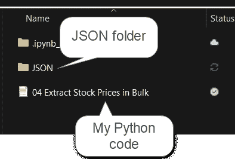
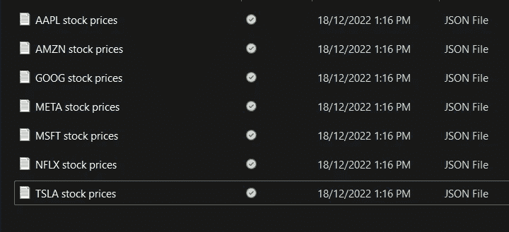

# 用 Python 提取股票价格(多只股票)

> 原文：<https://blog.devgenius.io/extract-stock-prices-with-python-multiple-stocks-fe2209261cfd?source=collection_archive---------8----------------------->

Python 股票价格分析 02:用股票代码列表提取股票价格


模板由 Canva 提供，照片由[克里斯·利维拉尼](https://unsplash.com/@chrisliverani?utm_source=unsplash&utm_medium=referral&utm_content=creditCopyText)在 [Unsplash](https://unsplash.com/s/photos/stock-trading?utm_source=unsplash&utm_medium=referral&utm_content=creditCopyText) 上拍摄

# 目录

> [简介](#da2d)
> [修改—如何提取股票价格](#f64b)
> [多只股票](#db75)
> [输出](#ae9e)
> [结论](#3871)
> [视频教程](#a5b8)
> [关于我](#5da7)

# 介绍

我之前的[文章](https://medium.com/dev-genius/extract-stock-price-data-with-python-fa53300120e0)讲了用 Python 代码提取股价数据的基本思路。但是，我只谈到了提取 1 只股票的股价。

如果我想分析所有 FAANG 股票之间的关系怎么办？如果我想提取 SP500 所有股票的价格，该怎么办？

在今天的文章中，我们来谈谈批量提取股票价格。

# 修订版—如何提取股票价格

回想一下，这是提取我们指定的股票价格的代码。在这种情况下，我选择了 MSFT。

```
import requests

url = "https://alpha-vantage.p.rapidapi.com/query"

querystring = {"function":"TIME_SERIES_DAILY_ADJUSTED","symbol":"MSFT","outputsize":"full","datatype":"json"}

headers = {
 "X-RapidAPI-Key": 'your-api-key',
 "X-RapidAPI-Host": "alpha-vantage.p.rapidapi.com"
}

response = requests.request("GET", url, headers=headers, params=querystring)

print(response.text)
```

如果你是第一次运行这个，请参考我的前一篇文章来设置 API 并了解更多关于提取股票价格的信息。

# 多只股票

我们不能只是将一个股票代码列表传递到查询字符串中。将这个列表['MSFT '，' AAPL']传递给 symbol 参数将只返回 AAPL(最后一个报价机)价格数据。

```
querystring = {"function":"TIME_SERIES_DAILY_ADJUSTED","symbol":["MSFT","AAPL"],"outputsize":"full","datatype":"json"}
```

我们需要编写一个股票代码列表，并遍历该列表来请求每个代码的股票价格数据。比方说，我们想要检索 FAANG-MT 股票的价格。我们将创建一个列表来存储这些股票的股票代码。

```
stocks = ['META','AAPL','AMZN','NFLX','GOOG','MSFT','TSLA']
```

然后我们将遍历这些股票代码，并将这些数据保存到一个 JSON 文件中。在我们开始编写代码之前，记得在 python 代码所在的目录中创建一个 JSON 文件夹。



图片由[作者](https://medium.com/@foocheechuan)

然后我们可以编写一个循环，用 API 请求数据，并写入一个 JSON 文件。

```
import requests
import json
import os

json_path = f"{os.getcwd()}\\JSON"
url = "https://alpha-vantage.p.rapidapi.com/query"
headers = {
    "X-RapidAPI-Key": "your-api-key",
    "X-RapidAPI-Host": "alpha-vantage.p.rapidapi.com"
}

for symbol in stocks:
    # Change ticker symbol in the query string in each loop
    querystring = {"function":"TIME_SERIES_DAILY_ADJUSTED","symbol":symbol,"outputsize":"full","datatype":"json"}
    print(f"Symbol = {symbol}")

    # Get a new request in every loop
    response = requests.request("GET", url, headers=headers, params=querystring)
    print(f"Done request {symbol} data")

    # Write the response into a JSON file in the JSON folder
    with open(f"{json_path}/{symbol} stock prices.json", "w") as outfile:
        json.dump(response.json(), outfile)

    # Output message to indicate a successful loop
    print(f"Wrote {symbol} to JSON file")
    print("")
    print('-'*30)
    print("")

else:
    # Output message to indicate the loop is complete
    print(f"Wrote all symbols to JSON file")
```

# 输出



图片作者[作者](https://medium.com/@foocheechuan)

然后，您可以使用我们在上一篇文章中讨论的方法将其转换为 pandas 数据框。

# 结论

今天的文章到此为止。在我的下一篇文章中，我将讨论如何将这些 JSON 文件存储到一个 CSV 文件中，以及这样做所需的准备工作。

感谢您阅读今天的文章。下一篇文章再见。

# 视频教程

# 关于我

目前担任数据科学家。我为世界各地的客户提供数据分析问题的咨询、培训和专业服务。我很乐意分享我作为顾问的经验，这样每个人都可以从中学到一些东西。

领英:[https://www.linkedin.com/in/foocheechuan/](https://www.linkedin.com/in/foocheechuan/?source=about_page-------------------------------------)

中:【medium.com/@foocheechuan】T2

Youtube: [车志川](https://www.youtube.com/channel/UC73tyElpkCE_6cbZxMLKnkw)


安妮·斯普拉特在 [Unsplash](https://unsplash.com/?utm_source=unsplash&utm_medium=referral&utm_content=creditCopyText) 上的照片