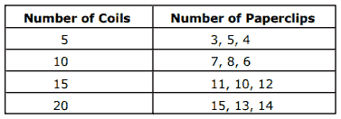
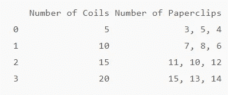
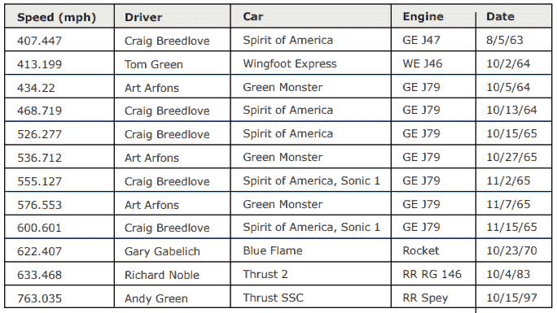
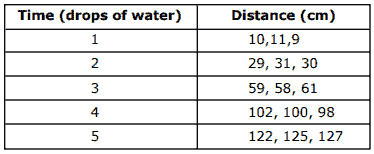

# 使用 Python-Python 编程从 PDF 中提取表格

> 原文：<https://blog.devgenius.io/extract-table-from-pdf-using-python-python-programming-13f40d468945?source=collection_archive---------0----------------------->

## 在本教程中，我们将讨论如何使用 Python 从 PDF 文件中提取表格


**目录**

*   介绍
*   示例 PDF 文件
*   使用 Python 从 PDF 的单个页面中提取单个表格
*   使用 Python 从单个 PDF 页面中提取多个表格
*   使用 Python 从 PDF 中提取所有表格
*   结论

# 介绍

当阅读研究论文或阅读一些技术指南时，我们通常会获得 PDF 格式的文件。它们载有许多有用的信息，读者可能对一些带有数据集或研究论文的发现和结果的表格特别感兴趣。然而，我们都面临着将这些表格轻松提取到 Excel 或数据框架的困难。

多亏了 Python 和它的一些神奇的库，现在您可以用几行代码提取这些表了！

要继续学习本教程，我们需要以下 Python 库:tabula-py。

如果您没有安装它，请打开“命令提示符”(在 Windows 上)并使用以下代码安装它:

```
pip install tabula-py
```

tabula-py 是 tabula-java 的 Python 包装器，所以您还需要在您的计算机上安装 java。你可以在这里下载[。](https://www.java.com/en/)

# 示例 PDF 文件

现在我们已经安装了需求，让我们找到几个示例 PDF 文件，我们将从中提取表格。

该文件仅用于代码示例:

*   [链接到文件](https://sedl.org/afterschool/toolkits/science/pdf/ast_sci_data_tables_sample.pdf)

现在让我们深入研究代码！

# 使用 Python 从 PDF 的单个页面中提取单个表格

在本节中，我们将使用上面提到的文件。如果你看一下，你会发现它在两页上总共有三个表格:第一页上有一个表格，第二页上有两个表格。

假设您对提取如下所示的第一个表感兴趣:



作者图片

我们知道它在 PDF 文件的第一页。现在我们可以使用 Python 将其提取为 CSV 或 DataFrame。

# 方法 1:

**第一步:导入库并定义文件路径**

**第二步:从 PDF 文件中提取表格**

上面的代码读取 PDF 文件的第一页，搜索表格，并将每个表格作为一个数据帧添加到一个数据帧列表中。

这里我们只期望一个表，因此 **dfs** 列表的长度应该是 1:

它应该返回:

```
1
```

您也可以通过显示列表中第一个元素的内容来验证结果:

并获得:



**步骤 3:将数据帧写入 CSV 文件**

只需将数据帧写入同一目录中的 CSV:

# 方法二:

这种方法将产生相同的结果，并且该库提供了一行解决方案，而不是一步一步地进行:

**重要提示:**

当您确定特定页面上只有一个表格时，上述两种方法都很容易使用。

在下一节中，我们将探讨在处理多个表时如何调整代码。

# 使用 Python 从单个 PDF 页面中提取多个表格

回想一下 [PDF 文件](https://sedl.org/afterschool/toolkits/science/pdf/ast_sci_data_tables_sample.pdf)在第 2 页上有 2 个表格。

我们希望提取下面的表格:



作者图片

和



作者图片

使用上一节中的**方法 1** ，我们可以将每个表提取为一个数据帧，并创建一个数据帧列表:

注意，在这种情况下，我们设置 **pages='2'** ，因为我们从 PDF 文件的第 2 页提取表格。

检查列表是否包含两个数据帧:

它应该返回:

```
2
```

既然列表包含多个数据帧，那么可以使用 for 循环将每个数据帧提取到一个单独的 CSV 文件中:

并且你应该会得到两个 CSV 文件: *table_0.csv* 和 *table_1.csv* 。

**注意:**如果您尝试使用上一节中描述的方法 2，它会将这两个表提取到 CSV 文件中的一个工作表中，您需要手动将它分成两个工作表。

# 使用 Python 从 PDF 中提取所有表格

在上面几节中，我们主要关注从给定的单个页面(第 1 页或第 2 页)中提取表格。现在，如果我们只是想把 PDF 文件中的所有表格放到不同的 CSV 文件中，我们该怎么做呢？

用表格库很容易解决。代码与前一部分几乎相同。我们需要做的唯一更改是设置 pages='all '，因此代码提取它找到的所有表作为数据帧，并用它们创建一个列表:

检查列表是否包含所有三个数据帧:

它应该返回:

```
3
```

既然列表包含多个数据帧，那么可以使用 for 循环将每个数据帧提取到一个单独的 CSV 文件中:

# 结论

在本文中，我们讨论了如何使用 tabula-py 库从 PDF 文件中提取表格。

如果你有任何问题或对编辑有任何建议，请随时在下面留下评论，并查看我的更多 [Python 编程](https://pyshark.com/category/python-programming/)文章。

*原载于 2021 年 6 月 27 日 https://pyshark.com*[](https://pyshark.com/extract-table-from-pdf-using-python/)**。**