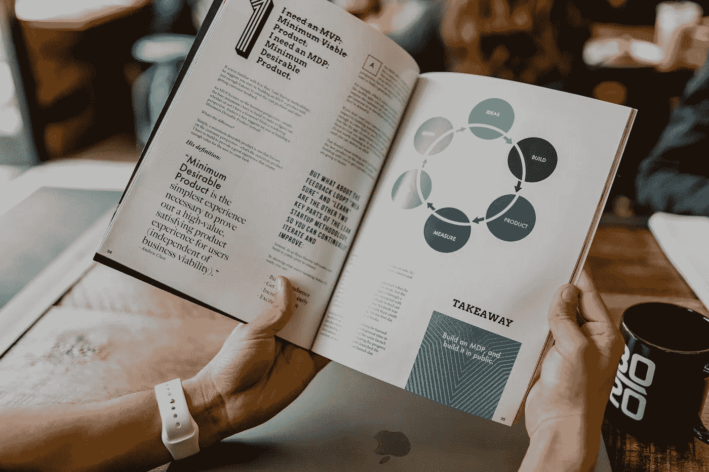

# 使用 Python 从 PDF 中提取文本

> 原文：<https://blog.devgenius.io/extract-text-from-pdf-using-python-d0f831b3245f?source=collection_archive---------1----------------------->

## 在本教程中，我们将探索如何使用 Python 从 PDF 文件中提取文本



在 [Unsplash](https://unsplash.com/s/photos/pdf?utm_source=unsplash&utm_medium=referral&utm_content=creditCopyText) 上由 [Austin Distel](https://unsplash.com/@austindistel?utm_source=unsplash&utm_medium=referral&utm_content=creditCopyText) 拍摄的照片

**目录**

*   介绍
*   示例 PDF 文件
*   使用 Python 从 PDF 中提取文本
*   结论

# 介绍

从 PDF 文件中提取文本是一项非常常见的任务，经常在处理报告和研究论文时执行。

如果您使用可用的软件和在线工具对每个文件进行手动操作，这将是一项繁琐的任务。

在本教程中，我们将探索如何使用 Python 和几行代码从 PDF 文件中提取文本。

为了继续学习本教程，我们需要以下 Python 库:PyPDF2。

如果您没有安装，请打开“命令提示符”(在 Windows 上)并使用以下代码安装它们:

```
pip install PyPDF2
```

# 示例 PDF 文件

以下是我们将在本教程中使用的 PDF 文件:

[https://pyshark . com/WP-content/uploads/2022/10/sample _ file . pdf](https://pyshark.com/wp-content/uploads/2022/10/sample_file.pdf)

这个 PDF 文件将与我们的代码一起存放在与 **main.py** 相同的文件夹中。

下面是我的文件的结构:


# 使用 Python 从 PDF 中提取文本

现在，我们已经拥有了所需的一切，可以使用 Python 轻松地从图像中提取文本:

您应该得到:

```
Sample Page 1
Sample Page 2
Sample Page 3
```

# 结论

在本文中，我们探索了如何使用 Python 和 [PyPDF2](https://pypdf2.readthedocs.io/en/latest/) 从 PDF 文件中提取文本。

如果你有任何问题或对编辑有任何建议，请随时在下面留下评论，并查看我的更多 [Python 编程](https://pyshark.com/category/python-programming/)教程。

*原载于 2022 年 10 月 17 日 https://pyshark.com*[](https://pyshark.com/extract-text-from-pdf-using-python/)**。**