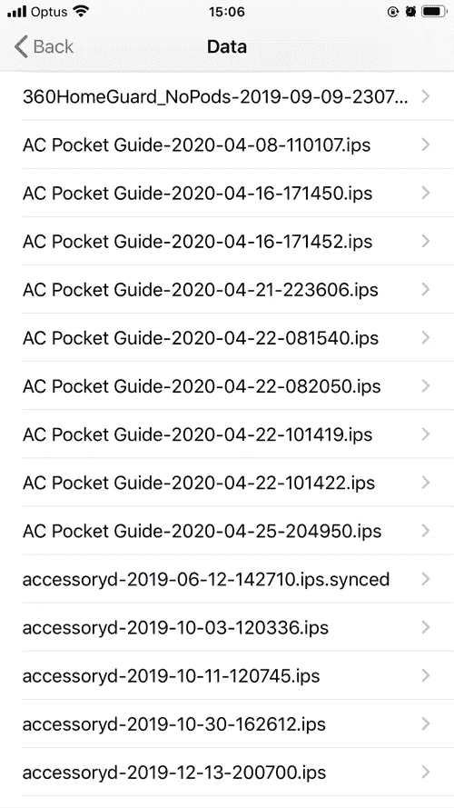

# 从 iPhone/iPad 中提取调试或崩溃日志

> 原文：<https://blog.devgenius.io/extract-the-debug-or-crash-log-from-iphone-ipad-87c9161c7a3c?source=collection_archive---------13----------------------->


# 对于真实设备

1.  打开设置应用程序
2.  轻触**隐私**
3.  点击**分析&改进**
4.  点击**分析数据**
5.  可能有相当多的数据，所以尽量找出可能的使用日期:



6.轻按右上角的“共享”按钮，您可以使用 Airdrop 或您喜欢的任何其他方式来共享它

# 对于模拟器

如果您使用模拟器，事情甚至会简单得多，这些日志将位于以下路径:

```
/Users/[your user name]/Library/Logs/CoreSimulator
```

然后你会发现有一些这样的文件夹:


类似于`4B43D000-AD34-4535-8E0B-C556525315B9`的目录是您的模拟器 id，您可以从 Xcode - >窗口→设备和模拟器:


进入该目录，您会发现输出文件位于 system.log 下，并在 CrashReporter 下崩溃(如果有)。


# 参考

*   [https://needone . app/extract-the-debug-or-crash-log-from-iphone-ipad](https://needone.app/extract-the-debug-or-crash-log-from-iphone-ipad)

*最初发布于 2020 年 8 月 5 日*[*https://needone . app*](https://needone.app/extract-the-debug-or-crash-log-from-iphone-ipad)*。*