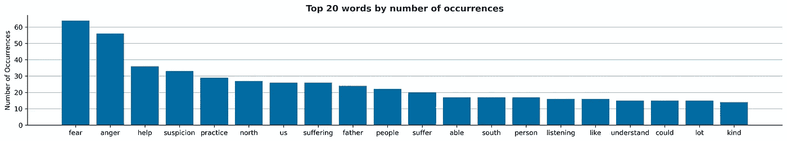

# 用 Python 实现抽取式文本摘要

> 原文：<https://blog.devgenius.io/extractive-text-summarizing-with-python-9834dad6a020?source=collection_archive---------4----------------------->

自然语言处理导论——一行禅师的美丽演讲


## 介绍

我敢肯定，像我一样，你们中的大多数人在手机或笔记本电脑上存储了大量用书签标记的新闻文章、推文或文本，而你没有足够的时间来阅读它们。

嗯，有一个方法可以帮你解决这个问题！我们不能延长时间。但是如果我们能为你做一个程序来总结这些课文呢？这就是我今天要探讨的。

文本摘要有两种类型:

*   抽象的:这种方法以一种新的方式压缩文本内容，使用新的单词和短语，类似于人所做的。它非常复杂，因为它基于深度学习。
*   **摘录**:这种方法从原文中选择最有意义的句子来创建摘要。

我选择了 2013 年一行禅师在 [*欧洲应用佛学研究院*](http://eiab.eu/) 的一次演讲的[这篇文字](https://medium.com/mindfulness-and-meditation/to-make-reconciliation-possible-19e357bfac47)发表在媒体上。

当时，朝韩关系高度紧张(朝鲜核威胁)，美国试图化解紧张局势。在这次谈话中，一行禅师为双方提供了一条和解和相互理解的道路。我邀请你阅读它，我希望这篇文章能在当前的世界背景下引起你的共鸣。

## 内容:

1.  [网页抓取](https://medium.com/p/9834dad6a020#1f75)

[2。文本摘要](https://medium.com/p/9834dad6a020#9eee)

[3。最终结果](https://medium.com/p/9834dad6a020#6912)

[4。结论](https://medium.com/p/9834dad6a020#fbf5)

## 1.网页抓取

让我们从用 Python 库 BeautifulSoup 从网上抓取文本开始。你可以在我的 [Github](https://github.com/khuonglan/NLP) 回购这里找到代码。

```
from bs4 import BeautifulSoup as bs
import requests
url="[https://medium.com/mindfulness-and-meditation/to-make-reconciliation-possible-19e357bfac47](https://medium.com/mindfulness-and-meditation/to-make-reconciliation-possible-19e357bfac47)"
response = requests.get(url)
html= response.content
soup=bs(html,"lxml")blog_text= soup.find_all("p",limit=44)
core_text= ""
for p in blog_text:
    core_text+=p.text.strip().lower()
```

## 2.文本摘要

为了开始文本摘要的工作，我已经导入了所需的 Python 库，并进行了一些文本清理。

现在让我们把重点放在单词在文本中出现的次数上。

```
from collections import Counternltk.download("stopwords", quiet=True)
from nltk.corpus import stopwords
stopwords_english = stopwords.words("english")word_frequencies = {}
for word in nltk.word_tokenize(formatted_text):
    if word not in stopwords_english:
        if word not in word_frequencies.keys():
            word_frequencies[word] = 1
        else:
            word_frequencies[word] += 1
```

原理是这样的:我已经从 NLTK 库中导入了英语停用词表。这是名单的摘录。

> ['我'，'我'，'我的'，'我自己'，'我们'，'我们的'，'我们自己'，'你'，'你是']

因为我们不希望这个单词列表出现在我们的分析中，所以代码将对文本进行迭代，每当一个单词没有出现在停用词列表中时，它就会得到 1 分，如果不是 0 分的话。*(需要注意的是，每个单词都是小写的，因为停用字词词典只保存小写的单词，以避免像“the”这样的单词被计算在内)*如果我们按出现次数列出前 20 个单词，下面是我们得到的结果:



“恐惧”、“愤怒”和“帮助”是最常用的词。

为了找到加权频率，让我们用每个单词的频率除以最常出现的单词的频率。

```
maximum_frequency = max(word_frequencies.values())for word in word_frequencies.keys():
       word_frequencies[word] = (word_frequencies[word]/maximum_frequency)
```


基于这些数据，我们现在可以构建我们的摘要:我们的模型将选择得分最高的句子。我们现在需要通过添加每个单词的加权频率来计算他们的分数。我选择在超过 50 个单词的句子上做，因为他们用长句子表达了他最深刻的思想。

```
sentence_scores = {}
for sent in sentence_list:
    for word in nltk.word_tokenize(sent.lower()):
        if word in word_frequencies.keys():
            if len(sent.split(' ')) > 50:
                if sent not in sentence_scores.keys():
                    sentence_scores[sent] = word_frequencies[word]
                else:
                    sentence_scores[sent] += word_frequencies[word]
```

让我们通过选择得分最高的 5 个句子来构建我们的总结:

```
import heapq
summary_sentences = heapq.nlargest(5, sentence_scores, key=sentence_scores.get)
summary = ' '.join(summary_sentences)
print(summary)
```

## 3.决赛成绩

以下是总结文本:

> 我们的政治领导人没有受过帮助消除恐惧、愤怒和怀疑的艺术训练。这就是为什么我们必须向我们这些有灵性的人求助，他们富有同情心，知道如何倾听，知道如何转化我们自己的恐惧、愤怒和怀疑。当恐惧和愤怒成为一种集体能量时，这是非常危险的，战争随时可能爆发。我的书《愤怒》在一周前刚刚出版。根据我们的实践经验，如果你想帮助别人减少他们的恐惧、愤怒和怀疑，你首先要练习减少你自己的恐惧、愤怒和怀疑。在韩国釜山，我给 11000 人做了一个题为“和平是可能的”的演讲。他们总是承诺，当他们回到中东时，他们将建立一个僧伽并组织同样的修行，以便其他人可以来修行并减少痛苦。我认为如果政治领导人知道这种修行，他们将能够帮助冲突双方消除怀疑、错误的看法、恐惧和愤怒，这样和平才可能真正实现。当你试图制造核武器时，并不是真的因为你想摧毁对方，而是因为你害怕他们会先攻击你。如果你想帮助朝鲜和韩国，如果你想帮助巴勒斯坦和以色列，你应该做些什么来帮助双方消除恐惧、愤怒和怀疑。“南方必须倾听自己的声音，并做出改变，然后才能倾听北方的声音，帮助北方消除恐惧、愤怒和猜疑。然后，当美国倾听并理解了自己的痛苦后，美国人就可以转向中东，使用那种被称为温和、充满爱意的语言。”

## 4.结论

用 5 句话概括一个来自他们的又长又深的谈话并不容易。然而，阅读这个摘要通过挑选原文最有意义的句子，给了我们原文的核心思想。我希望它能激励你阅读全文([链接此处](https://medium.com/mindfulness-and-meditation/to-make-reconciliation-possible-19e357bfac47))来欣赏它。

*对于那些想探索更多的人来说，我推荐上乌斯曼·马利克的这个* [*页面*](https://stackabuse.com/text-summarization-with-nltk-in-python/) *。*