# 基于 Apache ShardingSphere 的 F6 汽车科技百万行数据分片策略

> 原文：<https://blog.devgenius.io/f6-automobile-technologys-multi-million-rows-of-data-sharding-strategy-based-on-apache-18c15114b9c6?source=collection_archive---------14----------------------->

[F6 汽车科技](https://www.f6car.com)是一家专注于汽车后市场信息化的互联网平台公司。它帮助汽车维修公司(客户)构建他们的智能管理系统，以数字化方式改造汽车售后市场。

不同汽修公司的数据肯定会相互隔离，所以理论上数据可以存储在不同数据库的不同表中。然而，快速发展的企业面临着越来越大的数据量挑战:有时单个表中的总数据量可能接近 1000 万甚至 1 亿个条目。

这个问题无疑对业务增长构成了挑战。此外，成长中的企业现在还计划根据领域或业务类型将他们的系统分成许多微服务，相应地，不同的业务案例垂直地需要不同的数据库。

## **我们为什么需要数据分片？**

关系数据库是存储容量、连接数和处理能力的瓶颈。

首先，我们总是优先考虑数据库性能。当单个表的数据量达到数千万，并且存在相对大量的查询维度时，即使我们添加更多的从数据库并优化索引，系统性能仍然不能令人满意。这意味着是时候考虑数据分片了。

数据分片的目的是减少数据库负载压力和查询时间。此外，由于单个数据库通常具有有限数量的连接，当数据库的每秒查询数(QPS)指标过高时，当然需要数据库分片来分担连接压力。

其次，确保可用性是另一个重要原因。如果不幸的是，一个数据库发生事故，我们可能会丢失所有数据，并进一步影响所有服务。数据库分片可以最小化风险和对业务服务的负面影响。一般当一个表的数据量大于 2GB 或者数据行数大于 1000 万时，更何况数据也在快速增长，我们最好使用数据分片。

## **什么是数据分片？**

业内有四种常见的数据分片类型:

*   垂直表分片:将大表分割成基于字段的小表，这意味着不常用的或相对较长的字段被分割成扩展表。
*   垂直数据库分片:基于业务的数据库分片用于解决单个数据库的性能瓶颈。
*   水平表分片:将表的数据行按照一定的规则分布到不同的表中，以减少单个表的数据量，优化查询性能。就数据库层而言，它仍然面临瓶颈。
*   水平数据分片:基于水平表分片，将数据分布到不同的数据库中，有效提升性能，降低单机和单个数据库的压力，打破 I/O、连接、硬件资源的束缚。

## **优秀的数据分片解决方案**

1.  [**切分——JDBC**](https://shardingsphere.apache.org/document/current/en/quick-start/shardingsphere-jdbc-quick-start/)**(阿帕奇切分)**

**优点:**

*   由一个活跃的开源社区支持。现在 Apache ShardingSphere 5.0 版本已经发布，开发迭代速度快。
*   被众多成功的企业应用案例证明功效:京东科技、Dangdang.com 等大公司都应用了 ShardingSphere。
*   易于部署:分片 JDBC 可以快速集成到任何项目中，无需部署额外的服务。
*   出色的兼容性:可以路由到单个数据节点，完美支持 SQL。
*   卓越的性能和低损耗:测试结果可以在 Apache ShardingSphere 网站上找到。

**缺点:**

*   操作和维护成本的潜在增加，以及数据分片后麻烦的字段更改和索引创建。要解决这个问题，用户需要部署支持异构语言并且对 DBA 更友好的分片代理。
*   到目前为止，该项目还不支持数据分片动态迁移。因此，需要特性实现。

**2。** [**MyCat**](http://mycat.sourceforge.net)

**优点:**

*   MyCat 是放置在应用程序和数据库之间的中间件，用于处理数据处理和交互。在开发过程中是无法感知的，集成 MyCat 的成本并不高。
*   使用 JDBC 连接 [Oracle](https://www.oracle.com/index.html) 、 [DB2](https://www.ibm.com/analytics/db2) 、 [SQL Server](https://www.microsoft.com/en-us/sql-server/sql-server-downloads) 、 [MySQL](https://www.mysql.com) 等数据库。
*   支持多种语言，易于跨不同平台部署和实施。
*   高可用性和崩溃触发的自动切换。

**缺点:**

*   运营和维护成本高:要使用 MyCat，需要配置一系列参数和 HA 负载平衡器。
*   用户必须独立部署服务，这可能会增加系统风险。

当然，还有类似的解决方案，如 Cobar、Zebra、MTDDL 和 [TiDB](https://en.pingcap.com/tidb/) 但老实说，我们没有花太多时间研究其他解决方案，因为我们决定使用 ShardingSphere，因为我们觉得它符合公司的需求。

## **F6 汽车科技总体规划**

基于我们公司的业务模型，我们选择 Client ID 作为分片键，以确保一个客户的工作订单数据存储在同一个特定于客户的数据库的同一个表中。因此，避免了多表关联查询带来的性能损失；再加上后来，即使需要多数据库分片，也可以避免跨数据库事务和跨数据库连接。

在客户端 ID 数据库中，类型 BIGINT(20)应用 UID(唯一标识号，或者我们称之为“基因”)来确保未来潜在的数据库伸缩性；一个客户机 ID 的最后两位数字是它的 UID，所以根据双倍缩放规则，最大值达到 64 个数据库。左位的值可用于表分片，可分成 32 个分片表。

以 10545055917999668983 为例，规则如下:

```
105450559179996689 83
Table sharding uid value % 32 database sharding uid value % 1
```

最后两位数(即 83)用于数据库分片，其中临时数据只分片到库 f6xxx 中，所以余数为 0。以后，不断增加的数据量可以扩展到多个库。剩余的值 105450559179996689 用于表分片。第一次，它被分成 32 个单个的表，所以模余数对应于特定的分片表下标为 0~31。

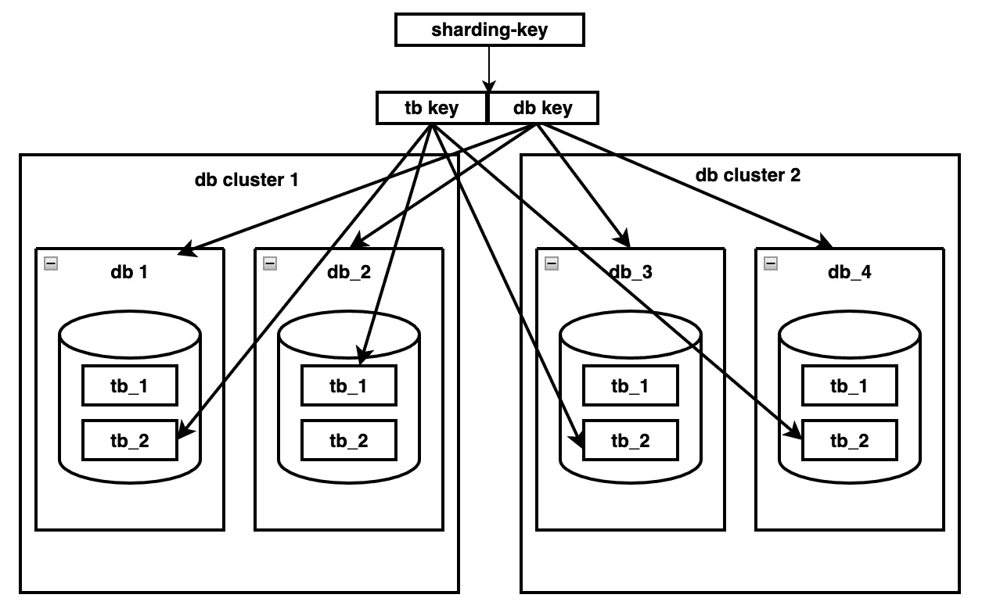

鉴于业务系统正在增长，我们采用快速迭代的方法逐步开发功能，我们计划先分片表，然后再做数据库分片。

数据分片对系统有很大的影响，所以我们需要灰度释放——如果不幸发生问题，系统可以快速开始回滚，以确保业务系统正常运行。实现细节如下:

**桌面分片**

*   从 JDBC 切换到 JDBC 沙丁，以连接数据源
*   分离写数据库，然后迁移代码
*   同步历史数据和增量数据
*   切换分片表

**数据库分片**

*   迁移只读数据库
*   数据迁移
*   切换只读数据库
*   切换只写数据库

## **表格分片细节**

***分片表数量***

在行业中，单个表的数据通常应该限制在 500 万行，分片表的数量应该是 2 的幂，以使它们具有可伸缩性。分片表的确切数量是根据业务发展速度和未来数据增长以及未来数据归档计划计算得出的。在定义了分片表计数和分片算法之后，就可以评估每个分片表中的当前数据量了。

***准备***

*   **替换数据库&自动表 ID 生成器**

在表分片之后，我们不能再使用自动数据库 ID 生成器，所以我们必须找到一个可行的解决方案。我们有两个计划:

计划 1:使用其他键，如雪花键

计划 2:自己实现一个增量组件(数据库或 Redis)

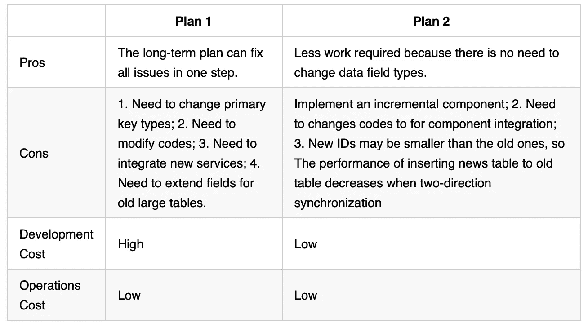

在比较了这两个解决方案和业务条件之后，我们决定选择方案 2，同时提供一个新的全面的表级 ID 生成器解决方案。

*   **检查是否所有请求都带有分片密钥**

现在，微服务流量入口包括:

*   超文本传送协议
*   杜博
*   XXLJOB 计划任务
*   消息队列(MQ)

在表分片之后，为了快速定位数据分片，所有请求都必须携带它们的分片键。

*   **解耦**

1.  解耦每个域的业务系统，并使用接口与读写数据进行交互。
2.  请删除直接表连接，改用接口。

解耦带来的最大问题是分布式事务问题:如何保证数据一致性。通常，开发人员引入分布式事务组件来确保事务的一致性，或者他们使用补偿或其他机制来确保最终数据的一致性。

***灰度发布计划***

为了确保在出现新功能发布导致的问题时快速回滚，所有在线修改都是基于客户端逐步发布的。我们的灰度发布计划如下所示:

**计划 1:** 维护两套映射器接口:一套使用分片 JDBC 数据源连接数据库，另一套使用 JDBC 数据源连接数据库。在服务层，需要根据下面的决策工作流程图从两个接口中选择一个:

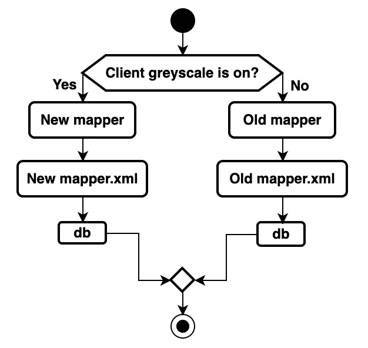

然而，该解决方案导致了另一个问题:所有访问映射器层的代码都有一个`if else`分支，导致主要的业务代码更改、潜在的代码入侵和更难的代码维护。因此，我们找到了另一个解决方案，我们称之为方案 2。

**计划 2 —自适应映射器选择计划**:一套映射器接口有两个数据源和两套实现。基于灰度配置，不同的客户端请求会经过不同的映射器实现，一个服务对应两个数据源和两组事务管理器，基于灰度配置，不同的客户端请求会到不同的事务管理器。相应地，我们利用 [MyBatis](https://mybatis.org/mybatis-3/) 的多个映射器扫描器来生成多个`mapperInterfaces`，同时生成一个`mapperInterface`用于包装。包装类支持`hintManager`自动选择映射器；事务管理器类似于包装类的生成。包装器类支持`hintManager`自动选择各种事务管理器来管理事务。这个解决方案实际上避免了入侵，因为对于服务层的代码，只有一个映射器接口。

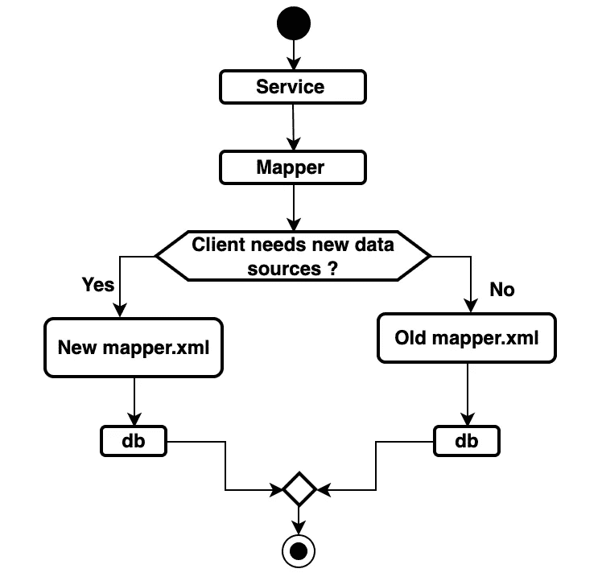

***数据源连接开关***

Apache ShardingSphere 已经在其网站上列出了一些 Sharding-JDBC 目前不支持的语法，但我们仍然发现了以下 Sharding-JDBC 解析器无法处理的有问题的 SQL 语句:

*   没有碎片键的子查询。
*   不支持值包含 cast ifnull now 等函数的`Insert`语句。
*   不支持`ON DUPLICATE KEY UPDATE`。
*   默认情况下，select for update 转到从属数据库(自 4.0.0.RC3 以来，该问题已得到修复)。
*   分片-JDBC 不支持用于查询 vision 的 MySqlMapper 的语句 ResultSet.first()。
*   批量更新没有这样的语句。
*   即使`UNION ALL`不支持灰度发布计划，我们也只需要复制一套 mapper.xml，在发布前基于分片-JDBC 的语法进行修改即可。

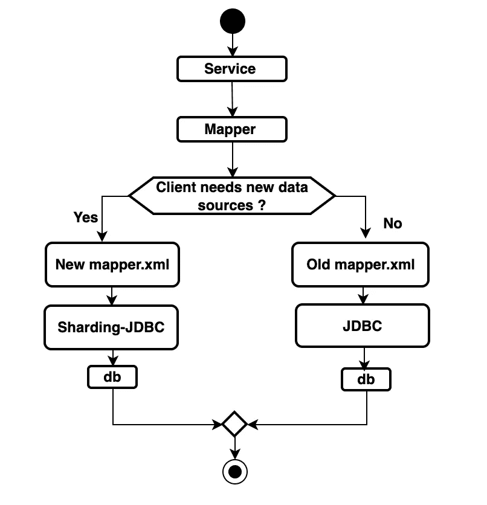

***历史数据同步***

[DataX](https://www.alibabacloud.com/help/en/doc-detail/126635.htm) 是阿里巴巴集团的离线数据同步工具，可以有效同步 MySQL、Oracle、SqlServer、Postgre SQL、HDFS、Hive、ADS、HBase、TableStore(OTS)、MaxCompute(ODPS)、DRDS 等异构数据源。

数据同步框架 DataX 可以将不同数据源的同步抽象为从数据源读取数据的 Reader 插件，然后作为将数据写入目标的 Writer 插件。理论上，DataX 框架可以支持所有数据源类型的数据同步。此外，DataX 插件生态系统可以允许每个新添加的数据源立即与旧数据源进行交互。

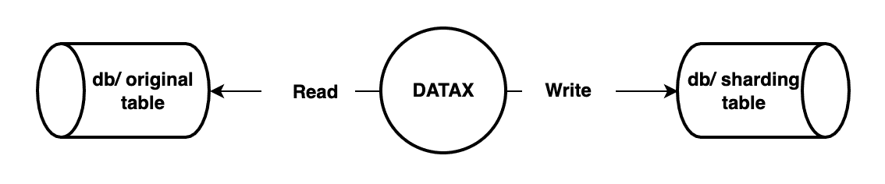

***验证数据同步***

*   使用定时任务比较原始表和分片表的数据数量。
*   使用定时任务比较关键字段的值。

***读写拆分和表格分片***

在读/写拆分之前，我们需要首先配置增量数据同步。

*   **增量数据同步**

我们使用另一个名为 [Otter](https://github.com/alibaba/otter) 的开源分布式数据库同步项目来同步增量数据。基于数据库增量日志解析，otter 可以同步本地机房或远程机房的 MySQL/Oracle 数据库的数据。要使用 Otter，我们需要特别注意以下提示:

*   对于 MySQL 数据库，用户必须启用 binlog，并将其模式设置为 ROW。
*   用户必须拥有 binlog 的查询权限，所以他们需要申请一个 otter 用户。
*   现在，DMS 数据库的 binlog 只存储 3 天。在 Otter 中，用户可以自行定义 binlog 同步的起始位置和增量同步的起始点:首先在 SQL 平台上选择 slave-testDb，使用 SQL 语句“show master status”进行查询。

> *注意:主从的* `*show master status*` *的执行结果可能会有所不同，所以如果设置了，需要获取主数据库的执行结果。我们认为这个功能真的很有用，因为当 Otter 的数据同步失败时，我们可以重置点并从头再次同步。*

*   当 Otter 被禁用时，它会自动记录最后一个同步点，下次继续从这个点同步数据。
*   Otter 允许开发人员定义自己的处理过程。例如，我们可以配置数据路由规则，并控制从子表到父表的客户端数据同步数据的方向，反之亦然。
*   禁用 Otter 不会使用户定义的 Otter 处理过程中定义的缓存失效。要修复它，解决方案是修改代码注释并保存它。
*   **读/写拆分计划**

我们的灰度转换计划如下所示:

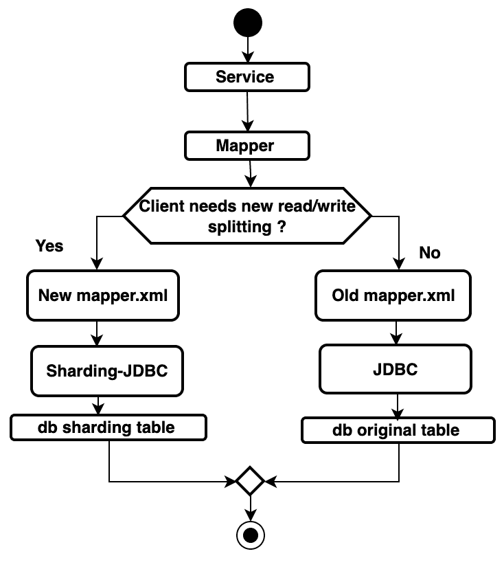

我们选择了灰度发布解决方案，这意味着有必要确保子表和父表中的实时数据更新。因此，所有数据在两个方向上同步:对于灰度释放打开的客户端，读取和写入到子表，数据通过 Otter 实时同步到父表，而对于灰度释放关闭的客户端，读取和写入到父表，数据通过 Otter 实时同步到子表。

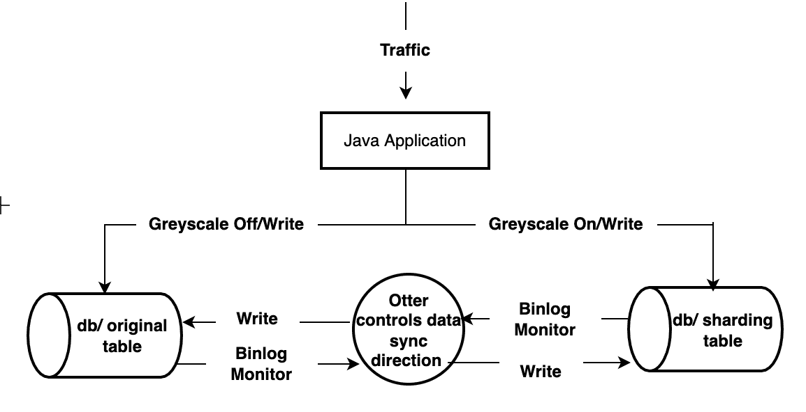

**数据库分片详细信息**

***准备***

*   **主键**

主键应该是自动增量类型(分片表应该是全局自动增量)或者访问唯一的主键编号服务(server_id 独立于 DB)。表自动增量主键生成或 uuid_short 生成的键需要切换。

*   **存储程序、功能、触发器和事件**

如果存在，首先尝试删除它们；如果无法删除，请提前在新数据库中创建它们。

*   **数据同步**

数据同步使用 DTS 或 sqldump(历史数据)+ otter(增量数据)进行同步。

*   **数据库变更程序**

为了避免潜在性能和兼容性问题，数据库更改计划必须遵循两个标准:

*   灰度切换:流量逐渐切换到 [RDS](https://www.alibabacloud.com/getting-started/learningpath/rds) (阿里云关系数据库服务，又名 RDS)，可以随时观察数据库性能。
*   快速回滚:在问题发生时实现快速恢复，对用户体验影响很小。

**现状:**四个应用实例+一个主数据库和两个从数据库

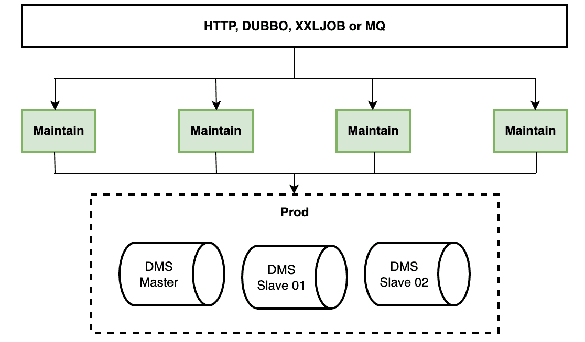

**第一步:**添加一个新的应用实例并切换到 rds，写入或传递 dms 主数据库，dms 主数据库中的数据将实时同步到 RDS

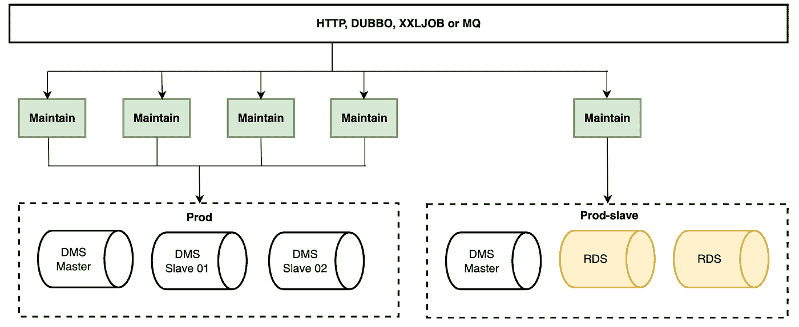

**第二步:**再添加三个应用实例，并截取 50%的数据写入 rds 数据库

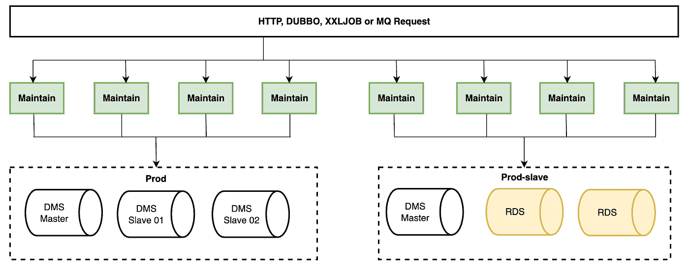

**步骤 3:** 删除四个原始实例流量，并在写入 dms 主数据库的同时将它们读入 rds 实例

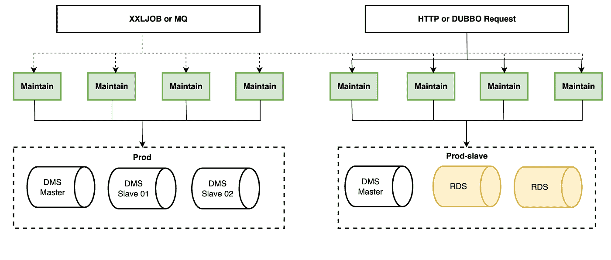

**第四步:**将主数据库切换到 rds，rds 数据将反向同步到 dms 主数据库，以便于数据的快速回滚

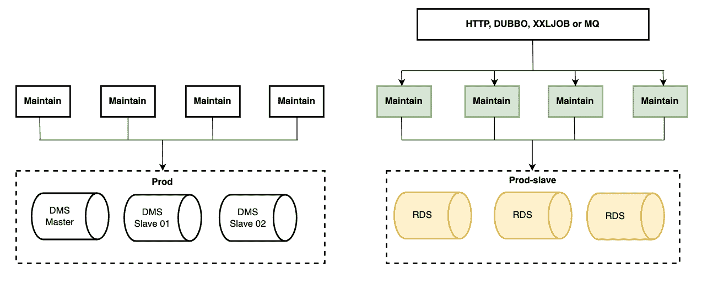

**第五步:**完成

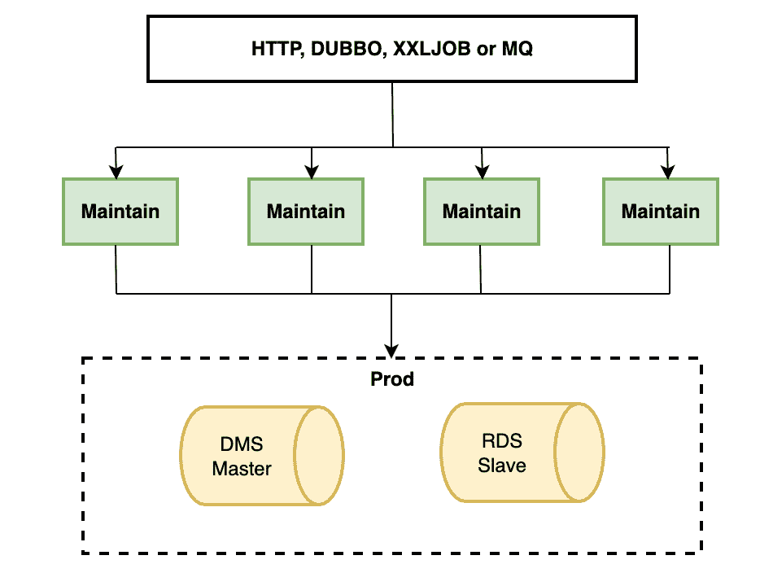

上述每一步都可以通过流量切换快速回滚，从而保证系统的可用性和稳定性。

**分片&缩放**

当单个数据库的性能达到稳定水平时，我们可以通过修改分片数据库路由算法和迁移数据来扩展数据库。

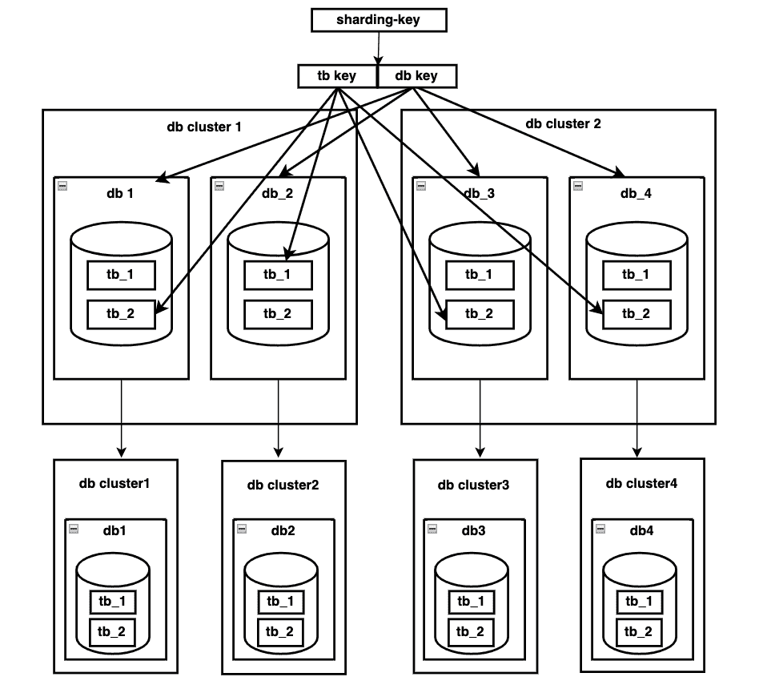

当单个表的容量达到最大值时，我们可以通过修改分片表路由算法和迁移数据来扩展该表。

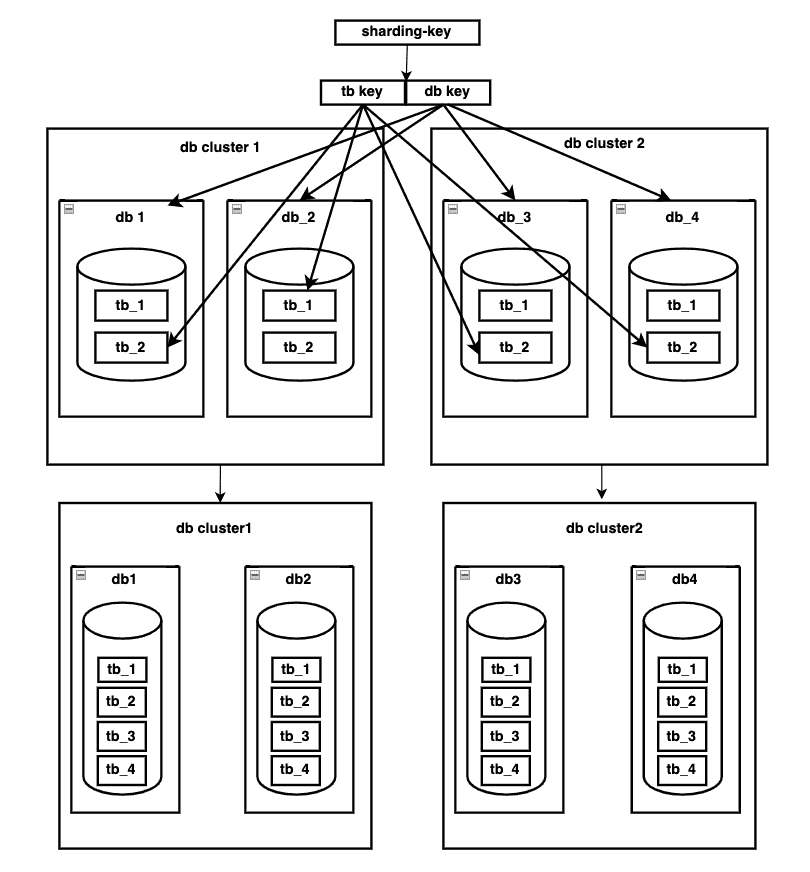

**常见问题解答**

***问:有时候，Otter 接收到 binlog 数据，但是在数据库中找不到数据？***

为了使我们的 MySQL 与其他非事务引擎的副本兼容，我们在服务器层添加了 binlog。Binlog 可以记录所有的引擎修改操作，因此可以支持所有引擎的复制功能。这个问题是重做日志和 binlog 之间潜在的不一致，但是 MySQL 使用其内部 XA 机制来解决这个问题。

**步骤 1:** 不对 InnoDB 准备、写入/同步重做日志和 binlog 执行操作。

**第二步:**首先写/同步 Binlog，然后 InnoDB 提交(内存提交)。

当然，从 5.6 版本开始，已经添加了组提交。这种开发在一定程度上提高了 I/O 性能，但并没有改变执行顺序。

在 write/sync binlog 完成之后，Binlog 已经被写入，所以 MySQL 认为事务已经被提交和持久化(现在，Binlog 已经准备好发送给订阅者)。即使数据库崩溃，MySQL 重启后事务仍然可以正确恢复。但是，在此步骤之前，任何操作失败都可能导致事务回滚。

InnoDB 提交以内存提交为中心，如杀死锁、读取与多版本并发控制发布相关的视图。MySQL 认为这一步没有错误发生——一旦真的发生错误，数据库就会崩溃——MySQL 本身无法处理崩溃。该步骤没有任何导致事务回滚的逻辑。就程序操作而言，只有完成这一步后，事务引起的变化才能通过客户端的 API 或查询显示出来。

可能出现问题的原因是首先发送 binlog，然后进行 db commit。我们使用查询重试来解决这个问题。

***问:说到多表查询，有时候，为什么有些表取不到数据？***

**答:**分片 JDBC 的主/从路由策略如下所示:

在下列情况下选择主数据库:

*   包含锁的 SQL 语句，如 select for update(4 . 0 . 0 . rc3 版)；
*   Not SELECT 语句；
*   已经转到主数据库的线程；
*   代码指定对主数据库的请求。

用于从多个从属数据库中进行选择的算法:

*   轮询策略
*   负载平衡器策略

默认值是轮询策略。然而，一个查询可能去往不同的从数据库，或者它可能去往主库和从数据库，这在主从数据库延迟或多从延迟之间存在时间不一致时发生。

***问:如何才能去除网络流量？***

**答:**

*   http:使用 nginx 移除上游；
*   dubbo:利用其 qos 模块来执行离线/在线命令；
*   xxljob:手工输入执行人的执行 IP，指定实例；
*   MQ:使用阿里云提供的 API 来启用或禁用消费者 bean。

# Apache ShardingSphere 开源项目链接:

[ShardingSphere Github](https://github.com/apache/shardingsphere)

[ShardingSphere Twitter](https://twitter.com/ShardingSphere)

[切割球松弛通道](https://join.slack.com/t/apacheshardingsphere/shared_invite/zt-sbdde7ie-SjDqo9%7EI4rYcR18bq0SYTg)

[投稿指南](https://shardingsphere.apache.org/community/cn/contribute/)

# 作者

**Yacine Si Tayeb**

> *spherex 国际业务主管*
> 
> *Apache ShardingSphere 贡献者*
> 
> Yacine 对技术和创新充满热情，他搬到北京攻读工商管理博士学位，并对当地的初创企业和技术领域充满敬畏。到目前为止，他的职业道路是由技术和商业交汇处的机遇塑造的。最近，他对 ShardingSphere 数据库中间件生态系统的开发和开源社区建设产生了浓厚的兴趣。

