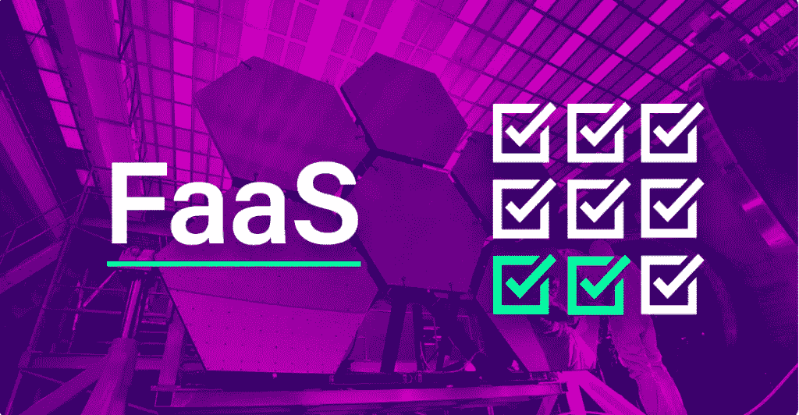
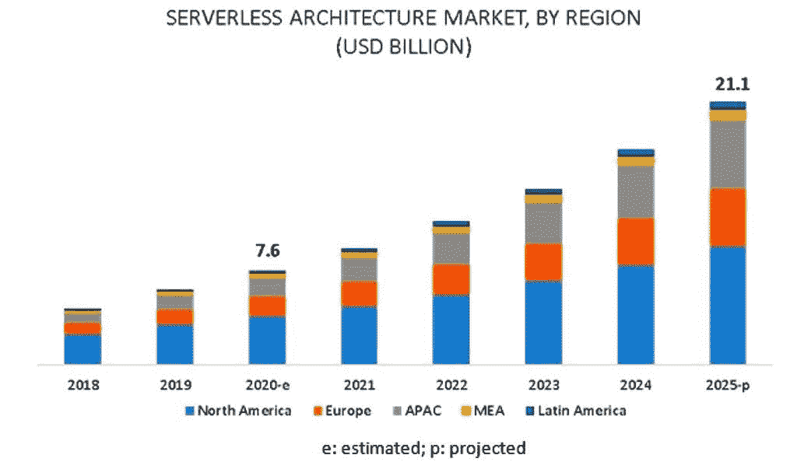
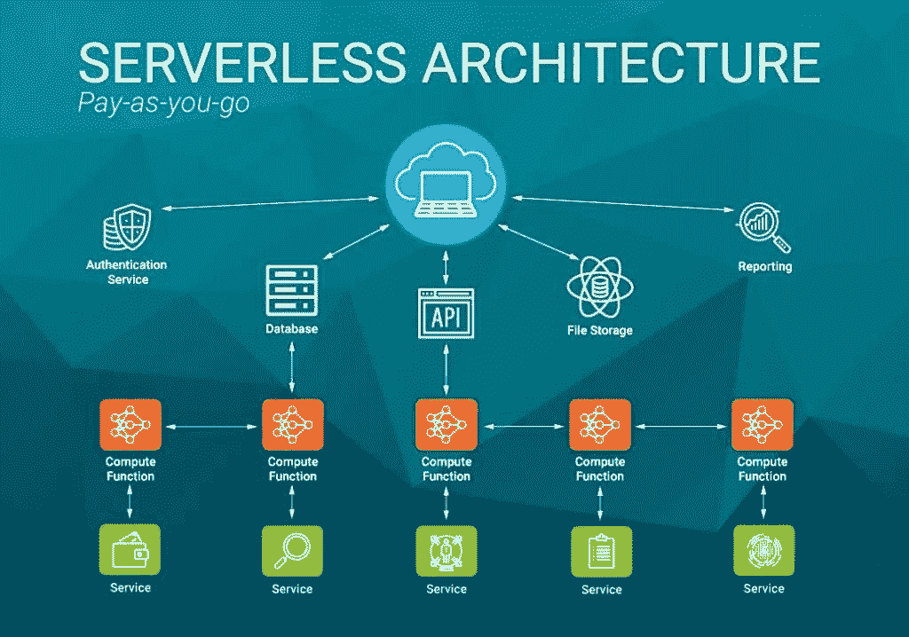
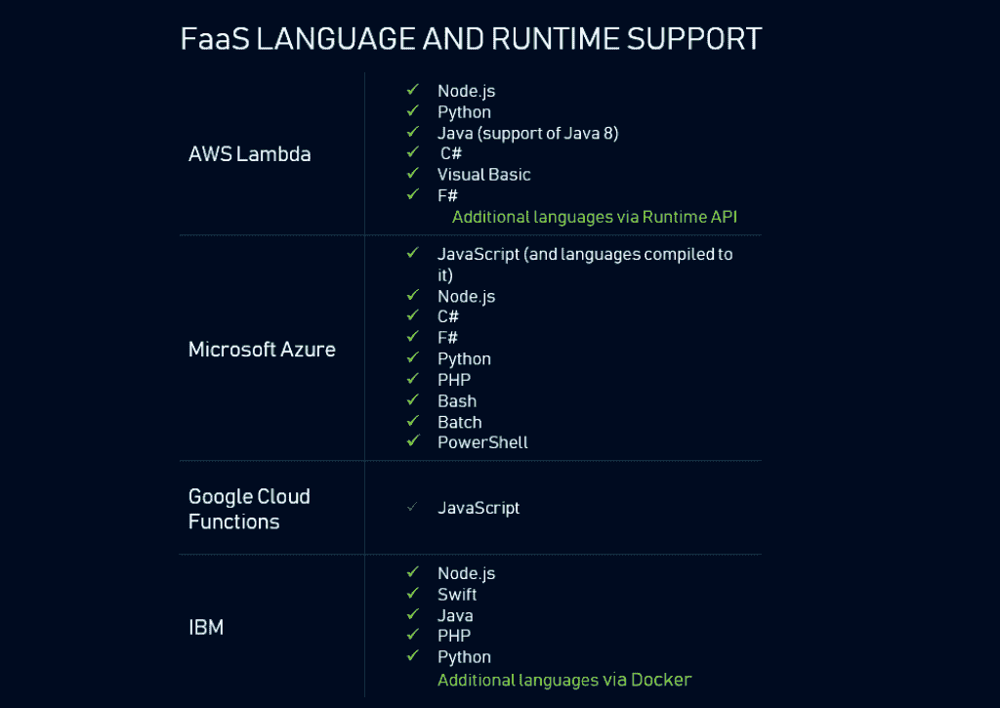
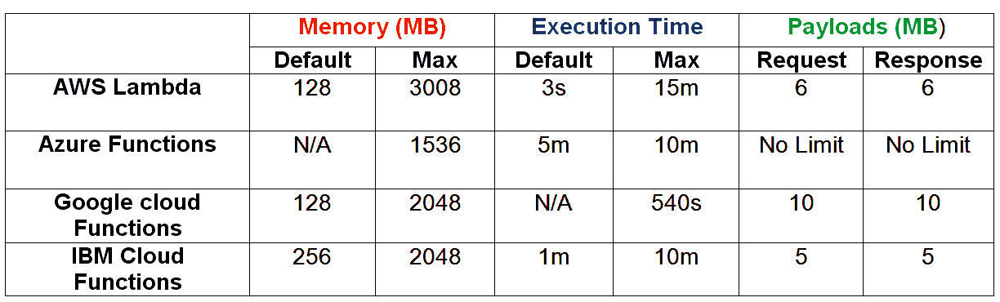
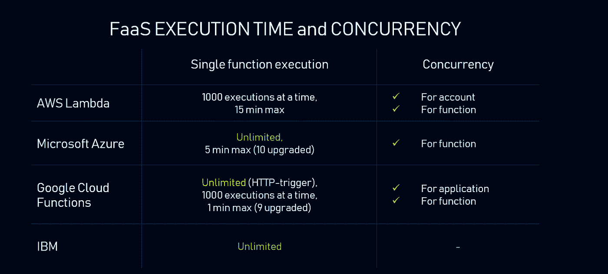

# FaaS 供应商:市场上的顶级品牌

> 原文：<https://blog.devgenius.io/faas-providers-the-top-names-on-the-market-e3fc99b4405f?source=collection_archive---------1----------------------->

专家预测，到 2025 年，全球无服务器基础设施市场将以 22.7%的复合年增长率增长到 211 亿美元。增长的关键驱动因素包括通过消除对服务器管理的需求，从资本成本转移到运营成本的需求日益增长。这大大降低了基础设施的成本，很容易被所有领域和规模的企业所接受。

迄今为止，已有近 24 个 FaaS 解决方案被认为是成功的，其数量还将继续增长。在 [7devs](https://7devs.co/) ，在多年开发经验的指导下，我们对 FaaS 供应商进行了比较，以确定最佳供应商，并在我们客户的项目中尽可能有效地使用他们的解决方案！

# 什么是 FaaS？

功能即服务(Function as a Service，FaaS)是云计算软件的一种格式，它允许您执行代码来响应事件，而无需与运行微服务应用程序相关的复杂基础架构。借助 FaaS，物理硬件、操作系统和 web 服务器软件由云提供商自动管理。

# 目前最大的无服务器架构提供商

无服务器功能市场的主要参与者是亚马逊、谷歌、微软和 IBM。这些公司的解决方案正在成为许多行业的驱动力。为什么？也许这些提供商已经设法击中要害，找到了功能、性能、特性和成本的“正确”组合。

# 自动气象站λ

2014 年推出的 T4 亚马逊网络服务已经成为无服务器架构的代名词。它是一种领先的产品，提供广泛的服务。最著名的用例是网飞。

# 微软 Azure 函数

[Azure Functions](https://azure.microsoft.com/en-us/services/functions/?&ef_id=Cj0KCQjw9_mDBhCGARIsAN3PaFOqW2zDvVAQdzEJTBUBeYUoeiCEnWB-9Rshpvki5hiohei0YXxwtkQaAuLcEALw_wcB:G:s&OCID=AID2100648_SEM_Cj0KCQjw9_mDBhCGARIsAN3PaFOqW2zDvVAQdzEJTBUBeYUoeiCEnWB-9Rshpvki5hiohei0YXxwtk) 是微软在 2016 年推出的。该服务提供类似的服务，重点是它自己的一套工具和语言。一个突出的用例是我被 pwn 了吗？

# 谷歌云功能(GCF)

[谷歌](https://cloud.google.com/functions)在 2017 年推出了自己的无服务器产品。尽管 GCF 的功能在功能上不如 Azure 和 Lambda，但所有的“童年疾病”都在最初发布后的一年左右被治愈了。

# IBM 云功能

[IBM Cloud Functions](https://cloud.ibm.com/functions) 是 OpenWhisk 唯一的云服务托管基础设施解决方案。如果你的目标是找到一个开源解决方案，Apache OpenWhisk 更合适。

这些提供商为在托管基础设施上运行应用程序提供类似的服务。但是只有全面的服务比较才能帮助你选择最佳方案。

# 价格和计费因素

被比较的 FaaS 提供商使用按请求付费的定价模式和他们自己的计算器。Serverlesscalc 是一款专门为我们的四家提供商设计的成本计算工具，目前处于测试阶段。

Lambda 每月免费提供 100 万次查询和 40 万千兆秒的计算时间。其余分配的资源(内存和 CPU)一起计费。

Azure 也是这样计费的，唯一的区别是 0.000016 GB/s，重负载成本更低，但微软不是为分配的内存计费，而是为消耗的内存计费。

GCF 每月免费提供 2M 请求，任何更大的请求收费 0.0000004 美元。考虑到功能的持续时间和请求的数量，成本更高，但 GCF 在分割资源费用方面有所不同。

IBM 计算出阈值以上的开销为每次调用 0.000017 GB/s。OpenWhisk 只对该特性激活时消耗的资源计费。

# 编程语言支持

Lambda 有各种各样的语言和编程环境。Azure 专注于微软语言家族。谷歌云功能过去只支持 JavaScript。最近宣布其他语言正在测试中。但到目前为止，这看起来不像是一个可靠的选择。IBM 支持 Node.js、Swift、Java、PHP 和 Python。该服务允许您方便地将各种编程语言(几乎任何现有的)与 Docker 容器集成。

无服务器 Azure 和 Lambda 支持更多语言。谷歌正试图赶上他们。IBM 可以通过容器使用任何语言，但是你必须学会如何打包你的代码。

# 限制

FaaS 的一个主要问题是它的局限性，长期使用很容易被超越。Azure 是唯一没有有效负载限制的提供商，这可能解释了为什么他们在性能方面稍微落后。

# 执行时间和并发性

Lambda 将并发率限制为一次执行 1000 次，最长时间为 15 分钟。您可以为 account、tick 或单个函数配置并发性。

Azure 在单个应用程序中提供无限的并发性，但将一个功能的执行时间限制在 5 分钟。

GCF 像 Lambda 一样允许无限制的 HTTP 触发器调用和并发。一个函数的执行时间限制在一分钟以内，但是可以增加到将近九分钟。

值得注意的是，Lambda 计算一个帐户内的并发函数，而 GCF 计算一个项目内的并发函数。换句话说，在 AWS 中，1000 个并发调用只能运行一个函数，而在 GCF 中，几个函数具有相同的并行性。

IBM 对单个函数调用没有时间限制。并行的速度还不清楚。不能保证函数可以并发运行。OpenWhisk 没有为副作用提供任何特定的并发一致性模型。

因此，Lambda、GCF 和 Azure 无服务器计算之间没有关键区别。IBM 似乎没有关于并发速度的明确信息。但是如果你的重点是一个长通话，Lambda 和 IBM 是首选。

# 监控和记录

为了了解应用程序的整体行为以及应用必要的指标，有必要进行全面的监控。每个服务都提供日志工具来查看资源和查找错误。

亚马逊发布了 CloudWatch，但该工具功能有限。另一个是 X-Ray，这是一个针对各种 AWS 服务的分布式跟踪系统，效果很好，但其主要目的是跟踪微服务应用，而不是功能。还有第三方监控选项:

*   Dashbird 是一项免费服务，具有额外的 CloudWatch 功能和更友好的用户界面。
*   OpenTracing 是一个九种语言、独立于供应商的监控服务。

桑德拉现已推出测试版。这项服务将专注于 JavaScript 和 x 光体验。

# 部署方法

部署方法没有区别。Serverless.yml 用于设置或更改功能。Lambda 会单独更新每个函数，其他的则通过插件解析 serverless.yml，按顺序加载有差异的资源。

# 结论

如您所见，无服务器计算有很多优点。例如，迁移或创建新云服务的简单方法。这意味着您可以专注于您的业务及其盈利能力，避免管理服务器的痛苦，只为您需要的东西付费。