# 🐵基于 LBPH 算法的人脸识别。

> 原文：<https://blog.devgenius.io/face-recognition-based-on-lbph-algorithm-17acd65ca5f7?source=collection_archive---------1----------------------->

## ⛳️:这篇文章的目标是构建一个人脸识别应用程序，并向你介绍一个非常有趣和有用的 OpenCV 库。我很确定这份材料对初学者会有用。

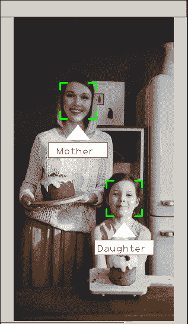

来自 [Pexels](https://www.pexels.com/photo/a-mother-and-daughter-holding-easter-cakes-set-on-wooden-boards-3992526/?utm_content=attributionCopyText&utm_medium=referral&utm_source=pexels) 的 [cottonbro](https://www.pexels.com/@cottonbro?utm_content=attributionCopyText&utm_medium=referral&utm_source=pexels) 的视频

# 摘要

在这篇文章中，我们将尝试一些在 [**计算机视觉**](https://www.sas.com/en_us/insights/analytics/computer-vision.html#:~:text=Computer%20vision%20is%20a%20field,to%20what%20they%20%E2%80%9Csee.%E2%80%9D) 和 [**机器学习**](https://expertsystem.com/machine-learning-definition/#:~:text=Machine%20learning%20is%20an%20application,use%20it%20learn%20for%20themselves.) 中使用的内置方法。为了检测个人，选择了 [**Haar-like 特征**](https://en.wikipedia.org/wiki/Haar-like_feature#:~:text=Haar%2Dlike%20features%20are%20digital,first%20real%2Dtime%20face%20detector.) 算法，对于人脸识别，一种基于构建局部二值模式直方图的方法已经在 [**我之前的作品**](https://medium.com/swlh/local-binary-pattern-algorithm-the-math-behind-it-%EF%B8%8F-edf7b0e1c8b3) 中描述过。

# 理论

## 1-数字图像

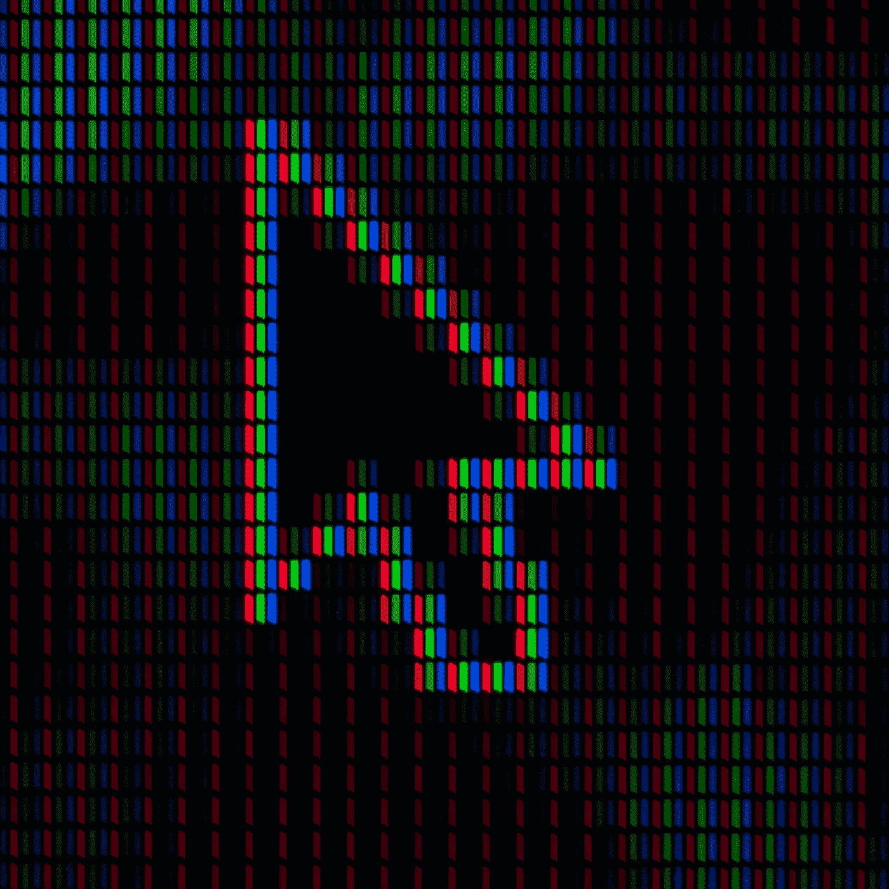

[翁贝托](https://unsplash.com/@umby?utm_source=medium&utm_medium=referral)在 [Unsplash](https://unsplash.com?utm_source=medium&utm_medium=referral) 上拍照

**什么是像素的简单定义？**

> “像素是数字世界中视觉信息的最小单位。每一张数码照片、插图、视频和游戏都是由像素构成的，这些像素往往是完美的圆形或方形”[1]。

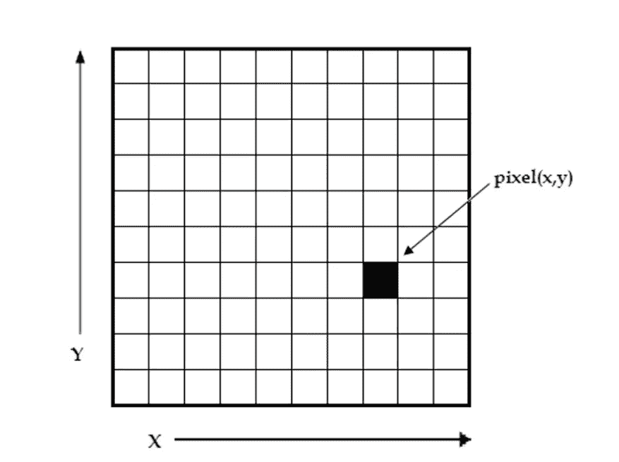

数字图像是像素的 2D 阵列。每个像素由其(x，y)坐标和值来表征。[2]

对于灰度图像，每个 **8 位**像素的亮度值在**0-255**之间，这样 **0** 代表黑色像素**，**和 **255** 代表白色像素**。**

******由******三个*** [***通道***](https://en.wikipedia.org/wiki/Channel_(digital_image))***【RGB】***如下图所示:*******

****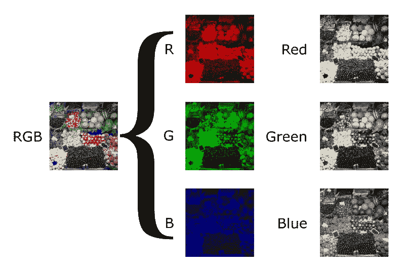****

****3 幅灰度图像的 RGB 合成[3]****

******最终图像**通过将这三个(RGB)通道组合成一个单一通道显示在计算机屏幕上。****

> ****关于**图像**和**色彩空间**的更多信息，你可以随时参考我之前的帖子【4】。****

## ****2-什么是对象检测？****

****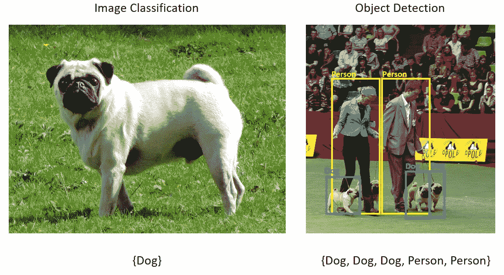****

****来源[5]****

******对象检测**是一种在计算机视觉和图像处理中使用的方法，用于在数字图像和视频中发现特定类别的对象(如猫、狗或人)的实例。****

****每一个 [**对象**](https://en.wiktionary.org/wiki/entity) 类都有自己特殊的 [**特征**](https://en.wikipedia.org/wiki/Feature_(computer_vision)) ，这有助于对类进行分类——例如，所有的 [**圆**](https://en.wikipedia.org/wiki/Circle) 都是**圆**。对象类别检测使用这些特殊功能。例如，当寻找圆时，寻找与一点(即中心)相距特定距离的对象。同样，在寻找**正方形**时，需要在角处[](https://en.wikipedia.org/wiki/Perpendicular)****垂直且**边长**相等的物体。类似的方法被用于面部识别[](https://en.wikipedia.org/wiki/Facial_recognition_system)**，其中可以找到眼睛、鼻子和嘴唇，并且可以找到 [**特征**](https://en.wikipedia.org/wiki/Feature_(computer_vision)) ，如肤色和两眼之间的距离。[6]**********

******物体检测**广泛应用于计算机任务视觉，如**人脸检测**，视频物体分割，如下图所示:****

****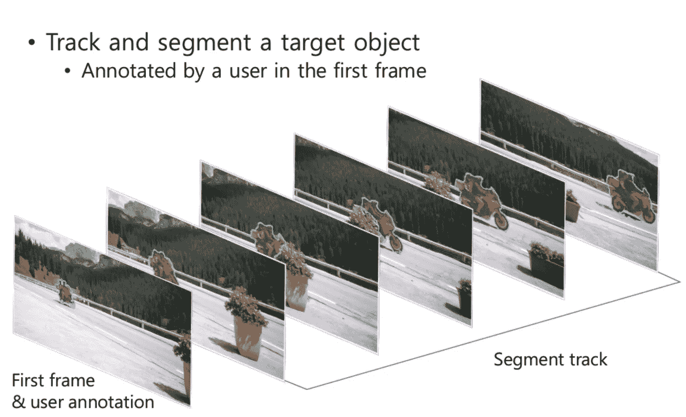****

****半监督视频对象分割[7]****

## ****2-什么是人脸检测？****

****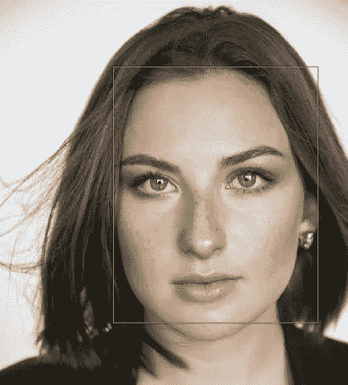****

****照片由[安娜斯塔西娅·巴芙洛娃](https://unsplash.com/@pinkkilla?utm_source=medium&utm_medium=referral)在 [Unsplash](https://unsplash.com?utm_source=medium&utm_medium=referral) 上拍摄****

****F **人脸检测**是**根据某些特定特征(肤色、鼻子、眼睛、嘴巴……)从任何给定的图像、视频、摄像头……中找到**和**提取**人脸的行为。[8]****

****由**保罗·维奥拉**和**迈克尔·琼斯**在**2001**【9】中提出的方法，至今仍然重要。该算法允许检测各种对象，但主要集中在**人脸检测、**图像和视频上…****

****这种方法使用哈尔 的 [**符号——一组明暗区域的基本组合。如下图所示，标志分为三种类型:**边缘**、**线形、**和**中央**特征。**](https://en.wikipedia.org/wiki/Haar-like_feature)****

****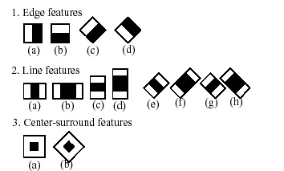****

****哈尔特征的类型[10]****

****所以如果在图像中发现它所在的区域，如果有足够的迹象，那么这个物体就可以被认为发现了。例如，众所周知，上脸颊和鼻子比人眼区域更亮。****

****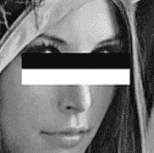****

****[**蕾娜**](https://en.wikipedia.org/wiki/Lenna) 。****

****每个**特征**通过从**黑色矩形**下的像素总和中减去白色矩形**下的像素总和**来计算。[11]这些值是积分图像中与输入图像中矩形的角一致的像素。下图展示了这一点。[12]****

****************

****作者图片****

******Viola-Jones 算法总结:******

*   ****[**中的图像采用了积分表示法**，](https://en.wikipedia.org/wiki/Summed-area_table)从而可以快速计算出所需的物体；****
*   ****使用 [**Haar-like 特征**](https://en.wikipedia.org/wiki/Haar-like_feature) ，有搜索期望的对象(在此上下文中，实体及其特征)；****

****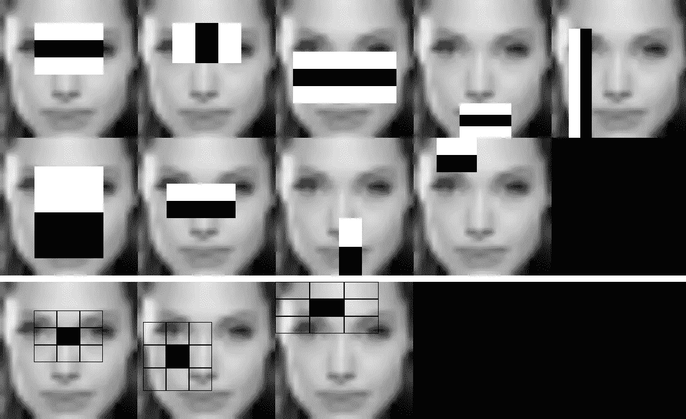****

****来源**【13】******

*   ****[**Boosting**](https://en.wikipedia.org/wiki/Boosting_(machine_learning))**用于(改进、放大)在图像的给定部分选择最适合所需对象的特征；******

******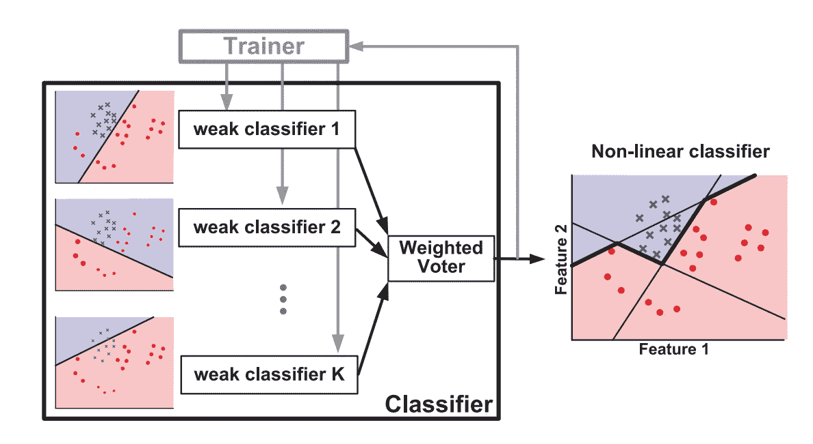******

******基于多个弱线性分类器创建强分类器的 AdaBoost 算法的图示。[14]******

*   ******将量词组合成 [**级联** **结构**](https://en.wikipedia.org/wiki/Cascading_classifiers) ，给出结果“真”或“假”；******

******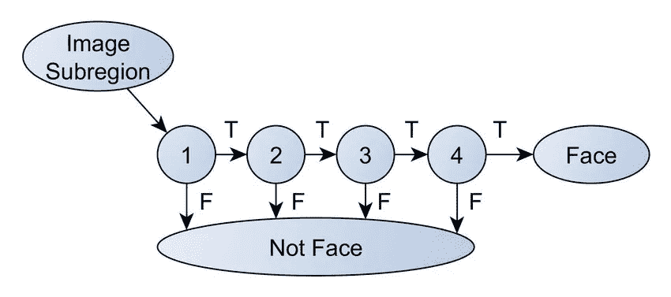******

******级联分类器图解[15]******

> ******要了解更多信息，你可以阅读[这篇](https://medium.com/@mahmoudharmouch/haar-cascade-classifiers-in-opencv-explained-visually-f608086fc42c)帖子，讨论更多关于 viola jones 算法的内容。******

## ******3-什么是人脸识别？******

******在给定帧(图像)上应用**人脸检测**之后， [**人脸识别**](https://en.wikipedia.org/wiki/Facial_recognition_system) 算法试图找到该提取的人脸与数据库中的人脸(训练样本/图像)的某种匹配。******

******面部识别算法列表:******

******1-[**LBPH**](https://en.wikipedia.org/wiki/Local_binary_patterns)
2-[**eigen faces**](http://www.scholarpedia.org/article/Eigenfaces)
3-[**fisher faces**](http://www.scholarpedia.org/article/Fisherfaces)
**SIFT**
5-[**SURF**](https://en.wikipedia.org/wiki/Speeded_up_robust_features)******

******每种算法都有自己的指令集和规则，以便识别给定图片中的人脸。******

******如题所述，我们的人脸识别程序是基于我之前的帖子**(**[**LBP**](https://medium.com/swlh/local-binary-pattern-algorithm-the-math-behind-it-%EF%B8%8F-edf7b0e1c8b3)**)**中描述的 **LBPH** 方法。******

## ******特征抽出******

******在前一篇文章中，我们已经讨论了一种基本类型的局部描述符( **LBP** )以及它是如何计算的。现在的问题是:“下一步是什么？”******

*   ******将人脸图像分成 R 个(例如 R = 8×8 = 64 个区域)局部区域以提取 LBP 直方图。******

******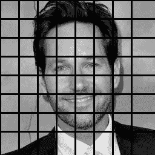******

******作者图片[17]******

*   ******从每个子区域提取的 LBP 直方图用于计算，并组合成单个直方图，其空间高级特征定义为:******

******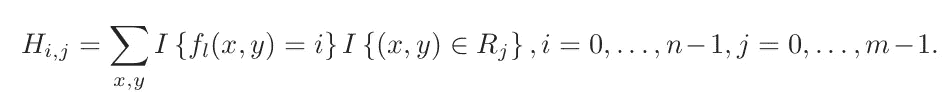******

******LBP 图像的直方图公式[16]******

******其中:******

> ********n:** 是 LBP 操作员生成的不同标签的数量。******
> 
> ********m:** 是子区域的个数。******

******并且 I{…}定义如下:******

******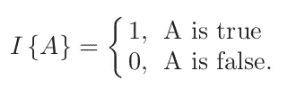******

******二元函数******

******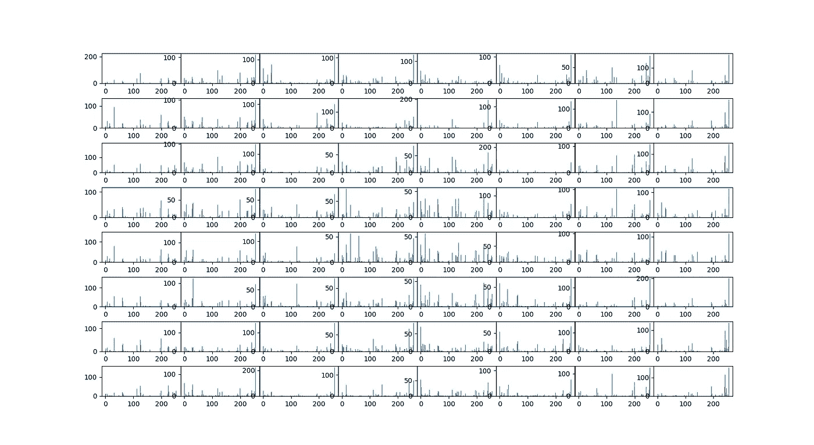******

******每个子区域的直方图[18]******

*   ******最近邻分类器用于将新图像与训练模板进行匹配，训练模板通过以下公式之一计算:******

******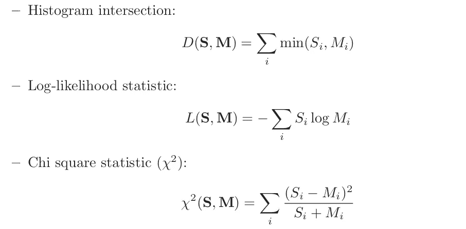******

******几种可能的相异度[19]******

******其中 **S** 和 **M** 是两个 **LBP** 直方图。******

******从列表中搜索最佳匹配直方图也可以通过计算新的和可用直方图之间的[**欧几里德距离**](https://en.wikipedia.org/wiki/Euclidean_distance#:~:text=In%20mathematics%2C%20the%20Euclidean%20distance,metric%20as%20the%20Pythagorean%20metric.) 来实现:******

************

******来自[维基百科](https://en.wikipedia.org/wiki/Euclidean_distance#:~:text=In%20mathematics%2C%20the%20Euclidean%20distance,metric%20as%20the%20Pythagorean%20metric.)的直方图之间的距离******

> ******特征提取到此为止。******

******接下来的识别过程如下:
a-在程序中添加新的图像进行人脸识别。
b-该识别器为新图像生成 LBP 直方图。
c)然后将该直方图与现有直方图进行比较。
d)最后，它找到最佳匹配，并返回与这个最佳匹配相关联的标签 person。******

************

# ******Python 实现******

> ******为了实现这个项目，我决定选择 python 作为我最喜欢的编程语言，因为它在计算机视觉和机器学习领域非常受欢迎。******

******在运行该程序之前，您需要安装以下必需的库:******

```
******-----------------------------OpenCV---------------------------------# OpenCV with conda
conda install -c conda-forge opencv# Update pip :package manager for Python packages
pip install -U pip 
pip show pip# OpenCV with pip
pip install opencv-python  
pip install opencv-contrib-python# Install pip3 :package manager for Python3 packages
sudo apt-get -y install python3-pip
# OpenCV with pip3
pip3 install opencv-python
pip3 --version--------------------------Numpy library-----------------------------# With conda
conda update conda # update conda
conda install -c anaconda numpy# with pip, pip3
pip install numpy
pip3 install numpy******
```

## ******用于人脸检测的 Python 代码******

******使用 Python 和 OpenCV 的级联类型分类器来执行人脸检测。******

******点击 [**此处**](https://docs.opencv.org/trunk/db/d28/tutorial_cascade_classifier.html) 获取 **OpenCV** 提供的官方教程，该教程有三种不同语言版本: **Python** 、 **C++** 、 **Java** 。******

******为对象检测创建一个**级联分类器**类的实例:******

```
******cascade_file_path = "path for certain cascade file (xml extension)" 
face_cascade = cv2.CascadeClassifier(cascade_file_path)******
```

******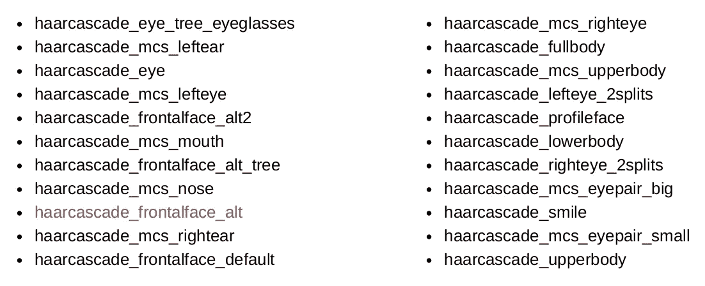******

******OpenCV 中可用的预训练模型列表******

******`**detectMultiScale**`-检测人脸和物体的功能。为了让函数准确地搜索人脸，我们将它传递给相应的级联。******

******函数`**detectMultiScale**`带 **7** 个参数，其中只有 **4** 个重要参数:******

```
******void cv::CascadeClassifier::detectMultiScale(
InputArray **image**,                                         std::vector< Rect > & **objects**,
double **scaleFactor** = 1.1,
int **minNeighbors** = 3,
int **flags** = 0,
Size **minSize** = Size(),
Size **maxSize** = Size() )******
```

*   ******`**ScaleFactor**` -一个参数，表示在每个图像比例下图像尺寸缩小了多少。例如，“1.1”意味着将尺寸减小 10%，**增加**尺寸与**检测**找到的特征相匹配的**可能性**。******

******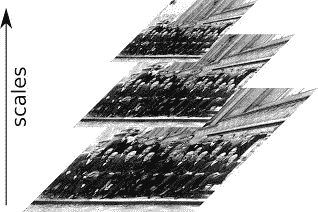******

******图像金字塔[20]******

*   ******`**minNeighbors**` -该参数影响检测到的人脸质量。值越高，检测越少，但质量越高。`**3~6**`是人脸检测的好值。******
*   ******`**minSize**` -被探测物体的最小可能尺寸。尺寸较小的对象将被忽略。通常情况下，`**[30, 30]** is a`适用于人脸检测。******
*   ******`**maxSize**` -物体的最大可能尺寸。尺寸较大的对象会被忽略。默认情况下，人脸检测没有上限。******

******该函数的返回值是:******

> ******一个 **NumPy** **数组**如果人脸检测成功。[[x，y，宽度，高度]]******
> 
> ******或者如果没有检测到任何东西，则为空的 **元组****。( )********

```
******image_path ="absolute or relative path for a given image"
image = cv2.imread(image_path)
gray = cv2.cvtColor(image, cv2.COLOR_BGR2GRAY)
faces = face_cascade.detectMultiScale(
    gray,
    scaleFactor= 1.1,
    minNeighbors= 4,
    minSize=(30, 30)
)******
```

******检测人脸后，程序搜索**右眼(白色矩形)**，搜索**左眼(黄色矩形)**，如图所示:******

******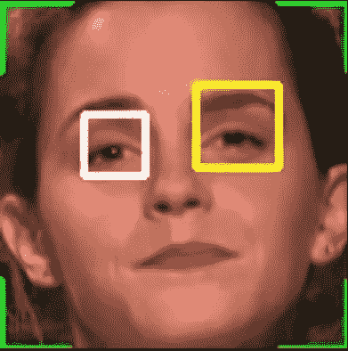******

******检测到的面部和眼睛******

******找到眼睛的**中心**后，程序执行使用以下公式计算的角度 **θ** 的旋转:******

******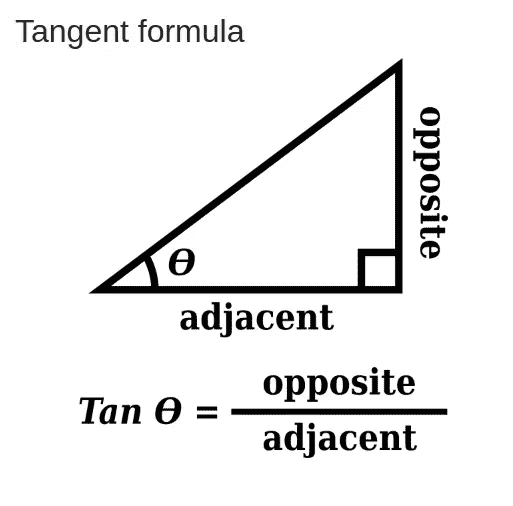******

******切线公式[来源](https://freesvg.org/tangent-formula)******

******根据谷歌[21]的说法，人脸对齐使其人脸识别模型 [FaceNet](https://sefiks.com/2018/09/03/face-recognition-with-facenet-in-keras/) 的准确度从 98.87 提高到 99.63。******

******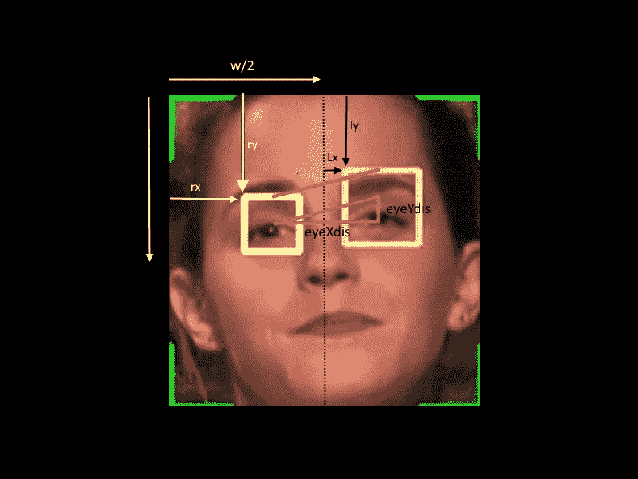******

******旋转角******

******为了找到旋转角度，程序需要“ **eyeXdis”(相邻)**和“ **eyeYdis”(相对)**的值，计算如下:******

```
******eyeXdis = (lx + w / 2 + lw / 2) - (rx + rw / 2)
eyeYdis = (ly + lh / 2) - (ry + rh / 2)
angle_rad = np.arctan (eyeYdis / eyeXdis)
# convert rad to degree
angle_degree = angle_rad * 180 / np.pi******
```

******找到对准角度的值后，可以借助 **OpenCV** 提供的“**warpAffine】**和**“getrotationmatrix 2d】**方法进行旋转。******

```
******# Find the center of the image
image_center = tuple(np.array(gray_chunk.shape) / 2)rot_mat = cv2.getRotationMatrix2D(image_center, angle_degree, 1.0)
rotated_image = cv2.warpAffine(gray_chunk, rot_mat,gray_chunk.shape, flags=cv2.INTER_LINEAR)******
```

********cv2.warpAffine** 方法有三个主要参数******

> ******1-原始图像: **gray_chunk********
> 
> ******2-转换矩阵，在这种情况下，旋转矩阵: **rot_mat********
> 
> ******3-具有输出图像尺寸的元组: **gray_chunk.shape********

******此方法返回旋转后的图像。******

******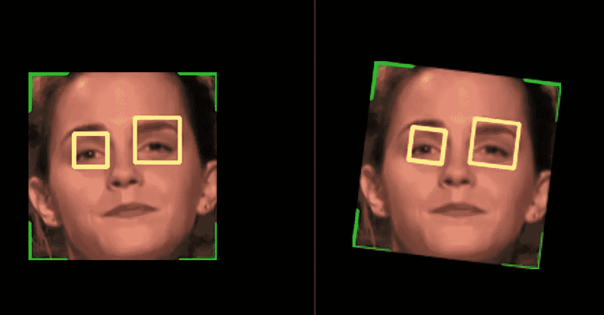******

******对齐前后******

******现在，旋转后的图像将保存到一个特定的文件夹(数据集)中，带有照片号(计数器)和主题 ID。
重复该过程，直到捕获 50 个面部图像。稍后，这些样本将被输入到一个用于训练目的的模型中。******

******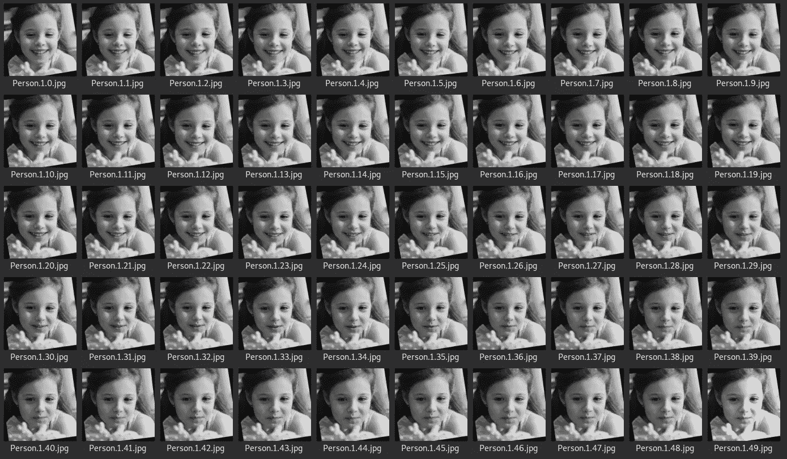******

******训练样本******

## ******模特培训******

******这时，需要指出在程序中使用哪种识别方法，即局部二值模式直方图的方法。这可以通过以下方法实现。******

```
******recognizer = cv2.face.LBPHFaceRecognizer_create(
int radius = 1,
int neighbors = 8,
int grid_x = 8,
int grid_y = 8)******
```

********1-半径**:“用于构建圆形局部二进制模式的半径。半径越大，图像越平滑，但可以获得更多的空间信息。”*【22】*******

********2- Neighbors** :“构建圆形局部二进制模式的样本点数量。一个合适的值是使用`8`采样点。请记住:你包含的样本点越多，计算成本就越高。”*【22】*******

********3- Grid_x** :“水平方向的单元格个数，8 是出版物中常用的数值。单元越多，网格越细，得到的特征向量的维度越高。”*【22】*******

******4- **Grid_y** :“垂直方向的单元格个数，8 是出版物中常用的数值。单元越多，网格越细，得到的特征向量的维度越高。”*【22】*******

********接下来**，程序根据每个图像的名称(在 users_name.txt 文件中)在**数据集**文件夹中找到所有图像，将这些图像转换成数组，然后将它们和它们的 ID 传递给识别器进行训练。之后，模型创建一个格式化文件”。yaml”，包含相应的直方图及其标签([监督学习](https://en.wikipedia.org/wiki/Supervised_learning#:~:text=Supervised%20learning%20is%20the%20machine,a%20set%20of%20training%20examples.))，用于进一步的识别目的。******

********程序工作流程********

******我们在这个部分使用 2 个脚本:
**a-数据收集和训练:********

```
******python3 Train.py -v videos/video3.mkv # if you have a pre-recorded #video
python3 Train.py -c 0 # 0 is the id of the built-in camera******
```

******现在程序会询问这个人的名字:******

******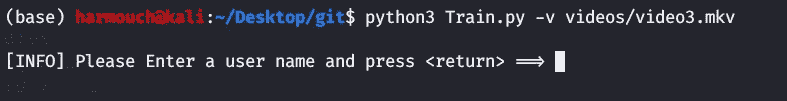******

******作者图片******

******然后，程序会生成一个 **users_name.txt** 文件来保存这个人的名字和他的 id。******

******现在，捕获过程将开始:******

******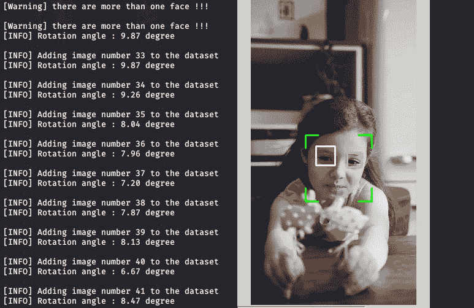******

******捕捉图像******

******捕获 50 个样本后，如主功能中所述，训练阶段将开始:******

******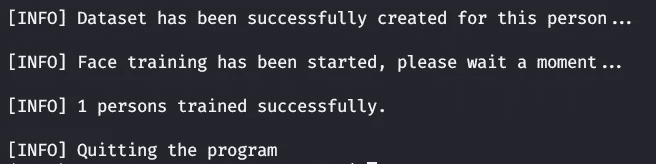******

******模特培训******

******这将生成“火车”。YAML”文件，该文件包含直方图及其标签:******

******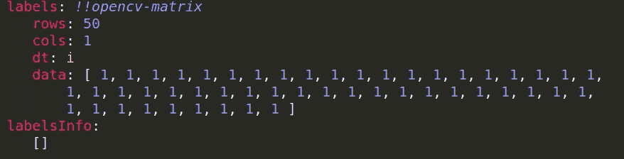******

******“train.yaml”文件的底部******

******现在你可以进入程序的主要操作，即人脸识别:******

********b 面识别:********

```
******python3 Recognize.py -v videos/video3.mkv # if you have a pre-recorded #video
python3 Recognize.py -c 0 # 0 is the id of the built-in camera******
```

******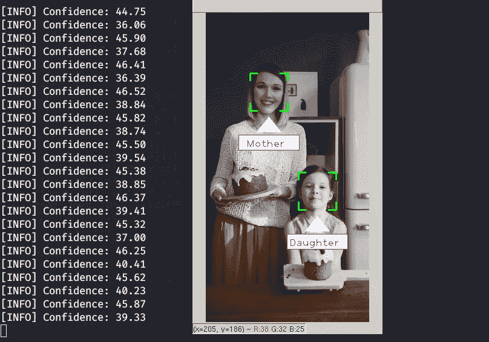******

> ******注意**置信度**小于 100。**较低的置信度**意味着这张脸与训练过的脸更加**相似**。“0”完全匹配。******
> 
> ******现在，我已经为这个程序添加了一个新的功能，即当 haar cascade 检测不到人脸时，它将被我以前的帖子[8]中描述的肤色阈值算法检测到******

******要在任意图像上书写文本，可以使用函数[23]:******

```
******putText (image, text, coordinates, font type, font scale,color [, pen thickness [, line type [, center of coordinates]]])******
```

******它采用以下参数:******

*   ********框架** —我们要在其上书写文本的图像；******
*   ********文本**—我们要在框架上显示的文本；******
*   ********坐标** —文本左下角两个坐标的元组，例如(1，5)；******
*   ********字体类型** —下面指出的常量之一；******
*   ********字体大小** —字体大小。例如，将字体增大三倍—放 2，减小三倍—0.3；******
*   ********颜色** —从 0 到 255 的三个数字的元组，指定 RGB 模型中的颜色。绿色— (0，255，0)；******
*   ********笔厚**是可选参数；******
*   ********线型** —可选参数，三值之一:LINE_8 虚线小，LINE_4 虚线大，LINE_AA 为平滑线；******
*   ********坐标中心**是可选参数。默认情况下，文本的坐标从左上角开始计算。******

******字体类型:******

*   ******字体 _ 好时 _ 单纯形******
*   ******FONT_HERSHEY_PLAIN******
*   ******FONT_HERSHEY_DUPLEX******
*   ******FONT _ HERSHEY _ 复杂******
*   ******FONT_HERSHEY_TRIPLEX******
*   ******FONT _ 好时 _COMPLEX_SMALL******
*   ******字体 _ 好时 _ 脚本 _ 单纯形******
*   ******FONT _ HERSHEY _ SCRIPT _ 复杂******

******一个**功能**，用于在检测到的人脸周围绘制一个**自定义**矩形；******

```
******def Draw_Rect(self,Image,face,color):
        x,y,w,h = face
        # line 1 : top left corner horizontal line 
        cv2.line(Image, (x, y), (int(x + (w/5)),y), color, 2)
        # line 2 : top right corner horizontal line 
        cv2.line(Image, (int(x+((w/5)*4)), y), (x+w, y), color, 2)
        # line 3 : top left corner vertical line 
        cv2.line(Image, (x, y), (x,int(y+(h/5))), color, 2)
        # line 4 : top right corner vertical line 
        cv2.line(Image, (x+w, y), (x+w, int(y+(h/5))), color, 2)
        # line 5 : bottom left corner vertical line 
        cv2.line(Image, (x, int(y+(h/5*4))), (x, y+h), color, 2)
        # line 6 : bottom left corner horizontal line 
        cv2.line(Image, (x, int(y+h)), (x + int(w/5) ,y+h), color,2)
        # line 6 : bottom right corner horizontal line 
        cv2.line(Image,(x+int((w/5)*4),y+h),(x + w, y + h),color, 2)
        # line 6 : bottom right corner verticals line 
        cv2.line(Image, (x+w, int(y+(h/5*4))), (x+w, y+h), color, 2)******
```

******OpenCV 提供了一个**函数**用于预测新图像的标签:******

```
******id, confidence = recognizer.predict(gray_scale_face)******
```

******它将捕获的要分析的人脸部分作为参数，并返回其 id 和置信度值。******

********程序的汇总流程:**
1。捕捉图像。
2。利用 Haar-like 特征分类器提取人脸区域。
3。将图像旋转一定角度。
4。使用 FaceRecognizer (train())将图像和标签作为训练数据进行训练。
5。对所有训练图像重复步骤 1 至 4。
6。加载测试图像进行识别。
7。使用 Haar-like 特征分类器提取人脸区域。
8。将面部区域调整到某个大小。
9。使用 FaceRecognizer 预测(predict())测试图像[id，confidence]。
10。对所有测试图像重复 6 至 9。******

************

# ******结论******

******面部识别是迄今为止最重要的技术之一，广泛应用于医疗保健、广告、安全、支付等许多领域。******

******根据 Grand View Research，Inc .的一项新研究，全球 [**生物识别技术市场**](https://www.grandviewresearch.com/industry-analysis/biometrics-industry?utm_source=prnewswire.com&utm_medium=referral&utm_campaign=PRN_Apr18_biometrics-technology_RD1&utm_content=Content) 的规模到 2025 年可能达到**593.1 亿美元，在预测期内经历了 19.5%** 的 **CAGR。[27]********

******该程序的源代码可以在下面找到:******

******[](https://github.com/Harmouch101/Face-Recogntion-Detection) [## harmouch 101/人脸识别检测

### 这个项目实现了一个人脸检测算法，使用皮肤分割 RGB-YCrCb-HSV，viola jones 和人脸…

github.com](https://github.com/Harmouch101/Face-Recogntion-Detection) 

## 📚文献，有用的资源:

【1】Shutterstock 的，[什么是像素？](https://www.shutterstock.com/support/article/what-is-a-pixel#:~:text=Short%20for%20%22pixel%20element%22,,be%20perfectly%20round%20or%20square.) (2020)

[2] M.Lyra，A.Ploussi 和 A.Georgantzoglou， [MATLAB 作为核医学图像处理的工具](https://www.researchgate.net/publication/221918148_MATLAB_as_a_Tool_in_Nuclear_Medicine_Image_Processing) (2011)，MATLAB——实用工程师的普遍工具，第 23 章。

[3] Wikiwand，[灰度为单通道的多通道彩色图像。](https://www.wikiwand.com/en/Grayscale)

[4] M.Harmouch，[利用阈值分类器进行人体肤色分类:RGB，YCbCr，HSV(Python 代码)](https://medium.com/swlh/human-skin-color-classification-using-the-threshold-classifier-rgb-ycbcr-hsv-python-code-d34d51febdf8)，(2020)

[5]微软，[教程:在 ML.NET 使用 ONNX 检测物体。](https://docs.microsoft.com/en-us/dotnet/machine-learning/tutorials/object-detection-onnx) (2020)

[6] Dasiopoulou，Stamatia 等.[知识辅助的语义视频对象检测](http://www.iti.gr/~bmezaris/publications/csvt05.pdf)。IEEE 视频技术电路和系统汇刊 15.10(2005):1210–1224。

[7] NAVER Engineering，[视频中的视频对象分割](https://www.slideshare.net/NaverEngineering/video-object-segmentation-in-videos) (2017)，幻灯片-5

[8] M.Harmouch，[使用肤色阈值的人脸检测(RGB-YCrCb): Python 实现(](https://medium.com/swlh/face-detection-using-skin-tone-threshold-rgb-ycrcb-python-implementation-2d4f62d376f1) 2020)

[9] P.Viola 和 M.Jones，[鲁棒实时对象检测](http://citeseerx.ist.psu.edu/viewdoc/download;jsessionid=D45E774ABB25CDF248EB84EE8ACFD92A?doi=10.1.1.110.4868&rep=rep1&type=pdf) (2001)，第二届统计和计算国际研讨会

[10] M. Ameen Chhajro，Kamlesh Kumar，M. Malook Rind，Aftab Ahmed Shaikh，Haque Nawaz 和 Rafaqat Hussain Arain，[使用基于 Haar 的级联分类器的驾驶员辅助系统行人检测方法](https://www.researchgate.net/publication/326181724_Pedestrian_Detection_Approach_for_Driver_Assisted_System_using_Haar_based_Cascade_Classifiers) (2018)，国际高级计算机科学与应用杂志。

[11] Alexander Mordvintsev 和 Abid K .，[使用哈尔级联进行人脸检测](https://opencv-python-tutroals.readthedocs.io/en/latest/py_tutorials/py_objdetect/py_face_detection/py_face_detection.html) (2013 年)

[12] Helvig Jensen，[实现 Viola-Jones 人脸检测算法。P-11](https://pdfs.semanticscholar.org/40b1/0e330a5511a6a45f42c8b86da222504c717f.pdf) (2008 年)，孔根斯·林比·IMM，理学硕士，2008-93 年

[13]*StevenPuttemans but Packt，* [级联分类器训练](https://docs.opencv.org/master/dc/d88/tutorial_traincascade.html)。

[14]王卓、张金涛和纳文·维尔马，[通过在 ADC 内直接实现矩阵乘法实现低能耗分类系统](https://www.researchgate.net/publication/288699540_Realizing_Low-Energy_Classification_Systems_by_Implementing_Matrix_Multiplication_Directly_Within_an_ADC) (2015)，IEEE 生物医学电路与系统汇刊

[15] W.S .马达·桑佳亚，迪亚赫·昂格拉尼，基基·扎卡里亚，阿蒂普·朱瓦迪，马迪那图尔·穆纳瓦洛，[人机交互的人脸识别和跟踪设计](https://www.researchgate.net/publication/323057610_The_design_of_face_recognition_and_tracking_for_human-robot_interaction)，(2017)，图 4。级联分类器插图。

[16] Timo Ahonen，Abdenour Hadid 和 Matti Pietik ainen，[使用局部二元模式的人脸识别](https://link.springer.com/content/pdf/10.1007%2F978-3-540-24670-1_36.pdf) (2004)，第 472 页

[17][18] M.Harmouch，[人脸识别检测](https://github.com/Harmouch101/Face-Recogntion-Detection/blob/master/feature_lbp.py)，(2020)，GitHub

[19] Timo Ahonen、Abdenour Hadid 和 Matti Pietik ainen，[使用局部二元模式进行人脸识别](https://link.springer.com/content/pdf/10.1007%2F978-3-540-24670-1_36.pdf) (2004)，LBP 直方图的几种可能的相异度测量，p-472。

[20] *F .科马奇，* [维奥拉-琼斯人脸检测](https://sites.google.com/site/5kk73gpu2012/assignment/viola-jones-face-detection#TOC-Image-Pyramid) (2012)

[21] Omkar M. Parkhi，Andrea Vedaldi 和 Andrew Zisserman，[深度人脸识别海报。](https://www.robots.ox.ac.uk/~vgg/publications/2015/Parkhi15/poster.pdf)

[22] OpenCV，[cv::face::lbphfacecognizer 类引用](https://docs.opencv.org/3.4/df/d25/classcv_1_1face_1_1LBPHFaceRecognizer.html#ac33ba992b16f29f2824761cea5cd5fc5)

[23] OpenCV 文档，[绘图功能](https://docs.opencv.org/2.4/modules/core/doc/drawing_functions.html)(2011–2014)

[24] OpenCV，[几何图像变换](https://docs.opencv.org/2.4/modules/imgproc/doc/geometric_transformations.html#geometric-image-transformations)(2011–2014)

[25]阿拉莱克，[哈尔级联分类器](https://github.com/opencv/opencv/tree/master/data/haarcascades)，Github (2013)

[26] Quora，[OpenCV Python 中最好的人脸识别算法是哪个？](https://www.quora.com/Which-is-the-best-face-recognition-algorithm-in-OpenCV-Python)，(2016)

[27] Sherry James，[生物识别技术市场规模到 2025 年价值 593.1 亿美元:大观研究公司](https://www.prnewswire.com/news-releases/biometrics-technology-market-size-worth-59-31-billion-by-2025-grand-view-research-inc-300834463.html) (2019)******