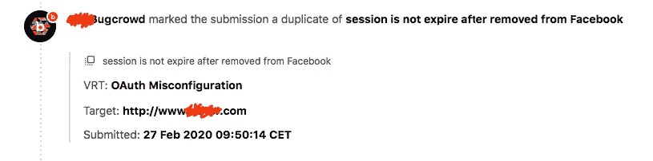
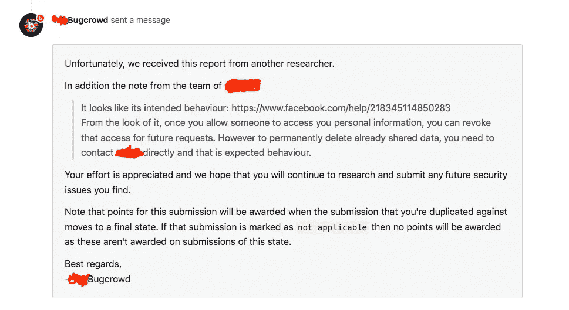

# FaceBook 配置错误。OAuth

> 原文：<https://blog.devgenius.io/facebook-misconfiguration-oauth-c0227beb6f62?source=collection_archive---------1----------------------->

## **server _ security _ misconfiguration . oauth _ misconfiguration**

由[格伦·凯莉](https://unsplash.com/@glencarrie?utm_source=medium&utm_medium=referral)在 [Unsplash](https://unsplash.com?utm_source=medium&utm_medium=referral) 拍摄的照片

> 什么是 OAuth 错误配置？
> 
> 安全配置错误。漏洞描述:OAuth 2.0 是**一个 Web 应用的授权框架**。它向请求它的网站验证用户的身份，而不泄露网站的密码。

## 介绍

几天前，当我和我的搭档在做一个周末度假的飞机低价机票的快速调查时，我注意到她正在使用一个著名的公司应用程序做这类事情。我知道这个特定的应用程序不是因为他们的服务，而是因为我在过去发现了许多漏洞。

该应用程序允许用户使用经典的基于密码的机制登录，或者使用 OAuth 将他们的帐户链接到社交媒体档案。

## 故事

我的合伙人不知道我以前在这家公司的经历。出于无知，我信任这个应用程序，以至于使用我的个人脸书帐户登录。

我不太喜欢用这种方法登录网络应用，这就是为什么我的第一步是撤销它的令牌，只使用普通电子邮件创建一个帐户。但是试了两次之后，我发现有些不对劲。即使删除了 web 应用令牌，它仍显示此应用仍可访问脸书帐户。这就是我们所说的 **OAuth 误配置**，在很多情况下，这会让你得到报酬。我做到了。

## 我是这样做的:

1.  使用脸书帐户登录“*公司*”网络应用程序
2.  在脸书控制应用程序面板中删除并撤销对“*公司*”的任何权限
3.  现在你的“*company.com*”账户应该可以让你立即退出

正如我之前所说，这种情况(**步骤 3** )从未发生过。这就是为什么我发了一份报告通知公司这个漏洞，就像你从下面的截图看到的那样。

令我惊讶的是，我并不是第一个向公司报告这种漏洞的人。

你可能会问自己，脸书和这有什么关系？我把报告发给了公司，认为是他们那边做错了什么。事实证明这是脸书的错。以至于他们把报告改成了不适用。

我试图与脸书取得联系，为了这篇文章。这么说吧，他们基本上告诉我这不是他们的错，而是公司的错。他们只是不停地来回传球。

## 摘要

虽然我这次举报没有得到奖励。如果发现这种漏洞，应该举报。就我而言，有两件事出了差错。首先，这是一个副本，最终，脸书是有问题的公司，而不是相反。