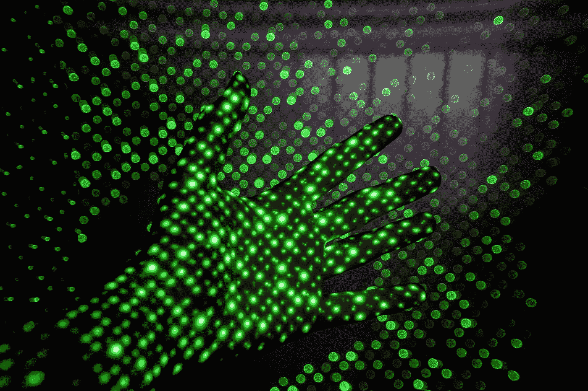

# Python 中基于 AWS 识别的人脸情感检测

> 原文：<https://blog.devgenius.io/facial-emotion-detection-using-aws-rekognition-in-python-69b2da668192?source=collection_archive---------4----------------------->



乔希·里默尔在 [Unsplash](https://unsplash.com?utm_source=medium&utm_medium=referral) 上的照片

# AWS 识别

Amazon Rekognition 使用成熟的、高度可扩展的深度学习技术，无需使用机器学习专业知识，就可以轻松地将图像和视频分析添加到您的应用程序中。

我们将看到如何使用这个服务从图像中检测人脸和人脸上的情绪。

# 人脸检测

首先，我们将了解如何检测图像中的人脸。为了访问 AWS Rekognition，我们将使用 python 包 *boto3* 。移民局

使用以下命令安装 *boto3* :

```
pip install boto3
```

要使用*重新识别*服务，

```
import boto3rekognition = boto3.client('rekognition',aws_access_key_id=AWS_ACCESS_KEY,
             aws_secret_access_key=AWS_SECRET_KEY,
             region_name=AWS_REGION)
```

我们将使用本地存储中的图像。Rekogntion 有一个函数 *detect_faces()* 从图像中检测所有的人脸。

```
with open('file.png', 'rb') as image_data:
     response_content = image_data.read()rekognition_response =
rekognition.detect_faces(Image={'Bytes':response_content}, Attributes=['ALL'])
```

如果你想从 S3 桶中检查一个图像，你可以传递桶名和文件密钥。

```
rekognition_response = rekognition.detect_faces(Image={'S3Object': {'Bucket': BUCKET_NAME, 'Name': file_key}}, Attributes=['ALL'])
```

*detect_faces()* 函数返回以下响应。

```
{
    'FaceDetails': [
        {
            'BoundingBox': {
                'Width': **...**,
                'Height': **...**,
                'Left': **...**,
                'Top': **...**
            },
            'AgeRange': {
                'Low': 123,
                'High': 123
            },
            'Smile': {
                'Value': **True|False**,
                'Confidence': **...**
            },
            'Eyeglasses': {
                'Value': **True|False**,
                'Confidence': **...**
            },
            'Sunglasses': {
                'Value': **True|False**,
                'Confidence': **...**
            },
            'Gender': {
                'Value': 'Male'**|**'Female',
                'Confidence': **...**
            },
            'Beard': {
                'Value': **True|False**,
                'Confidence': **...**
            },
            'Mustache': {
                'Value': **True|False**,
                'Confidence': **...**
            },
            'EyesOpen': {
                'Value': **True|False**,
                'Confidence': **...**
            },
            'MouthOpen': {
                'Value': **True|False**,
                'Confidence': **...**
            },
            'Emotions': [
                {
                    'Type': 'HAPPY'**|**'SAD'**|**'ANGRY'**|**'CONFUSED'**|**'DISGUSTED'**|**'SURPRISED'**|**'CALM'**|**'UNKNOWN'**|**'FEAR',
                    'Confidence': **...**
                },
            ],
            'Landmarks': [
                {
                    'Type': 'eyeLeft'**|**'eyeRight'**|**'nose'**|**'mouthLeft'**|**'mouthRight'**|**'leftEyeBrowLeft'**|**'leftEyeBrowRight'**|**'leftEyeBrowUp'**|**'rightEyeBrowLeft'**|**'rightEyeBrowRight'**|**'rightEyeBrowUp'**|**'leftEyeLeft'**|**'leftEyeRight'**|**'leftEyeUp'**|**'leftEyeDown'**|**'rightEyeLeft'**|**'rightEyeRight'**|**'rightEyeUp'**|**'rightEyeDown'**|**'noseLeft'**|**'noseRight'**|**'mouthUp'**|**'mouthDown'**|**'leftPupil'**|**'rightPupil'**|**'upperJawlineLeft'**|**'midJawlineLeft'**|**'chinBottom'**|**'midJawlineRight'**|**'upperJawlineRight',
                    'X': **...**,
                    'Y': **...**
                },
            ],
            'Pose': {
                'Roll': **...**,
                'Yaw': **...**,
                'Pitch': **...**
            },
            'Quality': {
                'Brightness': **...**,
                'Sharpness': **...**
            },
            'Confidence': **...**
        },
    ],
    'OrientationCorrection': 'ROTATE_0'**|**'ROTATE_90'**|**'ROTATE_180'**|**'ROTATE_270'
}
```

正如您在上面看到的，Rekognition 为图像中检测到的每个人脸提供了许多属性。

在这里，我们将使用边界框属性来确定从图像中检测到的人脸的尺寸。

要使用它，首先我们需要找到所用图像的精确宽度和高度。为此，我们将使用 Python 包 *Pillow(PIL)* 。

```
pip install Pillow from PIL import Imageimage = Image.open('file.png')
image_width, image_height = image.size
```

我们将从图像中裁剪掉所有的脸。Rekogntion 返回 0 到 1 之间的十进制小数形式的边界框值(例如，0.391559898853302)。所以，我们要把这些值作为整数。

```
i = 1
for item in rekognition_response.get('FaceDetails'):
    bounding_box = item['BoundingBox']
    print('Bounding box {}'.format(bounding_box))
    width = image_width * bounding_box['Width']
    height = image_height * bounding_box['Height']
    left = image_width * bounding_box['Left']
    top = image_height * bounding_box['Top']

    left = int(left)
    top = int(top)
    width = int(width) + left
    height = int(height) + top

    box = (left, top, width, height)
    box_string = (str(left), str(top), str(width), str(height))
    print(box)
    cropped_image = image.crop(box)
    thumbnail_name = '{}.png'.format(i)
    i += 1
    cropped_image.save(thumbnail_name, 'PNG')
```


原象


裁剪面 1


裁剪面 2

# 情感检测

现在，我们将检测面部表情。在来自 *detect_faces()* 函数的相同 Rekognition 响应中，我们得到了情感值。我们将解析 *FaceDetails* 属性来获取情绪。它将返回 7 种类型的情绪-快乐，平静，悲伤，愤怒，惊讶，困惑和厌恶，以及他们对每张脸的信心值。

举个例子，

```
'Emotions': [{
   'Type': 'CALM',
   'Confidence': 21.520294189453125
  }, {
   'Type': 'ANGRY',
   'Confidence': 1.0282570123672485
  }, {
   'Type': 'HAPPY',
   'Confidence': 1.2899268865585327
  }, {
   'Type': 'DISGUSTED',
   'Confidence': 0.8267041444778442
  }, {
   'Type': 'SAD',
   'Confidence': 0.14941808581352234
  }, {
   'Type': 'FEAR',
   'Confidence': 0.3257277309894562
  }, {
   'Type': 'CONFUSED',
   'Confidence': 3.0882787704467773
  }, {
   'Type': 'SURPRISED',
   'Confidence': 71.7713851928711
  }]
```

我们将解析这个响应，并获取具有最高置信度值的情感。

```
i = 1
for item in rekognition_response.get('FaceDetails'):
    bounding_box = item['BoundingBox']
    print('Bounding box {}'.format(bounding_box))
    width = image_width * bounding_box['Width']
    height = image_height * bounding_box['Height']
    left = image_width * bounding_box['Left']
    top = image_height * bounding_box['Top']

    left = int(left)
    top = int(top)
    width = int(width) + left
    height = int(height) + top

    box = (left, top, width, height)
    box_string = (str(left), str(top), str(width), str(height))
    print(box)
    cropped_image = image.crop(box)
    thumbnail_name = '{}.png'.format(i)
    i += 1
    cropped_image.save(thumbnail_name, 'PNG')

    face_emotion_confidence = 0
    face_emotion = None
    for emotion in item.get('Emotions'):
        if emotion.get('Confidence') >= face_emotion_confidence:
            face_emotion_confidence = emotion['Confidence']
            face_emotion = emotion.get('Type')
    print('{} - {}'.format(thumbnail_name, face_emotion))
```

我们通过面部表情得到以下数值。


惊讶的


幸福的

希望这篇教程有帮助。玩得开心。

继续编码！！！