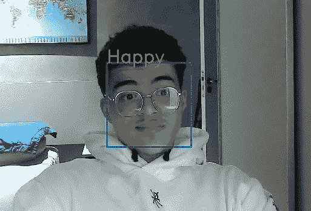
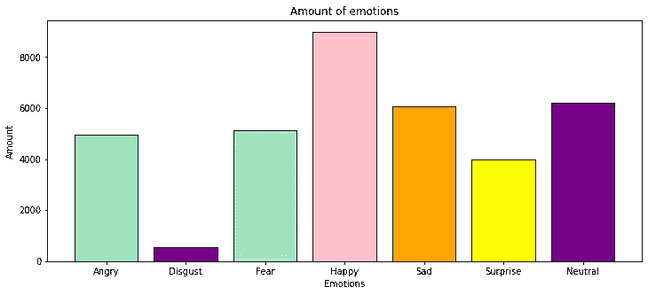
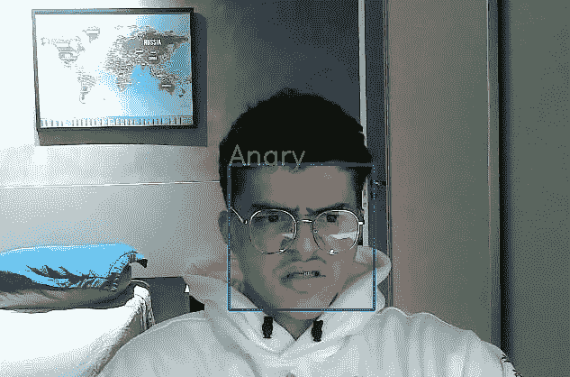
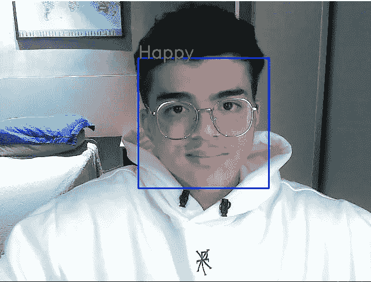
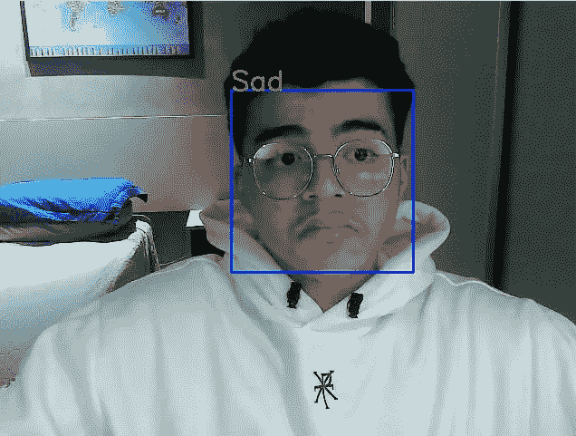
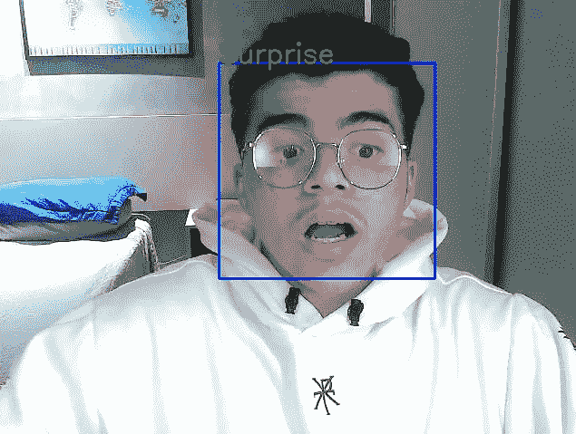

# 张量流人脸表情识别

> 原文：<https://blog.devgenius.io/facial-expression-recognition-with-tensorflow-90f6174163c3?source=collection_archive---------1----------------------->



我开始了作为机器学习工程师的旅程，试图尽可能多地进行实践，与其他人建立联系，并接收一些反馈以进行改进。所以如果你想谈谈或给我一些反馈，我会很感激，我会让我的 LinkedIn 和 GitHub 在文末。

所以首先，我想做一些图像分类器项目，然后我做了一些研究，发现了这个“检测情绪”的想法，我认为它非常酷。所以在搜索了一些关于这个特定问题的数据集后，我选择了这个[表征学习的挑战:来自](https://www.kaggle.com/c/challenges-in-representation-learning-facial-expression-recognition-challenge) [Kaggle](https://www.kaggle.com) 的面部表情识别挑战。

我们将在数据分析、数据预处理和建模的这些过程中使用 Google Colab。但是，让我们谈谈我们的数据，数据集为我们提供了 7 个类，如下所示:



情感

你看到的和我一样吗？我们有一个不平衡数据的问题…是的，那很糟糕。但是为了“解决”这一点，我们将只使用 4 个类，因为某些类的图像是糟糕的，并且不会对我们的模型有好处，所以我们的类将是愤怒、快乐、悲伤和惊讶的。

让我们去掉一些我们不会用到的值。

```
data = data[data["emotion"] != 1]data = data[data["emotion"] != 2]data = data[data["emotion"] != 6]data["emotion"].value_counts().reset_index(drop=True, inplace=True)
```

所以，让我们把数据分成 X 和 y。

```
# Split data into X & yX = data.drop("emotion", axis=1)y = data["emotion"]# Concat train sets into onedf = pd.concat([X, y], axis=1)
```

下一步是处理我们的图像，因为它们是字符串格式。

```
def pixels_to_array(pixels):array = np.array(pixels.split(),'float64')return array df['pixels'] = df["pixels"].apply(pixels_to_array)
```

将数据分为训练集和测试集。

```
data_train = df[df["Usage"] == "Training"]data_test1 = df[df["Usage"] == "PublicTest"]data_test2 = df[df["Usage"] == "PrivateTest"]data_test = pd.concat([data_test1, data_test2])
```

然后，我们将重塑我们的图像，成为 RGB 格式和形状(48，48，3)。

```
def image_reshape(data):image = np.reshape(data.to_list(),(data.shape[0],48,48,1))image = np.repeat(image, 3, -1)return image X_train = image_reshape(data_train["pixels"])X_test = image_reshape(data_test["pixels"])y_train = data_train["emotion"]y_test = data_test["emotion"]
```

将类名设置为变量:

```
class_names = ["Angry", "Happy", "Sad", "Surprise"]
```

现在，我们需要解决另一个问题，因为我们丢弃了一些情绪，我们情绪的值是连续的，它们现在是这样的“0，3，5，7”。这将是一个问题，在下一步，当我们得到图像，并把它们放入各自的目录，所以让我们来解决这个问题。

```
# Do the same for y_test
for i in range(len(y_train)):if y_train[i] == 3:y_train[i] = 1elif y_train[i] == 4:y_train[i] = 2elif y_train[i] == 5:y_train[i] = 3for label in range(len(classes)):os.makedirs("/content/data/train/" + classes[label], exist_ok=True)os.makedirs("/content/data/test/" + classes[label], exist_ok=True) for i in range(len(X_train)):emotion = classes[y_train[i]]cv2.imwrite(f"/content/data/train/{emotion}/{emotion}{i}.png", X_train[i])for j in range(len(X_test)):emotion = classes[y_test[j]]cv2.imwrite(f"/content/data/test/{emotion}/{emotion}{j}.png", X_test[j])
```

我们接下来的步骤很重要。首先，我们将标准化我们的数据(将值转换为 0 到 1 之间的值)，这有助于我们的模型更好地学习和执行。其次，执行一些数据扩充(通过对现有数据进行细微的更改来添加更多数据的技术)。最后，但仍然重要的是，将我们的数据分批转换(基本上将我们的数据分成**组**，以便我们的模型权重仅在每个**组**之后更新)。

```
from tensorflow.keras.preprocessing.image import ImageDataGeneratorIMAGE_SHAPE = (48, 48)BATCH_SIZE = 64train_dir = "/content/data/train/"test_dir =  "/content/data/test/"train_datagen = ImageDataGenerator(rescale=1/255.,rotation_range=0.1,zoom_range=0.1)test_datagen = ImageDataGenerator(rescale=1/255.) train_data = train_datagen.flow_from_directory(train_dir,target_size=IMAGE_SHAPE,batch_size=BATCH_SIZE,class_mode="categorical",shuffle=True)test_data = test_datagen.flow_from_directory(test_dir,target_size=IMAGE_SHAPE,batch_size=BATCH_SIZE,class_mode="categorical")
```

让我们想象一下我们的火车场景中的一个图像:


我们做了所有需要的数据处理，所以让我们建立我们的模型。经过一些测试，这种架构达到了最佳效果:

```
# Import packagesimport tensorflow as tffrom tensorflow.keras import Sequentialfrom tensorflow.keras.callbacks import ReduceLROnPlateaufrom tensorflow.keras.layers import BatchNormalization tf.random.set_seed(42)# Create the modelmodel_1 = Sequential([tf.keras.layers.Input(shape=(48, 48, 3)),tf.keras.layers.Conv2D(512, (3,3), activation="relu", padding="same"),BatchNormalization(),tf.keras.layers.Conv2D(256, (3,3), activation="relu", padding="same"),BatchNormalization(),tf.keras.layers.MaxPool2D(2),tf.keras.layers.Dropout(0.5),tf.keras.layers.Conv2D(128, (3,3), activation="relu", padding="same"),BatchNormalization(),tf.keras.layers.Conv2D(64, (3,3), activation="relu", padding="same"),BatchNormalization(),tf.keras.layers.MaxPool2D(2),tf.keras.layers.Dropout(0.5),tf.keras.layers.Conv2D(32, (3,3), activation="relu", padding="same"),tf.keras.layers.MaxPool2D(2),tf.keras.layers.Dropout(0.5),tf.keras.layers.Flatten(),tf.keras.layers.Dense(4, activation="softmax")])
```

编译和训练我们的模型。

```
# Compile the modelmodel_1.compile(loss="categorical_crossentropy",optimizer=tf.keras.optimizers.Adam(),metrics=["accuracy"])checkpoint_callback = tf.keras.callbacks.ModelCheckpoint(filepath="checkpoint/",save_weights_only=False,save_best_only=True,save_freq="epoch",verbose=1)reduce_lr = ReduceLROnPlateau(monitor='val_accuracy', factor=0.2,patience=8, min_lr=0.00001)# Fit the modelmodel_1.fit(train_data, epochs=80, callbacks=[reduce_lr, checkpoint_callback], validation_data=test_data)
```

对于训练集，我们得到了大约 83%的 ACC，对于测试集，我们得到了大约 79%的 ACC，考虑到我们的图像存在的一些问题，这已经相当不错了，比如:
-水印
-一些图像用数字字符(不是人)
-少量数据。为了解决这些问题，我们可以搜索其他用于面部情感识别的数据集，删除一些不好的图像，或者添加我们可以在某个地方获得的图像。

因此，我们分析我们的数据，处理它，执行建模和训练。下一步是什么？看到现实生活中的结果，最精彩的部分…



对我来说，I.A 最令人兴奋的部分是深度学习，所以做这个关于面部表情识别的小项目非常酷，我学到了很多东西。

如果你有任何反馈，想谈谈，或者只是跟随我在这个旅程中，我会让我的 LinkedIn 和那些想看完整代码的人，我的 GitHub 在下面😁

领英:[https://www.linkedin.com/in/joaopdss/](https://www.linkedin.com/in/joaopdss/)

GitHub:[https://github.com/joaopdss](https://github.com/joaopdss)