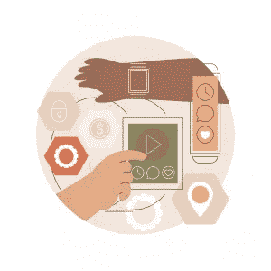

# 选择有效的移动 UX 设计时要考虑的因素

> 原文：<https://blog.devgenius.io/factors-to-consider-when-choosing-an-effective-mobile-ux-design-5dd71ba04aef?source=collection_archive---------12----------------------->

不可否认，移动设备正在统治当今世界。人们每天都依赖移动设备进行通信、电子商务、内容浏览、工作、银行业务、导航等。此外，他们使用几个小工具，包括智能手机、智能手表、平板电脑、平板电脑、可穿戴设备和混合笔记本电脑。

然而，为移动用户创建一个有效的 UX 设计可能具有挑战性，因为在设计时要考虑许多因素。本文将重点介绍其中的一些因素，让您更好地了解如何在下一个移动应用设计中创造引人注目的用户体验。

# 什么是移动用户体验(UX)设计？

首先，让我们谈谈基础知识:移动用户体验或 UX 设计。在移动设备和可穿戴设备上运行的应用或服务的设计被称为移动用户体验(UX)设计。UX 设计师密切关注效率、可访问性和可发现性，因为移动 UX 设计非常注重这些方面。

# 创建有效的移动 UX 设计时需要考虑什么

移动设计的主题很难，在创建移动应用程序时需要考虑很多问题。以下是开发移动应用程序时需要考虑的一些因素。在构建应用程序体验时，请考虑这些因素:

# 1)适当的 UX 研究

在某些时候，你可能会忍不住直接进入模型或原型，但首先进行彻底的 UX 研究是不能夸大的事情。请记住，你不是你的用户，良好的用户体验取决于全面的 UX 研究，这样你就可以在每种情况下领先一步。

# 2)避免杂乱

我们都感受过对杂乱桌面的恐惧——想象一下在移动设备上！每增加一个按钮、图片、信息等等都会增加复杂性。在移动 UX 里扔掉任何不是真正必要的东西是个好主意。一个奇妙的想法是遵循极简设计方法，但不能以可用性为代价。这通常可以通过关注每个屏幕上的一个主要动作来实现。

# 3)忠于核心目标

在你的产品中塞进尽可能多的功能是一种诱惑。你可能认为省略任何东西都会降低顾客的体验。然而，你必须抛弃这种想法。相反，专注于产品最关键的方面，根据公司的主要目标缩小要素范围。通过分析哪些功能最常用来改进设计，并使这些功能易于理解和享受。

# 4)获得正确的接触目标

如果触摸目标设计得不好，移动用户界面可能会令人沮丧。当设计任何类型的交互元素时，比如按钮或链接，应该总是有足够的空间，这样当人们触摸它们时就不会感到局促，从而导致所谓的“内容折叠”因此，创建控件、按钮、链接和其他元素(基本上是触摸目标)时，间隔至少 7-10 毫米是至关重要的。

# 5)确保文本清晰易读

要在各种移动设备上提供一致的体验，请选择各种大小和粗细的字体。为了减少眼睛疲劳，建议字体至少为 11 点。谷歌的 Roboto 和 Noto 或苹果的新旧金山字体是寻找干净易读字体的绝佳选择。

# 6)用户界面反馈

当我们使用设计良好的应用程序时，我们可以随时了解信息。另一方面，如果用户没有收到足够的反馈，他们会感到困惑。不同类型的反馈(声音、触觉、视觉)应该根据 UI 元素或应用程序的当前情况来使用。

# 7)可达性

毫无疑问，这是用户体验设计中最容易被忽视的部分之一。大约 15%的世界人口有某种形式的残疾。网页内容可访问性指南是一个免费的资源，设计者应该在他们的工具箱中有并且熟悉它。

# 你正在寻找一家公司，可以创建一个有用和有效的移动 UX 设计？

选择一家移动 UX 设计公司可能会令人望而生畏，但也不尽然。最后，你要确保你的[网络](https://zluck.com/web-application-development/)或[移动](https://zluck.com/mobile-application-development/)应用可以在任何设备上访问和使用，这意味着思考人们使用手机与使用笔记本电脑等其他设备的不同之处。如果你正在寻找一个有效的移动 UX 设计合作伙伴，今天就联系 [Zluck](https://zluck.com/) ！我们熟练的开发人员和项目经理团队将与您合作，为您量身打造完美的产品体验。

*更多内容尽在*[*blog . devgenius . io*](http://blog.devgenius.io)*。*