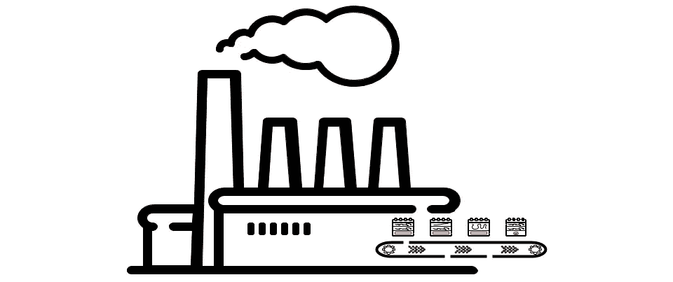

# 工厂设计模式

> 原文：<https://blog.devgenius.io/factory-design-pattern-23e20d933045?source=collection_archive---------17----------------------->



在软件工程中，创造性的设计模式处理对象创建机制，也就是说，试图以适合情况的方式创建对象。除此之外，这种基本或普通形式的对象创建可能会导致设计问题或增加设计的复杂性。C++中的工厂设计模式通过 ***使用单独的方法或多态类*** 创建对象来帮助缓解这个问题。

> */！\:这篇文章最初发表在我的博客上。如果你有兴趣接收我的最新文章，* [*请报名参加我的简讯*](http://eepurl.com/gDNybv) *。*

顺便说一句，如果你还没有看过我关于创造性设计模式的其他文章，那么下面是列表:

1.  [**工厂**](http://www.vishalchovatiya.com/factory-design-pattern-in-modern-cpp/)
2.  [**建造者**](http://www.vishalchovatiya.com/builder-design-pattern-in-modern-cpp/)
3.  [**原型**](http://www.vishalchovatiya.com/prototype-design-pattern-in-modern-cpp/)
4.  [**单胎**](http://www.vishalchovatiya.com/singleton-design-pattern-in-modern-cpp/)

您在这一系列文章中看到的代码片段是简化的，而不是复杂的。所以你经常看到我不使用像`override`、`final`、`public`(同时继承)这样的关键字，只是为了让代码紧凑&可消耗(大部分时间)在单一标准屏幕尺寸。我也更喜欢`struct`而不是`class`，只是为了节省代码行，有时不写`public:`，也故意忽略[虚析构函数](http://www.vishalchovatiya.com/part-3-all-about-virtual-keyword-in-c-how-virtual-destructor-works/)，构造函数[，复制构造函数](http://www.vishalchovatiya.com/all-about-copy-constructor-in-cpp-with-example/)，前缀`std::`，删除动态内存。我也认为自己是一个务实的人，希望用尽可能简单的方式，而不是标准的方式或使用术语来传达一个想法。

***注:***

*   如果你是在这里被直接绊倒的，那么我建议你浏览一下[什么是设计模式？](http://www.vishalchovatiya.com/what-is-design-pattern/)一、哪怕是鸡毛蒜皮的小事。相信会鼓励你对这个话题进行更多的探索。
*   您在本系列文章中遇到的所有这些代码都是使用 C++20 编译的(尽管我在大多数情况下使用了 C++17 之前的[现代 C++](http://www.vishalchovatiya.com/21-new-features-of-modern-cpp-to-use-in-your-project/) 特性)。因此，如果你没有获得最新的编译器，你可以使用[https://wandbox.org/](https://wandbox.org/)，它也已经预装了 boost 库。

# 目的

> ***用于创建批发对象，不同于生成器(分段创建)。***

# 动机

*   假设你有一个`Point`类，有`x` & `y`作为坐标，可以是笛卡尔坐标或极坐标，如下所示:

```
struct Point {
    Point(float x, float y){ /*...*/ }      // Cartesian co-ordinates // Not OK: Cannot overload with same type of arguments
    // Point(float a, float b){ /*...*/ }    // Polar co-ordinates // ... Implementation
};
```

*   这是不可能的，因为你可能知道你不能用相同类型的参数创建两个构造函数。
*   反过来是:

```
enum class PointType{ cartesian, polar };class Point {
    Point(float a, float b, PointTypetype = PointType::cartesian) {
        if (type == PointType::cartesian) {
            x = a; b = y;
        }
        else {
            x = a * cos(b);
            y = a * sin(b);
        }
    }
};
```

*   但这并不是一种复杂的方式。相反，我们应该将单独的实例化委托给单独的方法。

# C++中的工厂设计模式示例

*   所以你可以猜到。我们将通过将初始化过程从构造函数转移到其他结构来减轻构造函数的限制。我们将使用工厂方法。
*   顾名思义，它使用方法或成员函数来初始化对象。

# 工厂方法

```
enum class PointType { cartesian, polar };class Point {
    float       m_x;
    float       m_y;
    PointType   m_type; // Private constructor, so that object can't be created directly
    Point(const float x, const float y, PointType t) : m_x{x}, m_y{y}, m_type{t} { }
public:
    friend ostream& operator<<(ostream& os, const Point& obj) {
        return os << "x: " << obj.m_x << " y: " << obj.m_y;
    }
    static Point NewCartesian(float x, float y) { 
        return { x, y, PointType::cartesian }; 
    }
    static Point NewPolar(float a, float b) { 
        return { a*cos(b), a*sin(b), PointType::polar }; 
    }
};int main() {
    // Point p{ 1,2 };  // will not work
    auto p = Point::NewPolar(5, M_PI_4);
    cout << p << endl;  // x: 3.53553 y: 3.53553
    return EXIT_SUCCESS;
}
```

*   正如您可以从实现中观察到的。它实际上不允许使用构造函数&强迫用户使用静态方法。而这就是 ***工厂方法即私有构造函数&静态方法*** 的本质。

# 经典工厂设计模式

*   如果你有专门的代码用于构造，那么当没有的时候，我们把它移到一个专门的类中。仅仅是为了分离关注点，即[单一责任原则](http://www.vishalchovatiya.com/single-responsibility-principle-in-cpp-solid-as-a-rock/)和实体设计原则。

```
class Point {
    // ... as it is from above
    friend class PointFactory;
};class PointFactory {
public:
    static Point NewCartesian(float x, float y) {
        return { x, y };
    }
    static Point NewPolar(float r, float theta) {
        return { r*cos(theta), r*sin(theta) };
    }
};
```

*   请注意，这不是抽象的工厂，这是具体的工厂。
*   制作`Point`的`PointFactory`好友类我们违反了[开闭原则](http://www.vishalchovatiya.com/open-closed-principle-in-cpp-solid-as-a-rock/) (OCP)。作为朋友的关键词本身与 OCP 相反。

# 内部工厂

*   我们工厂忽略了一个关键的东西，即`PointFactory` & `Point`之间没有强有力的联系，这使得用户看到一切都是`private`就混淆了使用`Point`。
*   所以与其在课堂外设计工厂。我们可以简单地把它放在鼓励用户使用工厂的类中。
*   因此，我们也服务于第二个问题，即打破[开闭原则](http://www.vishalchovatiya.com/open-closed-principle-in-cpp-solid-as-a-rock/)。这对于用户使用 Factory 来说会更加直观。

```
class Point {
    float   m_x;
    float   m_y; Point(float x, float y) : m_x(x), m_y(y) {}
public:
    struct Factory {
        static Point NewCartesian(float x, float y) { return { x,y }; }
        static Point NewPolar(float r, float theta) { return{ r*cos(theta), r*sin(theta) }; }
    };
};int main() {
    auto p = Point::Factory::NewCartesian(2, 3);
    return EXIT_SUCCESS;
}
```

# 抽象工厂

## 为什么我们需要一个抽象工厂？

*   C++使用基类的[虚拟析构函数](http://www.vishalchovatiya.com/part-3-all-about-virtual-keyword-in-c-how-virtual-destructor-works/)支持多态对象析构。类似地，由于с++不支持[虚拟构造函数](http://www.vishalchovatiya.com/7-advanced-cpp-concepts-idiom-examples-you-should-know/) & [复制构造函数](http://www.vishalchovatiya.com/all-about-copy-constructor-in-cpp-with-example/)，因此缺少对对象的创建&复制的等效支持。
*   此外，除非知道对象的静态类型，否则无法创建对象，因为编译器必须知道它需要分配的空间量。出于同样的原因，复制一个对象也需要在编译时知道它的类型。

```
struct Point {
    virtual ~Point(){ cout<<"~Point\n"; }
};struct Point2D : Point {
    ~Point2D(){ cout<<"~Point2D\n"; }
};struct Point3D : Point {
    ~Point3D(){ cout<<"~Point3D\n"; }
};void who_am_i(Point *who) { // Not sure whether Point2D would be passed here or Point3D
    // How to `create` the object of same type i.e. pointed by who ?
    // How to `copy` object of same type i.e. pointed by who ?
    delete who; // you can delete object pointed by who, thanks to virtual destructor
}
```

## 抽象工厂设计模式的例子

*   抽象工厂在需要创建许多不同类型的对象的情况下非常有用，这些对象都是从一个公共的基类型派生出来的。
*   抽象工厂定义了创建对象的方法，然后[的子类](http://www.vishalchovatiya.com/memory-layout-of-cpp-object/)可以覆盖该方法来指定将要创建的派生类型。因此，在运行时，将根据引用/指向的对象类型调用适当的抽象工厂方法&返回指向该对象的新实例的基类指针。

```
struct Point {
    virtual ~Point() = default;
    virtual unique_ptr<Point> create() = 0;
    virtual unique_ptr<Point> clone()    = 0;
};struct Point2D : Point {
    unique_ptr<Point> create() { return make_unique<Point2D>(); }
    unique_ptr<Point> clone() { return make_unique<Point2D>(*this); }
};struct Point3D : Point {
    unique_ptr<Point> create() { return make_unique<Point3D>(); }
    unique_ptr<Point> clone() { return make_unique<Point3D>(*this); }
};void who_am_i(Point *who) {
    auto new_who       = who->create(); // `create` the object of same type i.e. pointed by who ?
    auto duplicate_who = who->clone();    // `copy` the object of same type i.e. pointed by who ?
    delete who;
}
```

*   如上所示，我们通过委托创建动作来利用多态方法&通过使用纯虚拟方法将对象复制到派生类。
*   上面的代码不仅实现了`[virtual constructor](http://www.vishalchovatiya.com/7-advanced-cpp-concepts-idiom-examples-you-should-know/#Virtual-Constructor)`(即`create()`)，还实现了[【虚拟复制构造器】](http://www.vishalchovatiya.com/7-advanced-cpp-concepts-idiom-examples-you-should-know/#Virtual-Constructor)(即`clone()`)。
*   确保在使用抽象工厂时，你已经确保了[利斯科夫的替代原则(LSP)](http://www.vishalchovatiya.com/liskovs-substitution-principle-in-cpp-solid-as-a-rock/) 。

# 使用现代 C++实现工厂设计模式的函数方法

*   在我们的抽象工厂例子中，我们遵循了面向对象的方法，但是现在它同样可能是一种更功能化的方法。
*   因此，让我们建立一个类似的工厂，不依赖多态功能，因为它可能不适合一些时间受限的应用程序，如[嵌入式系统](https://en.wikipedia.org/wiki/Embedded_system)。因为[虚拟表&动态调度机制](http://www.vishalchovatiya.com/part-1-all-about-virtual-keyword-in-cpp-how-virtual-function-works-internally/)可能会在关键功能期间影响系统。
*   这非常简单，因为它使用了如下的函数式λ函数:

```
struct Point { /* . . . */ };
struct Point2D : Point {/* . . . */};
struct Point3D : Point {/* . . . */};class PointFunctionalFactory {
    map<PointType, function<unique_ptr<Point>() >>      m_factories;public:
    PointFunctionalFactory() {
        m_factories[PointType::Point2D] = [] { return make_unique<Point2D>(); };
        m_factories[PointType::Point3D] = [] { return make_unique<Point3D>(); };
    }    
    unique_ptr<Point> create(PointType type) { return m_factories[type](); }  
};int main() {
    PointFunctionalFactory pf;
    auto p2D = pf.create(PointType::Point2D);
    return EXIT_SUCCESS;
}
```

*   如果您认为我们过度工程化了，那么请记住，我们的对象构造很简单，只是为了演示该技术&我们的 lambda 函数也是如此。
*   当你的对象表示增加时，需要调用很多方法才能正确实例化对象，这种情况下你只需要修改工厂的 lambda 表达式或者引入 [Builder 设计模式](http://www.vishalchovatiya.com/builder-design-pattern-in-modern-cpp/)。

# 工厂设计模式的好处

1.  不同对象创建的单点/类。因此易于维护和理解软件。
2.  通过使用抽象工厂，您甚至可以在不知道对象类型的情况下创建对象。
3.  它提供了很好的模块化。想象一下，编写一个视频游戏，你想在未来添加新类型的敌人，每个敌人都有不同的 AI 功能，可以不同地更新。通过使用工厂方法，程序的控制者可以调用工厂来创建敌人，而不需要任何依赖或实际敌人类型的知识。现在，未来的开发者可以创造新的敌人，用新的人工智能控制和新的绘图成员功能，把它添加到工厂，并创建一个调用工厂的关卡，通过名字询问敌人。将这种方法与级别的 XML 描述结合起来，开发人员就可以创建新的级别，而不必重新编译他们的程序。所有这一切，都要归功于对象的创建和对象的使用的分离。
4.  允许您更容易地更改应用程序的设计，这被称为松耦合。

# 常见问题汇总

**在 C++中实现工厂设计模式的正确方法是什么？**

抽象工厂&功能工厂总是一个不错的选择。

**工厂 vs 抽象因素 vs 功能工厂？**

- Factory:创建具有不同实例化的对象。
-抽象因素:创建一个不知道类型的对象&引用使用基类指针&引用。使用多态方法访问。
-功能工厂:当对象创建比较复杂的时候。抽象工厂+ [构建器设计模式](http://www.vishalchovatiya.com/builder-design-pattern-in-modern-cpp/)。虽然我没有在功能工厂示例中包括构建器。

**什么时候使用工厂设计模式？**

使用工厂设计模式创建所需功能的对象，但对象类型仍未确定，或者将由传递的动态参数决定。

[有什么建议、疑问或者想说](http://www.vishalchovatiya.com/contact-2/) `[Hi](http://www.vishalchovatiya.com/contact-2/)` [？减轻压力，只需点击一下鼠标。](http://www.vishalchovatiya.com/contact-2/) 🖱️