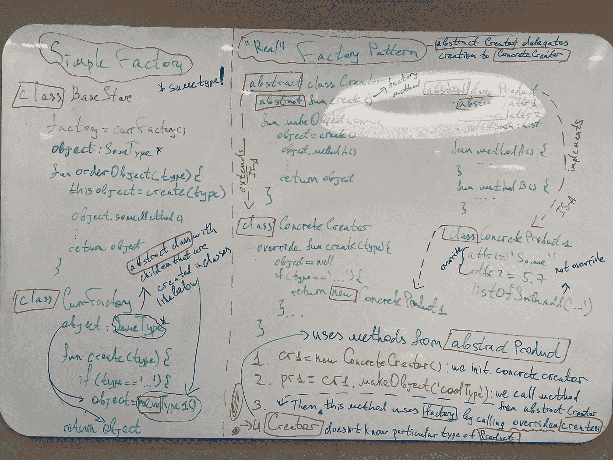
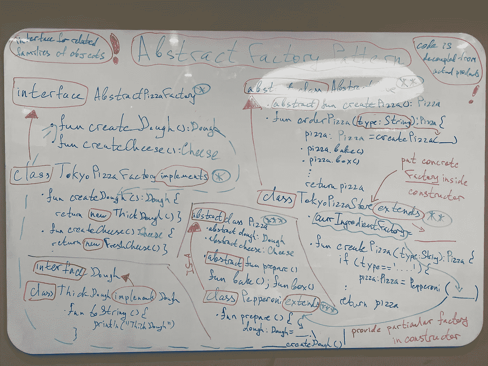

# 隐藏实例化的工厂模式

> 原文：<https://blog.devgenius.io/factory-patterns-to-hide-instantiation-kotlin-d5f01cf01921?source=collection_archive---------8----------------------->

Y o，欢迎回到我开始传播快乐的设计模式系列！不要吝啬你的时间，看看我以前的帖子，以获得最大的收获:

*   策略模式:[https://medium . com/toward sdev/strategy-pattern-for-independent-algorithms-kot Lin-70 ed 24 c 7 BD 8 b](https://medium.com/towardsdev/strategy-pattern-for-independent-algorithms-kotlin-70ed24c7bd8b)
*   观察者模式:[https://medium . com/toward sdev/observer-pattern-for-loose-coupling-kot Lin-f5ab 804609 bb](https://medium.com/towardsdev/observer-pattern-for-loose-coupling-kotlin-f5ab804609bb)
*   装饰模式:[https://medium . com/toward sdev/decorator-decorator-pattern-for-object-composition-kot Lin-7 CEC 92 cbaf 7b](https://medium.com/towardsdev/decorator-decorator-pattern-for-object-composition-kotlin-7cec92cbaf7b)

另外，通过购买“设计模式”来支持[奥赖利媒体](https://medium.com/u/fbfa235a954c?source=post_page-----d5f01cf01921--------------------------------):[https://www . oreilly . com/library/view/head-first-Design/9781492077992/](https://www.oreilly.com/library/view/head-first-design/9781492077992/)

结构:

*   介绍
*   问题(在本文中将有 2 个部分)
*   要遵循的设计原则
*   最终解决方案代码(在本文中将有 2 个部分)
*   额外部分
*   图画

一点序言:这个模式很长。实际上，它包含了 3 个变量，我将尝试分解它们👹但是要获得最大的收获，请查阅提到的那本书👀

此外，我将在本文中不止一次地提到各种事情，因为这有助于更好地吸收信息，并从不同的角度看待它

# 工厂模式

## 介绍

在之前的文章中，我已经多次提到:以一种灵活的方式设计你的软件。也就是说，我们不需要改变现有的代码或者分散一堆`if/else`语句，这些语句会使代码变得脆弱，容易被修改。

为了避免这种情况**编程到一个接口**而不是具体的父接口，并通过多态来利用方法。我们也不局限于这些类的具体实现。

让我们看看糟糕的设计:

乍一看，我们编程到一个超类型，可以利用多态性。**唉**，如果`ParentClass`的实现会改变怎么办？🧐加号，那些上面提到的`if/else`在这里找到他们的路= >坏！

> 找到不同的东西并封装它们

如何重构？让我们一步一步来:

1.  有什么变化？*创建对象*
2.  什么保持不变？应用于对象的方法，因为它们是相同的超类型

Solution❓ **封装**变化的内容(对象创建)并保留方法调用。另外，添加接口/抽象类。

> 对象创建的部分违反了实体的**开闭原则**,因为我们需要重新打开代码来放置更改

遇到所谓的**简易工厂**哪来的救援！您可以在下面的 repo 中找到源代码:

[](https://github.com/SleeplessChallenger/KotlinDesignPatterns/tree/main/src/main/kotlin/4_FactoryPattern/SimpleFactory) [## KotlinDesignPatterns/src/main/kotlin/4 _ factory pattern/simple factory at main…

### O'Reilly 设计模式在 Kotlin 的实现。为 sleep less challenger/KotlinDesignPatterns 开发做出贡献…

github.com](https://github.com/SleeplessChallenger/KotlinDesignPatterns/tree/main/src/main/kotlin/4_FactoryPattern/SimpleFactory) 

现在，让我们仔细阅读它来修改上面粘贴的设计。

1.  `PizzaStore.kt`是我们的主文件，类似于`main()`函数。我们用`type`呼叫`orderPizza()`，开始我们的创作。但是这里我们把变化的逻辑移到另一个叫做`SimplePizzaFactory`的类中，在那里可以找到变化的部分。
2.  `Pizza.kt`是我们的`abstract class`，它是其他披萨类型的父代:`Cheese` & `Pepperoni`
3.  在我们创建了想要的比萨饼之后，我们回到我们的`PizzaStore`，在这里利用了超类型的方法(又名`Pizza`)。由于我们的 concrete pizza 是子类型，所以我们不关心返回的是哪一个。因此，我们简单地对它应用方法。

现在我们有一个地方，`SimplePizzaFactory`所有可能的变化都集中在这里，因此我们不需要重新打开我们的`Store`来实现它们🔝

但是…

简单工厂本身并不是一种模式。然而，许多开发者认为这是一个 thing‼️

现在，在这个沉重的介绍之后，让我们进入有趣的部分，探索真实的 patterns🕵🏼‍♂️

## 问题:第一部分

正如你在介绍中看到的，我们需要**封装**不同的东西。实际上，我们设法以某种方式做到了这一点，还能走得更远吗？

你看，在我们的`SimpleFactory`中，我们的对象**工厂**创造了所有种类的产品。但是如果我们想要有更多的变化呢？

例如，我们有`abstract creator`也就是**客户端**和许多`concrete creators`也就是**子客户端**。在**客户端**中，我们有*抽象工厂方法*，然后在**子客户端中实现。**

因此，我们有*许多子客户*，这些客户希望拥有自己的产品**继承*抽象产品*的**。当父 creator 的子类可以处理**工厂方法**中的所有实例化，从而只返回产品时，我们该如何做呢？然后产品将由抽象创建者处理并返回

哇…🤯我知道这看起来很模糊，所以让我们一步一步来。

1.  我们在子客户中制造工厂方法。这个工厂方法在抽象创建器中实现了`abstract`工厂方法
2.  这些子客户端处理实例化
3.  它们返回 object(是抽象对象的子类)
4.  我们的*抽象客户端*对其进行进一步处理，并将处理后的对象返回给我们的具体子客户端，具体子客户端再将其呈现给我们(实际上，该方法是从**子客户端**调用的，因此该方法将对象返回给我们)

```
 abstract creator
               /           \
           sub-creator1    sub-creator2
           /   |    \        /   |   \

concrete product1 ..2     another concrete product1 ..2Those products inherit from abstract product
```

看看我们**如何将**抽象类创建者*与子客户端中的*具体产品*分离。*

> 别担心，我们会一步一步来的

此外，在所有这些模式中，`abstract creator`是我们的客户端。我们**封装**子客户端中的变更，并隔离其中的所有内容。所以，我们的客户不需要知道太多，只要有那个产品要处理(客户只知道这个产品将是`abstract product)`的子类型)

## 最终解决方案代码:第一部分

[](https://github.com/SleeplessChallenger/KotlinDesignPatterns/tree/main/src/main/kotlin/4_FactoryPattern/Factory) [## KotlinDesignPatterns/src/main/kotlin/4 _ Factory pattern/Factory at main…

### O'Reilly 设计模式在 Kotlin 的实现。为 sleep less challenger/KotlinDesignPatterns 开发做出贡献…

github.com](https://github.com/SleeplessChallenger/KotlinDesignPatterns/tree/main/src/main/kotlin/4_FactoryPattern/Factory) 

让我们看看具体的例子来澄清所有的骚动🙌

1.  我们有`abstractCreator.kt`，它有抽象方法`createObject()`。*但是我们不直接用这个方法。*
2.  我们有子类(子客户端):`concreteCreator` & `anotherConcreteCreator`，这个`abstractCreator`，是我们本地的创作者。那些创建者**覆盖/实现了**来自父类的抽象方法，而父类实际上是我们的**工厂**。所以，那些子客户端是我们的`abstractCreator`的子客户端可以访问父客户端的方法。我们从**客户端**(父客户端)调用方法，在我的例子中，是`giveType`触发了特定子客户端的`createObject`。
3.  那个`createObject`也是我们的**工厂**本身，它处理对象实例化。它将具体产品返回给我们的`abstractClient` `giveType`方法，具体产品是我们抽象产品的子产品。
4.  在这个父方法中，我们被限制在**产品**的`abstract class`(父)，这允许我们应用来自**抽象产品**的方法(回忆多态及其用法)
5.  子产品因客户而异。即`concreteCreator`有 2 个`concreteProducts`(来自抽象产品)`anotherConcreteCreator`还有 2 个`anotherConcreteProducts`(又是**从抽象产品继承**)。
6.  那些产品，作为子类，被返回到`abstractCreator`中的`giveType`方法，在那里来自`abstractProduct`的方法被应用。
7.  然后，处理后的对象返回给我们，我们可以进一步处理它。(我在上面解释了为什么我们可以利用父方法，并且这个方法直接给我们结果)
8.  我们在`abstractCreator`中的`giveType()`是从特定类型的产品中分离出来的**。只要这个产品是抽象产品的一个**子类，我们不关心哪个客户实际上把产品返回给我们。****

**呃……😲很艰难。我希望你得到了这种分离工厂的主要优点。**

**同样，好处是我们可以尽可能多地参数化/调整我们的创建(也就是子代中的**工厂方法**),只要它返回期望的对象。**

> **通过使用**工厂模式**我们:**
> 
> **-封装类/方法中不同的部分**
> 
> **-编程到一个接口，而不是一个特定的实现。也就是说，我们知道工厂返回`abstractProduct`的子类型**

## **要遵循的设计原则**

**固体的另一个原理😈**

1.  **依赖倒置原则:我们依赖抽象，而不是具体的类**

**你可能会问自己:这听起来类似于上面提到的*“编程到一个接口而不是特定的实现”*。但是这个原则规定了这样一个事实:我们的高级组件&低级组件不应该相互依赖，它们**必须依赖于相似的抽象。****

**以下是对原则的违反:**

```
 abstractCreator
                     /   |     \
       concreteProduct1        concreteProduct3
                   concreteProduct2
```

**现在让我们本着这个原则来做:**

```
 abstractCreator
                           |
                       abstractProduct
                     /      |       \
         concreteProduct1        concreteProduct3
                   concreteProduct2
```

**看看**高层组件** (abstractCreator) & **低层组件** (concreteProducts)如何依赖一个抽象。回忆代码演练中的`giveType`。这取决于*抽象产品类型*。在子客户端中创建的产品也依赖于**相同的** *抽象产品类型*。**

## **问题:第二部分**

**但是，如果我们不想简单地创建最终产品，而是用产品系列对其进行微调，该怎么办呢？也就是说，想象我们不是简单地创建具有硬编码值的`concreteProduct`，而是在它里面有工厂，子产品有它们自己的`interface`等等？**

**另外，如果我们有相同的`concreteProduct`，只是子产品的类型不同，那会怎么样？即`Colour`是一个抽象类，它有两个相似的孩子:`Red` & `Blue`。在这种情况下，我们不需要像**工厂模式**中那样有重复的代码。**

**换句话说，我们已经设法创造了一个所谓的成分家族，来填充我们相同的产品。**

> **在我的代码中，产品系列是面团、奶酪、浇头**

**请阅读以下段落，直到它铭刻在你的脑海中:**

**一个 **抽象工厂**允许我们通过为子工厂(不是**子客户/子创建者**)提供接口来创建产品系列。结果，我们的代码是**与*混凝土工厂*分离**，使得*混凝土产品*充满所谓的配料。因此，我们可以有*多家工厂*生产**相同的**产品，而*的含量*不同。说到被**解耦**，可以追溯到产品与其他代码的**松耦合**，即**子客户端/客户端**代码(在我们这里是**具体创建者/抽象**)保持不变。因此，**每个工厂都创造了自己的产品系列**。**

**I’m serious, もう一度読んでください！👺**

## **最终解决方案代码:第二部分**

**现在让我们仔细阅读**抽象工厂**的代码**

**[](https://github.com/SleeplessChallenger/KotlinDesignPatterns/tree/main/src/main/kotlin/4_FactoryPattern/AbstractFactory) [## KotlinDesignPatterns/src/main/kotlin/4 _ factory pattern/abstract factory at main…

### O'Reilly 设计模式在 Kotlin 的实现。为 sleep less challenger/KotlinDesignPatterns 开发做出贡献…

github.com](https://github.com/SleeplessChallenger/KotlinDesignPatterns/tree/main/src/main/kotlin/4_FactoryPattern/AbstractFactory) 

1.  是我们心爱的工厂。它定义了所有其他工厂要实现的方法。
2.  `TokyoIngredientFactory.kt`是实现所有方法的具体工厂。回想一下上面写的东西:这些方法本身就是小厂。
3.  `AbstractPizzaStore.kt`是我们的抽象创建者/客户，它定义了**抽象工厂方法**，以及一个我们将用来获得产品的方法(`createPizza()`-我们的工厂方法)
4.  `TokyoPizzaStore.kt`是拥有混凝土工厂的子客户/创建者。这个子客户把工厂放在混凝土产品里面。
5.  `Pepperoni.kt`等披萨都是`AbstractPizza`的子产品。这里回忆一下**反转**的依赖关系。
6.  `Cheese`、`Dough`为混凝土配料接口。

那么，一切是如何运作的呢？

在`main.kt`中，我们实例化**子客户端**并使用来自**抽象客户端**的方法。Steps☝️:

1.  从**子客户端**中，我们调用**父客户端**(带有披萨类型)方法(在我的例子中是`orderPizza()`)，该方法触发子客户端中实现的工厂方法。
2.  **工厂方法**
3.  这个**工厂**实现了**抽象工厂**。
4.  然后，从开始的父中的那个方法，`orderPizza()`，使用抽象的比萨方法，`prepare()`，在具体的比萨中实现。那种方法使用放在混凝土比萨饼里面的工厂**。**
5.  **然后在父方法`orderPizza()`中，它进一步处理 pizza。最后，我们收到了比萨饼。**
6.  **因此，正如在开始时提到的，如果内部材料相同，我们不需要相同比萨饼的类别数。只要把工厂放在里面，这将解耦代码。**

**呃…我知道，很多信息，很难跑题。**

> **如果你没有得到任何东西，不要羞于再读一遍并提问**

## **额外部分**

*   **在抽象工厂模式代码中，我们的**存储**是**客户端**，工厂方法为`createPizza()`。然后，在`Pepperoni/MeatPizza`我们依次有小工厂。**
*   **`Pizza`与**和**从地区差异中分离出来，看起来像是一个充满了工厂的模式，这些工厂有他们自己的一套配料。例如，`Pepperoni`可以填充各种利用不同成分的工厂。只要这些工厂坚持特定的`interface`成分，即他们创造子成分(像`ThickCrust`工具`Dough`等)，一切都在运转。**
*   **看，**抽象工厂**中的每个方法本身就是一个小工厂。为什么？- >那些方法在它们内部进行对象实例化。另外，*具体工厂*覆盖*抽象工厂*的*抽象方法*。这有点类似于**工厂模式**中的方法覆盖，但是我们只覆盖了一个方法。**
*   **在`Abstract Factory`的源代码中你可以找到文件夹:`Modified Version`。它是由我工作时的高级开发人员修改的。坦率地说，我喜欢他的补充👐如果你想让我做一个代码演练——写在评论里！**

## **图画🎨**

****简单工厂&工厂模式****

****工厂模式****

****

****抽象工厂模式****

****

**我的画能让我理清所有事物的运作方式。我知道我的涂鸦可能看起来很可怕😵，但如果你发现他们至少有一点点洞察力，那么我是 elated✌️**

## **结尾部分👣**

**在最后一部分，让我们观察一下抽象工厂模式的**工厂** & **的学术定义****

> ****工厂模式**:为对象创建定义一个接口，但是强制子类实现它。这种模式允许主类将对象实例化推迟到子类**
> 
> ****抽象工厂模式**:定义相关产品族创建的接口，不指定产品的具体类别**

**这种模式肯定是漫长的。需要多少遍就仔细读多少遍。并且可以自由提问！👍希望你明白这两种模式的区别，但是如果不明白，你知道该怎么做，该去哪里问😇**

**你可以找到我:**

*   **领英:[www.linkedin.com/in/sleeplesschallenger](http://www.linkedin.com/in/sleeplesschallenger)**
*   **GitHub:[https://github.com/SleeplessChallenger](https://github.com/SleeplessChallenger)**
*   **leet code:[https://leetcode.com/SleeplessChallenger/](https://leetcode.com/SleeplessChallenger/)**
*   **电报:@无眠挑战者****