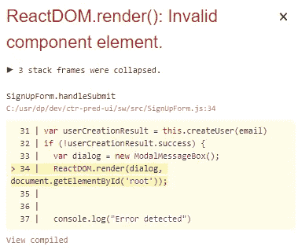
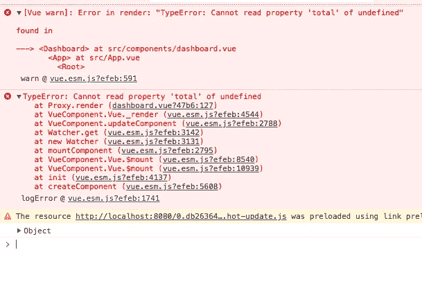

# 努力失败，节省时间

> 原文：<https://blog.devgenius.io/fail-hard-save-time-3555a1dc1458?source=collection_archive---------3----------------------->

ugs 是不可避免的。调试错误是对时间的巨大浪费。更好的错误消息让工程师们行动更快。为了获得更好的错误，我们需要更努力地失败。

以下规则是我总结的最佳实践，按照实现难度的顺序排列

# 1.大声失败

无声的失败是可怕的。

产品代码应该在 UI 里大声**失败** **，而不是控制台或者日志**。基础代码应该**在日志中失败，而不是返回空值**。

如果我们正在编写一个库或服务，默认应该是 throw/spew，用户应该尽力让它静音。永远不要隐藏异常(例如***catch***(***Exception $ e)***)，除非我们只是记录日志并打算立即重新抛出。

错误对话框

# 2.含糊地失败

失败时不要言简意赅。足够详细的错误有助于重现 bug。错误包含的信息应该比您可能期望的要多得多。

交互模式(或 **cmd 线工具**)就是最好的例子。当我们输入东西时，电脑会给我们一个结果。理想的错误消息或日志消息将捕获您粘贴“python -i”或再现错误所需的任何内容。

错误示例

# 3.接近根本原因的失败

与#1 和#2 不同，这条规则涉及修改代码，而*不处理*错误处理。这意味着让我们的软件更加脆弱。

当您获得堆栈跟踪时，它通常指向最接近的原因。我们想在终极原因上失败。出了问题，你想尽快知道。

您的代码越脆弱、越不宽容，就越容易找到错误的最终原因。