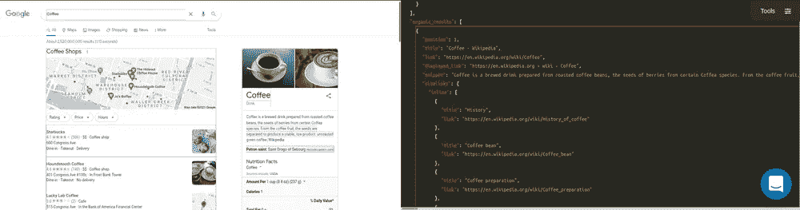

# [失败]调查机器学习技术以改进规格测试— V

> 原文：<https://blog.devgenius.io/failed-investigating-machine-learning-techniques-to-improve-spec-tests-v-a388b387bdcd?source=collection_archive---------12----------------------->


# 介绍

这是与人工智能实现相关的系列博文的一部分。如果你对故事的背景或情节感兴趣:

本周我们将展示存储和重用训练过的权重，以及我在计算模型的早期结果时犯的严重错误。我们将使用 [SerpApi 的 Google Organic Results Scraper API](https://serpapi.com/organic-results)进行数据收集。此外，您可以在[操场](https://serpapi.com/playground?q=Coffee&location=Austin%2C+Texas%2C+United+States&gl=us&hl=en&no_cache=true&newPara=lr+async+as_qdr)查看我们将使用的数据的更多详细信息。



# 我在计算模型精确度时犯了一个致命的错误

让我首先给出我用训练例子计算的方法:

```
true_examples = key_array.map {|el| el = el.first == "1" ? el.second : nil}.compact
false_examples = key_array.map {|el| el = el.first == "0" ? el.second : nil}.compactpredictions = []false_examples.each do |example|
  prediction = test example, 2, vector_array, key_array
  predictions << prediction
endpredictions.map! {|el| el = el == 1 ? 0 : 1}true_examples.each_with_index do |example, index|
  puts "--------------"
  prediction = test example, 2, vector_array, key_array
  predictions << prediction
  puts "Progress #{(index.to_f/true_examples.size.to_f).to_f}"
  puts "--------------"
endprediction_train_accuracy = predictions.sum.to_f / predictions.size.to_fputs "Prediction Accuracy for Training Set is: #{prediction_train_accuracy}"
```

我们采用的例子是`snippet`和`not snippet`，并在训练好的模型中运行它们。如果`not snippet`实例的预测结果是`0`，那么它们将被计为正确预测，如果`snippet`结果被计为`1`，那么它们也将被计为正确结果。最终正确预测率的结果是`0.8187793427230047`。我后来使用了一个更大的数据集，结果大约是`89%`。

这是我犯下的逻辑谬误；与`snippet`结果相比，有更多`non-snippet`结果。让我们假设在 10 个单元的示例集中其比率是 1:9。如果模型更倾向于以随机的方式调用事物`non-snippet`而不是`snippet`，就像这种情况，那么`non-snippet`结果将被正确预测，这将在结果中产生偏差。

之所以在更大的数据集中增加到 89 %,是因为其中有更多类型的键。这导致`snippet`大小/ `non-snippet`大小进一步最小化，这引发了`non-snippet`结果的假阳性预测偏差。

实际上，我应该只使用`snippet`例子来测试这个模型。我做了，发现模型没用。我会尝试调整，并找到一种方法，使其有用。但是，我认为更好的办法是在此之前说明我为什么计算失败，以此来通知大家，并防止其他人犯同样的错误。

# 以定制方式存储训练过的重量

过了一会儿我才意识到我的错误。在此之前，我已经创建了一种使用模型进行存储和预测的方法。

这是它的完整代码:

```
class Predict 
  def initialize csv_path, trained_weights_path, vocab_path, object = "Snippet", k = 2
    @@csv_path = csv_path
    @@trained_weights_path = trained_weights_path
    @@vocab_path = vocab_path
    @@object = object
    @@k = k
    @@key_arr = []
    @@vector_arr = []
    @@weights = []
    @@maximum_word_size = 0
    @@vocab = {}
  enddef self.construct
    @@weights = initialize_trained_weights @@trained_weights_path
    @@vocab = read_vocab @@vocab_path
    @@key_arr = read_csv @@csv_path
    @@vector_arr = define_training_set @@key_arr
    @@maximum_word_size = @@weights.size
    extend_vectors
  enddef self.read_csv csv_path
    CSV.read(csv_path)
  enddef self.read_vocab vocab_path
    vocab = File.read vocab_path
    JSON.parse(vocab)
  enddef self.initialize_trained_weights trained_weights_path
    weights = File.read trained_weights_path
    weights = JSON.parse(weights)
    Vector.[](*weights)
  enddef self.define_training_set vectors
    @@key_arr.map { |word| word_to_tensor word[1] }
  enddef self.default_dictionary_hash
    {
      /\"/ => "",
      /\'/ => " \'  ",
      /\./ => " . ",
      /,/ => ", ",
      /\!/ => " ! ",
      /\?/ => " ? ",
      /\;/ => " ",
      /\:/ => " ",
      /\(/ => " ( ",
      /\)/ => " ) ",
      /\// => " / ",
      /\s+/ => " ",
      /<br \/>/ => " , ",
      /http/ => "http",
      /https/ => " https ",
    }
  enddef self.tokenizer word, dictionary_hash = default_dictionary_hash
    word = word.downcase
    dictionary_hash.keys.each do |key|
      word.sub!(key, dictionary_hash[key])
    end
    word.split
  enddef self.word_to_tensor word
    token_list = tokenizer word
    token_list.map {|token| @@vocab[token]}
  enddef self.extend_vector vector
    vector_arr = vector.to_a
    (@@maximum_word_size - vector.size).times { vector_arr << 1 }
    Vector.[](*vector_arr)
  enddef self.extend_vectors
    @@vector_arr.each_with_index do |vector, index|
      @@vector_arr[index] = extend_vector vector
    end
  enddef self.product vector
    @@weights.each_with_index do |weight, index|
      vector[index] = weight * vector[index]
    endvector
  enddef self.euclidean_distance vector_1, vector_2
    subtractions = (vector_1 - vector_2).to_a
    subtractions.map! {|sub| sub = sub*sub }
    Math.sqrt(subtractions.sum)
  enddef self.execute example
    example_vector = word_to_tensor example
    example_vector.map! {|el| el = el.nil? ? 0: el}
    example_vector = extend_vector example_vector
    weighted_example = product example_vectordistances = []
    @@vector_arr.each_with_index do |comparison_vector, vector_index|
      distances << euclidean_distance(comparison_vector, weighted_example)
    endindexes = []
    @@k.times do 
      index = distances.index(distances.min)
      indexes << index
      distances[index] = 1000000000
    endpredictions = []
    indexes.each do |index|
      predictions << @@key_arr[index].first.to_i
    endputs "Predictions: #{predictions}"prediction = (predictions.sum/predictions.size).to_f
    if prediction < 0.5
      puts "False - Item is not #{@@object}"
      return 0
    else
      puts "True - Item is #{@@object}"
      return 1
    end
  end
endcsv_path = "organic_results/organic_results__snippet.csv"
trained_weights_path = "organic_results/snippet_weights.json"
vocab_path = "organic_results/vocab.json"Predict.new csv_path, trained_weights_path, vocab_path, object = "Snippet", k = 5
Predict.constructtrue_examples = CSV.read(csv_path)
true_examples = true_examples.map {|el| el = el.first == "1" ? el.second : nil}.compacttrue_examples.each_with_index do |example, index|
  puts "--------"
  puts "#{index}"
  Predict.execute example
  puts "--------"
end
```

# 结论

我真诚地尝试了一个可以减轻考试写作压力的领域，但我失败了。定制代码上的细微错误可能会发生，并导致整体失败。我很感激我尝试了一下，并发现这种方法没有我想象的那么有效。我将在未来继续这方面的工作。然而，在下一篇博文中，主题很可能会有所不同。对于之前博文给出的误导性结果，我向读者道歉，感谢他们的关注。

*原载于 2022 年 5 月 4 日 https://serpapi.com**[*。*](https://serpapi.com/blog/investigating-macg/)*