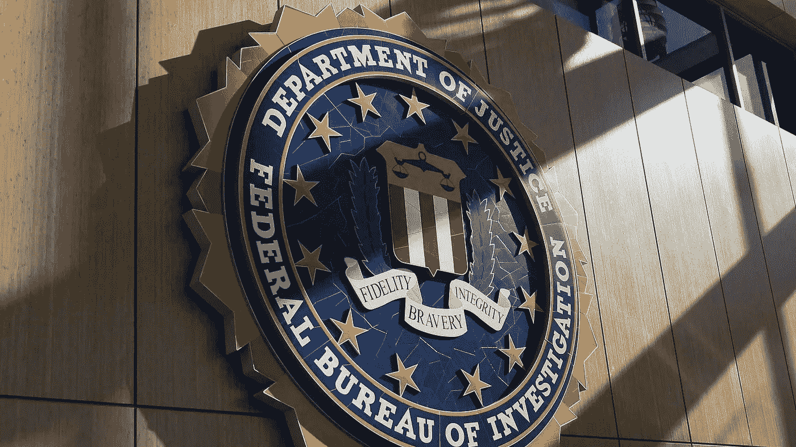

# 虚假的网络安全警报是从被黑的联邦调查局电子邮件服务器发出的

> 原文：<https://blog.devgenius.io/fake-cybersecurity-alerts-were-sent-out-from-the-hacked-fbis-email-server-b72ed81cc69a?source=collection_archive---------2----------------------->

从 trbimg.com 取回

美国联邦调查局(FBI)的电子邮件服务器遭到黑客攻击，发送假冒 FBI 警告的垃圾邮件，称收件人的网络遭到破坏，数据被盗。这些电子邮件似乎是在警告一个名叫文尼·特罗亚的高级威胁演员所犯下的*“复杂的连环攻击”*。

Troia 是两家黑暗网络情报公司 NightLion 和 Shadowbyte 的安全研究主管。据垃圾邮件追踪组织 SpamHaus 称，今天早上有数千封这样的邮件分两卷分发。他们觉得这只是整个运动策略的一小部分。

根据[传呼计算机](https://www.bleepingcomputer.com/news/security/fbi-system-hacked-to-email-urgent-warning-about-fake-cyberattacks/)的报告，网络罪犯能够向超过 10 万个地址发送电子邮件，所有这些都是从美国互联网号码注册(ARIN)数据库中收集的。据[彭博](https://www.bloomberg.com/news/articles/2021-11-14/fbi-says-no-network-data-compromised-after-fake-email-incident)称，他们利用了联邦调查局面向公众的电子邮件系统，使得交流显得更加官方。根据网络安全专家 Kevin Beaumont 的说法，电子邮件的标题通过域名密钥识别邮件(DKIM)程序验证为来自 FBI 服务器，这是 Gmail 在确认的公司电子邮件上放置品牌标志的方法的一部分。

[FBI 就事件](https://www.fbi.gov/news/pressrel/press-releases/fbi-statement-on-incident-involving-fake-emails)发表声明，称这是*“正在进行中的事情”*，*“受影响的硬件已经下线。”*除此之外，FBI 声称目前没有其他信息可以披露。

无论是谁在背后努力，都很可能试图破坏黑暗网络情报公司 Shadowbyte 的创始人 Vinny Troia，他在电子邮件中被称为虚假供应链攻击背后的威胁行动者。Troia 与 RaidForums 黑客社区的个人有着长期的竞争，他们经常破坏网站并进行小规模的黑客攻击，将其归咎于安全研究员。当[发推文](https://twitter.com/vinnytroia/status/1459515619838251010)时，Vinny Troia 暗示某个被确定为*“pombomourin”*的人可能是垃圾邮件企图的肇事者。根据 Troia 的说法，此人以前曾与旨在损害安全研究员名誉的行为有关联。

如果你喜欢这篇文章，并想支持我写更多这样的文章，考虑注册成为一个媒体成员。只需 5 美元，你就可以无限制地阅读媒体上的故事。

 [## 通过我的推荐链接加入 Medium—David Artykov

### 作为一个媒体会员，你的会员费的一部分会给你阅读的作家，你可以完全接触到每一个故事…

david-artykov.medium.com](https://david-artykov.medium.com/membership)