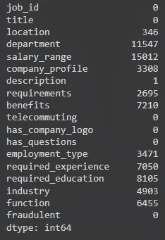
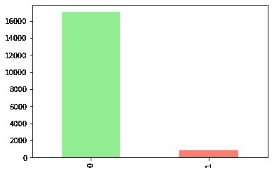
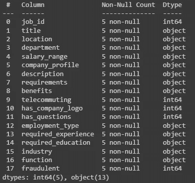
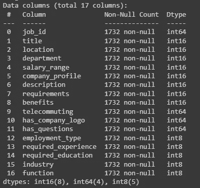
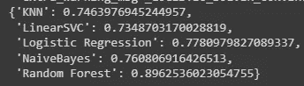
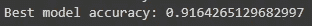

# 用机器学习进行假工作预测

> 原文：<https://blog.devgenius.io/fake-job-prediction-with-machine-learning-76b238c2d2e8?source=collection_archive---------8----------------------->


在机器学习中，分类问题可能是人们第一次学习该领域时首先学习的问题。我是作为数据科学家开始我的旅程的，所以为了练习，今天我们将使用著名的机器学习问题库，它提供了十几个内置模型，Scikit-learn。对于我们的数据，我们将使用来自 Kaggle 的 [Fake Jobs 数据集来查看我迄今为止的一些学习。这个想法是为了预测一些在互联网上发布的工作是真是假。我们将涵盖数据分析、数据清理、建模和改进超参数技术的基础知识。](https://www.kaggle.com/shivamb/real-or-fake-fake-jobposting-prediction)

让我们开始吧，我们的第一步是导入一些在数据处理过程中对我们有用的包，并从 Kaggle 下载数据集。

```
# Import tools we needimport pandas as pdimport numpy as npimport matplotlib.pyplot as pltfrom sklearn.model_selection import train_test_splitfrom sklearn.metrics import accuracy_score# Import datadata = pd.read_csv("fake_job_postings.csv")data.head()
```


正如我们所看到的，我们的数据有一些 NaN 值，这是一个大问题。让我们验证有多少列有 NaN 值。

```
data.isna().sum()
```



我们可以用一系列技术来解决这个问题，其中之一就是用零填充缺失的数据。

```
data = data.fillna(0)
```

正如我们在下图中看到的，我们在每个标签的数据量上有很大的差异，如果与“1-假工作”相比，标签“0-真工作”的数据大约多 20 倍。



有多种技术可以解决这个问题，其中一种称为“非抽样”，即从标签 0 开始减少样本数，直到与标签 1 的大小相同。

```
# Shuffle the Datasetshuffled_df = data.sample(frac=1,random_state=4)# Get only fraudulent valuesfraudulent_df = shuffled_df.loc[shuffled_df["fraudulent"] == 1]# Get only non-fraudulent valuesnon_fraudulent_df = shuffled_df.loc[shuffled_df["fraudulent"] == 0].sample(n=len(fraudulent_df),random_state=42)# Concat the fraudulent and non-fraudulent values in one datasetdf = pd.concat([fraudulent_df, non_fraudulent_df])
```

我们已经解决了数据中的两个问题，但还剩下一个。我们数据的某些列不是数值，这将很快成为训练我们机器学习模型的问题。

```
df.head().info()
```

我们可以看到，非数字数据的类型为“object”。



让我们将数据转换成分类格式，这将为列中的每个不同值生成一些“代码”。

```
# Turn into categorical 
for label, content in df.items():if pd.api.types.is_string_dtype(content):df[label] = content.astype("category").cat.as_ordered()# Turn categorical variables into numbersfor label, content in df.items():if not pd.api.types.is_numeric_dtype(content):df[label] = pd.Categorical(content).codes+1
```



正如我们所看到的，我们的数据现在是数字格式，我们可以在将数据分成训练集和测试集之后建模。

```
# Split data into train and test setX_train, X_test, y_train, y_test = train_test_split(X, y, test_size=0.2)
```

对于建模部分，让我们开始检查哪些算法在我们的数据中执行得最好，然后选择最好的，并调整它以获得可能的最佳精度。

```
# Put models in a dictionarymodels = {"KNN": KNeighborsClassifier(),"LinearSVC": LinearSVC(),"NaiveBayes": GaussianNB(),"Logistic Regression": LogisticRegression(),"Random Forest": RandomForestClassifier()} # Create function to fit and score modelsdef fit_and_score(models, X_train, X_test, y_train, y_test):# Random seed for reproducible resultsnp.random.seed(42)# Make a list to keep model scoresmodel_scores = {}# Loop through modelsfor name, model in models.items():# Fit the model to the datamodel.fit(X_train, y_train)# Evaluate the model and append its score to model_scoresmodel_scores[name] = model.score(X_test, y_test)return model_scores fit_and_score(models=models, X_train=X_train, X_test=X_test, y_train=y_train, y_test=y_test)
```



我们用 RandomForestClassifier 在测试数据中获得了大约 90%的准确率**，这是相当不错的。但是我们仍然可以调整模型超参数，看看是否在我们的数据中表现得更好。超参数调整有很多方法，但我们将使用 [RandomizedSearchCV](https://scikit-learn.org/stable/modules/generated/sklearn.model_selection.RandomizedSearchCV.html) ，它让我们为超参数提供一系列值，然后随机选择性能最佳的一个。**

```
from sklearn.model_selection import RandomizedSearchCVn_estimators = [int(x) for x in np.linspace(start = 100, stop = 1000, num = 10)]max_features = ['auto', 'sqrt']max_depth = [int(x) for x in np.linspace(10, 110, num = 11)]max_depth.append(None)min_samples_split = [2, 5, 10]min_samples_leaf = [1, 2, 4]random_grid = {'n_estimators': n_estimators,'max_features': max_features,'max_depth': max_depth,'min_samples_split': min_samples_split,'min_samples_leaf': min_samples_leaf}rf_random = RandomizedSearchCV(estimator = rf, param_distributions = random_grid, n_iter = 100, cv = 3, verbose=2, random_state=42, n_jobs = -1)rf_random = rf_random.fit(X_train, y_train)# Best random modelpreds_best_random = rf_random.predict(X_test)print(f"Best model accuracy: {accuracy_score(y_test, preds_best_random)}")
```



我们有将近 92%的准确率！！！这很好，如果我在随机搜索中使用更多的超参数，可能会更好或更差，这取决于每个问题。

我在 medium 上完成了我的第一个完整的机器学习实现教程/过程，听起来不错…

**对我帮助很大的资源:**

[完全机器学习&数据科学训练营 2022](https://www.udemy.com/course/complete-machine-learning-and-data-science-zero-to-mastery/)

[超参数调优 Python 中的随机森林](https://towardsdatascience.com/hyperparameter-tuning-the-random-forest-in-python-using-scikit-learn-28d2aa77dd74?gi=a2dc21967f4a)