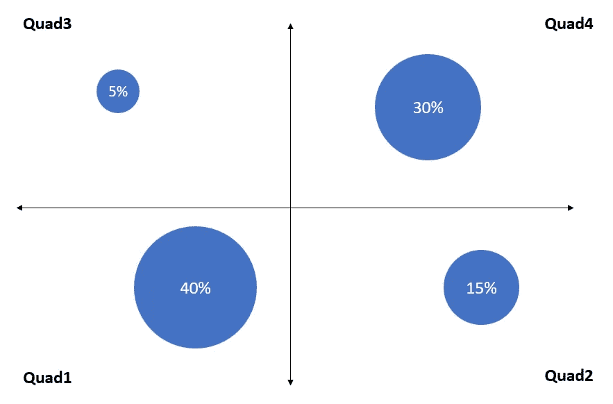
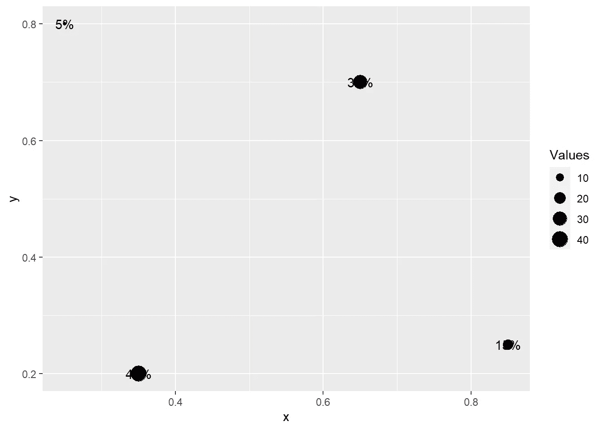
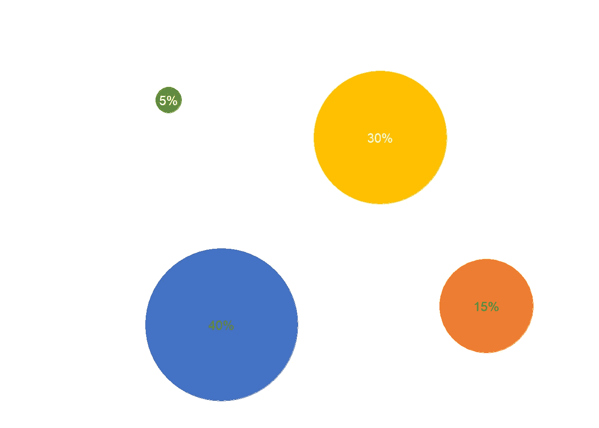
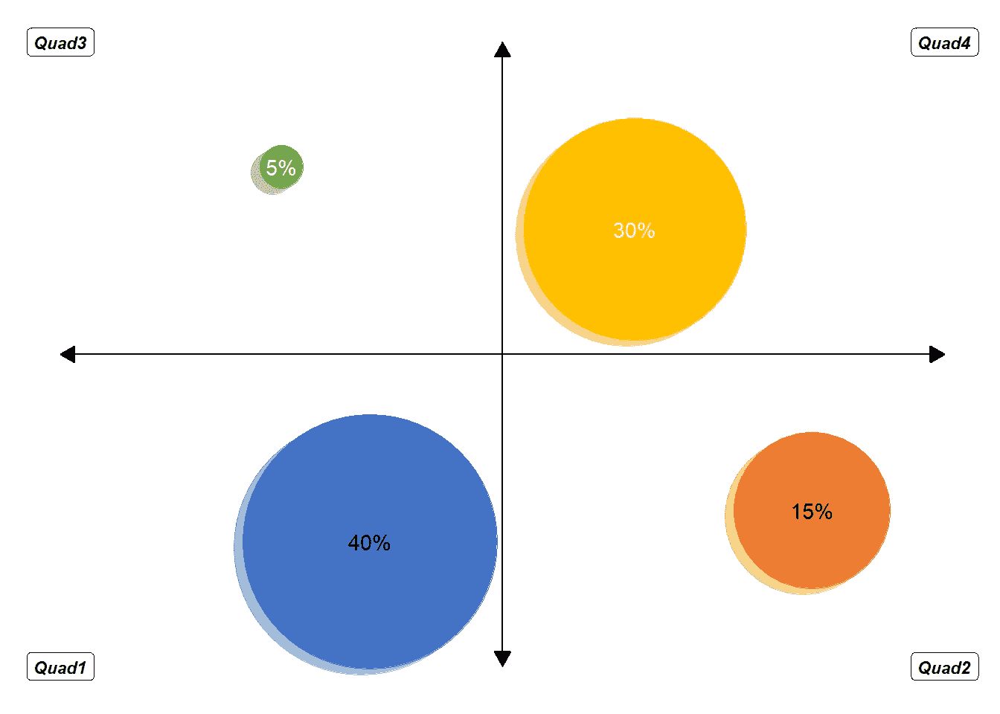

# 使用 ggplot2 的花式气泡图

> 原文：<https://blog.devgenius.io/fancy-bubble-plot-using-ggplot2-ab8efefffded?source=collection_archive---------12----------------------->

# 什么是 ggplot2？

如果您不熟悉 ggplot2，它是一个流行的 R 库，用于创建图形和图表。别担心，我将带您了解一些基本的 ggplot2 术语。更多详情可以参考—[https://ggplot2.tidyverse.org/](https://ggplot2.tidyverse.org/)

# 我们想要实现什么？

我们是不是觉得有点不可思议？让我们试着复制下图。



花式气泡图

一个漂亮的气泡图，你可以用它来绘制两个变量的数据，这两个变量分别用 x 轴和 y 轴表示。天平可能会从好变坏，同意不同意等等。当你从左到右或从上到下移动时。相应地，您可以为象限想出实际上有意义的特殊名称。4 个气泡中的%s 加起来是 100%。

为了生成此图，我将创建一个合成数据，并且为了方便起见，对 4 个象限中的每一个都使用了通用标签。

# 用 PowerPoint 制作这个图表不是更容易吗？

是的，当然。你可以用 PowerPoint 或 Excel 或 Word 在几分钟内创建它。那么，为什么要大费周章地通过代码创建它呢？

1.  作为一种学习活动。创建这样的图表有助于我更深入地了解 ggplot2 的工作原理。
2.  如果您必须在基于 web 的仪表板上添加这样的图表，或者每两周或每月定期重新创建该图表，这将非常方便。

# 那我们开始吧

## 加载库

第一步是确保我们有必要的库。我将使用 data.table、scales 和 ggplot2。您可以坚持使用基本的 data.frame 类，但我喜欢使用 data.table. 'scales '库帮助将数字显示为百分比、逗号或美元或其他格式。

不过，我会先打电话给吃豆人图书馆。使用“pacman”加载库的优点是，如果您的环境中没有所需的库，它会安装这些库，而不是抛出错误。

```
# install 'pacman' package if it isn't already installed
if (!require(pacman)) install.packages("pacman")

# load the 'pacman' library in the environment
library(pacman)

# load 'data.table' and 'ggplot2'
p_load(data.table, ggplot2, scales)
```

## 获取您的数据

我将为此演示创建一个虚拟数据集。数据集包含 6 列:

*   “象限”:4 个象限的名称/标签。
*   “值”:要在气泡中显示的值。这些也决定了气泡的大小。
*   “fillCol”:每个气泡的颜色。我给每个气泡不同的颜色，但如果你想坚持蓝色，你可以复制相同的颜色 4 次，或在' geom_point '函数调用中将其作为字符串提供给' fill '参数。这将在文件的后面部分介绍。
*   “fontCol”:每个气泡内显示的值标签的颜色。同样，如果您计划坚持使用相同的颜色，要么复制相同的颜色 4 次，要么在“geom_text”函数调用中将 is 作为字符串提供给“color”参数。
*   “x”和“y”:这是 4 个气泡的 x 和 y 坐标。我选择了以下坐标作为开始:

1.  (0.35，0.2)用于四分之一气泡
2.  (0.85，0.25)用于第二象限气泡
3.  (0.25，0.8)适用于 Quad3 气泡
4.  (0.65，0.7)用于四边形 4 气泡

如果需要，我们可以稍后更改坐标。

```
DT <- data.table(
  Quad = c("Quad1", "Quad2", "Quad3", "Quad4"),
  Values = c(40, 15, 5, 30),
  fillCol = c("#4472C4", "#ED7D31", "#70AD47", "#FFC000"),
  fontCol = c("black", "black", "white", "white"),
  x = c(0.35, 0.85, 0.25, 0.65),
  y = c(0.2, 0.25, 0.8, 0.7)
)
```

## 绘制图表

现在我们已经有了所有需要的信息，让我们开始构建情节。

“ggplot2”按照调用函数的顺序在层中构建图表。使用“ggplot”函数实例化绘图，然后您可以调用其他函数，如:

*   “几何点”(散点图)
*   “几何线”(折线图)
*   '几何条形图'(条形图)
*   geom_text '(标签)

因此，如果我们调用 ggplot+geom _ point+geom _ line+geom_text，gg plot 将首先创建散点图，将线图覆盖在它的顶部，由“geom _ text”生成的标注将是最顶层或最后一层。

这些函数中的每一个，包括“ggplot”都可以:

*   数据-用于绘图的数据集
*   aes(美学的缩写)-x 轴和 y 轴的参考列，这些列包含关于在绘制之前对数据进行分组的信息、颜色、标签等。

如果我们知道每个元素将使用相同的数据，x 和 y 坐标，那么在“ggplot”函数调用中提及这些数据会更容易，并且默认情况下后续函数将“继承”这些信息。

除此之外，每个函数都有自己的一组参数。

首先，我将创建一个带有标准主题格式的图表。

```
# 'ggplot' instantiates the plot
ggplot(
  data = DT, # The main dataset for the plot that other functions can inherit
  # aesthetics     
  aes(
         x = x, # Column in dataset with x coordinates
           y = y # Column in dataset with y coordinates
         )) +
  geom_point(
    # aesthetics specific to 'geom_point' function
    aes(
      size = Values # Column in dataset that determines size of the bubbles
      )) +
  geom_text(
    # aesthetics specific to 'geom_text' function
    aes(
      label = scales::percent(Values/100, 1) # Column in dataset to be used for labels. We divide the values by 100 and apply 'percent' formatting from 'scales' library
      ))
```



我们正在实现这一目标，但仍有许多工作要做:

*   将 x 轴和 y 轴的界限扩展为 0 到 1
*   气泡尺寸需要更大
*   为标签和气泡应用颜色
*   摆脱

1.  x 和 y 轴标签和标题
2.  神话；传奇
3.  网格线

```
ggplot(data = DT,
       aes(x = x,
           y = y)) +
  geom_point(aes(
    size = Values),
    color = DT$fillCol # Column in dataset that has color information
    ) +
  scale_size(
    range = c(10, 60) # Rescales the values so the bubbles are bigger
    ) +
  geom_text(aes(
    label = scales::percent(Values/100, 1)),
    color = DT$fontCol # Column in the dataset that as color information
    ) +
  ylim(0, 1) + # Sets limits of y-axis
  xlim(0, 1) + # Sets limits of x-axis
  theme_minimal() + # preset theme with 'white' background
  theme(
    axis.text = element_blank(), # Remove x and y axis labels
    axis.title = element_blank(), # Remove x and y axis titles
    panel.grid = element_blank(), # Remove major and minor gridlines
    legend.position = "none" # Remove legend
  )
```



注意我们是如何指定 DT$fillCol 而不是 fillCol 的。这是因为我们在“美学”之外设置了“颜色”参数。如果我们在“美学”中指定了“颜色”参数，我们就会使用 fillCol。根据参数设置的位置，会影响 ggplot 对它的处理方式。我不想深入细节，因为这超出了本文的目的，但是我鼓励您尝试一下。

好吧，我们的图表看起来还不错。

我们正在接近。最后几次调整:

*   添加两端带箭头的水平线和垂直线
*   四标签

然而，这些元素使用不同的 x 和 y 坐标。例如，垂直线将绘图一分为二，左半部分和右半部分大小相等。所以，我们可以想象这条线连接(0.5，0)和(0.5，1)坐标。类似地，水平线将图分成两半，上半部分和下半部分大小相等。在这种情况下，我们可以想象连接(0，0.5)和(1，0.5)坐标的水平线。

在同一行上，我们可以想象象限标签具有以下坐标:

*   象限 1: (0，0)
*   象限 2: (1，0)
*   象限 3: (0，1)
*   象限 4: (1，1)

解决这个问题的方法是在各自的函数调用中提供 x 和 y 坐标，而不是让它们从“ggplot”函数调用中“继承”这个信息。

```
ggplot(data = DT,
       aes(x = x,
           y = y)) +
  # Vertical line
  geom_line(
    # Dataset for plotting the vertical line
    data = data.table(
      x = c(0.5, 0.5), # x coordinates for the vertical line
      y = c(0, 1) # y coordinates for the verticle line
    ),
    # aesthetics
    aes(
      x = x,
      y = y
    ),
    # draw arrows
    arrow = arrow(
      ends = "both", # arrows required on both ends of the line
      length = unit(0.3, "cm"), # size of the arrow
      type = "closed" # type of the arrow. 'closed' creates an arrows that resembles a filled triangle. 'open' creates an arrows that looks like > or < depending the end of the line
      )
  ) +
  # horizontal line. I am not repeating the comments as they are similar to what we used for creating the 'vertical' line except for the x and y coordinates
  geom_line(
    data = data.table(
      x = c(0, 1),
      y = c(0.5, 0.5)
    ),
    aes(
      x = x,
      y = y
    ),
    arrow = arrow(
      ends = "both",
      length = unit(0.3, "cm"),
      type = "closed"
      )
  ) +
  geom_point(aes(
    size = Values),
    color = DT$fillCol) +
  scale_size(range = c(10, 60)) +
  geom_text(aes(
    label = scales::percent(Values/100, 1)),
    color = DT$fontCol) +
  # Label for quadrants
  geom_text(
    # Dataset used for labeling the Quadrants
    data = data.table(
      Quad = DT$Quad, # We pull the quardrant labels from 'Quad' column of 'DT' dataset
      x = c(0, 1, 0, 1), # x coordinates
      y = c(0, 0, 1, 1) # y coordinates
    ),
    # aesthetics
    aes(x = x, y = y, label = Quad)) +
  ylim(0, 1) +
  xlim(0, 1) +
  theme_minimal() +
  theme(
    axis.text = element_blank(),
    axis.title = element_blank(),
    panel.grid = element_blank(),
    legend.position = "none"
  )
```


我们定义“几何线”函数，在调用“几何点”之前创建垂直线和水平线，以便气泡绘制在线上，而不是相反。请注意“Quad4”中的“黄色”气泡是如何与水平线重叠的。如果我们在“几何点”之后调用“几何线”，水平线将会与“黄色”气泡重叠。

# 我们能把它变得更别致吗？也许吧，

我们可以添加另一个气泡图来增加阴影效果。这可以通过简单地复制生成气泡图的代码并稍微改变 x 和 y 坐标来实现，然后依靠‘geom _ point’的‘alpha’参数来增加透明度。

```
ggplot(data = DT,
       aes(x = x,
           y = y)) +
  # Vertical line
  geom_line(
    # Dataset for plotting the vertical line
    data = data.table(
      x = c(0.5, 0.5), # x coordinates for the vertical line
      y = c(0, 1) # y coordinates for the verticle line
    ),
    # aesthetics
    aes(
      x = x,
      y = y
    ),
    # draw arrows
    arrow = arrow(
      ends = "both", # arrows required on both ends of the line
      length = unit(0.3, "cm"), # size of the arrow
      type = "closed" # type of the arrow. 'closed' creates an arrows that resembles a filled triangle. 'open' creates an arrows that looks like > or < depending the end of the line
      )
  ) +
  # horizontal line. I am not repeating the comments as they are similar to what we used for creating the 'vertical' line except for the x and y coordinates
  geom_line(
    data = data.table(
      x = c(0, 1),
      y = c(0.5, 0.5)
    ),
    aes(
      x = x,
      y = y
    ),
    arrow = arrow(
      ends = "both",
      length = unit(0.3, "cm"),
      type = "closed"
      )
  ) +
  # Create another set of bubbles to add shadow effect
  geom_point(aes(
    x = (x - 0.01), # x coordinates from the 'DT' dataset are shifted by 0.01
    y = (y - 0.01), # y coordinates from the 'DT' dataset are shifted by 0.01
    size = Values),
    color = DT$fillCol,
    alpha = 0.5 # makes the bubbles transparent
    ) +
  geom_point(aes(
    size = Values),
    color = DT$fillCol) +
  scale_size(range = c(10, 60)) +
  geom_text(aes(
    label = scales::percent(Values/100, 1)),
    color = DT$fontCol) +
  # Label for quadrants
  ## Geom label is essentially same as 'geom_text' except that it adds a background to the text.
  geom_label(
    # Dataset used for labeling the Quadrants
    data = data.table(
      Quad = DT$Quad, # We pull the quardrant labels from 'Quad' column of 'DT' dataset
      x = c(0, 1, 0, 1), # x coordinates
      y = c(0, 0, 1, 1) # y coordinates
    ),
    # aesthetics
    aes(x = x, y = y, label = Quad),
    size = 3, # Size of the labels
    fontface="bold.italic" # Make the font bold and italic
    ) +
  ylim(0, 1) +
  xlim(0, 1) +
  theme_minimal() +
  theme(
    axis.text = element_blank(),
    axis.title = element_blank(),
    panel.grid = element_blank(),
    legend.position = "none"
  )
```



# 概述

在本文中，我们介绍了:

*   ggplot 简介
*   分层的概念
*   关键功能-几何图形，几何点，几何线，几何文本
*   如何提供数据、美学和其他功能参数
*   控制绘图的不同方面，如“轴标签”、“轴标题”、“网格线”、“图例”到“主题”

如果你觉得这篇文章有用并有任何反馈，请留下评论。快乐学习👍。