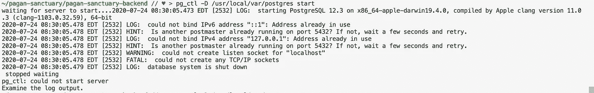
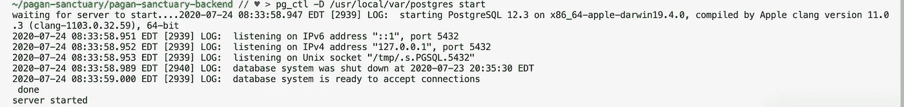
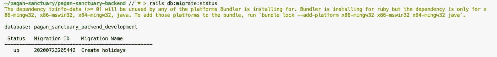

# 神奇的 PostgreSQL 和如何让它在 MacOS 上工作

> 原文：<https://blog.devgenius.io/fantastic-postgresql-and-how-to-make-it-work-on-macos-ef839ff0aeb4?source=collection_archive---------10----------------------->


PostgresSQL 徽标

正如官方网站所说，PostgreSQL 是一个强大的开源对象关系数据库系统。使用 PostgreSQL 的主要好处是显而易见的:如果你想通过 [Heroku](https://www.heroku.com/) 将你的惊人项目部署到网络上，你最好使用它。

然而，让 PostgreSQL 工作起来可能真的很有挑战性。我已经尝试了几种安装 PostgreSQL 的方法(通过直接下载，gems 等)，但是当我试图初始化我的数据库时，总是出现这个错误。

```
FATAL:  password authentication failed for user "username"
Couldn't create 'new_app' database. Please check your configuration.
rails aborted!
```

我搜索了堆栈溢出，但我尝试的每一个建议都不适合我。终于碰到[这个教程](https://www.robinwieruch.de/postgres-sql-macos-setup)真的很有帮助。让我给你演示一下，并展示我得到的其他错误。

**第 0 步**:卸载现有的 PostgreSQL

如果你试图安装 PostgreSQL 但没有成功，你要做的第一件事就是从你的本地机器上删除它并卸载 gem。

```
$ gem uninstall pg
$ brew uninstall postgresql
```

有时候这一小步可以解决你遇到的所有问题！

**第一步:**安装 PostgreSQL 并检查你的版本

```
brew update
brew install postgresql
```

之后，确保您使用的是 PostgreSQL 的最新版本，以避免进一步的错误。

```
postgres --version
```

*边注:* [强烈推荐使用家酿](https://brew.sh/)包在 MacOS 上安装和管理应用。下面是一个安装命令。

```
/bin/bash -c "$(curl -fsSL [https://raw.githubusercontent.com/Homebrew/install/master/install.sh](https://raw.githubusercontent.com/Homebrew/install/master/install.sh))"
```

第二步:在你的硬盘上创建一个数据库

通常，硬盘上的数据库是自动创建的，但为了确保安全，请运行以下命令:

```
initdb /usr/local/var/postgres
```

如果创建了数据库，您将看到以下错误消息:“initdb:directory”/usr/local/var/postgres”存在，但不为空

**步骤 3:** 启动您的 PostgreSQL 数据库

您可以使用以下命令手动启动数据库服务器:

```
pg_ctl -D /usr/local/var/postgres start
```

终端应该向您发送一个响应——“服务器已启动”。

这里我又得到了一个错误！



似乎另一个数据库正在我想使用的端口上运行。我试图停止数据库，然后重新启动，但它没有帮助。顺便说一下，要停止数据库，您可以使用这个命令。

```
pg_ctl -D /usr/local/var/postgres stop
```

所以，剩下的唯一办法就是杀死这只野兽。我是说，港口。


我用过

```
sudo pkill -u postgres
```

—实际上并不建议这样做，因为您看不到您要终止的是哪个端口。正如我后来发现的，更好的做法是使用`lsof -wni tcp:5432.`最后四位数字是您要终止的端口的编号。

无论如何，它工作得非常完美！如下图所示，我的数据库终于启动了。耶！



**步骤 4:** 为您的应用程序建立一个数据库

现在，当您的数据库打开时，您可以继续运行经典的:

```
rails new <my-project> --api -T --database=postgresql
rails db:create
rails db:migrate
rails db:seed
```

**第五步:**随时检查你的迁移！



哦，如果你有时间，请看看我的项目！现在已经播出了，只需 [**点击链接**](https://pagan-sanctuary.netlify.app/) 。

**来源:**

1.  【PostreSQL 官方网站
2.  [在 MacOS 上安装 PostgreSQL 的最佳教程](https://www.robinwieruch.de/postgres-sql-macos-setup)
3.  [无法打开端口 5432](https://github.com/PostgresApp/PostgresApp/issues/206)
4.  [当 Postgresql 不工作时](https://medium.com/@yutafujii_59175/pg-connectionbad-could-not-connect-to-server-no-such-file-or-directory-9a2eada16f9)
5.  [我的 MOD 4 熨斗项目](https://pagan-sanctuary.netlify.app/)