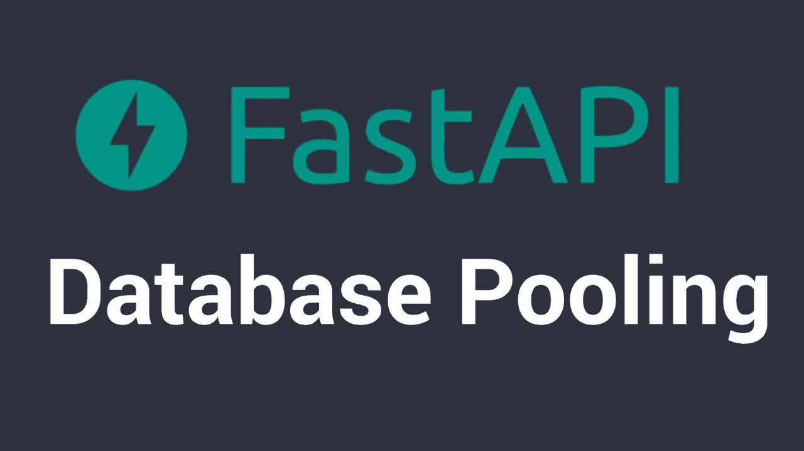
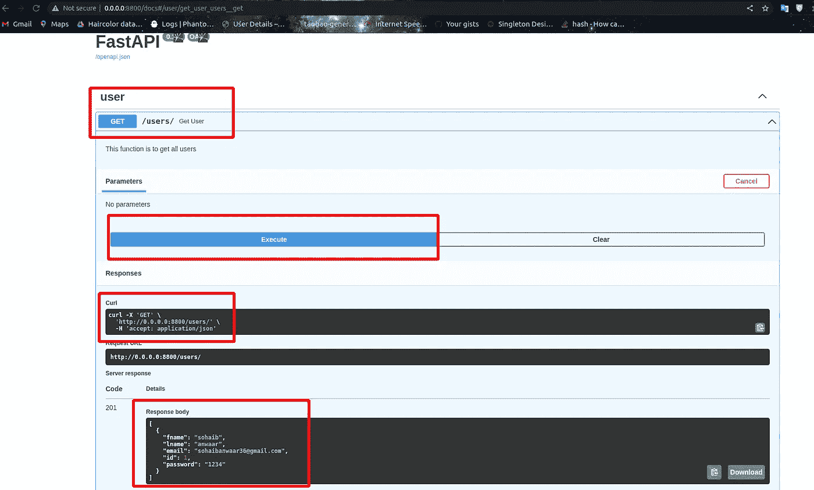

# 具有数据库连接池的快速应用编程接口

> 原文：<https://blog.devgenius.io/fast-api-with-db-connection-pools-cdfd6000827?source=collection_archive---------0----------------------->



# 问题陈述

当我们编写一个与数据库交互的快速 API 时，我们的系统会有更多的负载，其中大部分时间都被数据库连接占用了。

# 数据库连接的一些常见问题

1.  超过数据库连接限制
2.  数据库连接超时
3.  数据库连接未正确关闭
4.  数据库连接未正确释放

# 介绍

在这个 API 中，我们将看到如何使用 FastAPI 和 SQLAlchemy 创建一个带有数据库连接池的 API。这样我们就可以使我们的应用程序更具可扩展性和效率。

我们将在 Fast API 和 Postgres 数据库中创建一个用户模型。我们将使用 SQLAlchemy 作为与数据库交互的 ORM。

# 要求

1.  Python 3.6+

# 装置

1.  克隆存储库
2.  创建虚拟环境`conda create -n <env_name> python=3.6`
3.  安装要求`pip install -r requirements.txt`
4.  运行应用程序`uvicorn main:app --reload`

# 步伐

让我们在`main.py`中创建一个用户模型，在这个文件中，我们将提到快速 API，路由器，启动事件，关闭事件和数据库连接。

```
# Imports
from fastapi import FastAPI
from routers.user import view as userview
from database import engine
from connection_pool import database_instance
from fastapi.middleware.cors import CORSMiddleware
```

```
# Fast API
app = FastAPI()origins = ["*"]
# CORS
app.add_middleware(
    CORSMiddleware,
    allow_origins=origins,
    allow_credentials=True,
    allow_methods=["*"],
    allow_headers=["*"],
)# Including routers
app.include_router(userview.router)# Start up event
@app.on_event("startup")
async def startup():
    await database_instance.connect()# Main route
@app.get("/")
async def root():
    return {"message": "CMMS APP"}
```

让我们现在在`routers/user/models.py`制作一个用户模型我们的模型将会有 id，fname，lname，电子邮件，密码，我们将会使用 SQLAlchemy 作为一个表单来与数据库交互。

```
from sqlalchemy import Boolean, Column, ForeignKey, Integer, String
from sqlalchemy.orm import relationship
from database import Base
```

```
class User(Base):
    __tablename__ = "user" id = Column(Integer, primary_key=True, index=True)
    fname = Column(String)
    lname = Column(String)
    email = Column(String)
    password = Column(String)
```

现在我们在`routers/user/serializers.py`中为用户模型制作了序列化程序，这个序列化程序将帮助我们将数据从数据库转换成 python 对象，反之亦然。

```
from dataclasses import Field
from pydantic import BaseModel, EmailStr
from typing import Optional, List
from datetime import datetime
import uuid
```

```
class UserBase(BaseModel):
    id: int
    fname: str
    lname: str
    email: EmailStr
    password: str class Config:
        orm_mode = True
```

现在我们将在`routers/user/view.py`文件中为用户制作一个路由器，该文件将包含用户模型的所有路由，这将有助于我们与 API 进行通信。

```
from fastapi import status, HTTPException, Depends, APIRouter
from sqlalchemy.orm import Session
from database import get_db
from typing import Optional, List
from  routers.user.serializer import UserBase
from  routers.user import models
import time
from connection_pool import database_instance
```

```
router = APIRouter(
    prefix="/users",
    tags=['user']
)# Create a new area
@router.get("/", status_code=status.HTTP_201_CREATED)
async def get_user(db: Session = Depends(get_db)):
    """ 
    This function is to get all users
    """
    try:
        value = await database_instance.fetch_rows(query="SELECT * FROM public.user")
        return  value
    except Exception as err:
        print(err.args[0])
        raise HTTPException(status_code=status.HTTP_500_INTERNAL_SERVER_ERROR,
                            detail=err.args[0])
```

所以我们的 API 已经准备好了，让我们在`connection_pool.py`中建立一个数据库连接池

让我们制作`.env`文件

```
DATABASE_HOSTNAME="localhost"
DATABASE_PORT="5432"
DATABASE_PASSWORD="postgres"
DATABASE_NAME="test_fastapi"
DATABASE_USERNAME="postgres"
```

现在让我们制作一个设置文件，在`settings.py`中自动读取`.env`

```
from typing import Optional
from pydantic import BaseSettings
```

```
# This is a pydantic model for the enviroment variables
class Settings(BaseSettings):
    database_hostname: str
    database_port: str
    database_password: str
    database_name: str
    database_username: str class Config:
        env_file = ".env" settings = Settings()
```

`connection_pool.py`文件将帮助我们与数据库建立连接池

```
import asyncpg
# from psycopg2 import pool
from settings import settings 
```

```
class Database:
    def __init__(self):
        self.user = settings.database_username
        self.password = settings.database_password
        self.host = settings.database_hostname
        self.port = "5432"
        self.database = settings.database_name
        self._cursor = None self._connection_pool = None
        self.con = None async def connect(self):
        if not self._connection_pool:
            try:
                self._connection_pool = await asyncpg.create_pool(
                    min_size=1,
                    max_size=10,
                    command_timeout=60,
                    host=self.host,
                    port=self.port,
                    user=self.user,
                    password=self.password,
                    database=self.database,
                ) except Exception as e:
                print(e) async def fetch_rows(self, query: str):
        """
        Function to fetch rows from the database
        """
        if not self._connection_pool:
            await self.connect()
        else:
            self.con = await self._connection_pool.acquire()
            try:
                result = await self.con.fetch(query)
                print("Results", result)
                return result
            except Exception as e:
                print(e)
            finally:
                await self._connection_pool.release(self.con) database_instance = Database()
```

现在，让我们在 Postgres 数据库中手动创建一个表，其中包含用户名和列 id、fname、lname、电子邮件、密码

```
CREATE TABLE public.user
(
    id integer NOT NULL DEFAULT nextval('user_id_seq'::regclass),
    fname character varying COLLATE pg_catalog."default" NOT NULL,
    lname character varying COLLATE pg_catalog."default" NOT NULL,
    email character varying COLLATE pg_catalog."default" NOT NULL,
    password character varying COLLATE pg_catalog."default" NOT NULL,
    CONSTRAINT user_pkey PRIMARY KEY (id)
)
```

现在让我们运行我们的 API

```
uvicorn main:app --reload
```

现在去你的浏览器，点击`http://localhost:8000/docs/`你会看到你的 API 的文档

```
[
    {
        "id": 1,
        "fname": "sohaib",
        "lname": "anwaar",
        "email": "sohaibanwaar36@gmail.com"
    }
]
```

# 斯瓦格用户界面



# GitHub 回购

[https://github.com/SohaibAnwaar/FastApi-SqlAlchemy](https://github.com/SohaibAnwaar/FastApi-SqlAlchemy)

# 作者

*   sohaib an war:[https://www.sohaibanwaar.com](https://www.sohaibanwaar.com/)
*   Gmail:[sohaibanwaar36@gmail.com](mailto:sohaibanwaar36@gmail.com)
*   LinkedIn : [在这里做一些专业的谈话](https://www.linkedin.com/in/sohaib-anwaar-4b7ba1187/)
*   堆栈溢出:[在这里得到我的帮助](https://stackoverflow.com/users/7959545/sohaib-anwaar)
*   在这里查看我的杰作
*   GitHub : [在这里查看我的代码](https://github.com/SohaibAnwaar)