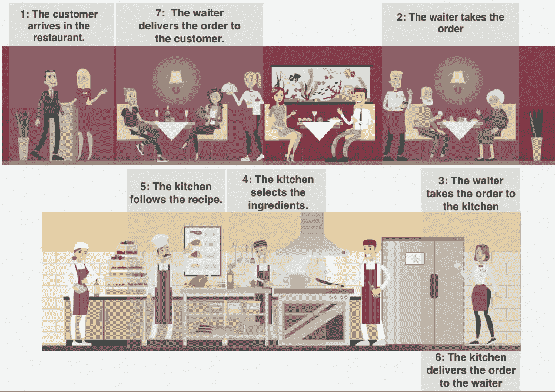
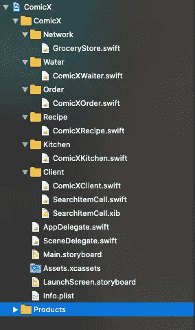
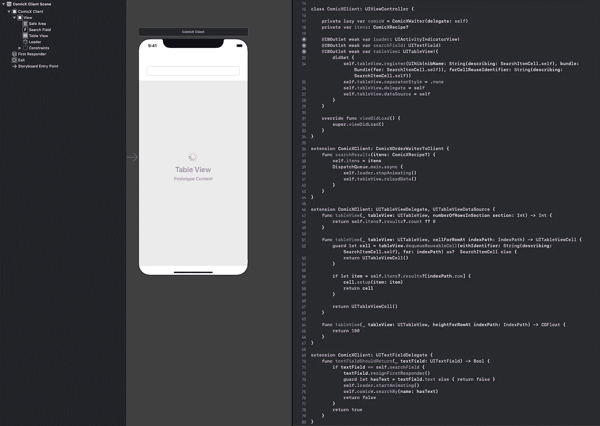
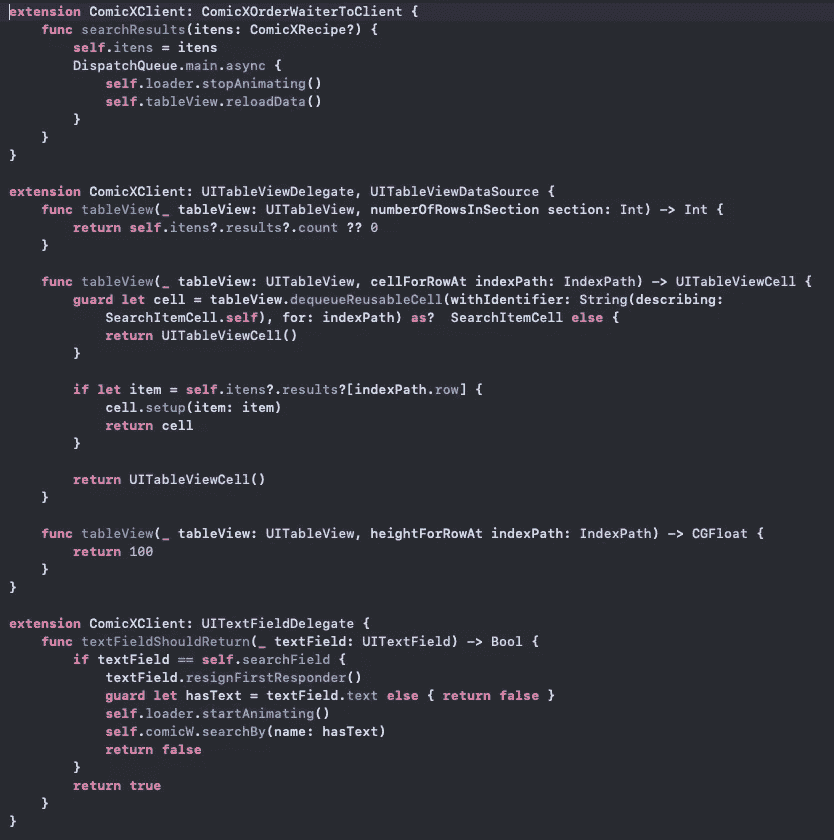
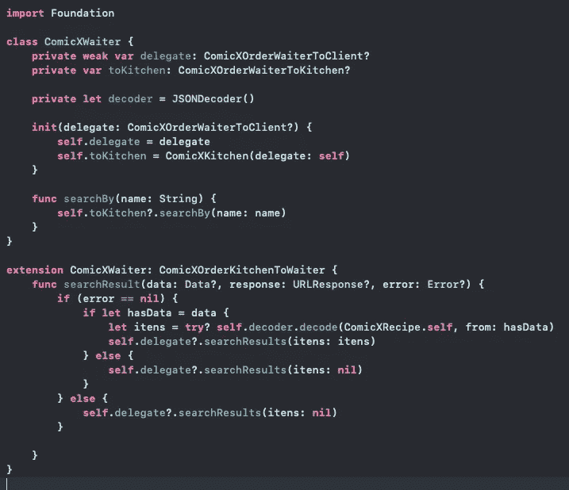
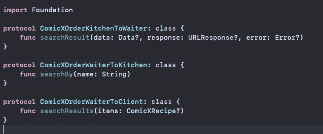
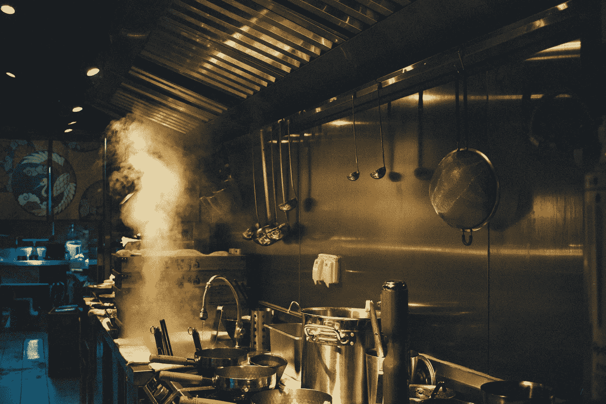
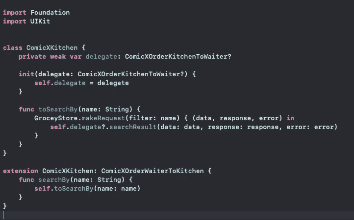
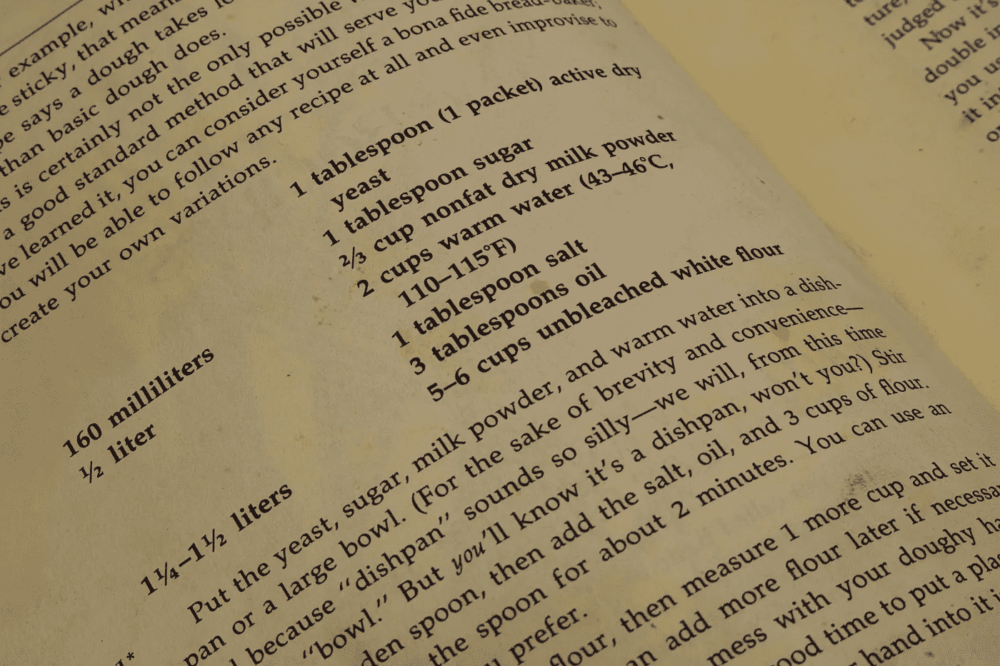
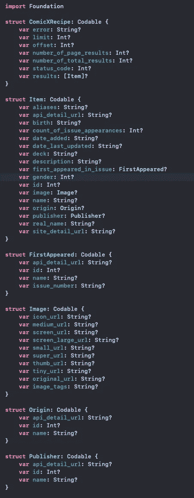

# 快餐建筑

> 原文：<https://blog.devgenius.io/fast-food-architecture-b087048cc4c8?source=collection_archive---------13----------------------->

> 移动软件开发架构的另一个愿景。

马尔科·奇里斯在 [Unsplash](https://unsplash.com/s/photos/restaurant-process?utm_source=unsplash&utm_medium=referral&utm_content=creditCopyText) 上的照片。

# **起初一切都是混乱的。**

订单是疯狂的，每个人都想要他们的食物。这就是我们决定尽快为饥饿的人们建造我们的建筑的原因。

> 该架构基于“干净的架构”。
> 
> 模型的总体视图

# **组织**

组织团体和档案。

# 客户

*客户端*

照片由 [NeONBRAND](https://unsplash.com/@neonbrand) 在 [Unsplash 上拍摄。](https://unsplash.com/s/photos/mobile?utm_source=unsplash&utm_medium=referral&utm_content=creditCopyText)

## 视图控制器

在架构中，一个*视图控制器*被命名为客户。

客户是为用户交互而可视化创建的每一个“屏幕”,只负责接收用户的交互，其他什么都不负责。

每一个“屏幕”，在其投影中，都将是一个顾客。

客户示例。

使用*扩展*来分隔代理，以获得更好的代码清晰度。

扩展示例。

# 服务员

*服务员*

凯特·汤森在 [Unsplash](https://unsplash.com/s/photos/waiter?utm_source=unsplash&utm_medium=referral&utm_content=creditCopyText) 上拍摄的照片。

## 视图模型

在建筑中，*视图模型*被命名为服务员，负责建立顾客与厨房之间的沟通。它还负责理解互动、顾客订单并将其引导到厨房，以及从厨房接收现成的饭菜。

服务员例子。

# *订单*

*订单*

在架构中， *Protocols* 被命名为一个订单，它负责控制服务员从厨房接收订单的流程，以便服务员能够正确地将其带给顾客。

订单示例

# 厨房

*厨房*

弗朗西斯科·苏亚雷斯在 [Unsplash](https://unsplash.com/s/photos/restaurant-kitchen?utm_source=unsplash&utm_medium=referral&utm_content=creditCopyText) 上拍摄的照片。

# 互动者

在建筑中，*互动者*被命名为厨房。

厨房负责不同的任务。其中一项任务是接收服务员的订单，并在准备好的时候送货上门。为此，它会在每一份具体的食谱和每一份订单中寻找必要的配料。它将能够在在线或离线环境中搜索配料，在我们的平台中，我们将其命名为*杂货店*。每个平台都将尽可能最好地利用*杂货店*。

厨房的例子。

# 食谱

*配方*

[李中清](https://unsplash.com/@picsbyjameslee)在 [Unsplash](https://unsplash.com/s/photos/recipe-book?utm_source=unsplash&utm_medium=referral&utm_content=creditCopyText) 上拍照。

# 模型

在建筑学中，*模型*被命名为配方。*模型*是每个配方的说明，是制作配方的必备项目。

厨房在*杂货店搜索到食材后，*会使用菜谱来点菜。它唯一的责任就是列出每一种特定食谱的必要成分。

食谱示例。

# 航行

*协调员*

使用*协调人*进行应用程序的每次导航，这是一个很好的资源。

在这篇文章中，你会得到很好的解释。

# 结论

这个想法是创建一个与现实世界的平行，以加速所有可能使用或维护代码的开发人员的理解，并试图创建一种新的“思考和看待”软件架构的方式。

*译自* [*译自*](https://www.instagram.com/ottonitatiana/)