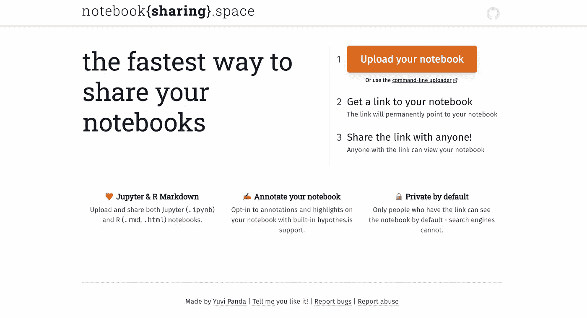
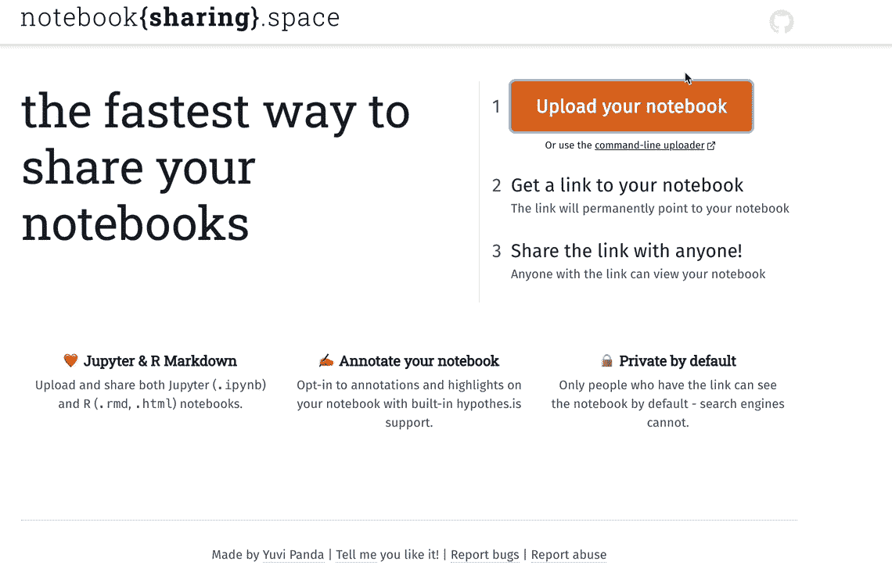

# 分享 Jupyter 笔记本的最快方式

> 原文：<https://blog.devgenius.io/fastest-way-to-share-jupyter-notebook-b03edc65561e?source=collection_archive---------14----------------------->

分享您的笔记本轻而易举

乔安娜·科辛斯卡在 [Unsplash](https://unsplash.com?utm_source=medium&utm_medium=referral) 上的照片

upyter 笔记本是我的最爱。作为一名数据科学家，它们是我日常工作流程中至关重要的工具，因为它们具有多种功能，包括记录我在自己喜欢的项目中尝试的内容，以及作为分析最终版本的自我参考格式，可以在 git 中提交并与我的团队共享。然而，当我有很多事情要做的时候，有时我会觉得通过 git 分享它有点乏味。

最近，我遇到了一个与任何人分享笔记本的救命稻草，我坚信这也可以帮助你的工作流程，它被称为**笔记本{分享}。空间**

[笔记本{分享}。在完全保密的情况下与任何人分享您的笔记本电脑是轻而易举的事情。是由](https://notebooksharing.space/)[yuvipanda](https://medium.com/u/9c7d747fb9c1?source=post_page-----b03edc65561e--------------------------------) 开发的。

笔记本{共享}的主页快照。空间。图片由作者提供。

## 特征

*   上传笔记本以获取可以与任何人共享的链接。
*   支持上传和渲染 Jupyter 笔记本和 RMarkdown 文件。
*   通过[假设选择加入注释支持](https://hypothes.is/)。
*   选择加入以允许搜索引擎发现您的笔记本。

## 演示

出于演示的目的，我想分享一个笔记本，关于[在 Python](https://towardsdatascience.com/surprisingly-effective-way-to-name-matching-in-python-1a67328e670e) 中惊人有效的名称匹配方法。

第一步:点击“上传笔记本”按钮

步骤 2:根据提示，选择您的笔记本，如果您希望搜索引擎发现并需要团队的注释，请分别单击“检查发现”和“注释”。

第三步:等待几秒钟得到结果。

第四步:复制整个网址，并与任何人分享。

这是我的

 [## 在 python . ipynb | notebook sharing . space 中进行名称匹配的惊人有效方法

### 编辑描述

笔记本分享. space](https://notebooksharing.space/view/32049f490d8c34ff37dce3a6e114241de4336e6b9da288660943d08573278f21#displayOptions=show-linenos%7Chide-inputs) 

作者 Gif。

与其他方法相比，这种方法节省了我很多时间，我希望它能对你的旅程有所帮助。试试吧，让我知道你对这个工具的看法。

# 推荐读物

*   [不是一个反对饼状图的人](https://uxdesign.cc/improving-your-dashboard-design-by-simply-changing-the-chart-type-94c449e510b4)
*   [大声思考观察——来自 LinkedIn 的案例研究](https://uxdesign.cc/think-aloud-observations-a-case-study-from-linkedin-ac9251f62586)
*   [如何在数据可视化中应用格式塔心理学原理](https://medium.com/nightingale/how-to-apply-gestalt-psychology-principles-in-data-visualization-6242f4f1a3de)