# FCM:使用 Firebase 函数推送通知

> 原文：<https://blog.devgenius.io/fcm-push-notifications-using-firebase-functions-3a6b93a8336a?source=collection_archive---------4----------------------->

## Flutter + Node.js + Flutter 本地通知

在这篇文章中，我将回顾我如何使用 FCM、Firebase 函数和 Flutter 本地通知来向用户发送新追随者的通知(这基本上是 [Firebase 的示例](https://github.com/firebase/functions-samples/blob/main/fcm-notifications/functions/index.js)的详细解释)。

# Flutter 本地通知入门

在此之前，你需要[在前端代码中设置 FCM](https://firebase.google.com/docs/cloud-messaging/flutter/client#platform-specific_setup_and_requirements) 。

## ios

[对于 iOS](https://firebase.flutter.dev/docs/messaging/apple-integration/#:~:text=Enable%20Push%20Notifications,Search%20for%20%22Push%20Notifications%22.) ，虽然苹果限制严格，但你需要加入[苹果开发者计划](https://developer.apple.com/programs/)，你还需要一个物理设备来接收消息。

1.  打开 **XCode** iOS 文件，点击 **top Runner 按钮**，你会看到如下标签:通用、签名&能力、资源标签等。
2.  点击**签名&功能，**并点击 **+功能** →“推送通知”。
3.  …其余的我不能做，因为我还没有注册苹果开发者计划:(

## 初始化 Firebase

```
flutter pub add firebase_messaging**// fcm service file** 
import 'package:firebase_core/firebase_core.dart'**;** import 'package:firebase_messaging/firebase_messaging.dart'**;**class FCMService {
  static Future<void> *initializeFirebase*() async => **await Firebase.*initializeApp*();** }**// main.dart**
void main() async  {
  **WidgetsFlutterBinding.*ensureInitialized*();
  await FCMService.*initializeFirebase*();** runApp(...)**;** }
```

## 初始化 Flutter 本地通知

我只会浏览 Android。这个过程在 [pub.dev](https://pub.dev/packages/flutter_local_notifications) 中有解释，但是简单总结一下:_localNotificationsPlugin 和 initializeNotification()用于初始化 flutter 本地通知，我在 main.dart 中这样做，还有前台消息和后台消息的处理程序。

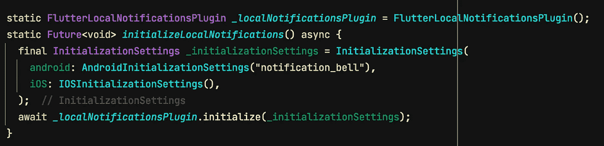

颤动—FCM 服务

对于 Android，需要将**默认图标文件名**放在 AndroidInitializationSettings()中，图标图片要放在**Android/app/src/main/RES/drawable 中。**然后，你还需要设置**通知细节**(还有很多设置你可以调，但我只做了最基本的)。如果你希望你的应用程序在前台运行时显示你的通知，优先级必须设置为 **Priority.high.**

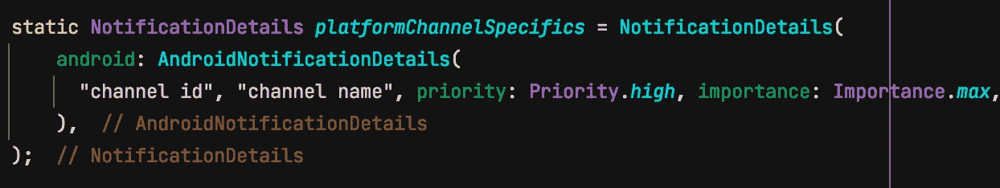

# 访问并保存注册令牌

我的应用程序一打开，它就检查服务器上是否有保存的设备令牌，如果没有，就发送一个新的设备令牌来保存。该令牌保存在 usersAuth/userUid/deviceToken 下。

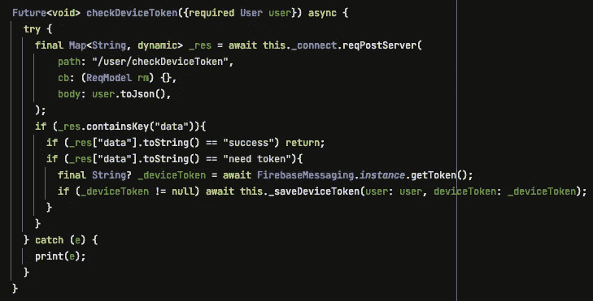

颤动—FCM 服务

一旦用户被设置为接收通知，并且另一个用户关注该用户，被关注的用户将接收到通过实时数据库触发功能发送的“新关注者”通知。

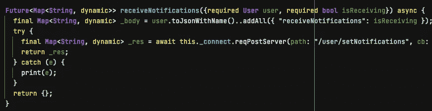

摆动

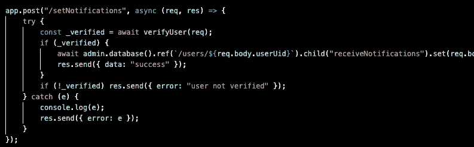

节点. js

## 保存关注者信息

当用户点击“关注”时，关注者的数据被保存到**followers/followed uid/follower uid**中，键/值为 **{ name: <关注者用户名>，deviceToken: <关注者设备令牌> }。**

然后，发送新的关注者通知的功能被触发。(1)当动作为“不跟随”时，存在该功能。(2)如果没有，则获取被关注用户的通知设置。(3)如果被跟踪的用户没有收到通知，则存在该功能。(4)如果被跟踪的用户收到通知，它将获得设备令牌并发送有效负载。

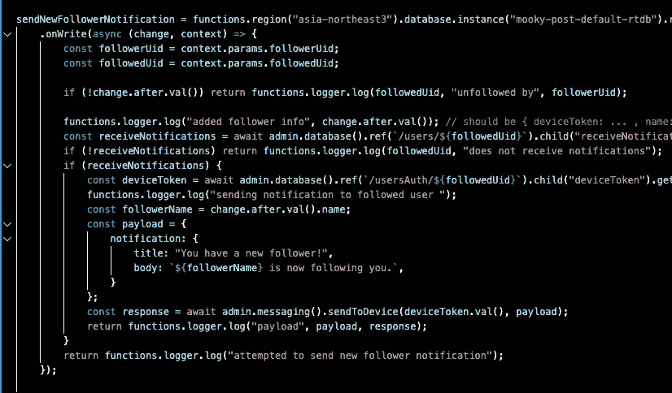

节点. js

# 接收 FCM

当应用程序在前台或后台运行时，我们是否收到消息决定了我们如何处理消息。这是我的 main.dart，初始化 flutter 本地通知，onBackgroundMessage()和 onMessage()。

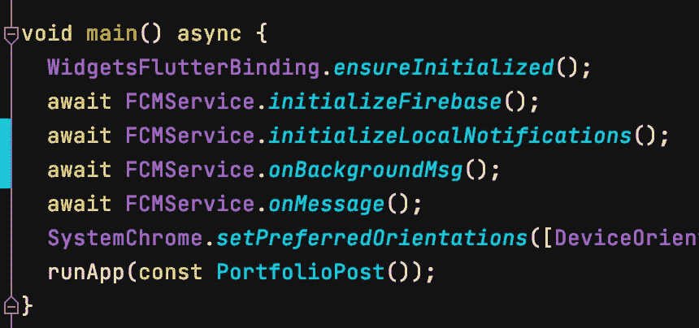

主.镖

同样，您可以在这里进行许多微调，为了简单起见，我没有这样做。有效负载是当用户点击通知时发送给 flutter 的消息(在初始化 Flutter 本地通知时通过 onSelect 处理程序处理——我没有实现它)。

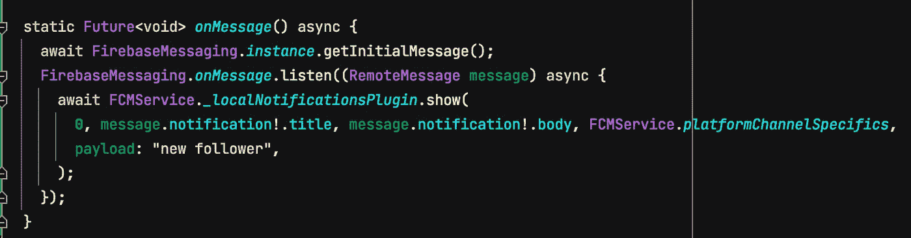

当应用程序在前台时

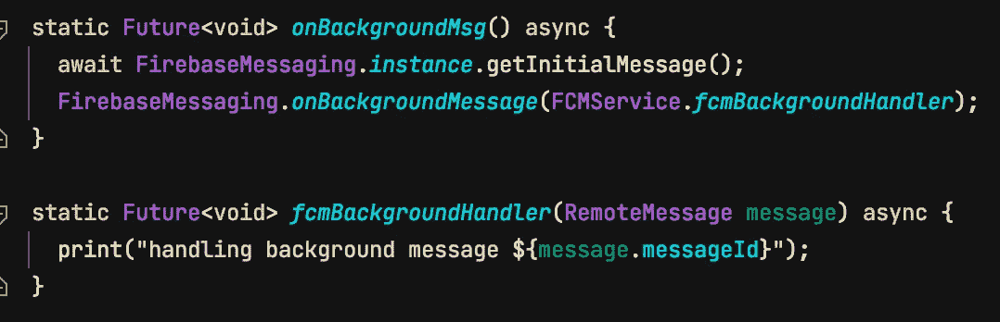

当 app 在后台时

> ***更新:*** *我发现****firebase messaging . instance****不应该被多次调用。请参考下面的更新代码。*

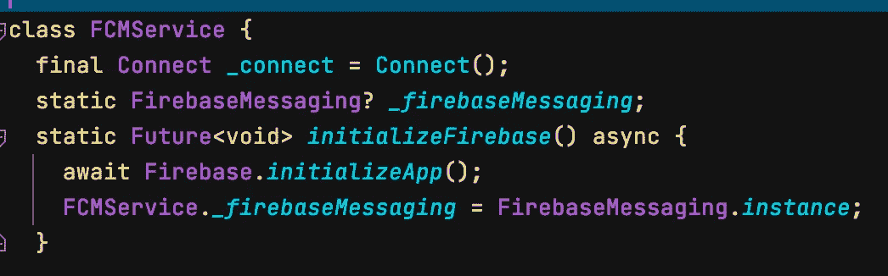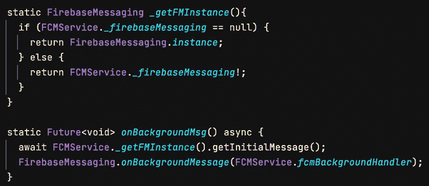

FCM 服务

这是一个视频，展示了当用户收到新的关注者时，我的通知是如何显示的。

[](https://youtube.com/shorts/YSICHAPJ8dc?feature=share) [## FCM & Flutter 本地通知

### 编辑描述

youtube.com](https://youtube.com/shorts/YSICHAPJ8dc?feature=share) 

对于任何想更详细地了解代码的人来说，这就是(这是我仍在做的一个作品集。

[](https://github.com/sookim482/portfolio_post) [## GitHub-sookim 482/portfolio _ post

### 一个新的颤振项目。这个项目是颤振应用的起点。一些帮助您入门的资源…

github.com](https://github.com/sookim482/portfolio_post)