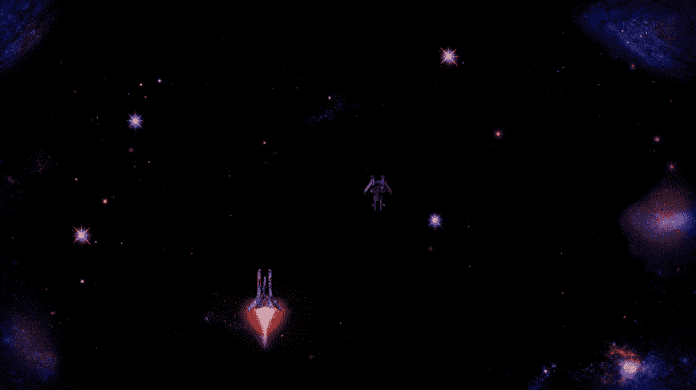
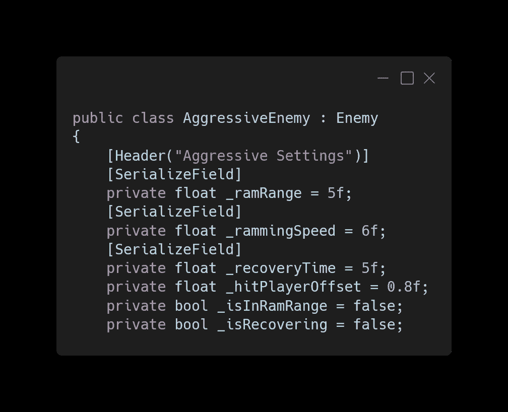
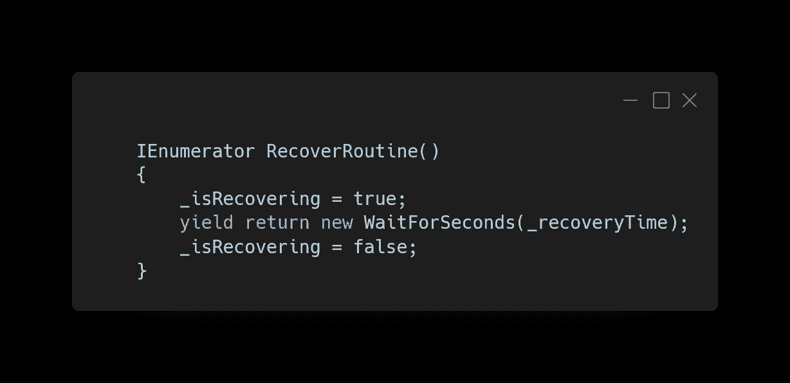
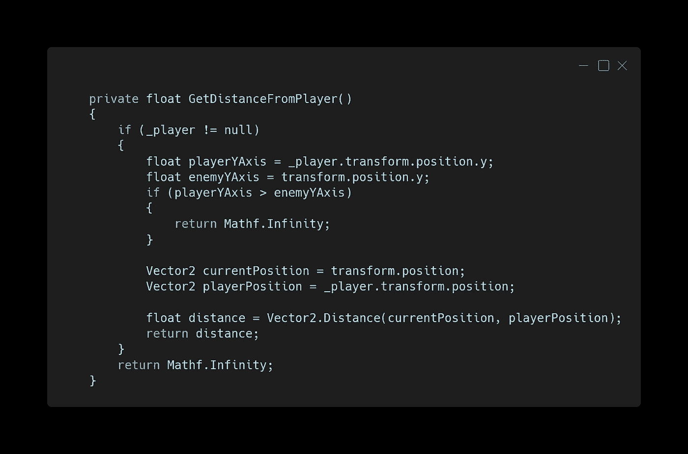
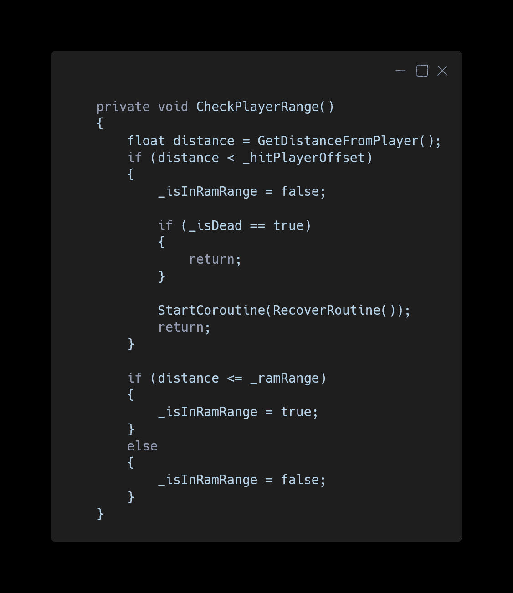
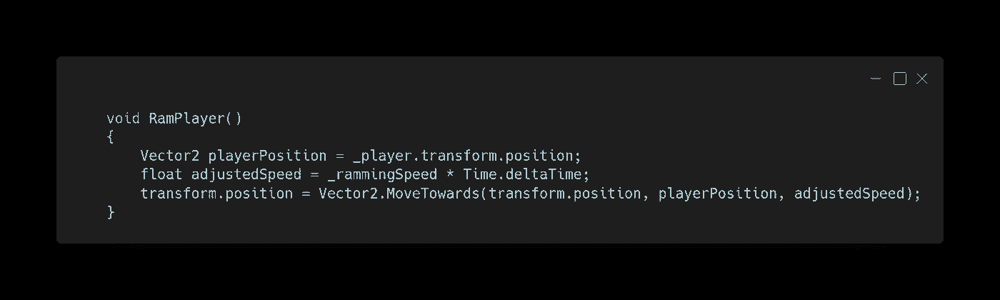
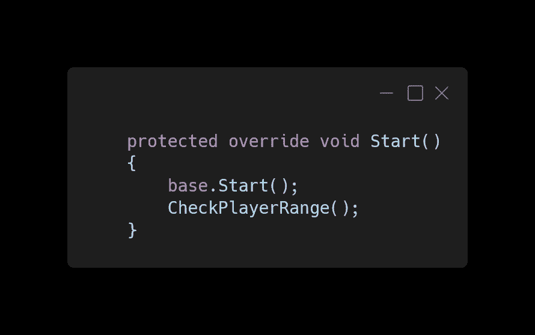
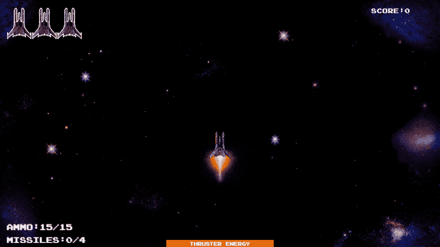

# 特点:冲撞敌人

> 原文：<https://blog.devgenius.io/feature-ramming-enemy-39984b3f5983?source=collection_archive---------14----------------------->

这篇文章将展示如何创造一个攻击性的敌人，当它在射程之内时会试图冲撞玩家。此外，敌人将确保玩家在他们面前，以避免向后移动，并有一个恢复期，如果没有被摧毁时，与玩家碰撞。

侵略敌人脚本将从抽象的阶级敌人继承。现在我们需要一些变量。首先是四个浮动，一个是检查敌人是否应该撞击的范围，第二个是撞击时的移动速度，第三个是恢复期的长度，最后一个是敌人看到的到达玩家的距离。还需要两个 bools，一个用来知道玩家是否在射程内，另一个用来知道敌人是否正在恢复。

我们需要一个简单的用于恢复期的协程，它在恢复期之后关闭恢复。

现在让我们创建一个方法，返回一个与玩家距离的浮点数，并检查他们是否在敌人后面。首先 null 检查玩家，如果 null 返回正无穷大，然后检查玩家是否在敌人后面，如果是则返回正无穷大。如果玩家不是空的或者在敌人后面，我们返回敌人和玩家的距离。

接下来是一个方法，根据 ram 范围和与玩家的距离来改变敌人是否试图 ram。首先，我们检查玩家的距离是否小于命中偏移量。如果是，我们将停止撞击，如果敌人没有死，我们将开始恢复期，并在两者之后结束这个方法。之后，我们检查玩家是否在击打范围内，并相应地改变球。

当敌人在冲击范围内时，这个方法控制敌人向玩家的移动。为此，我们将使用 Vector2 MoveTowards 函数以撞击速度将敌人的位置移动到玩家的位置。

在敌人基地开始后，我们会检查玩家是否在攻击范围内。检查必须在之后调用，因为否则我们就没有玩家参考来检查。

在被覆盖的更新中，在呼叫检查玩家是否在范围内之前，我们将确保敌人没有恢复。接下来，我们将根据玩家是否在攻击范围内以及敌人是否死亡来决定敌人的移动。

在玩游戏时，这个新的敌人会在攻击范围内攻击玩家，但是当玩家在攻击范围之外，在敌人后面，或者当敌人正在恢复时，它会表现正常。

