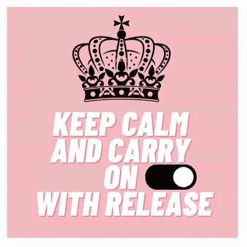
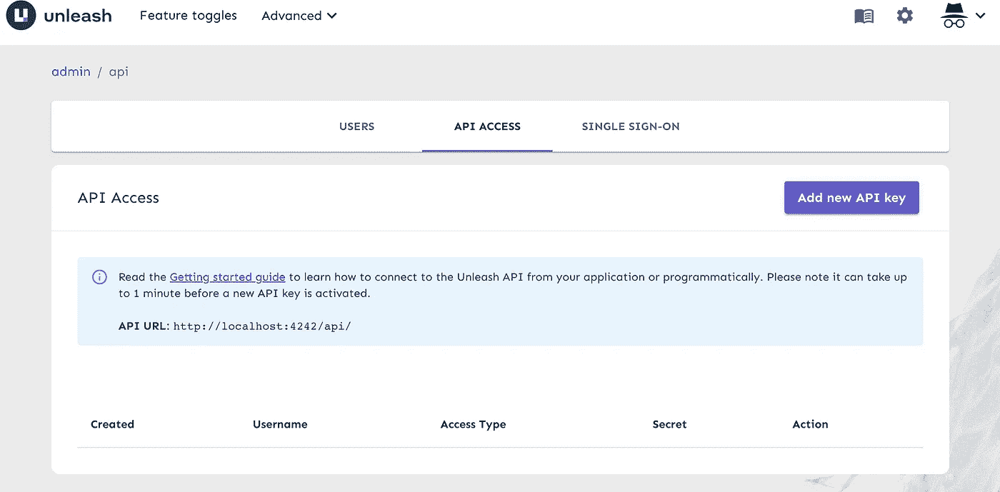

# 使用释放功能切换

> 原文：<https://blog.devgenius.io/feature-toggle-using-unleash-d19d17d0366d?source=collection_archive---------10----------------------->



功能切换

> 在本帖中，我们将介绍一个简单的功能切换用例，以及 Unleash 如何使用客户端和由 Unleash 提供的 Java SDK 来帮助实现这一功能。

让我们从什么是特性切换以及它将如何有所帮助这个基本问题开始。

**什么是功能切换？**

特性切换只是一种简单的开关机制，无需部署即可打开或关闭一段代码。实际上，切换逻辑由 IF ELSE 条件语句包装

```
// Toggle here is the service which is providing feature toggle server implementation if(toggle.isEnabled()){  
// Perform normal Logic 
}
else
{  
// Perform special logic 
}
```

**如何切换会有帮助？**

正如您可能想象的那样，出于多种原因，在许多过程中，切换都是有用的。他们中很少有人是

*   展示功能—帮助向特定用户组和特定应用程序灵活发布功能，以降低相关风险(错误代码)
*   canary Release——这是向相对较小的用户群发布功能的方法之一，用于测试软件是否满足期望的标准，而不会影响整个用户群。
*   基于主干的开发——这是一种开发策略，它有助于频繁合并小的变更，并确保保持功能分支是短暂的，功能切换可以在这里结合，以减少变更被合并到主分支的风险

如果在测试过程中发现任何问题，可以通过关闭开关(可能通过 UI)来简单地关闭新特性逻辑，而不需要部署。

**什么是松绑？**

[**Unleash**](https://www.getunleash.io/) 是一个开源的特性切换管理解决方案，提供了多种创建和管理切换的方法，可以通过 Unleash UI 进行管理。Unleash 为许多关键语言(Java、Go、NodeJS、Python 等)提供服务器端 SDK，以及需要通过 [Unleash Proxy](https://docs.getunleash.io/sdks/unleash-proxy) 进行交互的前端 SDK(Android、IOS、Javascript、React)

Unleash 有免费和付费两个版本(专业版和企业版)，免费版本的 Unleash 对于大多数用例来说已经足够全面，[这里](https://www.getunleash.io/plans#compare)是来自 Unleash docs 关于不同版本的详细对比。

**释放中的策略是什么？**

策略是一种条件，通过评估来决定切换是打开还是关闭。“释放”提供了一个内置激活策略列表，可用于决定触发条件。下面是现成可用的策略选项列表

*   标准—默认策略，意味着要么全部打开，要么全部关闭
*   用户标识——我们可以在 Unleash UI 中定义一个用户标识列表，只有那些已定义的用户，切换才会处于打开状态，而其他用户则处于关闭状态
*   IP——我们可以在 Unleash UI 中定义一个 IP 地址列表，只有那些已定义的 IP 地址的切换才会处于打开状态，而其他 IP 地址的切换会处于关闭状态
*   主机名—我们可以在 Unleash UI 中定义一个主机名列表，只有那些已定义的主机名，切换才会处于打开状态，而对于其他主机名，切换会处于关闭状态
*   逐步推广—该策略将所有逐步推广策略合并为一个策略。我们可以在这个策略中定义粘性和展示百分比

由于上述策略是现成的，为了在我们的 SDK 中使用它们，我们不需要任何更改，因为 SDK 包含它们的实现。除了上述策略，我们还可以在 UI 中定义自己的定制策略，并定义其服务器端实现(我们将在另一篇博客中看到)。多个策略可以与一个功能切换相关联。我们可以定义一个策略，并在多个切换中重用相同的策略

更多关于策略的信息可以在[这里](https://docs.getunleash.io/user_guide/activation_strategy#gradual-rollout)找到

**如何开始使用“释放”?**

为了开始使用 unlease，我们需要一个 unlease 实例(您将在其中创建和维护与 toggles 相关的信息)和一个 SDK，我们可以使用它连接到该实例。

**释放实例:**

为了快速访问和玩，释放提供了一个演示实例，可以在[https://app.unleash-hosted.com/demo/](https://app.unleash-hosted.com/demo/)访问。您可以使用有效的电子邮件地址登录并访问此实例。

或者，按照他们的官方 GitHub[https://github.com/Unleash/unleash-docker,](https://github.com/Unleash/unleash-docker,)中的说明，在您当地的几秒钟内就可以完成设置。我们将需要安装以下开始使用释放实例在本地

1.  创建一个 docker 网络供释放实例使用

```
docker network create unleash
```

2.创建 Postgres 实例

```
docker run -e POSTGRES_PASSWORD=some_password \
  -e POSTGRES_USER=unleash_user -e POSTGRES_DB=unleash \
  --network unleash --name postgres postgres
```

3.开始从 docker 映像释放实例

```
docker run -p 4242:4242 \
  -e DATABASE_HOST=postgres -e DATABASE_NAME=unleash \
  -e DATABASE_USERNAME=unleash_user -e DATABASE_PASSWORD=some_password \
  -e DATABASE_SSL=false \
  --network unleash unleashorg/unleash-server
```

一旦 docker 实例启动并运行，可以在 [http://localhost:4242](http://localhost:4242) 访问 unleash UI

使用以下凭据登录

```
**userName: admin****password: unleash4all**
```

主页应该如下所示

导航到高级> API 访问



单击添加新的 API 密钥，下面的弹出窗口应该会出现。用户名将是我们将尝试从服务器连接的应用程序名称，类型为客户端(您应该为管理目的创建单独的 API 令牌),然后单击“创建新密钥”


一旦您创建了 API 令牌，您将看到下面的屏幕


请记下以下值

`API URL: [http://localhost:4242/api/](http://localhost:4242/api/)`

用户名:测试

秘密:XXXX(点击上面屏幕上的揭露秘密图标)

如果您使用的是由 Unleash 提供的演示 URL，您可以检索(通过导航到 Configure > API access)任何现有的令牌用于测试目的。

为了测试该解决方案，我们需要创建一个测试开关，导航到屏幕顶部的功能开关。点击下面屏幕上的创建特征开关


填写切换名称和描述。请注意，您可以从可用列表中选择特征类型(它主要用于按类型分类和查看不同的切换)

关于功能切换类型的更多信息，请参见`[here](https://docs.getunleash.io/advanced/feature_toggle_types)`


点击添加策略并选择一个合适的策略，然后点击创建


成功创建切换后，可以在功能切换屏幕中查看，我们可以在其中切换切换


**服务器端 SDK**

Unleash 提供了许多用于服务器连接的 SDK，我们将以 Java 为例

```
<dependency>     
<groupId>io.getunleash</groupId>     
<artifactId>unleash-client-java</artifactId>     
<version>Latest version here</version> 
</dependency>
```

为了访问释放实例，我们需要初始化一个释放配置，如下所示

```
/**
appName - Test in this instance
instanceId -  This can be hostname
endpoint - [http://localhost:4242/api/](http://localhost:4242/api/) in case if you are running Unleash in local or if you are using demo, it would be [https://app.unleash-hosted.com/demo/api/](https://app.unleash-hosted.com/demo/api/)
fetchTogglesInterval - Fetch interval in seconds
sendMetricsInterval - Send metrics interval in seconds
clientSecret - secret obtained from Unleash UIAbove details can be provided in the configuration file and can be read accordingly**/[@Bean](http://twitter.com/Bean)
public UnleashConfig unleashConfig() {
        return UnleashConfig.builder()
                            .appName(appName)
                            .instanceId(instanceId) 
                            .unleashAPI(endpoint)                            .fetchTogglesInterval(fetchTogglesInterval)
                           .sendMetricsInterval(sendMetricsInterval)
                        .customHttpHeader("Authorization",clientSecret) 
                            .build();
    }
```

就是这样！释放实例和切换可以通过 SDK 的现有接口“no.finn.unleash”来访问和验证

我们可以将这种依赖性添加到我们感兴趣的任何服务中，并使用它来决定特性切换是打开还是关闭

```
import no.finn.unleash;public class MyService {private final Unleash unleash;public MyService(Unleash unleash){
     this.unleash=unleash;
   }public void customLogic(){
     if(unleash.isEnabled("TOGGLE_NAME")){
      // New Logic
     }else{
      // Existing Logic
     }
   }}
```

在大多数情况下，切换是短暂的，需要维护。作为一般规则，如果添加切换的目的是用有限的受众/用户来测试新功能，那么假设新功能/逻辑已经满足期望，则在几周的监控之后，可以完全移除切换代码。

此外，如果切换被关闭，拥有现有的逻辑将是明智的，这样，如果切换在其中一个环境中不可用，对 isEnabled 方法的默认调用将返回 false，现有的逻辑将不会受到干扰。

这篇文章总结了一个功能切换的简单用例，我们可以在另一篇文章中看到高级用例(自定义策略)。