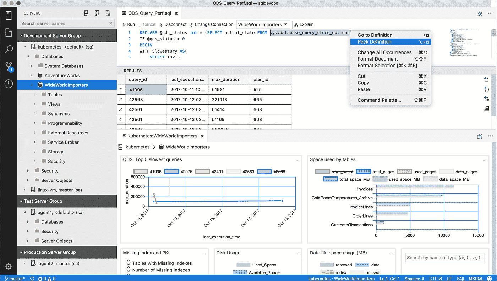
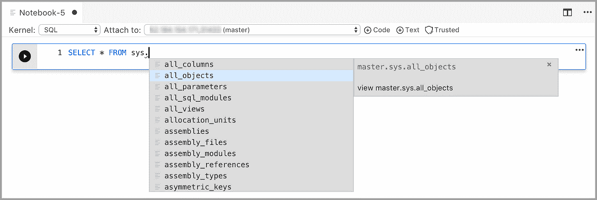

# Azure Data Studio 数据专业人员会喜欢的功能

> 原文：<https://blog.devgenius.io/features-of-azure-data-studio-data-professionals-going-to-love-31f40cdd5c10?source=collection_archive---------6----------------------->

## 令人惊叹的功能

2019 年 1 月，微软 Azure 推出了其较轻版本的数据库管理和解决方案，似乎是 SQL Server Management Studio 的替代品。

[https://mobile.twitter.com/azuredatastudio](https://mobile.twitter.com/azuredatastudio)

在我看来，该工具经历了巨大的功能提升，其强大的可扩展性使其成为越来越多数据专业人士的选择。

[**Widgets**](https://docs.microsoft.com/en-us/sql/azure-data-studio/insight-widgets?view=sql-server-ver16)

允许您构建一些真正简洁的系统，查询或服务器和数据库的性能概述。使您能够更快地了解服务器的性能。

[https://docs . Microsoft . com/en-us/SQL/azure-data-studio/insight-widgets？view=sql-server-ver16](https://docs.microsoft.com/en-us/sql/azure-data-studio/insight-widgets?view=sql-server-ver16)

[**服务器组**](https://docs.microsoft.com/en-us/sql/azure-data-studio/server-groups?view=sql-server-ver16)

将您的服务器环境分组和分类在一起，以便于管理和监督。

[**键盘快捷键**](https://docs.microsoft.com/en-us/sql/azure-data-studio/keyboard-shortcuts?view=sql-server-ver16)

对于那些熟悉 Visual Studio 代码的人来说，你会喜欢这个的。在键盘上定制您的日常功能，并提高您的工作效率。

[https://docs . Microsoft . com/en-us/SQL/azure-data-studio/keyboard-shortcuts？view=sql-server-ver16](https://docs.microsoft.com/en-us/sql/azure-data-studio/keyboard-shortcuts?view=sql-server-ver16)

[**内置端子**](https://docs.microsoft.com/en-us/sql/azure-data-studio/integrated-terminal?view=sql-server-ver16)

编写 Bash 或 Powershell 都可以在应用程序中完成，就像 Visual Studio 代码一样。

[**笔记本**](https://docs.microsoft.com/en-us/sql/azure-data-studio/notebooks/notebooks-guidance?view=sql-server-ver16)

就像你在 Visual Studio 代码中做的模块化脚本一样，我们可以用四种语言编写，当然还有 Markdown！

1.  结构化查询语言
2.  PySpark
3.  spark——用 Scala 或 R 编写
4.  计算机编程语言

[https://docs . Microsoft . com/en-us/SQL/azure-data-studio/notebooks/笔记本-指导？view=sql-server-ver16](https://docs.microsoft.com/en-us/sql/azure-data-studio/notebooks/notebooks-guidance?view=sql-server-ver16)

## 摘要

强烈推荐下载并试用，当然，还有一些功能，如有限的 SQL 代理控件，但它仍然是一个强大的工具！

[*休伯特梁📊🚀🐶*](https://medium.com/@hubert.liang78)

*首席数据工程师🚀Azure 经验|技术作家|药剂师|雪纳瑞伴侣|*[*https://linkedin.com/in/hubert-liang-850539134/*](https://linkedin.com/in/hubert-liang-850539134/)