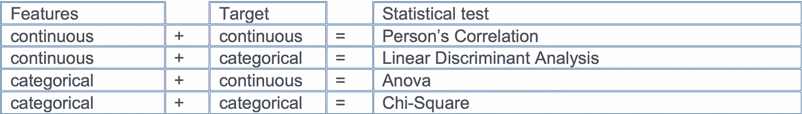
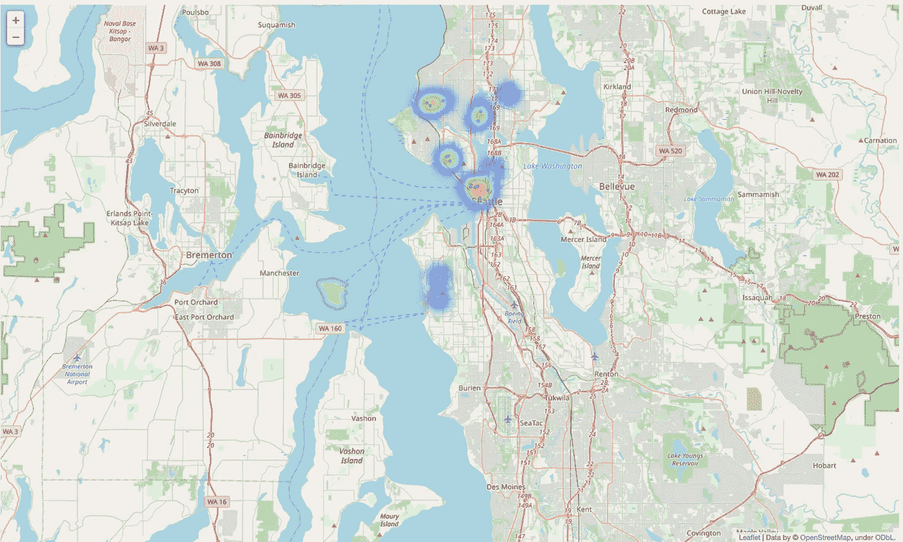
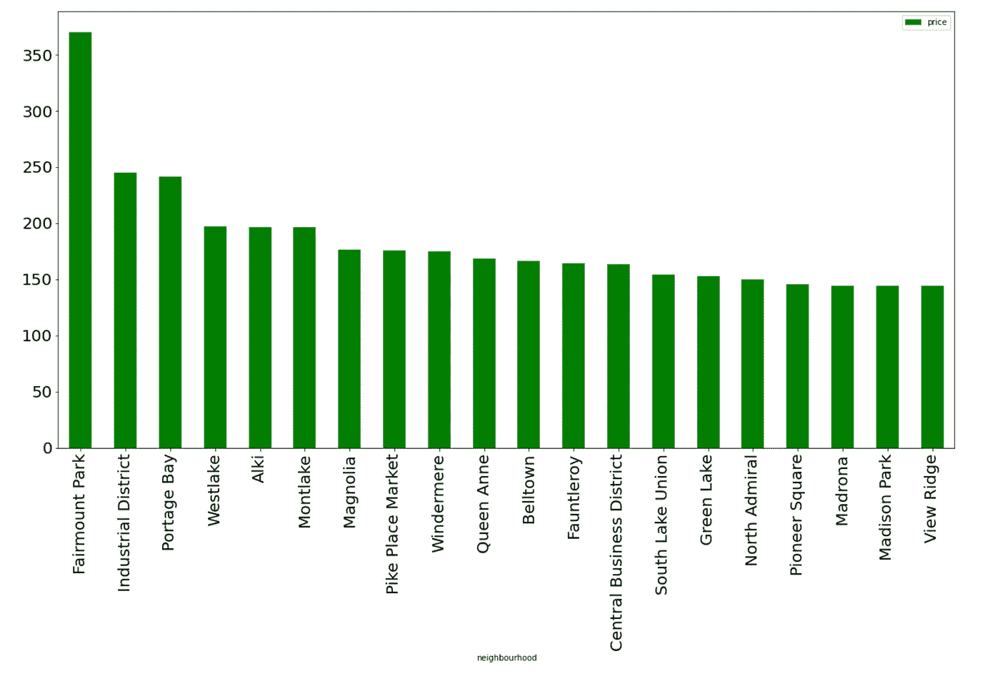
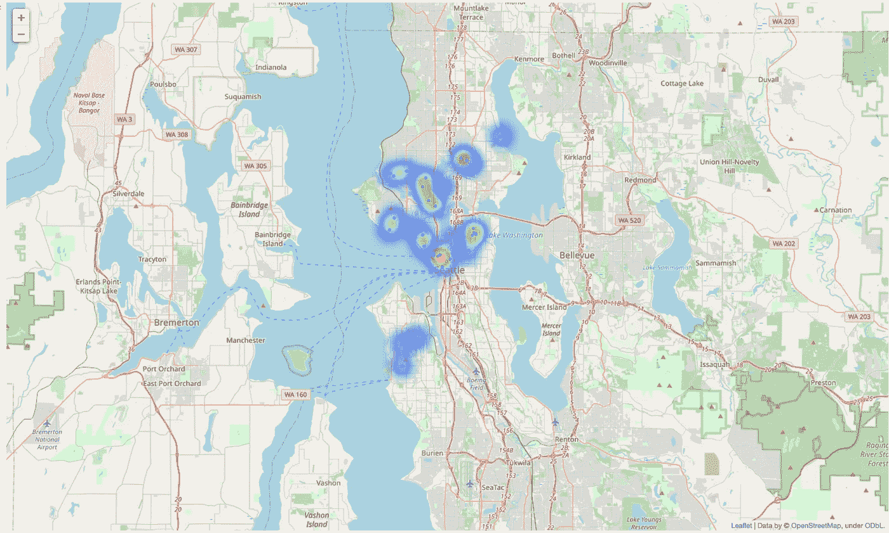
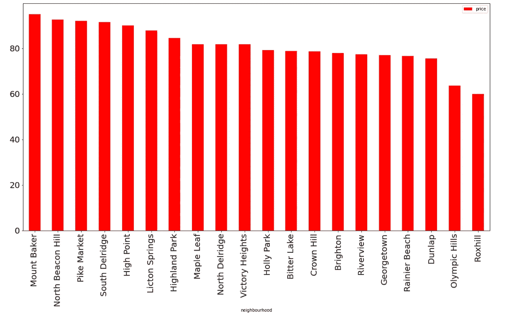
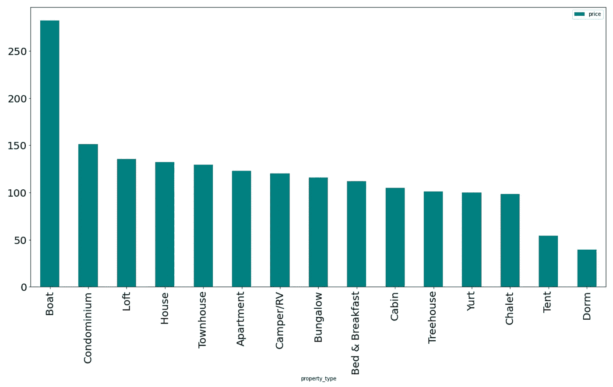
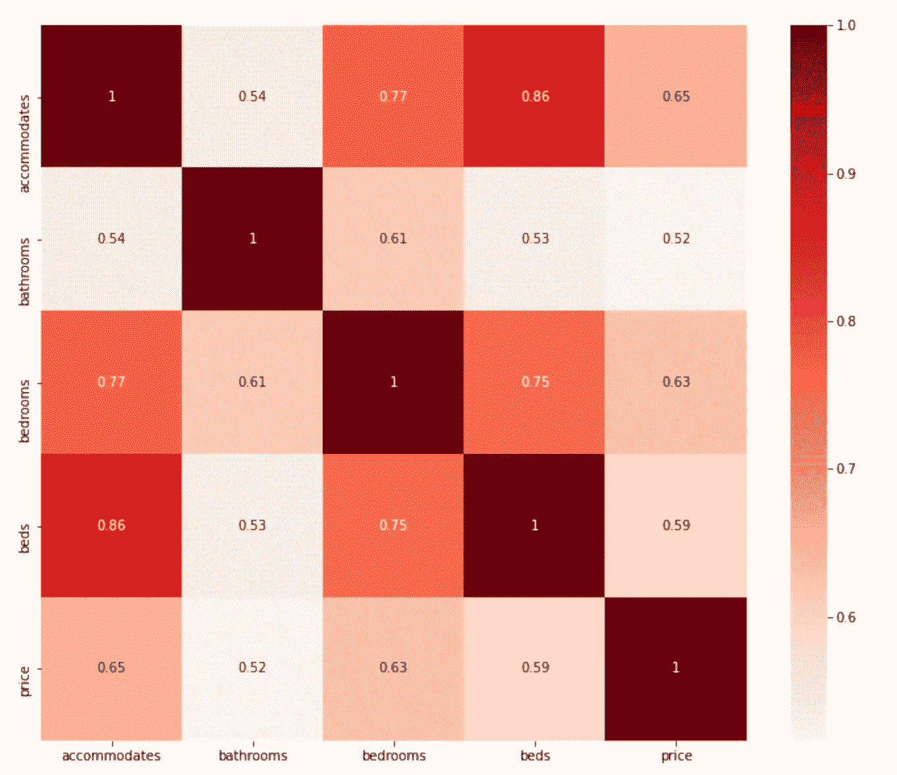
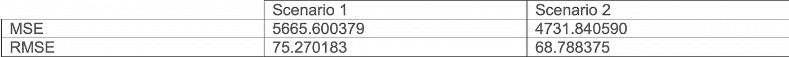

# 特征选择在机器学习中的重要性，以便更好地预测商业模式

> 原文：<https://blog.devgenius.io/features-selection-importance-in-machine-learning-for-a-better-prediction-of-business-patterns-aa9ee7fa2785?source=collection_archive---------22----------------------->

机器学习是建立**模型的现代实践。**这些模型可以根据数据进行训练，以找到可用于对新数据进行预测的模式。这个想法是，计算机可以从数据中学习，并在没有人类干预的情况下应用新数据中发现的模式。商业问题可以在机器学习的干扰下轻松解决。医生*丹科·尼科利茨谈到这一点*:

> 预测需要许多变量，变量之间存在复杂的非线性关系，并且在某些情况下具有高度的随机性。所以，往往只有算法才能学习那些关系。只有人类会有困难

*决定机器学习算法实施成败的因素之一是特征的选择。*特征选择是机器学习的关键概念之一。在训练数据时选择错误的特征对所创建的模型的性能具有直接的负面影响，并且降低了模型的准确性。

在本文中，我们将介绍选择正确特性的重要性以及可以使用的一般方法。然后，我们将进行一个案例研究，展示这个问题在现实生活中的重要性。

# **在对数据建模之前，特征选择的重要性是什么？**

特征选择是应该在实现机器学习算法之前的过程，该过程通常在清洗数据之后进行。它可以自动或手动完成。其重要性可以总结如下:

它使机器学习算法能够更快地训练，降低复杂性，更容易解释；

它通过减少混淆特征来提高模型的准确性；

它减少了过度拟合，这意味着模型不是基于噪声数据。

# **执行特征选择的技巧有哪些？**

有三种主要方法:

**过滤方法:**在该技术中，特征选择基于变量统计测试的输出。从特征和目标的类型(连续、分类)中选择合适的测试。基于特征在各种统计测试中的分数来选择特征，以确定它们与结果变量的相关性。

表 1:统计测试

**Wrapper methods:** 它将一组特征的选择视为一个搜索问题，然后使用预测机器学习算法来选择最佳特征子集。本质上，这些方法在每个特征子集上训练新的模型，这使得计算非常昂贵。然而，它们为给定的机器学习算法提供了性能最佳的特征子集。

**嵌入式方法:**主要是一个算法的实现，有它的特征选择过程。

我们现在将跳转到我们的案例研究，数据包括 2016 年至 2017 年期间西雅图 3818 所房屋的完整描述和平均评论分数。

首先，在回答我们的主要业务问题之前，我们有兴趣回答一些初步的业务问题，以便更熟悉我们的数据内容:

# **西雅图附近哪里的房子价格更高？**

图 1:高房价地区地图

图 2:房价较高的街区

从地图和条形图中，我们可以看到费尔蒙特公园、工业区、波蒂奇湾位于西雅图房价较高的街区的顶部。最贵的前 20 个街区的平均价格在 145 美元到 370 美元之间。

# **西雅图附近哪里的房子最便宜？**

图 3:高房价地区地图

图 4:附近最便宜的房子价格

从地图和条形图中，我们可以看到 Dunlap，Olympic Hills，Roxhill 是西雅图最便宜的街区。Roxhill 街区的房价最低，平均为 60 美元。

# 西雅图哪种类型的房产最贵？

图 4:不同物业类型的价格

从前面的条形图中，我们可以注意到，西雅图的房屋类型中，船只、公寓、阁楼、房屋和联排别墅的平均价格最高，而 Dom、帐篷、木屋、蒙古包和树屋的平均价格最低。我们还看到西雅图的平均房价在 280 美元到 40 美元之间波动。

现在让我们来回答我们的主要问题，也就是对价格影响最大的房屋特征。我们将通过两个场景来回答这个问题:

*   在第一个例子中，我们手动选择了一部分我们认为对 Airbnb 房价影响最大的功能。这些功能是:容纳，卧室，浴室，最低夜，最高夜和评论的数量。
*   在第二个例子中，我们使用上面引用的方法之一，即**过滤方法，进行了特征选择。用这种方法选择的特征是:房间、浴室、卧室、床。我们可以从下面的热图中看到，这些功能和价格有很强的相关性:**

图 5:价格和功能相关性的热图

然后，我们在两个数据集上实现了一个 K-neighbors 回归算法。之后，我们评估了每个模型的准确性，以确定两个场景中哪一个做了最好的价格预测。为此，我们使用了**均方误差**和**均方根误差**，前者是拟合线与数据点的接近程度，后者是均方误差的平方根，可以直接用测量单位**来解释。**

表 2:对两种情况的评估

我们可以看到，第二个场景执行了最好的价格预测，因为 **MSE** 和 **RMSE** 是最低的，这意味着通过**过滤方法**选择的特征更适合预测房价。

# 结论:

通过实例的结果，我们可以得出结论，使用不同的特征选择方法对于确保机器学习模型的最佳准确性是重要的，除非我们对所研究的领域有极好的了解。