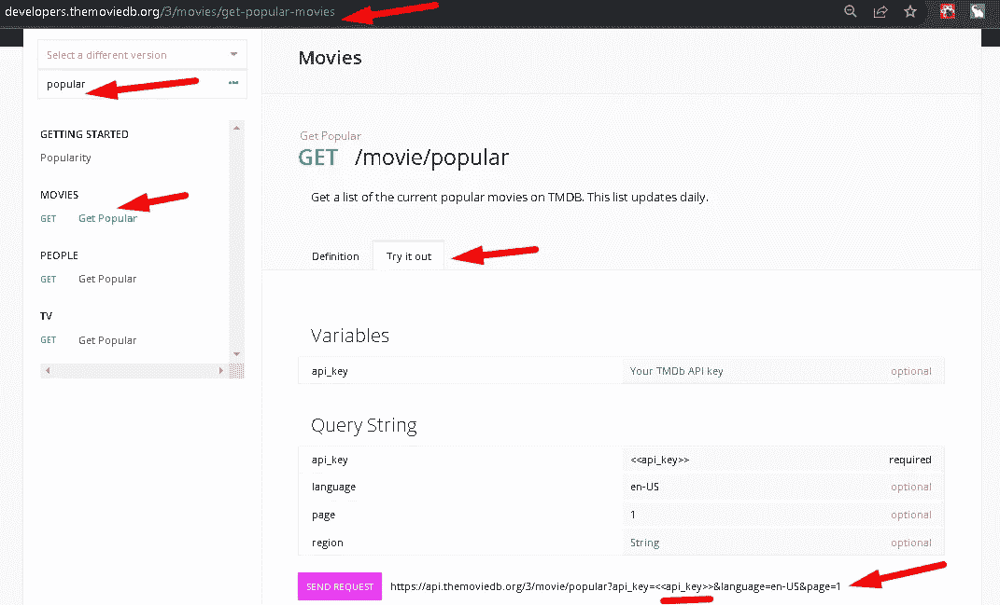

# 从真实的 API 获取数据—React/JS-[逐步完成]

> 原文：<https://blog.devgenius.io/fetch-data-from-a-real-api-react-js-f962da8af24a?source=collection_archive---------1----------------------->

## 了解我们如何使用 React/JS 从现实世界的 API 中获取真实数据


使用 API 从 IMDB 数据库提取图像

## 在 TMDB 上创建 API 键

```
[https://www.themoviedb.org/signup](https://www.themoviedb.org/signup)
```


登记

> 创建帐户后，请验证并立即登录:

```
[https://www.themoviedb.org/login](https://www.themoviedb.org/login)
```


验证后登录帐户

> 获取我们的 API 密钥:配置文件和设置> API

```
[https://www.themoviedb.org/settings/api](https://www.themoviedb.org/settings/api)
```


API 密钥

> 现在我们得到了 API 密匙，我们将从数据库中找出`popular`部电影。

```
[https://developers.themoviedb.org/3/getting-started/introduction](https://developers.themoviedb.org/3/getting-started/introduction)
```


获取热门类别电影

> 替换为您的 API 密钥

```
[https://developers.themoviedb.org/3/movies/get-popular-movies](https://developers.themoviedb.org/3/movies/get-popular-movies)
```



替换为我们的 API 密钥

```
E.g "https://api.themoviedb.org/3/movie/popular?api_key=19dedc791dc255XXXXXXXXXXXXXXXXXX&language=en-US&page=1"
```

现在我们的目标是抓住那些**电影**，所以让我们开始项目:我们将在这里创建**反应项目**

## 设置项目

让我们使用命令提示符创建一个应用程序

```
CMD > npx create-react-app movies 
```

现在转到电影文件夹…

```
cd movies
```

请注意，我已经删除了我们项目不需要的文件`src`。


修改的项目

让我们修改我们的代码:

**index.js**

```
import React from "react";
import ReactDOM from "react-dom";
import "./index.css";
import App from "./App";ReactDOM.render(<App />, document.getElementById("root"));
```

**App.js**

```
import React from 'react';const App = () => {
  return (
    <div>
      <h1>Hello App Component</h1>
    </div>
  );
};export default App;
```

**第一次运行我们修改过的项目:**

`npm start`


输出

现在我们要使用 javascript 的 [**fetch()**](https://developer.mozilla.org/en-US/docs/Web/API/Fetch_API/Using_Fetch) API 将电影提取到 **App.js** 组件中。我们将使用 [**异步**](https://developer.mozilla.org/en-US/docs/Web/JavaScript/Reference/Statements/async_function) 和 [**等待**](https://developer.mozilla.org/en-US/docs/Web/JavaScript/Reference/Operators/await) 来处理[异步](https://developer.mozilla.org/en-US/docs/Learn/JavaScript/Asynchronous)数据( [**承诺**](https://developer.mozilla.org/en-US/docs/Web/JavaScript/Reference/Global_Objects/Promise) )。

让我们创建一个匿名函数来从 API 获取电影:

一旦流行电影被获取，它将被存储在一个名为“ **data** 的变量中。最后，来自 API 的数据需要转换成 JSON 格式，所以我们将把它转换成 JSON，并存储到一个名为'**电影**'的变量中。请注意，来自服务器的消息不会同时处理这个问题，我们使用了 [**async**](https://developer.mozilla.org/en-US/docs/Web/JavaScript/Reference/Statements/async_function) 和 [**await**](https://developer.mozilla.org/en-US/docs/Web/JavaScript/Reference/Operators/await) 关键字来确保等待，直到定义的任务被执行。

当页面加载您想要的 API 数据时，为了获取这些数据，我们将使用名为[**use effect()**](https://reactjs.org/docs/hooks-effect.html)**的钩子。**

每当组件被渲染时，我们将使用 hook[**use effect()**](https://reactjs.org/docs/hooks-effect.html)**，即当组件被渲染时，运行 **fetchPopular()** 函数**。写在 useEffect()末尾的空数组[]确保它只在第一次加载时运行，即当一部分状态被更新时，这个 useEffect 再次运行，这也有助于避免无限循环。****

> **如果你熟悉 React 类生命周期方法，你可以认为 useEffect()钩子是**componentid mount**、**componentid update**和**componentid unmount**的组合。**

```
import React, { useEffect } from "react";
import "./App.css";const App = () => {
  const url =
    "[https://api.themoviedb.org/3/movie/popular?api_key=19dedc791dc255982eaf84be8a93012a&language=en-US&page=1](https://api.themoviedb.org/3/movie/popular?api_key=19dedc791dc255982eaf84be8a93012a&language=en-US&page=1)";useEffect(() => {
    fetchPopular();
  },[]);const fetchPopular = async () => {
    const data = await fetch(url);
    const movies = await data.json();
    console.log(movies);
  };return (
    <div className="App">
      <h1>Hello App Component</h1>
    </div>
  );
};export default App;
```

**→您可以在我们浏览器的控制台中看到电影输出。**

****

**→现在再次将数据存储在某个地方，这里我们存储在一小段状态中，这需要一个名为[**useState()**](https://reactjs.org/docs/hooks-state.html)**的钩子。****

```
const [popular, setPopular] = useState([]);
```

**这里的**流行的**是变量，**设置流行的**实际上是一个可以用来修改数据的函数。我们从电影数据库中获取的数据是以对象的**数组的形式存在的(参见控制台)，所以空数组 **[]** 在 useState()中传递。****

> **设置结果中可用的电影列表，因为结果对象拥有所有数据(参见控制台):**

```
const fetchPopular = async () => {
    const data = await fetch(url);
    const movies = await data.json();
    console.log(movies);
    setPopular(movies.results);
  };
```

**使用 map()循环访问热门电影以获取 movies.results 的所有数据。这将映射并逐一返回每部电影。**

```
return (
    <div className="App">
      <h1>Movies</h1>
      {popular.map(movie => {
        return <Movie />;
      })}
    </div>
  );
```

**首先，让我们创建一个电影组件。**

```
// A component that return a Movie
import React from "react";const Movie = () => {
  return (
    <div>
      <h5>Title</h5>
      
    </div>
  );
};export default Movie;
```

**如果一切都正确，我们应该像这样输出:**

****

**电影输出**

**此外，如果我们检查控制台，它有一些数据。**

****

**现在为了得到实际的输出，我们将使用 [**道具**](https://reactjs.org/docs/components-and-props.html) 来将数据从父组件传递到子组件。现在，我们必须将数据从父节点(App.js)发送到子节点(Movie.jsx ),因此我们将使用道具。**

**当我们为每部电影获取不同的 id 时，我们使用了一个键，即`key={ movie.id }`**

****发送数据:父(App.js)到子(movie . jsx)**
movie = { movie }**

****

**将数据发送到 Movie.jsx**

****接收数据:Child (Movie.jsx)****

********

**最终输出:从 API 接收的电影**

***通过这种方式，我们成功地从电影数据库中获取了数据。***

# **参考代码:-**

****index.js****

```
import React from "react";
import ReactDOM from "react-dom";
import "./index.css";
import App from "./App";ReactDOM.render(<App />, document.getElementById("root"));
```

****App.js****

```
import React, { useEffect, useState } from "react";
import "./App.css";
import Movie from "./Movie";const App = () => {
  const url =
    "[https://api.themoviedb.org/3/movie/popular?api_key=19dedc791dc255982eaf84be8a93012a&language=en-US&page=1](https://api.themoviedb.org/3/movie/popular?api_key=19dedc791dc255982eaf84be8a93012a&language=en-US&page=1)";const [popular, setPopular] = useState([]);useEffect(() => {
    fetchPopular();
  }, []);const fetchPopular = async () => {
    const data = await fetch(url);
    const movies = await data.json();
    console.log(movies);
    setPopular(movies.results);
  };return (
    <div className="App">
      <h1>Movies</h1>
      <div className="popular-movies">
        {popular.map((movie) => {
          return <Movie key={movie.id} movie={movie} />;
        })}
      </div>
    </div>
  );
};export default App;
```

****Movie.jsx****

```
import React from "react";const Movie = ({movie}) => {
  return (
    <div>
      <h5>{movie.title}</h5>
      
    </div>
  );
};export default Movie;
```

****App.css****

```
.App {
  text-align: center;
}.popular-movies {
  display: grid;
  grid-template-columns: repeat(auto-fit, minmax(250px, 1fr));
  grid-column-gap: 1rem;
  grid-row-gap: 2rem;
}img {
  width: 100%;
  height: 30vh;
  object-fit: cover;
  border-radius: 1rem;
  margin-bottom: 1rem;
}
```

****index.css****

```
body {
  margin: 5% 20%;
}
```

# **结论:**

**您只需学习如何使用 fetch() API 和 React 向现实世界的 API 公开。**

# ****第二部分:按类别过滤电影****

**接下来→**

**[](/fetch-data-from-api-part-2-8c5a57ad93fd) [## 从 API 获取数据—第 2 部分

### 了解如何根据不同的类别筛选出电影。

blog.devgenius.io](/fetch-data-from-api-part-2-8c5a57ad93fd)**