# 从真实世界电影 API 获取数据—第 2 部分

> 原文：<https://blog.devgenius.io/fetch-data-from-api-part-2-8c5a57ad93fd?source=collection_archive---------1----------------------->

了解如何根据不同的类别筛选出电影。

**请看之前的教程(第一部分)** : [如何从真实的 API 中获取数据——React/JS](/fetch-data-from-a-real-api-react-js-f962da8af24a)

[](/fetch-data-from-a-real-api-react-js-f962da8af24a) [## 从真实的 API 获取数据— React / JS

### 了解我们如何使用 React/JS 从现实世界的 API 中获取真实数据

blog.devgenius.io](/fetch-data-from-a-real-api-react-js-f962da8af24a) 

# 让我们开始…

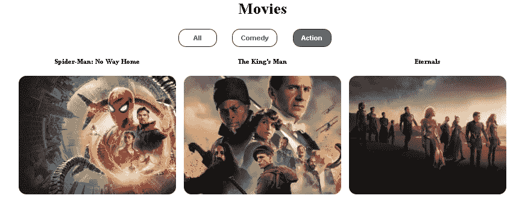

电影

# 使用 React 创建带有过滤器和类别的电影 Web 应用程序。

我们刚刚学习了如何从现实世界的 API 中获取数据。现在，我们将在项目中添加过滤器和类别，使我们的项目更加出色。

> 创建过滤器组件: **Filter.jsx**

参照我们的项目，我们现在需要创建一个**过滤器**组件。这里将为我们的项目创建 3 个过滤器。即所有，喜剧和动作。

```
import React from 'react';const Filter = () => {
  return (
    <div className="filter-container">
      <button>All</button>
      <button>Comedy</button>
      <button>Action</button>
    </div>
  );
};export default Filter;
```

现在，如果我们转到 App.js，我们已经使用第一个挂钩
`const [popular, setPopular] = useState([]);`获得了**热门**电影

现在你可能想知道如何获得这个功能，这个钩子目前保存了一组**流行的**电影(我们已经使用 **map()** 循环过它)参见 **App.js** ，对吗？因此，我们将创建一个新的状态，从那里复制所有内容，但它会根据我们的点击过滤掉元素或电影。

现在我们将 **setFiltered()** 添加到 **App.js** 中的 **fetchPopular()** 中如下:

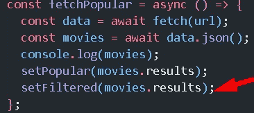

设置过滤器…

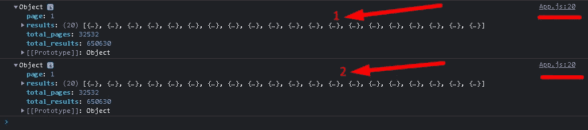

现在如果查看控制台我们会得到两个数组，对吗？这意味着它已经将数据从**流行**复制到**过滤**。厉害！


找到 2 个对象。

此外，如果你在 Chrome 浏览器中安装了 React DevTools 扩展，你可以有两种状态可用，即第一种是原始状态，第二种是过滤状态。

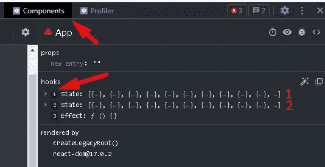

创建了两个国家。

现在我们将 props 传递给 Filter.js 来复制和修改数据。**set filtered = { set filtered }**实际上会修改 **filtered** 的一个副本。即`const [filtered, setFiltered] = useState([]);`

现在我们要创建另一个叫做 **ActiveGenre** 的状态来知道哪个按钮是活动的，`const [activeGenre, setActiveGenre] = useState(0);`现在你想为什么它从零‘0’开始，对吗？原因是我们不知道它在那里开始和结束的流派的数量，假设如果它是一个字符串，那么它可能已经通过了' **all** ，例如`const [activeGenre, setActiveGenre] = useState('all');`

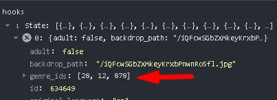

genre_ids 数组可以是任意数量。

你可能会对数组中的 28，12，878 感到困惑，所以不幸的是我们需要访问 [**电影**](https://developers.themoviedb.org/3) API 的网站。

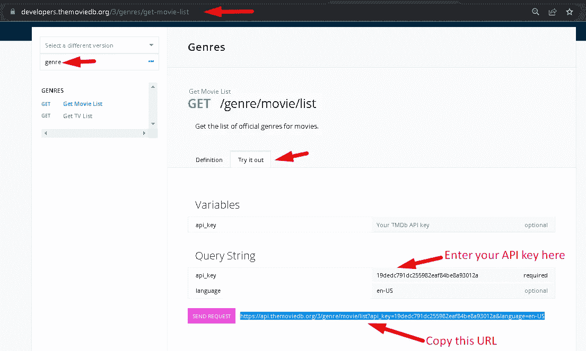

复制 URL

复制上面的 URL 并将其粘贴到浏览器中，获得以 JSON 格式返回的数据。

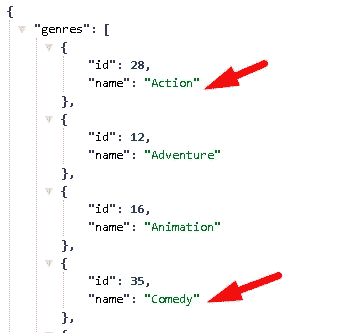

流派列表 id。

**→ App.jsx**

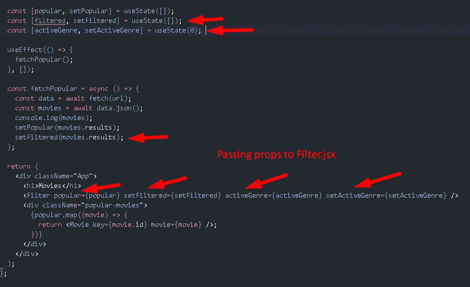

向 Filter.jsx 传递属性

→现在我们将把流派的道具传递给 **Filter.jsx**

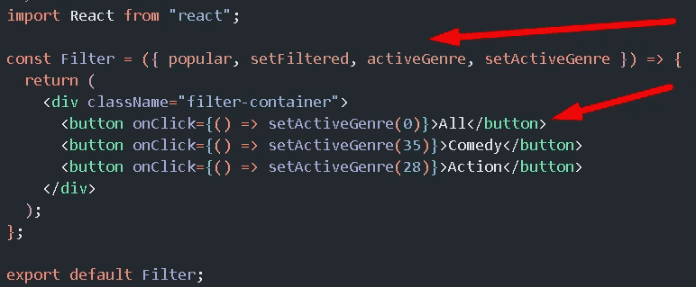

现在如果检查 devTools 组件，我们已经得到了**状态:28** 在点击**动作**过滤器后，酷！同样，我们会得到:
全部→ 0，喜剧→ 35，动作→ 28

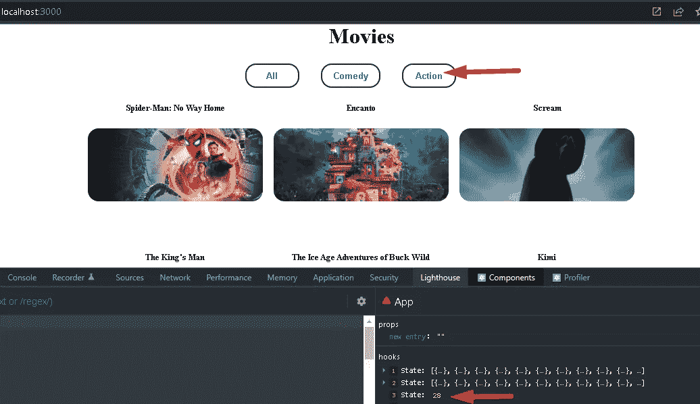

我们得到了动作过滤器的状态 28。

现在，我们将获取重复数组，并基于这个数字(比如 28、25 等)，我们将过滤出电影，这将再次通过使用 **useEffect()** 钩子变得非常简单。
这意味着当 **activeGenre** 改变时运行该功能。

```
useEffect(() => {

},[activeGenre]);
```

现在从' **popular** '中抓取原始电影，参照流派 id 过滤每部电影，确保包含 id 28、35 等。

**→过滤电影**。

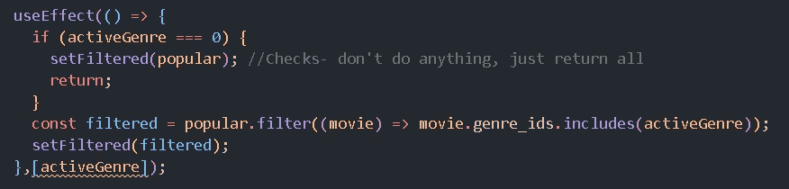

你可以从喜剧过滤器中看到我们的电影列表。

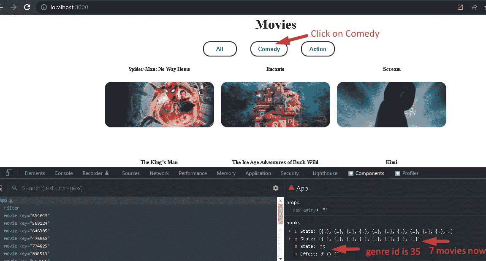

过滤器正在工作。

这里有一个问题，我们总是循环到 **App.js** 中的 **popular.map()** ，这是原始数组，所以我们的主页上没有任何变化，对吗？也就是说，我们正在进行过滤工作。

→只需在地图中将代码从**流行的**更改为**过滤的**()就可以在主页上看到我们的图像也在改变。

已有:
`<div className=”popular-movies”>
{popular.map((movie) => {
return <Movie key={movie.id} movie={movie} />;
})}`

新增:
`<div className=”popular-movies”>
{filtered.map((movie) => {
return <Movie key={movie.id} movie={movie} />;
})}`

→将类别名称添加到 **<过滤器/ >** 中，以显示哪个是当前激活的过滤器。

# 参考的最终代码:

**index.js**

```
import React from "react";
import ReactDOM from "react-dom";
import "./index.css";
import App from "./App";ReactDOM.render(<App />, document.getElementById("root"));
```

**App.js**

```
import React, { useEffect, useState } from "react";
import "./App.css";
import Movie from "./Movie";
import Filter from "./Filter";const App = () => {
  const url =
    "[https://api.themoviedb.org/3/movie/popular?api_key=19dedc791dc255982eaf84be8a93012a&language=en-US&page=1](https://api.themoviedb.org/3/movie/popular?api_key=19dedc791dc255982eaf84be8a93012a&language=en-US&page=1)";const [popular, setPopular] = useState([]);
  const [filtered, setFiltered] = useState([]); 
  const [activeGenre, setActiveGenre] = useState(0);useEffect(() => {
    fetchPopular();
  }, []);const fetchPopular = async () => {
    const data = await fetch(url);
    const movies = await data.json();
    console.log(movies);
    setPopular(movies.results);
    setFiltered(movies.results);
  };return (
    <div className="App">
      <h1>Movies</h1>
      <Filter popular={popular} setFiltered={setFiltered} activeGenre={activeGenre} setActiveGenre={setActiveGenre} />
      <div className="popular-movies">
        {filtered.map((movie) => {
          return <Movie key={movie.id} movie={movie} />;
        })}
      </div>
    </div>
  );
};export default App;
```

**Movie.jsx**

```
import React from "react";const Movie = ({movie}) => {
  return (
    <div>
      <h5>{movie.title}</h5>
      
    </div>
  );
};export default Movie;
```

**Filter.jsx**

```
import React, { useEffect } from "react";const Filter = ({ popular, setFiltered, activeGenre, setActiveGenre }) => {
  useEffect(() => {
    if (activeGenre === 0) {
      setFiltered(popular); //Checks- don't do anything, just return all
      return;
    }
    const filtered = popular.filter((movie) =>
      movie.genre_ids.includes(activeGenre),
    );
    setFiltered(filtered);
  }, [activeGenre]);return (
    <div className="filter-container">
      <button
        onClick={() => setActiveGenre(0)}
        className={activeGenre === 0 ? "active" : ""}
      >
        All
      </button>
      <button
        onClick={() => setActiveGenre(35)}
        className={activeGenre === 35 ? "active" : ""}
      >
        Comedy
      </button>
      <button
        onClick={() => setActiveGenre(28)}
        className={activeGenre === 28 ? "active" : ""}
      >
        Action
      </button>
    </div>
  );
};export default Filter;
```

**App.css**

```
.App {
  text-align: center;
}.popular-movies {
  display: grid;
  grid-template-columns: repeat(auto-fit, minmax(250px, 1fr));
  grid-column-gap: 1rem;
  grid-row-gap: 2rem;
}img {
  width: 100%;
  height: 30vh;
  object-fit: cover;
  border-radius: 1rem;
  margin-bottom: 1rem;
}.filter-container button {
  margin-right: 2rem;
  min-width: 5rem;
  padding: 0.5rem 1rem;
  border: none;
  background: white;
  color: rgb(65, 98, 168);
  border-radius: 1rem;
  border: 2px solid rgb(28, 36, 53);
  font-weight: bold;
  cursor: pointer;
}button.active {
  background: rgb(65, 98, 168);
  color: white;
}
```

**index.css**

```
body {
  margin: 5% 20%;
}
```

**最终输出:**

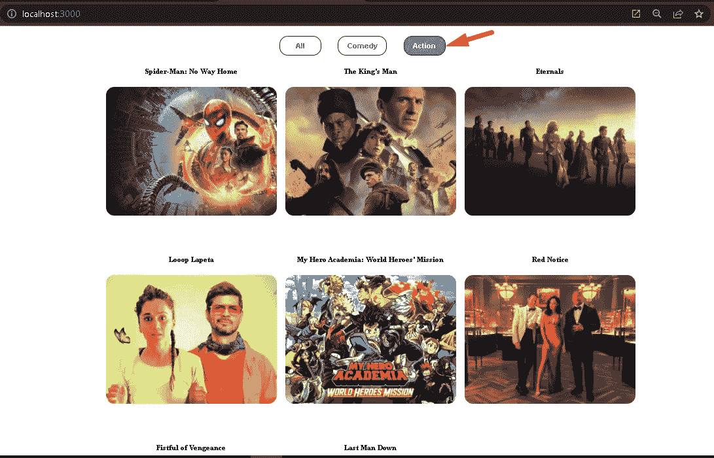

有源滤波器的最终输出。

# 结论:

你刚刚学习了我们如何从现实世界的电影 API 中过滤电影。

# 第 1 部分:**从真实的 API 中获取数据【逐步完成】。**

上一篇**↓**

[](/fetch-data-from-a-real-api-react-js-f962da8af24a) [## 从真实的 API 获取数据— React / JS

### 了解我们如何使用 React/JS 从现实世界的 API 中获取真实数据

blog.devgenius.io](/fetch-data-from-a-real-api-react-js-f962da8af24a)