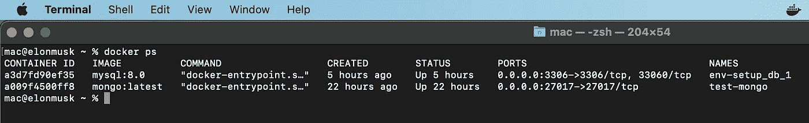

# 从 MongoDB-Talend 获取新创建的数据(第 1 部分)

> 原文：<https://blog.devgenius.io/fetch-latest-data-from-mongodb-talend-1f21ba7b98b5?source=collection_archive---------2----------------------->

**问题:**如果您正常设计一个 ETL 作业，那么在每次作业运行时，它都会从源数据库中提取**所有**数据并加载到目标数据库中。这将导致数据不一致，重复&在作业运行中消耗大量时间。

**需求:**我们的需求是，在每次 ETL 作业运行时，它应该提取源数据库中新创建的、以前从未加载到目标数据库中的行。

**解决方案:**

一个有效的解决方案是从目标数据库(在我们的例子中是 MySQL)加载最后一行的时间戳。

**ii)** 然后将这个时间戳存储到 Talend job 中的 globalMap 中。

**iii)** 然后查询源数据库，返回在这个时间戳之后创建的行。

## 看看我们将如何实现它..

我写这篇文章来解释一步一步的过程，有效地实现这一目的。

## **工具:**

**I)Talend Open Studio for Big Data 8.0:-**设计 ETL 作业。

**ii) MongoDB :-** 我们将从中提取数据的源数据库。

iii) MySQL 8.0 :- 目标数据库加载数据。

**iv) MySQL 工作台:-** 与 MySQL 服务器进行图形化交互。

v) MongoDB Compass :- 与 MongoDB 服务器进行图形化交互。

**vi) Docker :-** 运行 MySQL 和 MongoDB 的容器。

## **步骤 1:环境设置**

我已经通过运行以下命令启动了 MongoDB 的容器:

```
docker run -d -p 27017:27017 --name test-mongo mongo:latest
```

**ii)** 我已经创建了一个 **docker-compose.yml** 文件来运行 MySQL 8.0 容器。

```
version: '3.3'services:
  db:
    image: mysql:8.0
    restart: always
    environment:
      MYSQL_DATABASE: 'university_db'
      MYSQL_USER: 'rao'
      MYSQL_PASSWORD: 'root'
      MYSQL_ROOT_PASSWORD: 'root'
    ports:
      - '3306:3306'
    expose:
      - '3306' 
    volumes:
      - my-db:/var/lib/mysql
volumes:
  my-db:
```

然后在这个文件的目录下运行下面的命令。

```
docker-compose up -d
```

**iii)** 使用以下命令验证容器是否启动并运行

```
docker ps
```



**端子输出。**

**iv)下载&设置以下**

a)。 [MongoDB 罗盘](https://downloads.mongodb.com/compass/mongodb-compass-1.33.0-darwin-x64.dmg)

b)。 [Talend OS 大数据](https://sourceforge.net/projects/talend-bigdata/files/latest/download)

c)。 [MySQL 工作台。](https://dev.mysql.com/downloads/workbench/)

## 第 2 步:将数据插入 MongoDB。

我在数据库“大学”中创建了一个“雇员”集合，并在其中插入了一些记录。


来自 MongoDB Compass 的数据视图。

## **第三步:在 MySQL 数据库中创建表格**

我在 MySQL 数据库中创建了一个 employees 表。


员工表描述

## 步骤 4:设计 ETL 作业

**i)** 添加 **tDBInput — MySQL** ，我们将从这里获取最后创建的行的时间戳。


大学 _ 员工工作(快照 1)

**查询:**

```
"SELECT COALESCE(MAX(timestamp), '1900-01-01 00:00:00.000') AS timestamp FROM employees"
```

**解释:**这个查询将获取表中最后一行的时间戳。在第一次运行中，当我们的表没有数据/行时，查询将返回默认值，即 1900–01–01 00:00:00.000

**ii)从模式中删除除时间戳以外的字段:**

**iii)** 使用 **tJavaRow** 将时间戳值存储在 **globalMap 中。**


大学 _ 员工工作(快照 2)

**iv)** 在 tJavaRow 中只添加这一行。这将把时间戳存储在一个带有可变关键字“records _ last _ sync _ timestamp”&字符串值“2022–09–11t 13:10:44.634 z”的映射中。

```
globalMap.put("records_last_sync_timestamp", **new** StringBuilder().append(input_row.timestamp).append("Z").toString().replace(" ", "T"));
```


大学 _ 员工工作(快照 3)

## **重点:**

**表中:**

**时间戳格式:** YYYY-MM-DD hh:mm:ss。选征兵役制（SelectiveServiceSystem）

**数据类型:**日期时间(3)

**在 tJavaRow :**

**时间戳格式:**对于 global map " YYYY-MM-DD ' t ' hh:MM:ss。SSS'Z ' "

**数据类型:**字符串

**v)** 为 employees 集合添加 **tMongoDBInput** ，并将以下查询放入查询部分

**MongoDB 查询:**

```
"{'timestamp': {$gt: {$date: '"+globalMap.get("records_last_sync_timestamp")+"'}}}"
```


大学 _ 员工工作(快照 4)

**vi)** 添加一个 **tMap** ，它执行简单的数据映射，并将名字&姓氏作为雇员的名字连接起来，以存储到目标数据库中。


作业中的 tMap

**vii)** 添加 **tLogRow** 在控制台上打印，用于记录目的。

**viii)** 添加 **tDBOutput-MySQL** 来存储数据。

现在你的工作看起来像


大学 _ 员工工作(快照 5)

## 让我们现在测试:

**i)** 第一次运行时，它从 mongoDB 中提取所有 4 行，因为之前没有任何行被加载到 MySQL 中。


来自 MySQL Workbench 的**ii)**—我们将验证数据在 data time“2022–09–12 07:01:24.231”之前是否已加载


来自雇员表的数据检查。

**iii)** 现在，如果我们重新运行该作业，它不会加载任何新行，因为没有数据被创建到源数据库中，该数据库是在上次同步时间戳**之后创建的，即**2022–09–12 07:01:24.231。


**iv)** 让我们在 MongoDB 中添加一个新文档。(如下)


**v)** 重新运行作业。现在您可以看到，只有新创建的数据是从源数据库加载的。


**vi)从 MySQL Workbench 进行验证:**新记录被插入到这个。


**结论:**

因此，使用这种方法，我们已经了解了如何从 MongoDB 中只提取新创建的行。我们没有必要在工作设计中提到任何时间限制。这是处理这个问题的通用方法。

**工作项目 Github 链接:**【https://github.com/raowaqasakram/etl-learning 