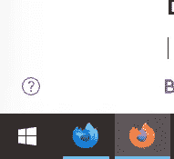
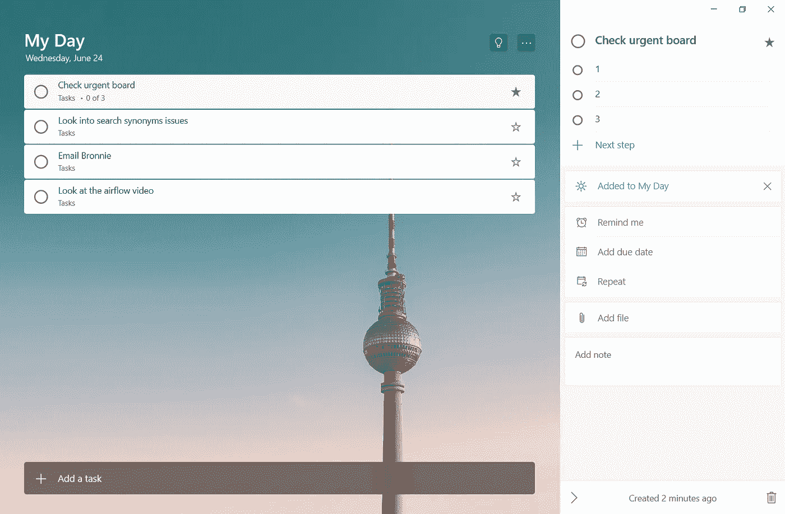
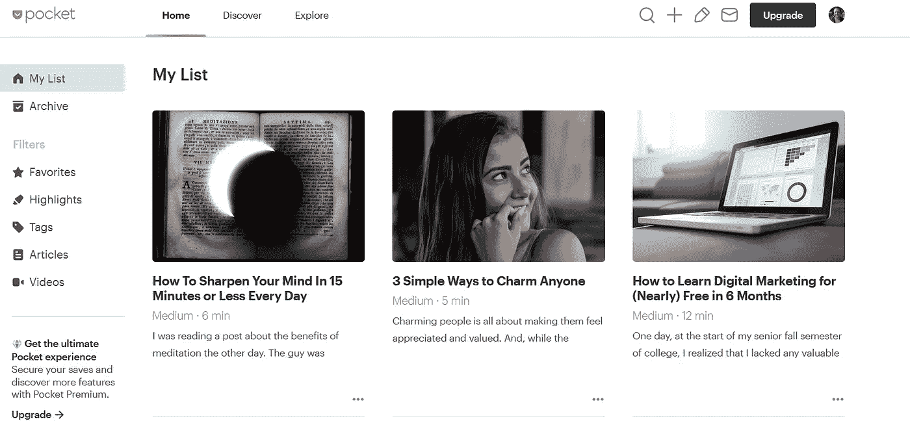

# 给开发人员的一些生产力提示

> 原文：<https://blog.devgenius.io/few-productivity-tips-for-developers-a0b07507aee9?source=collection_archive---------29----------------------->

[Zan](https://unsplash.com/@zanilic?utm_source=medium&utm_medium=referral) 在 [Unsplash](https://unsplash.com?utm_source=medium&utm_medium=referral) 上的照片

# 工作和个人浏览器

我工作时最大的问题是混淆个人和工作项目，个人和工作谷歌账户。你是否曾经在工作中做了一个演示，而 google ads 不断为你提供关于你刚刚购买的新车的广告，因为你是在工作浏览器中登录 Gmail 的。

我决定通过运行两个独立的浏览器来解决这个问题。以前我尝试过 Chrome 的多个配置文件，但是从来没有成功过，我正在离开谷歌。我目前的设置是有两只火狐。我用普通的 Firefox 做我的东西，用 Firefox Developer edition 做我的工作。

我登录了不同的 google 帐户。我有不同的书签。

这是我为提高工作效率做过的最好的事情。

# 每日清单

我决定做的是有一个简单的列表。

这些是我的规则:

*   我每天都开始列这个清单。
*   如果有前一天的任务，我会复制下来。
*   我强调需要这样做的事情。(或者加粗)
*   如果完成了，我就打勾。
*   如果每天需要做多次，我会选择更多的复选框(检查板)

你可以在纸上这样做(我就是这样做的)，或者你可以在几乎任何待办事项应用程序中这样做。

# 阅读/学习列表

这种事经常发生。有人将有趣的链接发送到 slack(团队，无论什么)，你想阅读它。你只是现在没有时间。我点击添加到口袋按钮。当你有空的时候，你会去逛逛，你有一大堆有趣的书可以读。

当我有几分钟时间的时候，Pocket 是我的随身应用。