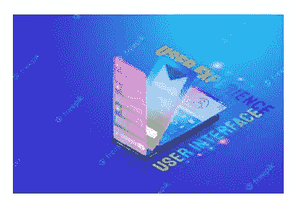

# 作为 UI/UX 初学者，我学到的很少东西

> 原文：<https://blog.devgenius.io/few-things-ive-learnt-as-a-beginner-in-ui-ux-d85a9f1962ff?source=collection_archive---------6----------------------->

我想分享几周以来我学到的一些东西。

在一个美好的日子里，在脸书网上冲浪时，我看到了这个关于由**天佑传媒科技**组织的**科技**导师项目的帖子，然后我决定申请这个项目，幸运的是我被选中参加这个项目。这是给我的一个很好的机会，我不会认为这是理所当然的。这是我作为 UI/UX 设计师旅程的开始。

你有兴趣成为一名用户界面/UX 设计师吗，你必须为陡峭的学习曲线做好准备。有些软技能你必须具备，比如适应性、沟通、思想开放、同理心、解决问题、团队合作等等。

让我们钻研一下...

*用户界面和用户体验(也称 UI/UX)是可以互换使用的，但它们有不同的含义。*

***什么是 UI/UX 设计？***

> 用户界面(UI)关注产品的外观和感觉、外观和交互性。它还考虑了产品界面的所有视觉、交互元素。包括按钮、图标、间距、版式、配色方案和响应设计。

> UX(用户体验)设计关注真实用户与日常产品和服务(如网站、应用等)之间的交互。UX 设计公司为用户在使用产品的过程中随时随地遇到的痛点创造结构设计解决方案。

你知道，你接触的任何一种产品或服务都会唤起某种体验。

简而言之，我们可以把 UX 设计比作一辆以 UI 设计为驾驶台的汽车。

在很短的时间内，我学到了很多东西，我想与你分享。但是我将从一些设计师忽略的设计基础开始。

首先，是所谓的设计师思维。

*什么是* ***设计师思维*** *？*

它意味着以不同的方式看待事物，这是非设计师看不到的。

如果你是一个设计师，读到这里！我相信你能理解。

为了创造有情感的、可爱的和美丽的应用程序设计，你必须是动态的，这是设计师的思维发挥作用的地方。对设计师来说，不同的色调有不同的心情。所以作为设计师，一定要为自己的产品选择合适的类型。

作为设计师，你必须根据规范拿出设计 A 和 B。

接下来我们要看的是**色**理**理**。

*你在设计的时候是如何组合不同的颜色的？*

你知道不同的色调会唤起不同的情感和心情。你必须为你的产品选择合适的颜色。色彩理论不仅是数码设计的基础，也是任何地方设计的基础。

*让我们来看看不同颜色的心情。*

**红色** -爱情、能量、强度
**黄色** -快乐、智力、关注
**绿色** -新鲜、安全、成长
**蓝色** -稳定、信任、宁静
**紫色** -皇室、财富、女性

并不是每种颜色都适合每种设计。你必须根据你想要设计的应用程序的类型来选择合适的颜色。

这些网站可以帮助你选择你最喜欢的调色板。

[www.colorhunt.com](http://www.colorhunt.com)T22[flatuicolors.com](http://www.flatuicolors.com)

[materialpalette.com](http://www.materialpalette.com)
colorzilla.com

**排版**——选择正确的*字体*是设计任何产品的基础。

***什么是排版？***

> 排版是以一种方式安排字母和测试的行为，这种方式使文本易读、清晰并在视觉上吸引读者。

字体设计是用户界面设计的重要组成部分。在我的下一篇文章中，我会更多地谈论字体设计。

这些是你在钻研正确设计之前必须考虑的一些事情。

期待在我的下一篇帖子里有更多实际的作品。

结论
作为一名初学者，你真的需要致力于成为一名设计师，你必须付出更多的努力。你必须注意细节。

谢谢你的来访。

希望你有价值。