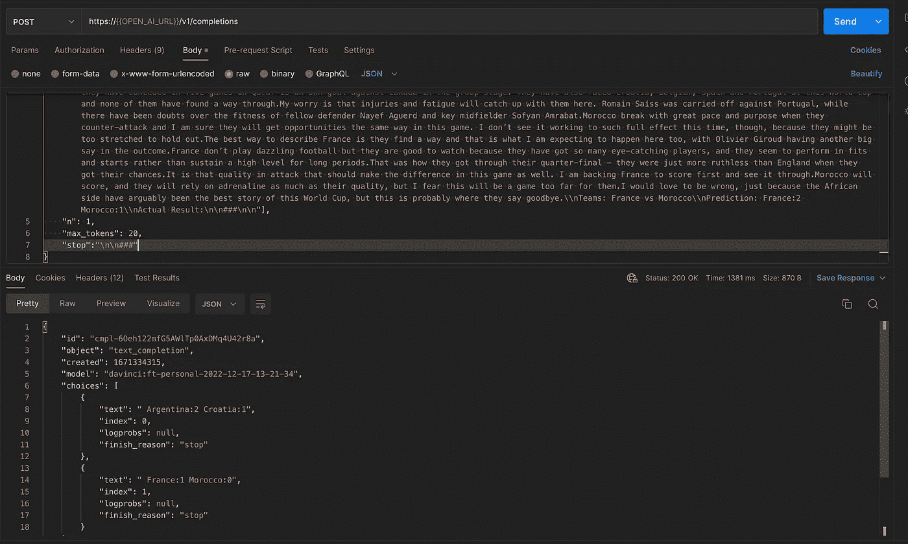
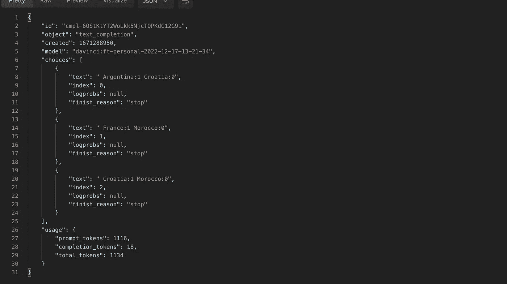
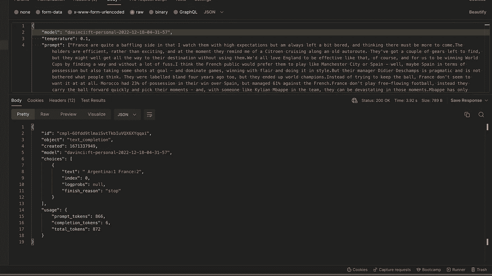

# GPT 对世界杯的最终预测

> 原文：<https://blog.devgenius.io/fifa-world-cup-final-prediction-by-gpt-7b275b472ed2?source=collection_archive---------7----------------------->

世界杯的决赛就在这里，我和全世界都在等待梅西举起世界杯。加油，梅西！！

虽然体育运动的预期和不可预测性使它们如此令人兴奋，但作为人类，我们最喜欢的莫过于预测未来。我想知道 GPT 是否能帮我解决这个问题，用它的智慧来预测决赛的结果。

# GPT 3 是世界杯的追随者吗？

GPT-3 是一个使用互联网数据训练的语言模型，直到 2021 年，所以它可能甚至不知道世界杯正在进行。当我问它“你知道的最新足球比赛结果是什么”时，它列出了 2021 年举行的一些比赛的结果。很明显，这不是世界杯。

# 通知模型

为了让 GPT 3 号进行预测，它需要被告知正在发生的事情以及预测结果的方法。所以下面是我决定要做的

1.  从互联网上收集总结比赛的数据
2.  分享每场比赛的预测和实际结果
3.  用这些数据微调模型
4.  希望这个模型能学到足够的知识来预测未来的游戏

# 收集数据

首先，我必须确定一个可靠的数据来源，我偶然发现了[克里斯·萨顿](https://en.wikipedia.org/wiki/Chris_Sutton)在 BBC 上做的[预测](https://www.bbc.com/sport/football/63673446)。即使他的预测不那么准确，他看起来也足够可信。但是我想让 GPT 知道预测是一件困难的事情，也许可以从他犯的错误中吸取教训。所以这个数据源对我来说似乎很好。

# 微调模型

接下来是如何微调模型，并用所有数据训练它。为此，我决定用下面一组提示和完成来训练*达芬奇*模型

> {“prompt”:“卡塔尔不得不希望主场优势为他们带来回报，但我非常怀疑这一点。他们很难从这个小组中出局——事实上，我认为他们会垫底。厄瓜多尔是一支防守型球队，所以在首场比赛中不会有太多进球，但他们应该会找到获胜的方法。\\nTeams:卡塔尔 vs 厄瓜多尔\ \ n 预测:卡塔尔:0 厄瓜多尔:1 \ \ n 实际结果:\n\n###\n\n "，" completion ":"卡塔尔:0 厄瓜多尔:2\n"}

按照这个[链接](https://drive.google.com/file/d/1iPX_j9mHMZ9TOzmdguFLqJt2BTNPOm45/view?usp=share_link)获取整个文件

目的是馈送克里斯的评论，预测，和每场比赛的实际结果，直到半决赛。然后用复赛来检验模型是否有效。然后我会用同样的模型预测第三名和最终的决赛。

# 测试模型

一旦模型被训练好，就到了测试的时候了。利用克里斯对半决赛、季军和决赛的预测，我进行了一些测试。

## 半决赛

该模型似乎几乎每次都能正确预测结果。即使它的分数不断变化，当然与实际发生的情况不符。但这很有希望。我保持 API 参数非常简单，温度设置为 0.1

半决赛的预测

## 第三名

对于第三名的比赛，模型似乎有点不确定，并不断给出不同的结果，但往往会显示克罗地亚是赢家。克里斯预测摩洛哥会获胜。下面是比赛开始前我预测的截图

第三名比赛的预测

# 决赛

那么模特是怎么看待大决赛的呢？这一次，我将使用半决赛和第三场比赛的实际结果对模型进行微调，以便它在做出大预测之前拥有所需的所有信息。

克里斯预测法国会以 3 比 1 的优势获胜。另一方面，这个模型

对决赛的预测

艾显然对梅西缺乏任何情感和忠诚。但我和其他数百万梅西球迷一样，希望这是错误的。